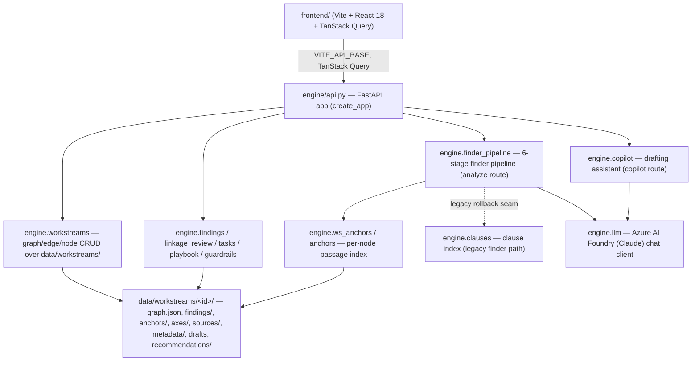
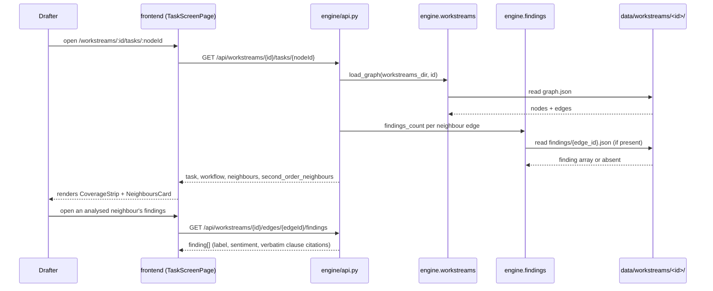
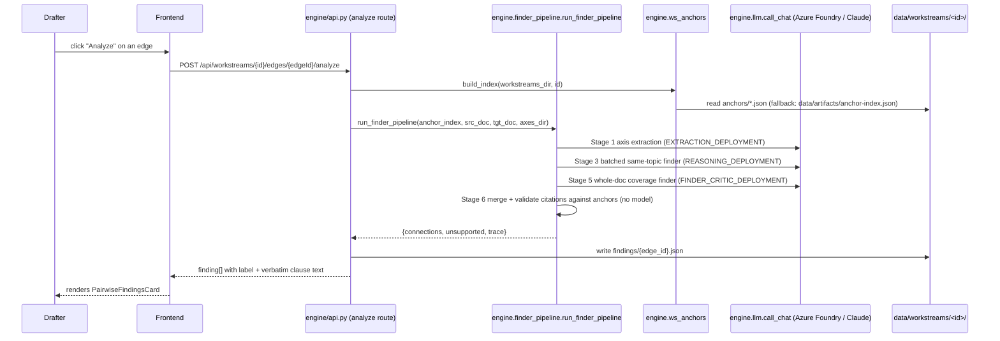
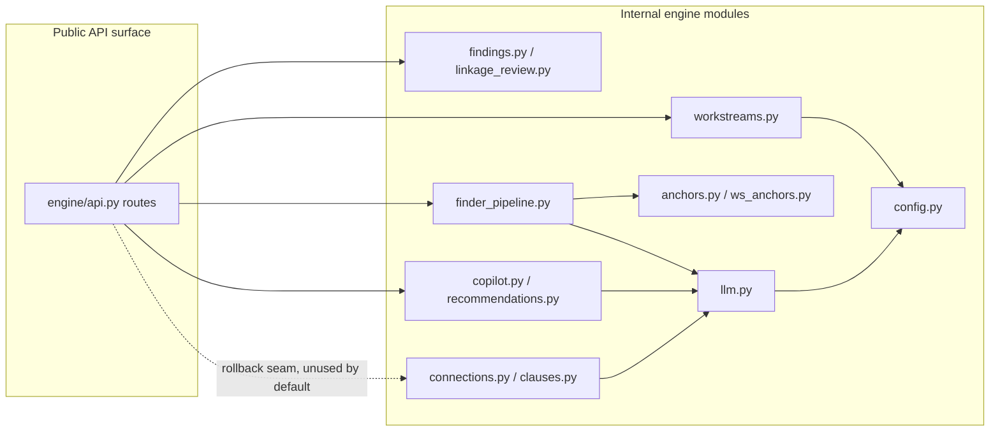
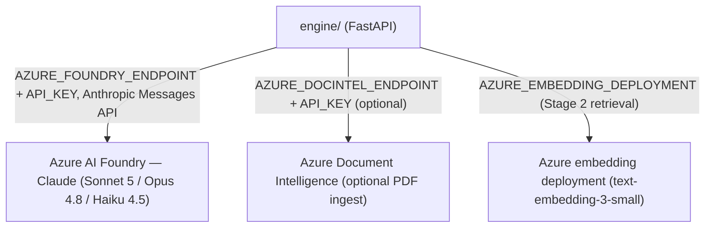

<!-- last-updated: 2026-08-02 -->

# Architecture — Project SELARAS

> Project SELARAS (**S**emantic **E**ngine for **L**inkage **A**nalysis across
> **R**egulatory **A**rtefacts & **S**tandards) helps a BNM policy drafter spot where
> a document under active drafting aligns, differs, conflicts, is silent, or goes
> beyond the regulatory documents around it. Each policy workstream is a knowledge
> graph of documents; an AI finder→validator pipeline turns clause-pair comparisons
> into findings the drafter reviews and accepts before drafting continues.

## System Overview

SELARAS has two live halves. `engine/` is a FastAPI service that projects a
per-workstream fixture store (`data/workstreams/`) into HTTP routes: graph/task/edge
reads are pure file projections, while `analyze` (clause-pair linkage finding) and
`copilot` (the drafting assistant chat) are live routes that call out to a model via
`engine/llm.py`. `frontend/` is the only UI — a Vite + React 18 + TanStack Query app
that renders the workstream graph, the task/draft screens, and cross-workstream
intelligence views. There is no database: a workstream's graph, findings, anchors,
axes, drafts, and recommendations are all committed JSON/Markdown files under
`data/workstreams/<workstream_id>/`, which is why the demo strategy is
build-and-persist rather than analyze-live-on-stage.



## Data Flow

Two flows matter: the read-only graph/task navigation every screen relies on, and
the live `analyze` call that turns an unanalyzed edge into findings.

### Primary Flow: opening a task and reviewing findings



### Secondary Flow: analyzing an unanalyzed edge (live model call)



## Directory Structure & Module Boundaries

```
copa-hackathon/
├── engine/                 # FastAPI service + knowledge-graph/finder engine (Python)
│   ├── api.py              # create_app(): all HTTP routes (2.7k lines, the whole surface)
│   ├── workstreams.py       # graph.json CRUD, node/edge validation, direction resolution
│   ├── findings.py          # per-edge findings/{edge_id}.json load/save + counts
│   ├── linkage_review.py    # maker-checker state machine for individual findings
│   ├── connections.py       # legacy finder+critic loop, five-label taxonomy definitions
│   ├── finder_pipeline.py              # current 6-stage finder pipeline (no critic)
│   ├── anchors.py / ws_anchors.py  # document segmentation into citable passages
│   ├── clauses.py            # clause index — the artifacts/-backed legacy citation lookup
│   ├── copilot.py            # drafting-assistant chat (grounding context + streaming)
│   ├── recommendations.py    # guardrail-aware recommendation generation/rewrite
│   ├── drafts.py             # working-draft HTML persistence (server-side sanitized)
│   ├── tasks.py / playbook.py / guardrails.py / node_metadata.py / directory.py
│   │                        # supporting per-workstream state (workflow, playbook, etc.)
│   ├── llm.py                # Azure AI Foundry (Claude) chat client + JSON parsing
│   ├── config.py             # env-driven deployment names, paths, feature flags
│   ├── ingest.py             # PDF/DOCX → markdown (MarkItDown or Azure Doc Intelligence)
│   ├── build.py               # offline artifact build (clause index, anchor index)
│   └── tests/                 # pytest suite; stubs every model seam, no network in CI
├── frontend/                # the SELARAS app — Vite + React 18 + TS + Tailwind + shadcn/ui
│   └── src/
│       ├── App.tsx            # react-router-dom route table
│       ├── components/        # AppShell, DemoController, shared chrome + shadcn ui/
│       ├── features/          # one dir per screen: task, workstream-graph, drafting-workspace,
│       │                      # review-queue, review-linkages, cross-intelligence,
│       │                      # institution-map, home, new-workstream, intro
│       └── lib/                # api.ts (fetch layer), types.ts, labels.ts, hooks/
├── data/
│   ├── workstreams/           # the "database" — one dir per workstream (see below)
│   ├── corpus/                 # parsed BNM policy PDFs
│   ├── references/             # public external standards (Basel, MAS TRM, PDPA)
│   └── artifacts/                # legacy clause index + recorded linkage traces
├── scripts/                    # run_finder_trace.py + offline maintenance scripts
├── kg-poc/                     # isolated ontology/NER spike — nothing imports it
└── docs/                       # specs/, adr/, learnings/, poc/ (read-only reference)
```



**Dependency rules:**

- `engine/api.py` is the only module that constructs the FastAPI app or wires HTTP
  routes; every other engine module is plain Python called from it.
- `engine.finder_pipeline` is the current analyze pipeline; `engine.connections` /
  `engine.clauses` are retained only as a rollback seam (`find_connections_fn` in
  `create_app`) — new work does not build on them.
- Every model call (finder pipeline's three stages, Copilot, recommendations generation)
  goes through `engine.llm.call_chat` / `call_chat_stream` — no module constructs an
  Azure/Anthropic client directly.
- `frontend/` talks to the engine only through `src/lib/api.ts` over `VITE_API_BASE`;
  no frontend module reads `data/` directly.

### A workstream's on-disk shape

```
data/workstreams/<workstream_id>/
├── workstream.json          # name, owner, reviewers, deliverable_type, hidden flag
├── graph.json                 # {"nodes": [...], "edges": [...]}
├── findings/{edge_id}.json     # finding[] once an edge has been analyzed
├── anchors/{document_id}.json  # segmented, citable passages per document
├── axes/axes-{document_id}.json  # cached topic-axis extraction (finder pipeline stage 1)
├── sources/{document_id}.md    # ingested markdown for an uploaded/URL document
├── metadata/{node_id}.json      # the 7-field regulatory profile a drafter fills in
├── playbook.json                # per-stage Copilot instructions
├── recommendations/{node_id}.json
└── drafts/{node_id}.html        # the working draft's sanitized HTML
```

Three of the four fixtures (`opres-v2`, `rmit-v2-2025`, `open-finance-ed`) are
retired and carry `"hidden": true`; **`open-finance-pd-2026` is the live demo
workstream** and the shape new features are designed against (see CLAUDE.md's
retired-fixtures rule — data oddities in the other three are recorded history, not
bugs).

## Tech Stack & Dependencies

| Layer              | Technology                                  | Purpose                                                      |
| ------------------ | ------------------------------------------- | ------------------------------------------------------------ |
| Backend language   | Python ≥3.12                                | `engine/`                                                    |
| Backend framework  | FastAPI ≥0.139 + Uvicorn                    | HTTP service, `create_app()`                                 |
| Model client       | `anthropic` SDK (AnthropicFoundry)          | Claude on Azure AI Foundry, via `engine/llm.py`              |
| Alt model client   | `azure-ai-inference`, `openai`              | Azure Document Intelligence / embedding calls                |
| Document ingest    | `markitdown[az-doc-intel,docx,pdf]`         | PDF/DOCX → markdown                                          |
| Retrieval          | `rank-bm25`, `numpy`                        | Stage 2 same-topic retrieval fallback/scoring                |
| Sanitization       | `bleach`                                    | server-side HTML sanitizer for saved drafts                  |
| Backend tests      | `pytest`, `httpx`, `python-multipart`       | `engine/tests/` (TestClient needs the latter two explicitly) |
| Frontend language  | TypeScript 5.x                              | `frontend/src`                                               |
| Frontend framework | React 18 + Vite 5                           | `frontend/` — the only UI                                    |
| Styling            | Tailwind CSS + shadcn/ui (Radix primitives) | `frontend/src/components/ui/`                                |
| Server state       | TanStack Query 5                            | all API data fetching/caching                                |
| Graph canvas       | `react-force-graph-2d`                      | workstream graph visualization                               |
| Routing            | `react-router-dom` 6                        | `App.tsx` route table                                        |
| Frontend tests     | Vitest + Testing Library + MSW              | unit/component tests, mocked API                             |
| E2E                | Playwright                                  | `frontend/e2e/`                                              |

### External Integrations



### Key Dependencies

**Runtime (`engine/pyproject.toml`):**

- `fastapi`, `uvicorn` — the HTTP service
- `anthropic` — Claude on Azure AI Foundry (Messages API, not chat-completions)
- `azure-ai-inference` — Azure Document Intelligence client
- `markitdown[az-doc-intel,docx,pdf]` — default document-to-markdown ingest
- `bleach` — the actual security boundary on draft HTML (the frontend's DOMPurify is a nicety)
- `rank-bm25`, `numpy` — finder pipeline Stage 2 same-topic retrieval

**Runtime (`frontend/package.json`):**

- `@tanstack/react-query` — all server state, no Redux/Zustand
- `react-force-graph-2d` — the only graph canvas library in use
- `dompurify` — client-side sanitization of rendered draft/markdown content
- `marked` — markdown rendering in the Copilot chat

**Development:**

- `pytest` + `httpx` + `python-multipart` (backend), `vitest` + `msw` + `@playwright/test` (frontend)

## Key Patterns & Conventions

### Architecture Pattern

A single FastAPI app (`engine/api.py`) built by a factory, `create_app(...)`, whose
every model-calling dependency (`run_finder_pipeline_fn`, `copilot_reply_fn`,
`copilot_stream_fn`, `extract_axes_fn`, `generate_recommendations_fn`,
`find_connections_fn`, `converter`) is an **injectable seam** with a real default —
so tests construct the app against fixture directories and stub the model calls,
and CI needs no network or credentials, while the running service still reaches a
real model. Read routes are pure **projections** over on-disk JSON (no in-memory
database, no ORM); write routes mutate that same JSON in place. The frontend is a
conventional **feature-folder SPA**: one directory per screen under `src/features/`,
shared chrome in `src/components/`, all server access funneled through
`src/lib/api.ts`.

### File Naming & Organization

- Engine: one flat module per concern (`workstreams.py`, `findings.py`,
  `linkage_review.py`, …) — no subpackages; `engine/tests/test_<module>.py` mirrors
  each module 1:1, plus `test_api_*.py` per route group.
- Frontend: `features/<feature>/<PascalCaseComponent>.tsx` with a colocated
  `.test.tsx`; shared primitives live in `lib/` as lowercase modules
  (`api.ts`, `labels.ts`, `types.ts`).
- A workstream's data files are named by the id they belong to
  (`axes-{document_id}.json`, `{edge_id}.json` under `findings/`), never a flat
  incrementing id — so a workstream's directory is self-describing on disk.

### Error Handling

- Every route returns a consistent `{code, message[, field]}` body via
  `_ws_error(status_code, code, message, field=None)` — no bare tracebacks leak to
  the client; unexpected exceptions in the task route are caught and mapped to a
  generic `INTERNAL_ERROR` 500.
- Domain errors are typed exceptions the route layer catches explicitly
  (`FindingsNotAnalysedError`, `LinkageReviewError`, `PlaybookValidationError`,
  `GuardrailsTooLargeError`, `UnreadableDocumentError`) rather than string
  matching — each carries its own `code`/`message`/`status`.
- Model-call failures (extraction, ingest, recommendations) are caught at the route
  boundary and turned into a 4xx/5xx with a descriptive message; they never crash
  the process or corrupt on-disk state (writes happen only after a call succeeds).

### State Management

- Frontend: TanStack Query owns all server state (fetch, cache, invalidate); no
  global client-state store. Local UI state (dialogs, form fields, selection) is
  plain `useState`/`useReducer` inside the owning component.
- Backend: there is no server-side session state — every route reads/writes the
  workstream's JSON files fresh on each request; the "database" is the git-tracked
  `data/workstreams/` tree itself.

### Testing Patterns

- Backend: `fastapi.testclient.TestClient` against `create_app()` pointed at a
  tmp/fixture directory, with every model seam replaced by a stub — `engine/tests/`
  runs with no network access and no credentials.
- Frontend: Vitest + Testing Library for components, with MSW
  (`src/test/msw/handlers.ts`) mocking the API layer; Playwright
  (`frontend/e2e/`) for end-to-end flows against a running dev server.
- The taxonomy and citation guarantees are enforced by dedicated tests, not just
  convention: `engine/tests/test_taxonomy_traces.py` asserts the five-label
  vocabulary never regresses to the retired `Conflict/Duplication/Gap` labels, and
  the citation validator (`_validate_candidates` / finder pipeline Stage 6) is what makes an
  unsupported clause citation impossible to ship as a finding.

## Configuration & Environment

| Variable / File                                      | Required                               | Purpose                                                                                                      |
| ---------------------------------------------------- | -------------------------------------- | ------------------------------------------------------------------------------------------------------------ |
| `AZURE_FOUNDRY_ENDPOINT`                             | Yes (for live `analyze`/`copilot`)     | Base URL for Claude on Azure AI Foundry; must end in `/anthropic`                                            |
| `AZURE_FOUNDRY_API_KEY`                              | Yes (for live `analyze`/`copilot`)     | Auth for the Foundry endpoint                                                                                |
| `AZURE_FOUNDRY_PARSER_DEPLOYMENT`                    | No (defaults `claude-sonnet-5`)        | Unused leftover from the legacy clause-parsing path                                                          |
| `AZURE_FOUNDRY_FINDER_CRITIC_DEPLOYMENT`             | No (defaults `claude-opus-4-8`)        | finder pipeline Stage 5 whole-doc coverage finder; legacy finder+critic loop                                 |
| `AZURE_FOUNDRY_COPILOT_DEPLOYMENT`                   | No (defaults `claude-sonnet-5`)        | Drafting Copilot chat model                                                                                  |
| `AZURE_FOUNDRY_EXTRACTION_DEPLOYMENT`                | No (defaults `claude-haiku-4-5`)       | finder pipeline Stage 1 axis extraction (small/fast)                                                         |
| `AZURE_FOUNDRY_REASONING_DEPLOYMENT`                 | No (defaults `claude-sonnet-5`)        | finder pipeline Stage 3 batched same-topic finder                                                            |
| `AZURE_FOUNDRY_RECOMMENDATIONS_DEPLOYMENT`           | No (defaults `claude-opus-4-8`)        | Recommendation generation/rewrite                                                                            |
| `AZURE_EMBEDDING_DEPLOYMENT`                         | No (defaults `text-embedding-3-small`) | Stage 2 same-topic retrieval, cosine signal                                                                  |
| `AZURE_DOCINTEL_ENDPOINT` / `AZURE_DOCINTEL_API_KEY` | No                                     | Optional Document Intelligence PDF ingest (needed for multi-column BNM PDFs; offline build fails without it) |
| `AZURE_DOCINTEL_API_VERSION`                         | Only if DocIntel set                   | GA api-version override (MarkItDown hardcodes a rejected preview version)                                    |
| `.env` (repo root, git-ignored)                      | Yes for live model calls               | Loaded by `engine/config.py` via `load_dotenv` before any `AZURE_FOUNDRY_*`/`*_DEPLOYMENT` read              |
| `VITE_API_BASE` (`frontend/.env`)                    | No (defaults `http://localhost:8000`)  | Engine base URL the frontend's fetch layer targets                                                           |

## Companion Doc Candidates

- [`docs/api-reference.md`](api-reference.md) — the full route-by-route reference
  for `engine/api.py`'s 40 routes (workstreams, tasks, edges, findings,
  linkage-review, playbook, guardrails, cross-links, review-queue, node CRUD,
  extract-concepts, metadata), grouped by screen with every error code.
- `docs/finder-pipeline.md` — the six-stage finder pipeline (`engine/finder_pipeline.py`,
  ~1000 lines: axis extraction, retrieval, batched same-topic finding, suppression,
  whole-doc coverage finding, merge/validate) has enough internal design detail
  (batch-union membership, citation reformatting rules, per-stage model tiers) to
  warrant its own document.
- `docs/workstream-data-model.md` — the on-disk workstream shape (graph, findings,
  anchors, axes, metadata, playbook, guardrails, drafts, recommendations) and the
  retired-fixtures rules are dense enough to extract from the Directory Structure
  section above.
