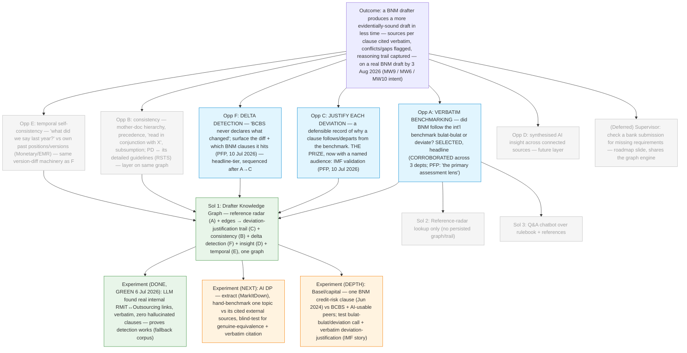

# Discovery Brief: Drafter Knowledge Graph — from drafting to execution (COPA Hackathon 2026)

> **This brief redefines the product around a single pain point: the policy
> drafter.** It supersedes the two-persona framing in
> [`../policy-consistency-ai/brief.md`](../policy-consistency-ai/brief.md)
> (drafter + supervisor on one graph). The supervisor persona is **deferred to a
> roadmap slide** (decision below). The prior brief remains the record of the
> two-persona era and its two green experiments.
>
> Context: COPA Hackathon Challenge 2026 (3 August 2026, BNM internal). Judging
> weights **Problem Relevance & Impact (30)** highest, then Technical Execution
> (20), Innovation (15), MVP Quality (15), Feasibility & Scalability (10),
> Presentation (10). Final judges include the CIO, DG, AG and Directors.
> Solutions must align with BP2026 Must-Wins.

## The redefinition, in one line

**A policy drafter drafts one real, cite-heavy BNM policy end-to-end on a living
knowledge graph of everything that policy depends on — external references (peer
regulators, acts, standards, international bodies) and internal BNM policies —
so the draft is faster to produce, evidentially sound, and carries a defensible
reasoning trail for every decision.**

## Discovery Update — 10 Jul 2026 (four more interviews: FS, Monetary, RSTS, PFP)

Four interviews across **different departments** — the generalisation check
Opportunity A was waiting on (prior Action Item #3). The pattern holds, and one
genuinely new pain surfaced. (Abbreviations, all confirmed by user 10 Jul 2026:
**PPD** = Payments Policy Department, **EMR** = Economic & Monetary Review,
**OPR** = Overnight Policy Rate, **RH** = Regulatory Handbook. Added from the deep
PFP interview: **PFP** = Prudential and Financial Policy department, **PD** =
Policy Document, **ED** = Exposure Draft, **BCBS** = Basel Committee on Banking
Supervision, **FSA 2013** = Financial Services Act 2013, **RSU** = Risk
Supervision Unit. RSTS / FS / CLS / NAIO / IFD are departments/policies used as
the interviewees named them.)

1. **Opportunity A generalises — second dept, second drafter.** A **policymaker
   from FS**, drafting a new policy (**CLS**), described the pain as _"getting a
   holistic view of **BNM vs international standards**."_ This is Opportunity A
   almost verbatim, now on a different drafter in a different department than the
   RMiT interview — A's evidence moves from single-source to **corroborated**.
2. **New Opportunity E — "what did we say last year?"** An **economist from
   Monetary Policy**, drafting the annual **EMR** (Economic & Monetary
   Review), said it is common to ask _"what did we say last year?"_ — especially
   when **OPR** (Overnight Policy Rate) decisions haven't changed. This
   is a **temporal self-consistency** pain: aligning a draft with the
   institution's **own past positions and versions**, not external sources. The
   graph already models past versions as nodes, so this is a low-cost, high-
   resonance new branch (added to the tree below).
3. **Opportunity B, sharpened — PD ↔ its own detailed guidelines.** A **supervisor
   from RSTS**, on RMiT, framed the need as ensuring the **detailed guidelines
   stay in line with the core PD**. Context: when BNM releases a Policy Document,
   more detailed guidelines are also released on the **RH platform** (Regulatory
   Handbook). This is a specific, concrete flavour of Opportunity B
   (internal consistency): PD ↔ its downstream guidelines.
4. **PFP policymaker — deep interview completed (see next section).** This
   prudential/capital drafter gave the richest journey yet and **reframes two of
   our core bets** — it is written up in full below.

### Deep interview — PFP (prudential / capital) drafter, 10 Jul 2026

The single strongest evidence in this brief. It confirms the headline, gives the
"prize" a named audience, and surfaces one sharp new pain.

- **Verbatim benchmarking IS the job — Opportunity A confirmed a third time, at
  full strength.** The drafter's own framing: _"verbatim benchmarking is the
  primary assessment lens."_ When enhancing a document, the core question is _what
  new requirements were added on top, and did BNM follow the international
  benchmark **bulat-bulat** (exactly/blindly) or deviate?_ This is not "nice to
  see what peers say" — it is the central drafting activity. A is now corroborated
  across **three drafters in three departments** (RMiT, FS/CLS, PFP/capital).
- **Opportunity C now has a concrete, named consumer: the IMF.** _"IMF validation
  assessment checks how closely BNM follows [BCBS], in which areas it deviates,
  and whether the deviation is warranted."_ Nuance: BNM is **not** obligated to
  comply with BCBS and isn't penalised for deviating (unlike jurisdictions under
  BCBS), but the IMF still assesses the closeness and the justification. **This
  retires C's "weak/inferred" status** — the decision trail _is_ the
  deviation-justification record BNM needs for IMF review. C's framing sharpens
  from "reconstruct my reasoning" to **"justify every deviation from the
  benchmark, verbatim."**
- **New Opportunity F — external-standard delta detection (headline-tier).**
  _"BCBS never declares what changed — the drafter has to spot the deltas
  manually."_ PFP tracks BCBS; PPD tracks a different (e-money) standard-setter.
  Diffing two versions of an external standard and surfacing what moved — and
  which BNM clauses it touches — is concrete, painful, and obviously AI-shaped.
  Added as a first-class branch (a likely demo beat of its own).
- **Opportunity B is structural, not just "good to know."** Confirmed mechanics:
  a **mother-document hierarchy** (Operational Resilience is the mother doc →
  applies to RMiT etc.; Basel III → capital sub-modules credit/operational/market
  risk; counterparty risk subsumed into credit risk); **precedence/ranking**;
  explicit _"read in conjunction with X"_ and subsumption decisions (_"can this be
  subsumed under the PD?"_); and cross-team overlap tagging to **FS, RSU, IFD** via
  **FPWG** / MC. The graph must model these as real structure.
- **Benchmarking is not one-size-fits-all — the graph needs document metadata.**
  **Technical** docs (Basel/capital) are followed _bulat-bulat_; **principle-based**
  docs (Operational Resilience, BCM) are high-level and deliberately avoid
  point-in-time requirements. Each requirement/jurisdiction also carries structural
  attributes the drafter must answer: _is it legislated? is there a mother doc?
  what is its precedence/rank? who is the standard-setting party?_
- **The jurisdiction corpus, with AI-usability pre-labelled by the drafter:**
  **AI-usable** — UK (PRA/BoE; SACR/UK PRA for credit risk), Canada (OSFI;
  Basel-based, paused output floor with ~2yr notice), Australia (APRA), Singapore
  (MAS), Indonesia, New Zealand (RBNZ). **Manual** (harder to ingest) — Hong Kong
  (HKMA; requirements built into legislation), EU (EBA + national regulators), US
  (Fed + state-level). National discretions live in footnotes (currently only MAS
  and HKMA exercise them). Latest BNM credit-risk doc: **June 2024**.
- **Lifecycle + adjacent products:** the flow is **Discussion Paper → Exposure
  Draft (ED) → Feedback → Policy Document (PD)**, ~2 years end to end; consultation
  papers signal intent (listed in Annex 1 of the PD). Feedback is categorised
  agree / partially agree / disagree (capital = quantitative feedback; BCM =
  qualitative), worked through **FPWG** and MC — the drafter wants **a system to
  submit ED-consultation feedback**. These are real adjacent surfaces (roadmap).
- **The "why now" pain restated:** policy drafting takes ~2 years while tech moves
  faster — so PDs are kept high-level on purpose, and fast-moving areas (PPD/e-money)
  use **supervisory letters** instead of rigid PDs. Speeding the benchmarking +
  delta + justification loop is the efficiency prize (MW10 — see the correction
  banner below; earlier MW9 references in this brief are superseded).
- **Two verbatim citations still owed** (⚠️ **CORRECTED 11 Jul 2026: NOT local.**
  Earlier text here claimed these were "expected local in `docs/references/`" —
  they are not; only Basel _Operational Resilience_ d516 is local): the **Basel
  III 72.5% output floor** (BCBS d424 / Basel Framework RBC20) and **Canada's OSFI
  output-floor freeze** (likely the Jun 2023 DSB press release). Both are public
  and obtainable, but must be sourced + extracted (see the greenfield brief's
  Validation Kit). Needed so the demo quotes them exactly, per the guardrail.

**Strategic steer from the comments (these reshape the pitch, not just the tree):**

- **Flexibility is the headline value.** _"By being the persona yourself, some
  policies we could've missed"_ and _"anything beyond BNM [we] didn't realise
  existed"_ — the core value is a **flexible drafting graph that surfaces
  connections the drafter didn't know were there**, across document types (PDs,
  guidelines, discussion papers, CLS, EMR, even a parliament paper / bill), not a
  tech-risk-specific tool. **Decision (10 Jul):** pitch the flexibility; **demo
  one concrete slice** (the AI DP vs RMiT + international standards).
- **Favour an in-progress example over a completed one.** Explicit steer to
  **rethink RMiT-as-headline** and lead with something _currently in the works_.
  This **confirms the AI DP anchor** and sharpens its use case: check **PPD's AI
  discussion paper against the existing RMiT for conflicting guidelines** (Opp A +
  B on a live document) rather than a hypothetical RMiT v2 edit.
- **"How is this special — not replicable by an FI?"** A moat question the pitch
  must answer directly. Working answer: an FI only sees BNM's **published** output;
  **only BNM sees the drafting-side web** — the internal rulebook, the confidential
  RH guidelines, cross-policy authority, and its own historical positions (Opp E).
  The graph is built from a vantage point an FI structurally cannot occupy.
- **Priority ranking (from the comments):** **(1) policy drafting = the main
  bet**; supervisor view = **(2) "what else / next"** → _confirms the deferral_;
  parliament paper / bill = **(3)** a flexibility example. NAIO noted as a
  stakeholder/context.
- **Value stream to frame the pitch:** _drafting → execution by FIs._

The knowledge graph stops being a hidden engine (as it was for the supervisor
checklist) and becomes **the product the drafter operates**: they _see_ the
connections between their draft and its sources, and that visibility is what
produces speed, soundness, and traceability.

## Desired Outcome

A BNM policy drafter produces a **more evidentially-sound draft in less time**
using a knowledge-graph tool — demonstrated on one real BNM policy draft where
the tool (a) surfaces the external + internal sources each clause relies on,
**cited verbatim**, (b) flags conflicts / gaps / duplication against those
sources, and (c) captures the reasoning trail behind each drafting decision — by
the hackathon (**3 Aug 2026**).

**Metric (to be finalised in the experiment / Action Item #5):** on one real
drafting task, ≥15% less time on source research **and** a measurable lift in
evidential completeness (share of drafted clauses that carry a verbatim,
verifiable citation to the source that informed them, vs. a from-memory
baseline).

**Must-Win alignment (re-anchored for the drafter-only scope):**

> **⚠️ CORRECTED 11 Jul 2026 after reading the real BP2026 deck — do not cite
> MW9.** The greenfield brief
> ([`../reconciliation-workbench/brief.md`](../reconciliation-workbench/brief.md))
> supersedes the Must-Win framing below. BP2026 footnotes MW9-KR2's "non-IT" as
> _process improvements that do **not** require building or acquiring software_;
> our tool is software, so **MW9 does not apply.** The correct anchor is **MW10
> KR2** (AI business-process-reengineering — a binary Must-Win hit) + **KR3**
> (>15% efficiency) + **Trusted Institution / T2 Credible regulator** (evidenced
> by the IMF FSAP). The list below is retained for history.

- **~~MW9 (Resource discipline)~~ — DROPPED (see correction above):** MW9-KR2 is
  explicitly _non-software_; our tool is software.
- **MW6 (Financial sector strategy)** — a coherent, non-contradictory rulebook:
  drafts that are checked against their sources at authoring time.
- **MW10 (AI roadmap) — primary.** KR2 (one AI business-process-reengineering
  initiative per sector) is the clean binary fit; KR3 (>15% efficiency) supplies
  the metric. The "supervisory processes" wording in KR3 is why the supervisor
  persona is deferred (see Decision Log) — lead on KR2, cite KR3's efficiency as
  intent.
- **SET2027 (wider appeal):** an evidentially-sound rulebook supports _Trusted
  Institution / Credible Regulator_; less manual cross-referencing supports
  _Engaged Employees_.

## Demo anchor — ONE demo: the Reconciliation view (11 Jul 2026)

**Decision (11 Jul 2026, supersedes the 10 Jul dual anchor):** time is the
binding constraint for a hackathon pitch, so we commit to **one demo** built
around the **single common pain** (clause-level reconciliation — see Selected
Opportunity). The dual AI-DP-plus-Basel plan is dropped: two corpora doubled the
prep and split the narrative.

**The hero is the _act_, not a document.** The demo opens on the Reconciliation
view — one draft clause on the left, the authoritative source on the right, a
verdict badge (**Aligned / Deviates / Gap / No source found**), the verbatim
quote, and a "why this call" note. A **source-type legend** (peer · benchmark ·
our past · parent PD) shows the same view serving every persona — so we assert
the flexible-tool message _and_ show it in one screen, without a second corpus.

**Vehicle document (staging detail, not the product) — recommended: the AI in
Financial Sector Discussion Paper.** Chosen as the vehicle because: it is a real,
live, in-progress draft (honours the "favour current work" steer); it is
instantly legible to the senior non-technical panel (Innovation + Presentation);
and the **POC already exists for it** — lowest prep under time pressure. Its
concrete reconciliations: **DP ↔ FTFC** (Deviates — fairness), **DP ↔
Outsourcing** (Gap — third-party AI), **DP ↔ MAS / FSB / IOSCO** (benchmark).

- **Basel/capital is NOT a second demo** — it becomes the _showcase example_ of
  another source type inside the same view (one BCBS reconciliation row: BNM
  credit-risk clause ↔ BCBS output floor, verdict _Deviates_, with the IMF
  justification note). One row, not a corpus — it carries the IMF story (C) and
  the delta idea (F) as illustration, at near-zero extra prep.
- RMiT/Outsourcing remains the **de-risking fallback** (already-green
  connection-finding) if the AI DP corpus work runs late.

**Pitch framing — flexible tool, ONE concrete demo:** the _message_ is a
**document-type-agnostic reconciliation engine** — PDs, guidelines, discussion
papers, CLS, EMR, capital rules, even a parliament paper → bill (value stream:
**drafting → execution by FIs**). The _demo_ proves it on one view, with the
source-type legend standing in for breadth. General claim, single concrete proof.

_If the team would rather lead with the most-defensible, lowest-stage-risk
source, swap the vehicle to the Basel/capital reconciliation (carries the IMF
story; **note the Basel output-floor / OSFI PDFs are NOT yet local — must be
sourced + extracted first**, corrected 11 Jul 2026) and demote the AI DP to the
illustrative row. Same view either way — the vehicle is a staging choice, not a
product change._

**Why an FI can't replicate this (the moat — a question the pitch must answer):**
an FI only ever sees BNM's **published** output. **Only BNM occupies the
drafting-side vantage point** — the internal rulebook, the confidential RH
guidelines, cross-policy authority, and its own historical positions (Opp E).
The graph is assembled from a seat an FI structurally cannot sit in.

**Known cost / risk (logged, not a blocker):**

- The DP PDF uses BNM's custom-font encoding — naive text extraction produces
  gibberish, the exact problem the prior brief documented. **MarkItDown** is the
  proven fix (already the `engine/` ingestion pipeline). Extracting the DP and
  cataloguing its _actual_ citations is **Action Item #1**.
- Both prior green experiments were on the **RMiT + Outsourcing** pair. The
  connection-finding assumption is **unproven on the AI DP corpus** and its
  external cited sources still need sourcing — this is what the experiment below
  tests. The RMiT/Outsourcing pair is retained as a **de-risking fallback** (a
  proven case that connection-finding works), even though the AI DP leads.

## Opportunity Map

All opportunities are the **drafter's**. The supervisor's submission-checking
pain from the prior brief is out of scope for this redefinition (deferred).

| #     | Opportunity (drafter pain)                                                                                                                                                                                                                                                                            | Evidence                                                                                                                                                                                                          | Strength                                        | Size                                              |
| ----- | ----------------------------------------------------------------------------------------------------------------------------------------------------------------------------------------------------------------------------------------------------------------------------------------------------- | ----------------------------------------------------------------------------------------------------------------------------------------------------------------------------------------------------------------- | ----------------------------------------------- | ------------------------------------------------- |
| **A** | **Verbatim benchmarking** — for the clause being drafted, finding what external sources say (peer regulators, acts, int'l bodies/BCBS, standards) and whether BNM followed the benchmark _bulat-bulat_ or deviated. Scattered, manual, and **the central drafting activity**.                         | **Corroborated across THREE depts (10 Jul 2026):** RMiT drafter; FS/CLS ("BNM vs int'l standards"); **PFP/capital: _"verbatim benchmarking is the primary assessment lens."_** The AI DP cites dozens of sources. | **Strong** (three direct sources, three depts)  | Policy-drafting teams (cross-dept)                |
| **B** | Keeping a draft **consistent** with the sources it depends on — conflicts, gaps, duplication across internal BNM policies and external references — relies on memory, not a map. **Sharpened flavour:** a Policy Document ↔ its own downstream **detailed guidelines** (released on the RH platform). | RMiT drafter: overlaps "good to know". **RSTS supervisor (10 Jul):** ensure detailed guidelines stay in line with the core PD. Green experiment (6 Jul) proved LLM _detection_ works without hallucinating.       | Moderate as a driver; **Strong** on feasibility | Policy-drafting teams                             |
| **C** | **Justifying deviations from the benchmark** — a defensible, evidential record of _why_ each clause follows or departs from the international standard. Hard to reconstruct months later; today it lives in people's heads.                                                                           | **Validated 10 Jul 2026 (PFP), with a named consumer:** _"IMF validation checks how closely BNM follows [BCBS], where it deviates, and whether the deviation is warranted."_ The decision trail IS that record.   | **Strong** (direct, named audience = IMF)       | Policy-drafting teams + reviewers/IMF/leadership  |
| **F** | **External-standard delta detection** — spotting what changed between two versions of an external standard (e.g. BCBS) and which BNM clauses it hits. Today entirely manual.                                                                                                                          | **Direct interview (10 Jul 2026, PFP):** _"BCBS never declares what changed — the drafter has to spot the deltas manually."_ PFP tracks BCBS; PPD tracks the e-money standard-setter.                             | **Strong** (direct, new)                        | Policy-drafting teams tracking external standards |
| **D** | Getting **synthesised insight** across all connected sources — the emerging consensus, where peers diverge, what a cited source implies for this clause — is manual and slow without AI over the connected corpus.                                                                                    | Implied by the "insights better with AI" goal. No direct interview.                                                                                                                                               | Weak                                            | Policy-drafting teams                             |
| **E** | **Temporal self-consistency** — aligning a draft with the institution's **own past positions and prior versions** ("what did we say last year?"), especially where the position hasn't changed.                                                                                                       | **Direct interview (10 Jul 2026):** Monetary Policy economist on the annual EMR — common to ask "what did we say last year?", esp. when OPR decisions are unchanged.                                              | **Moderate** (one direct source, new)           | Policy-drafting teams (esp. recurring drafts)     |

## Selected Opportunity

### The one common pain point across all five interviews (11 Jul 2026)

Stripping away department specifics, **every interview describes the same act**
with a different thing on the other side of the comparison:

| Interview       | The draft clause is reconciled against…    | Source type             |
| --------------- | ------------------------------------------ | ----------------------- |
| RMiT drafter    | peer regulators, national acts             | External peer / law     |
| FS / CLS        | "BNM vs international standards"           | International benchmark |
| PFP / capital   | BCBS — followed _bulat-bulat_ or deviated? | International benchmark |
| Monetary / EMR  | "what did we say last year?"               | Our own past version    |
| RSTS supervisor | detailed guidelines vs the core PD         | Our own parent policy   |

Different sources, **one identical loop underneath** — the pain we build the
whole solution around:

> **Every drafter, in every department, reconciles their draft — clause by
> clause — against the authoritative sources that bear on it, decides whether it
> _aligns_ or _deliberately deviates_, and must justify that call. Today it is
> manual, done from memory, and leaves no defensible trail.**
>
> `For clause X → which sources bear on it? → what do they say (verbatim)? → do I align or deviate? → why, and can I prove it?`

**This dissolves the "which document" demo fork (decided 11 Jul 2026).** We do
_not_ pick a document as the product — we build the **Reconciliation view** (one
clause ↔ its authoritative source, a verdict badge **Aligned / Deviates / Gap /
No source found**, the verbatim quote, and a recorded "why this call"), and the
demo document is simply the clearest _vehicle_ to dramatise that act. Every
opportunity below is now a **facet of this single view**, not a separate feature:

- **A (verbatim benchmarking)** = the reconciliation act itself.
- **C (deviation-justification trail)** = the "why this call" record, accumulated.
- **B (internal consistency)** = the same view with a _parent policy / guideline_
  on the source side (RSTS).
- **E (temporal)** = the same view with _our own past version_ on the source side.
- **F (delta detection)** = the same view, run when a source _version changes_.
- **D (AI insight)** = synthesis across many reconciliations.

The **source-type legend** (peer · benchmark · our past · parent PD) is how one
engine visibly serves all five personas — the "flexible tool" pitch made literal,
and honest because the interviews prove it.

### How the pieces rank under the one pain

The graph is structured so **A (the reconciliation act) is the headline** and
**C (the justification trail) is the payoff**; B, E, F, D are the same view with
a different source type or trigger. Framing: _"one view, one act — align or
deviate, and prove it."_ The PFP interview strengthened both ends: A is the
drafter's own "primary assessment lens", and C now has a named audience (the
IMF), retiring its earlier "weak/inferred" status.

Selection rationale against the criteria:

- **Evidence:** A is now the best-evidenced pain by a wide margin — named
  directly by three drafters across three departments, and called the "primary
  assessment lens" by the prudential drafter. C is no longer a bet on an inferred
  need: the IMF deviation-justification use case is real and named.
- **Outcome alignment:** A drives the "less time benchmarking" half of the
  outcome; C drives the "evidentially sound / defensible" half — and maps cleanly
  to a concrete institutional obligation (IMF validation), which sharpens the
  Impact pitch.
- **Feasibility:** A's external corpus is largely **public** (peer regulators,
  int'l bodies, national acts) and the drafter pre-labelled which jurisdictions
  are AI-ingestable. The Basel output-floor / OSFI PDFs **must be sourced +
  extracted** (⚠️ corrected 11 Jul 2026 — they are NOT yet local, contrary to
  earlier text). The regulatory handbook stays **deferred** (confidential).
- **Why C is a "free" payoff, not extra scope:** every reference the radar
  surfaces is captured as a **graph edge at authoring time**, so the
  justification trail is a _view over data the tool already holds_ — not a
  separate feature. This is what makes "A leads, C is the prize" credible.

**Deferred (not discarded):**

- **F (delta detection)** — validated and headline-tier, but sequenced _after_
  the core A→C loop lands; it reuses the same version-diff machinery as E and is
  a strong standalone demo beat (esp. on the Basel depth slice).
- **D (AI synthesis insight)** — a natural next layer once A and C land.
- **E (temporal self-consistency)** — validated (Monetary/EMR) and cheap (the
  graph already holds version nodes), but kept off the MVP critical path: it
  rides the same graph and can light up once A + B land. Strong flexibility
  proof-point for the pitch (shows the tool isn't tech-risk-specific).
- **The entire supervisor persona** (bank-submission checklist, gaps against the
  rulebook) — a validated adjacent product, ranked #2 "what else / next" by the
  interviews, deferred to a roadmap slide to keep the "one pain point" focus. Its
  shared-graph engine means it can return cheaply.
- **Parliament-paper / bill drafting** — ranked #3 in the interviews; a
  flexibility example for the roadmap, not MVP1.

## Solution Candidates

| #   | Solution                                                                                                                                                                                                                                                                                                                                                                                                                                     | Riskiest Assumption                                                                                                                                                                                                                                                                                                                                         | PRD                                                                                            |
| --- | -------------------------------------------------------------------------------------------------------------------------------------------------------------------------------------------------------------------------------------------------------------------------------------------------------------------------------------------------------------------------------------------------------------------------------------------- | ----------------------------------------------------------------------------------------------------------------------------------------------------------------------------------------------------------------------------------------------------------------------------------------------------------------------------------------------------------- | ---------------------------------------------------------------------------------------------- |
| 1   | **Drafter Knowledge Graph (SELECTED)** — the drafter works on one living draft (the AI DP) at the centre of a graph of its sources. **Reference radar (A)** surfaces, per clause, what external + internal sources say, cited verbatim. Each surfaced/accepted reference becomes an **edge**, which produces the **decision trail (C)** as a by-product. **Consistency checks (B)** and an **AI insight layer (D)** run over the same graph. | The LLM can find the **genuinely equivalent / relevant** passages in differently-structured external sources (a peer regulator's policy, an act, an int'l-body paper) with verbatim citations — **without forcing false equivalences or missing obvious ones** — on the **AI DP corpus** (the prior green covered only the internal RMiT↔Outsourcing pair). | [Epic PRD](../../specs/rulebook-radar/spec.md) (needs re-issue to drafter-only + AI DP anchor) |
| 2   | **Reference radar only (no persistent graph / trail)** — a per-clause "what do external sources say" lookup panel, RAG-style, without modelling references as durable graph edges.                                                                                                                                                                                                                                                           | That the _lookup_ alone delivers enough value — i.e. that drafters don't need the persisted connections (which is exactly what powers C, B, and D). Cheaper to build, but throws away the "prize".                                                                                                                                                          | —                                                                                              |
| 3   | **Q&A over the rulebook + references** — plain-language "what do our peers say about X?" chatbot.                                                                                                                                                                                                                                                                                                                                            | That a chatbot answer ("what does the rule say") substitutes for graph-anchored, clause-linked, verbatim-cited connections. Less novel; loses the benchmarking and traceability jobs a chatbot structurally can't do.                                                                                                                                       | —                                                                                              |

**Leading solution: #1, the Drafter Knowledge Graph.** It is the only candidate
that delivers all four payoffs from one artifact and preserves the
verbatim-citation guardrail (the hard product rule) as the anti-hallucination
measure. #2 and #3 are the "what a plain RAG tool would do" foils — useful in the
pitch to explain _why the graph wins_.

## Opportunity Solution Tree

## Recommended Experiment

**Test the riskiest assumption on the actual demo anchor before re-issuing specs:
can the LLM find the genuinely-relevant passages in the AI DP's own cited external
sources, verbatim, without inventing equivalences?**

- **What:** (1) Extract the AI DP with MarkItDown and catalogue its real
  citations (this is also Action Item #1). (2) Pick **one topic the DP covers**
  (e.g. its AI governance / model-risk expectations). By hand, write down what
  **2–3 of its cited external sources** actually say on that topic. (3) Give a
  fresh LLM agent the DP clause + those external documents and ask it to find and
  quote the equivalent / related passages.
- **How to judge:** compare against the hand-made list. Every citation must be
  **verifiable verbatim** (same guardrail as the 6 Jul green run).
- **Effort:** ~half a day, no code (sourcing the external PDFs doubles as the
  check that the demo corpus is obtainable).
- **"Good" looks like:** most hand-found relevant passages surfaced, quotes
  verbatim, and **no invented equivalence** (a passage claimed to "relate" that
  actually covers something else). → green light to re-issue specs and build.
- **If it fails:** tighten to topic-scoped retrieval (match topic first, quote
  second) before the build — the design-around Project Gaia used for the same
  hallucination risk.
- **Bonus signal:** show the output to the interviewed drafter — a second cheap
  validation of Opportunity A ("is this the research you meant?"), and probe
  Opportunity C directly ("would a saved trail of these references help you
  defend the draft later?").

The prior green run on RMiT↔Outsourcing stands as the **fallback proof** that
connection-finding works; this experiment extends it to the (harder,
cross-jurisdiction, real-draft) AI DP case.

### Experiment 3 — Basel/capital depth (NEXT, added 10 Jul 2026 after PFP)

**Tests the sharpest, most quantifiable version of the riskiest assumption — and
the IMF deviation-justification story (Opportunity C) — on the depth anchor.**

- **What:** take one BNM **credit-risk** clause (latest doc Jun 2024) and, by
  hand, record what **BCBS** and 2–3 **AI-usable** peers (UK PRA/BoE, OSFI, MAS)
  say on the same point. Include the two owed verbatim citations — the **Basel III
  72.5% output floor** (BCBS d424 / RBC20) and **Canada's OSFI freeze** — from the
  local PDFs in `docs/references/`.
- **How to judge:** give a fresh LLM the BNM clause + external passages and ask it
  to (a) surface the equivalents verbatim, (b) make the **bulat-bulat vs deviation**
  call, and (c) draft a one-line **deviation justification**. Score equivalence
  accuracy, citation-verbatimness, and whether the follow/deviate call is correct.
- **"Good" looks like:** correct equivalents, exact quotes, a defensible
  deviation note a drafter would accept for an IMF assessment — no invented match.
- **Bonus (Opportunity F):** feed two BCBS versions and check the LLM surfaces the
  real delta — a cheap probe of the delta-detection branch.
- **Effort:** ~half a day of analysis — **plus sourcing + extracting the Basel
  output-floor / OSFI PDFs first** (⚠️ corrected 11 Jul 2026: they are NOT local;
  earlier text wrongly said "no sourcing needed").

## Recommendation

Proceed in this order:

1. **Run Experiment 2 (AI DP) and Experiment 3 (Basel depth)** — together they are
   the go/no-go and lock the dual demo corpus. Experiment 3 is cheap (PDFs already
   local) and tests the strongest, most defensible slice.
2. **In parallel, close the remaining validation:** complete the **PFP-adjacent**
   generalisation (Action Item #8) and pull the two owed verbatim citations
   (Action Item #10). Opportunity C no longer needs standalone validation — the
   PFP interview gave it the IMF audience.
3. **Once green:** run `/prd` to re-issue the drafter specs in
   `docs/specs/rulebook-radar/` to the **drafter-only scope + dual anchor** —
   promote **verbatim benchmarking (A)** and the **deviation-justification trail
   (C)**, add **delta detection (F)**, model the graph's structural metadata
   (mother-doc / precedence / legislated / standard-setter / technical-vs-principle),
   and **remove the built supervisor stories from MVP1** (roadmap appendix). The
   graph/clause engine is unaffected — its segmentation + linking applies to
   external standards and capital rules too.

Scope stays deliberately small: **one Reconciliation view**, demonstrated on the
AI DP vehicle with a handful of its sources, plus one illustrative Basel row for
the benchmark/IMF story. Not every source or jurisdiction the drafter named, and
**not two corpora**.

## Decision Log

- **One common pain + one demo (11 Jul 2026).** Synthesised all five interviews
  to a single invariant — **clause-level reconciliation** (align / deviate / gap
  against any authoritative source, with a recorded justification) — and built
  the solution and pitch around it. **Supersedes the 10 Jul dual anchor**: time
  is the binding hackathon constraint, so we run ONE demo (the Reconciliation
  view). The demo document is a staging vehicle (recommended: AI DP, since its
  POC already exists), not the product; Basel/capital collapses from a second
  corpus into one illustrative row carrying the IMF (C) and delta (F) story.
  Opportunities A/B/C/D/E/F are re-framed as _facets of the one view_ (different
  source type or trigger), shown via a source-type legend.
- **Redefined to a single pain point — the policy drafter (10 Jul 2026).** Focus
  the whole product on the drafter's "drafting to execution" journey, powered by
  a knowledge graph the drafter _operates_ (not a hidden engine). Chosen per the
  user's explicit redefinition request.
- **Supervisor persona deferred to a roadmap slide (10 Jul 2026).** Chosen over
  "keep as secondary" and "fold gap-checking into the drafter." Buys a clean
  one-pain-point story; **cost:** loses the literal MW10 "supervisory processes"
  wording match, so the outcome re-anchors to MW9 + MW6 + MW10's broader
  AI-tools intent. The supervisor shares the same graph engine, so it can return
  cheaply in a later phase.
- **Dual demo anchor: AI DP (hero) + Basel/capital (depth) — 10 Jul 2026.**
  _(⚠️ SUPERSEDED 11 Jul by the single-demo decision — see below — and this entry
  contained a factual error: it said "real PDFs already local", but the Basel
  output-floor / OSFI PDFs are NOT local and must be sourced. Retained for
  history.)_ After the PFP deep interview, chosen over "switch fully to Basel" and
  "keep AI DP only." The AI DP carries novelty/liveness; the Basel slice carries
  the sharpest, most quantifiable verbatim-benchmarking pain and the IMF
  deviation-justification story. Cost: two corpora to prep.
- **Opportunity A re-characterised as _verbatim benchmarking_ and confirmed
  strongest (10 Jul 2026, PFP).** Three drafters, three departments; the
  prudential drafter called it "the primary assessment lens" (did BNM follow the
  benchmark _bulat-bulat_ or deviate). A is no longer "research what peers say" —
  it is the central drafting act.
- **Opportunity C validated with a named audience — the IMF (10 Jul 2026, PFP).**
  Retires C's earlier "weak/inferred" status. IMF validation checks how closely
  BNM follows BCBS and whether deviations are warranted; the decision trail _is_
  that deviation-justification record. C's framing sharpens from "reconstruct my
  reasoning" to "justify every deviation, verbatim."
- **Added Opportunity F — external-standard delta detection (headline-tier,
  10 Jul 2026).** Chosen over "layer within A" and "note but defer." "BCBS never
  declares what changed" — a concrete, AI-shaped pain worth its own demo beat;
  sequenced after the core A→C loop and reusing E's version-diff machinery.
- **Graph must model structural metadata (10 Jul 2026, PFP).** Mother-doc
  hierarchy, precedence/rank, legislated?, standard-setting party, and
  technical-vs-principle — benchmarking behaves differently per type (capital =
  follow _bulat-bulat_; OpRes/BCM = principle-based). Deferred to `/prd` (Action
  Item #12).
- **Demo anchored on the real AI in the Financial Sector Discussion Paper
  (10 Jul 2026).** Chosen over "keep the RMiT tech-risk cluster" and "AI DP
  primary + RMiT backup as a single blended plan." It is a genuinely live,
  citation-heavy BNM draft → maximal honesty + novelty. RMiT/Outsourcing is
  retained only as a **de-risking fallback** (already-green proof of
  connection-finding). Cost: new corpus, custom-font extraction needed, and the
  connection-finding assumption is unproven on it (the experiment tests this).
- **Reference radar (A) leads; decision trail (C) is the payoff (10 Jul 2026).**
  Chosen over leading with C directly (weakest evidence — no drafter has voiced
  the traceability pain) and over A-only. Rationale: lead with the best-evidenced
  pain, and earn the strategic end-goal (C) as a by-product of the graph edges
  the radar already creates. B (consistency) and D (AI insight) are further layers
  on the same graph.
- **Verbatim-citation guardrail carried through unchanged** — the hard product
  rule and the anti-hallucination measure that made the 6 Jul verification
  possible in ~2 minutes.
- **Opportunity A corroborated across departments (10 Jul 2026).** Four
  interviews (FS, Monetary, RSTS, PFP-pending) confirm the external-reference /
  cross-source pain is not RMiT-specific — the FS/CLS "BNM vs international
  standards" framing matches A almost verbatim in a different department.
- **Flexible tool, concrete demo (10 Jul 2026).** Chosen over staying
  single-cluster. The interview steer ("flexibility***"; "by being the persona
  yourself, policies we could've missed"; "anything beyond BNM we didn't realise
  existed") reframes the value as document-type-agnostic. Pitch the flexibility;
  demo one concrete slice (AI DP vs RMiT + vs int'l standards). Value stream:
  drafting → execution by FIs.
- **Added Opportunity E — temporal self-consistency (10 Jul 2026).** The
  Monetary/EMR "what did we say last year?" pain is a new, directly-evidenced
  branch. Kept off the MVP critical path but rides the same graph (version nodes
  already exist) — a cheap flexibility proof-point.
- **Demo use case sharpened to AI DP ↔ RMiT (10 Jul 2026).** Per the steer to
  favour in-progress over completed work, the headline slice checks PPD's live AI
  discussion paper against the existing RMiT for conflicting guidelines (B), plus
  AI DP vs international standards (A) — rather than a hypothetical RMiT v2 edit.
- **Moat named (10 Jul 2026):** "not replicable by an FI" because an FI sees only
  BNM's published output; the drafting-side graph (internal rulebook, confidential
  RH guidelines, cross-policy authority, own historical positions) is a vantage
  point only BNM holds. The pitch must state this explicitly.
- **Priority ranking from interviews (10 Jul 2026):** (1) policy drafting = main
  bet; (2) supervisor view = "what else/next" (confirms deferral); (3)
  parliament-paper/bill = flexibility example. Reinforces the current scope.
- **Inherited, still standing:** public external corpus carries the demo; the
  regulatory handbook stays deferred (confidential — locked placeholder / labelled
  mock, never in a tracked path); single tech-cluster / no cross-cluster ripple in
  MVP1; the AI-proposes / human-commits rule for any draft edits.

## Action Items

| #   | Question to resolve                                                                                                                                                                                     | Who to consult                | Blocks step                                      | Status                                                                                                                                                                                                                             |
| --- | ------------------------------------------------------------------------------------------------------------------------------------------------------------------------------------------------------- | ----------------------------- | ------------------------------------------------ | ---------------------------------------------------------------------------------------------------------------------------------------------------------------------------------------------------------------------------------- |
| 1   | Extract the AI in the Financial Sector DP with MarkItDown and catalogue its **actual** cited references (which peer regulators, acts, int'l bodies, internal BNM policies) — verbatim titles.           | Hackathon team                | Locks the real demo corpus; feeds the experiment | **Open — NEXT.** DP PDF fetched (custom-font encoded, ~683KB, 37pp); needs MarkItDown, not naive text extraction                                                                                                                   |
| 2   | Run the reference-radar experiment on the AI DP corpus (see Recommended Experiment) — genuine-equivalence + verbatim-citation blind test.                                                               | Hackathon team                | Go/no-go on the redefinition & specs             | Open — depends on #1                                                                                                                                                                                                               |
| 3   | Validate Opportunity A generalises: does the external-reference research pattern hold for drafters beyond RMiT / beyond tech-risk?                                                                      | Other policy-drafter contacts | Firms up the headline opportunity                | **RESOLVED 10 Jul 2026** — FS policymaker (CLS) independently framed the same pain ("BNM vs int'l standards"); corroborated across depts.                                                                                          |
| 4   | Validate Opportunity C directly: do drafters actually struggle to reconstruct the reasoning behind past drafting decisions? Would a saved decision trail be used and trusted?                           | Policy-drafter contacts       | Whether C can graduate from payoff to lead       | **RESOLVED 10 Jul 2026 (PFP)** — C validated with a named consumer: IMF validation checks how closely BNM follows BCBS + whether deviations are warranted. The trail IS that record.                                               |
| 8   | Complete the **PFP** policymaker interview (noted "to check", no findings yet) — does the pattern hold there too?                                                                                       | PFP contact                   | Further generalisation of A / E                  | **RESOLVED 10 Jul 2026** — deep PFP interview completed; richest evidence yet (see deep-interview section). Confirmed A, validated C, surfaced F.                                                                                  |
| 10  | Source **and extract** the two owed **verbatim citations**: Basel III 72.5% output floor (BCBS d424 / RBC20) and Canada's OSFI freeze (Jun 2023 DSB release).                                           | Hackathon team                | Basel depth demo + Experiment 3                  | **⚠️ CORRECTED 11 Jul 2026 — NOT local.** Prior text wrongly said "pull from `docs/references/`". Only Basel d516 (Op Resilience) is local. d424 PDF downloaded but needs `markitdown`; OSFI still to source. Public + obtainable. |
| 11  | Run **Experiment 3 (Basel/capital depth)** — bulat-bulat/deviation call + verbatim deviation-justification on one credit-risk clause vs BCBS + AI-usable peers.                                         | Hackathon team                | Go/no-go on the depth anchor + IMF story         | **Open.** ⚠️ Not "cheap: PDFs already local" (corrected) — depends on #10 sourcing first.                                                                                                                                          |
| 12  | Model the graph's **structural metadata** in the specs: mother-doc hierarchy, precedence/rank, legislated?, standard-setting party, technical-vs-principle — benchmarking behaves differently per type. | Hackathon team (in `/prd`)    | Faithful graph model for the build               | **Open — new.** Surfaced by the PFP interview.                                                                                                                                                                                     |
| 9   | Confirm abbreviation expansions used in this brief: EMR, OPR, RH, PPD.                                                                                                                                  | User                          | Brief accuracy for the pitch                     | **RESOLVED 10 Jul 2026** — PPD = Payments Policy Department, EMR = Economic & Monetary Review, OPR = Overnight Policy Rate, RH = Regulatory Handbook, all confirmed by user.                                                       |
| 5   | Define the outcome metric precisely: baseline "time spent on external-reference research per draft" and how the ≥15% + evidential-completeness lift is measured on one real task.                       | User + contacts               | Needed for the Impact pitch (30 pts)             | Open — carried from prior brief (was #5)                                                                                                                                                                                           |
| 6   | Handbook access: real-build access control for the confidential regulatory handbook; demo shows a locked placeholder vs. a clearly-labelled mock document.                                              | User + policy contacts        | Demo credibility for Opp A                       | Partially resolved (handbook deferred from MVP1); real-build access control still to define                                                                                                                                        |
| 7   | Decide the AI DP demo topic + which 2–3 of its cited external sources to hand-benchmark (must be publicly obtainable).                                                                                  | Hackathon team                | Scopes the experiment and demo                   | Open — depends on #1                                                                                                                                                                                                               |

## POC Walkthrough — Drafter Simulation (10 Jul 2026)

A first-person walkthrough of `docs/poc/drafter-knowledge-graph/` **as the
drafter (Aisyah)** surfaced a clear verdict: the POC nails **"see the
connections"** but not **"draft better"** — it is a strong _reference explorer_
and a weak _drafting tool_, and the product's own tagline is drafting
(drafting → execution). These are gaps for `/prd` to resolve; the POC is
intentionally left as-is for stakeholder review.

**What works and should carry into the specs:**

- Reference Radar with **verbatim quotes + "No matching clause found"** — the
  core value; it lands. (The guardrail is visible and credible.)
- **Clickable edges with "why these are connected"** — the correlation insight
  is real and immediately legible.
- **Decision trail auto-assembled from accepted references** — demonstrates the
  "C is a by-product of A" thesis honestly.
- Honest labelling throughout (illustrative corpus, locked handbook, roadmap
  previews).

**Gaps, ranked by damage to the drafter story:**

| #   | Gap                                                                                                    | Severity     | Why it matters                                                                                                                                                                                                |
| --- | ------------------------------------------------------------------------------------------------------ | ------------ | ------------------------------------------------------------------------------------------------------------------------------------------------------------------------------------------------------------- |
| G1  | **The draft document itself is never shown or editable** — the tool orbits the draft, never enters it  | **Critical** | It's "drafting → execution" with no drafting surface. The clauses appear only as one-liners inside the radar; a drafter lives _in_ the document.                                                              |
| G2  | **You can't _act_** — radar & findings let you look, never change the draft (no insert / redraft)      | **Critical** | Both closed loops promised earlier in this brief (AI proposes → human commits as tracked changes) are absent in the POC.                                                                                      |
| G3  | **"Mark resolved" / "Submit for approval" without an edit** — dismissing a flag ≠ fixing the draft     | **Critical** | Lets a drafter certify a draft "consistent" while the conflict still exists — actively misleading to the approving manager.                                                                                   |
| G4  | **No "analyse my draft" moment** — the graph is pre-built and static                                   | High         | Hides the actual magic (AI _finding_ connections the drafter didn't know existed). No reactive edit-then-analyse trigger.                                                                                     |
| G5  | **Radar-accepted state and Alignment-resolved state don't reconcile** — two localStorage keys          | High         | Accepting the FTFC reference (which _is_ the fix for finding f1) doesn't clear f1. Contradicts the "one shared state" promise.                                                                                |
| G6  | **No AI / copilot presence at all** — every match is pre-written mock data                             | High         | The pitch sells AI-assisted drafting + insight; the demo shows a static graph browser. Weak on the Innovation score; a judge will notice.                                                                     |
| G7  | **Doesn't feel like a ~40-clause document** — only 3 hand-picked clauses; drafter can't drive coverage | Medium       | Unclear the approach scales to a whole draft, or that the drafter chooses which clause to analyse.                                                                                                            |
| G8  | **Trail records _references_, not _decisions / divergences_**                                          | Medium       | "Defensible reasoning" needs the _why_ — including roads not taken (e.g. "considered MAS's disclosure model, chose explainability-on-request because…"). Ties to the rejected-references open question below. |
| G9  | Graph legend lists only Draft / External / Internal, but locked + gap edges use unexplained colours    | Minor        | Small legend-completeness issue.                                                                                                                                                                              |

**Highest-leverage fix (recommended for `/prd` scope):** add a **draft-document
surface** — a screen showing the drafter's own clauses _in context_ where the
radar, findings, and copilot **act on the text** (accept a reference or resolve a
finding → inserts a tracked change → flows into the trail as a real decision).
This single move closes **G1, G2, G3, and G5** together and makes the draft, not
the graph, the drafter's home. **G4** (edit-then-analyse trigger) and **G6** (a
grounded copilot) are the next two; both were already anticipated in the prior
brief's Spec Notes and remain the strongest Innovation levers.

**Through-line for the pitch:** the graph is the _understanding_ layer; MVP1 must
add the _acting_ layer on top of the draft, or the tool demonstrably stops short
of its own tagline.

## Open Questions

- **How to present the graph so a non-technical judge (DG/AG) instantly gets it**
  — e.g. a side-by-side "DP clause ↔ what MAS / PDPA / IOSCO say" panel, vs. the
  full graph view. Which is the hero visual for the pitch?
- **What is the smallest convincing slice of the AI DP** to demo? The DP is 37
  pages and cites many sources — one topic + a handful of its references, or a
  wider but shallower sweep?
- **Does the decision-trail (C) need to capture _rejected_ references too** ("we
  considered MAS's approach and chose not to follow it because…"), or only the
  references that shaped the final text? The former is more defensible but bigger
  scope.
- **How much of the existing `docs/specs/rulebook-radar/` engine work transfers
  unchanged** vs. needs re-issue when the specs move to drafter-only + AI DP —
  to be resolved in `/prd` (the clause segmentation + linking engine should
  transfer; the supervisor stories come out of MVP1).
