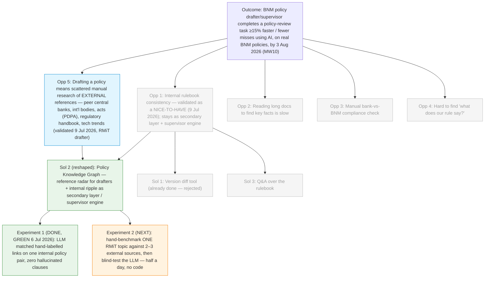

# Discovery Brief: AI for Policy Consistency (COPA Hackathon 2026)

> Context: This brief scopes a use case for the **COPA Hackathon Challenge 2026**
> (3 August 2026, BNM internal). Judging weights **Problem Relevance & Impact (30)**
> highest, followed by Technical Execution (20), Innovation (15), MVP Quality (15),
> Feasibility & Scalability (10), Presentation (10). Final judges include the CIO,
> DG, AG and Directors. Solutions must align with **BP2026 Must-Wins**.

## Desired Outcome

A BNM policy drafter/supervisor completes one real policy-review task **at least 15%
faster or with fewer missed issues** using an AI tool, demonstrated on a real cluster
of BNM policy documents by the hackathon (3 Aug 2026).

This is taken directly from **BP2026 Must-Win 10 (AI roadmap)**, Key Result 3:
_"Improved efficiency by >15% across 10 supervisory processes from staff usage of AI
tools."_ It also supports **MW9 (Resource discipline** — non-IT process improvement
with >20% productivity gains) and **MW6 (Financial sector strategy** — a coherent,
non-contradictory rulebook).

## Discovery Update — 9 Jul 2026 (first real drafter interview)

The team interviewed a **BNM policy drafter who works on RMiT** — the first direct
user conversation, and the strongest evidence in this brief so far. Four findings:

1. **Direction validated, angle wrong.** The drafter finds the proposal valuable,
   but our core assumption — that internal cross-policy overlaps/conflicts drive
   drafting pain — is off. Internal overlaps are **appreciated context** ("good to
   know where the overlaps are in other policy documents") but **rarely change the
   draft**, and internal conflicts are not a big concern. Opportunity #1 is hereby
   confirmed as a **nice-to-have**, not the headline.
2. **The real reference work is external.** When drafting RMiT, the drafter's heavy
   lifting is researching what **external sources** say: other central banks'
   equivalent tech-risk policies, international bodies, government acts (e.g.
   **PDPA**), the **regulatory handbook** (confidential — shared between policy
   makers and FIs), and **technology trends**. This is new **Opportunity #5** and
   the new primary drafter pain.
3. **Generalisation pending.** This is one interview. The team is lining up other
   policy makers to check the pattern holds (see Action Items).
4. **Supervisor use case untouched.** This was a drafter interview; the
   submission-checking pain (Outsourcing 12.6 / JP) was not tested either way and
   stands as previously scoped.

**Decision (9 Jul 2026): pivot the drafter value proposition to external
references** — the graph's primary job for a drafter becomes "for the clause you
are drafting, here is what other regulators, acts, standards, the handbook, and
tech trends say — cited verbatim." Internal overlaps stay as a secondary layer.
The supervisor persona is unchanged, pending its own validation interviews.
Chosen over "lead with supervisor" and "bolt external refs onto the
internal-ripple story" because it follows the strongest evidence we now hold.

## Opportunity Map

| #   | Opportunity (user pain)                                                                                                                                                                                                                                                                                   | Evidence                                                                                                                                       | Strength                       | Size                                                 |
| --- | --------------------------------------------------------------------------------------------------------------------------------------------------------------------------------------------------------------------------------------------------------------------------------------------------------- | ---------------------------------------------------------------------------------------------------------------------------------------------- | ------------------------------ | ---------------------------------------------------- |
| 1   | When a policy drafter revises one policy, checking it stays consistent with the rest of BNM's rulebook is slow and error-prone — the links between policies live in people's heads, not in a map.                                                                                                         | **Tested with an RMiT drafter (9 Jul 2026): overlaps are appreciated context but rarely change the draft; conflicts are not a top concern.**   | Strong — **as a nice-to-have** | Policy-drafting teams (focused group, not all staff) |
| 2   | Reading long submissions/reports to find a few key facts is slow.                                                                                                                                                                                                                                         | Generic; matches BIS Project Gaia problem statement.                                                                                           | Weak                           | Many supervisors                                     |
| 3   | Checking a bank's internal policy against BNM's current rules (compliance gap) is manual.                                                                                                                                                                                                                 | AI Tinkerers KL #4 (bank-side framing) — already run as a hackathon.                                                                           | Weak                           | Supervisors, but needs banks' internal docs          |
| 4   | Answering "what does our rule say about X?" means digging through many policy docs.                                                                                                                                                                                                                       | Generic; a Q&A-over-documents need.                                                                                                            | Weak                           | Broad                                                |
| 5   | When drafting a policy (e.g. RMiT), researching what **external references** say — other central banks' equivalent policies, international bodies, government acts (e.g. PDPA), the regulatory handbook (confidential), technology trends — is scattered, manual work that **directly shapes the draft**. | **Direct RMiT-drafter interview (9 Jul 2026)** — named this as the more valuable overlap. Generalisation to other policy makers being checked. | Strong (single source so far)  | Policy-drafting teams                                |

## Selected Opportunity

**Opportunity #5 — external-reference research pain for drafters** (primary, since
9 Jul 2026), with **Opportunity #1 retained as a secondary layer** and the
**supervisor use case unchanged**. Selected because:

- **Evidence:** the only direct user interview so far (an RMiT drafter) named this
  as the more valuable version of "overlap" — external references directly shape
  the draft, where internal overlaps are context. Strongest signal in this brief.
- **Outcome alignment:** still a policy-drafting/review task → MW10's ">15%
  efficiency" target, MW9, and MW6 all still apply. The supervisor persona
  (untouched by this pivot) keeps the direct "supervisory processes" wording link.
- **Feasibility / data:** much of the external corpus is **public** — other central
  banks' tech-risk policies, national acts (PDPA), international standards bodies.
  The **regulatory handbook is confidential** and needs the same locked-placeholder
  treatment as internal minutes (see provenance section). Exact demo corpus to be
  locked as an action item.
- **Novelty:** "when we change one policy, what do our peers and our laws say about
  this exact topic?" is a benchmarking angle judges are unlikely to have seen — and
  it is _the drafter's own described workflow_, not an assumed one.

**Demoted (not discarded):** #1 (internal rulebook consistency) stays in the product
as a secondary "good to know" layer — validated as appreciated, just not
draft-shaping. **Deferred:** #2 (document reading) and #4 (Q&A) remain future
branches; #3 (bank-side compliance) stays deferred (close to an already-run
hackathon; needs banks' internal documents).

## Solution Candidates

| #   | Solution                                                                                                                                                                                                                                                                                                                                                                                                                                                                                                                                                                            | Riskiest Assumption                                                                                                                                                                                                                                                                                                                                                      | PRD                                                                      |
| --- | ----------------------------------------------------------------------------------------------------------------------------------------------------------------------------------------------------------------------------------------------------------------------------------------------------------------------------------------------------------------------------------------------------------------------------------------------------------------------------------------------------------------------------------------------------------------------------------- | ------------------------------------------------------------------------------------------------------------------------------------------------------------------------------------------------------------------------------------------------------------------------------------------------------------------------------------------------------------------------ | ------------------------------------------------------------------------ |
| 1   | **Version diff tool** — compare old vs new version of one policy, highlight additions/edits/removals.                                                                                                                                                                                                                                                                                                                                                                                                                                                                               | Low technical risk, but **not novel** (this is the AI Tinkerers KL #4 idea). Rejected on innovation grounds.                                                                                                                                                                                                                                                             | —                                                                        |
| 2   | **Policy Knowledge Graph + ripple check (SELECTED — reshaped 9 Jul 2026)** — a linked map of a cluster of BNM policies **plus their external reference universe**. For the drafter, the primary lens is the **reference radar**: for the clause being drafted, surface what other central banks' equivalents, international standards, national acts (PDPA), the regulatory handbook, and tech trends say — cited verbatim. Internal ripple (conflict/duplication/gap across BNM's own rulebook) becomes the secondary layer, and stays the engine behind the supervisor checklist. | **New (post-pivot):** an LLM can find the **genuinely equivalent** clauses in another regulator's differently-structured document (and relevant act/standard passages) with verbatim citations — without forcing false equivalences or missing obvious ones. (The internal-pair version of this was retired GREEN on 6 Jul; the cross-jurisdiction version is untested.) | [Epic PRD](../../specs/rulebook-radar/spec.md) (re-issued to this pivot) |
| 3   | **Q&A over the rulebook** — ask "which policies mention X?" in plain language.                                                                                                                                                                                                                                                                                                                                                                                                                                                                                                      | Useful but less tied to the "ripple/consistency" pain, and less novel.                                                                                                                                                                                                                                                                                                   | —                                                                        |

**Leading solution: #2, Policy Knowledge Graph — now led by the reference radar.**
It moves beyond "spot the changes" (the done idea) into "**understand the
connections**" — and after the 9 Jul interview, the connections that matter most to
a drafter run _outward_ (peer regulators, acts, standards, the handbook, trends),
not just _inward_ across BNM's own rulebook. Same graph, richer node types. The
verbatim-citation guardrail carries over unchanged as the hard product rule.

## Opportunity Solution Tree

## Recommended Experiment

**Test the riskiest assumption (LLM finds real connections, not fake ones) cheaply,
before building the full thing.**

- **What:** Pick **one pair of BNM policies you already know overlap** (from the chosen
  cluster). By hand, write down the 3–5 real connections/overlaps between them.
- **How:** Ask an LLM to find the connections between the same two documents. Compare
  its answers to your hand-made list.
- **Effort:** ~half a day, no code.
- **"Good" looks like:** the LLM finds most of the real connections with few or no
  made-up ones. → green light to build the graph.
- **If it fails:** it hallucinates or misses obvious links → add guardrails (e.g.
  force it to quote the exact clause it's citing) before the hackathon build.

_Note: Project Gaia (BIS) hit exactly this hallucination risk with LLMs on financial
documents and designed around it — so it is a known, solvable problem, not a dead end._

### Experiment result — GREEN (run 2026-07-06, on real BNM documents)

A first real dry-run was completed on two **current, real** BNM policy documents:
**RMiT (reissued 28 Nov 2025)** and **Outsourcing (23 Oct 2019)**, both fetched from
bnm.gov.my.

- **Ingestion — SOLVED, tool chosen:** plain PDF text extraction produced gibberish
  (custom font encoding). **Microsoft MarkItDown** converted both PDFs to clean
  markdown with clause numbers intact (Outsourcing ~52KB, RMiT ~204KB). This is the
  recommended ingestion pipeline for the build. Budget setup time for it; do NOT assume
  naive PDF-to-text works on BNM documents.
- **Verified real cross-policy interaction** (hand-found, quotable):
  - _Outsourcing 12.1:_ "A financial institution must obtain the Bank's written approval
    before entering into a new material outsourcing arrangement." (11.1/11.2 bring cloud
    arrangements into this policy.)
  - _RMiT clause 17:_ 17.1 requires consulting the Bank before first-time public-cloud
    adoption for critical systems; 17.2 requires notifying the Bank for subsequent
    adoption. Amending 17.1 to "notify-after" collides with Outsourcing 12.1's
    "approve-before" whenever a critical cloud service is also a material outsourcing.
- **Blind LLM test — PASSED:** a fresh agent with NO access to this project, given only
  the two markdown files, independently found the 12.1 ↔ 17 conflict (and correctly
  scoped it to "only where the cloud service is a material outsourcing", even checking
  the 12.4 affiliate exemption). It also surfaced real issues a human missed: 17.2(a)
  depends on a prior 17.1 consultation the amendment deletes; 17.5 ties cloud into the
  annual outsourcing plan. **Every clause it cited was verified to exist verbatim** —
  no hallucinated clause numbers or wording (one trivial 11.1/11.2 label slip).
- **Conclusion:** the riskiest assumption ("LLM finds real links without hallucinating")
  is retired for this pair. The **verbatim-citation guardrail is what made verification
  possible in ~2 minutes** — keep it as a hard product rule.
- **Caveat / remaining action:** this is ONE test on ONE document pair. Before the
  hackathon, repeat on 2–3 more pairs to confirm it generalises. A single green is
  encouraging, not conclusive.
- **Scope caveat (added 9 Jul 2026):** this green covers **internal** BNM-to-BNM
  clause linking only. It does NOT cover the post-pivot riskiest assumption
  (cross-jurisdiction equivalence) — that needs Experiment 2 below.

### Experiment 2 — reference-radar test (NEXT, not yet run)

**Tests the new riskiest assumption:** the LLM can find the _genuinely equivalent_
passages in external sources — a peer regulator's differently-structured policy, a
national act — without forcing false equivalences or missing obvious ones.

- **What:** Pick **one RMiT topic the drafter already knows well** (cloud adoption,
  RMiT 17.1/17.2, is the natural choice — the team already knows it cold). By hand,
  write down what 2–3 external sources actually say on that topic (e.g. one peer
  central bank's tech-risk policy + PDPA; add a Basel/BIS paper if time allows).
- **How:** Give a fresh LLM agent the RMiT clause plus the external documents and
  ask it to find and quote the equivalent/related passages. Compare against the
  hand-made list. Every citation must be verifiable verbatim — same guardrail as
  Experiment 1.
- **Effort:** ~half a day, no code. Sourcing the external PDFs is part of the test —
  it doubles as the check that the demo corpus is actually obtainable.
- **"Good" looks like:** most hand-found equivalents surfaced, quotes verbatim, and
  crucially **no invented equivalence** (a passage claimed to "match" that actually
  covers something else).
- **If it fails:** tighten to topic-scoped retrieval (match on topic first, quote
  second) before the hackathon build — same design-around path Project Gaia used.
- **Bonus signal:** show the output to the interviewed drafter. Their reaction is a
  second, cheap validation of Opportunity #5 ("is this the research you meant?").

## Architecture Assumptions (for `/prd`)

Where documents live and who owns edits — decided during POC review:

- **Corpus (read side):** BNM's _published_ policy documents (PDFs on bnm.gov.my).
  Rulebook Radar reads these, extracts clauses, and builds the knowledge graph +
  clause index. This is the derived layer the tool owns.
- **External reference corpus (added 9 Jul 2026, confirmed by user):** the same
  read-side treatment extends to the drafter's reference universe — peer central
  banks' equivalent policies, national acts (PDPA), international-body papers
  (public PDFs, same MarkItDown ingestion). **All external references are modelled
  as graph nodes connecting to the policy clauses they inform** — same graph, new
  node types. The **regulatory handbook is deferred from MVP1**: confidential, same
  class as internal committee minutes, so its node appears at most as a locked
  placeholder or a clearly-labelled mock document — never in a tracked repo path.
  _POC reflects this (updated 9 Jul 2026, iteration 2): `index.html` shows an
  External References band — MAS TRM, PDPA 2010, Basel/BIS, a locked Regulatory
  Handbook node, and a "Trends · News · Policies (preview)" sub-band with three
  concrete example nodes (in-country cloud regions, EU DORA, cloud-outage news) —
  linked to RMiT v2 by clickable "why this reference matters" edges.
  `review.html` lists ALL 4 draft changes with prev/next + click-to-jump
  side-by-side viewers, then the Reference Radar panel (illustrative excerpts,
  labelled as such). `impact.html` is reframed as a "Draft alignment" report:
  Reference gap / Supports draft / Internal overlap findings, in that order.
  `chat.html` shows the copilot retrieving from reference nodes and running web
  search grounded to an approved source allowlist._
- **In-progress draft (write side):** a **living Word document on SharePoint** — the
  single source of truth for a policy being revised. Rulebook Radar **reads and writes
  to it directly** (via SharePoint / Microsoft Graph). There is no separate "working
  draft" inside the tool and no export step; the SharePoint doc _is_ the record.
- **Node status is derived, not invented:** a graph node is **"In progress"** exactly
  when a live SharePoint draft exists for that policy. "In force" and "Superseded"
  come from the published corpus.
- **Copilot can edit the live doc, but AI proposes / human commits:** accepted redrafts
  are written into the Word doc as **tracked changes** for a human drafter to Accept or
  Reject. The copilot never silently finalises policy text.
- **Guardrail carried through:** every copilot answer and every ripple finding cites the
  exact clause it is based on (the anti-hallucination measure = the riskiest assumption).

_POC reflects this: `review.html` shows side-by-side PDF viewers of the published
versions; `chat.html` shows a live SharePoint Word-doc viewer where accepted redrafts
appear as tracked changes. (POC uses mock viewers; real build embeds the actual PDF
viewer and the live SharePoint document.)_

### Single-draft perspective (SUPERSEDED role-based workspace, 9 Jul 2026)

**Superseded by the pivot:** the earlier design gave the user a multi-document
workspace with per-document roles (edit / review / locked — 1..n editable drafts,
a reviewer mode, other teams' locked drafts). After the drafter interview, the
perspective narrows to match how the value actually lands:

- **One working draft.** The user is drafting exactly one policy (RMiT v2). It is
  the only editable node (green ring) and the centre of the graph.
- **Every other BNM policy appears as _published_ (in force / superseded)** —
  read-only context. Overlaps with them are the "good to know" secondary layer,
  not documents the user works on.
- **No reviewer mode in MVP1.** There are no other in-progress drafts and no
  assigned-reviewer role. The drafter's closing action is **submit for manager
  approval** (manager approval is retained).
- **External references orbit the draft as first-class nodes** — the sources that
  lead the drafting (peer regulators, acts, international bodies, the handbook,
  tech trends). This is the primary layer.
- The multi-draft, role-based workspace (including the "two related drafts, one
  drafter — fix both" scenario) is **deferred to a future phase**, not deleted —
  it can return when more than one policy team uses the tool.

### Provenance / traceability — "Why this changed"

- Each policy **version** can carry a provenance trail: the supporting documents and
  decisions behind the change. This answers "why did this clause change?" and links a
  change back to the discussion/decision that drove it — hard to reconstruct months later.
- **Confidentiality-aware by design:**
  - **Public** supporting docs (discussion papers, consultation feedback, FAQs, policy
    amendment notes) are shown with real titles + dates.
  - **Internal** supporting docs (committee/JPP minutes, working-group notes) appear as
    **locked, access-controlled placeholders** — the trail is visible, the sensitive
    content is not. The real build must enforce access control on these.
- **Placement:** shown in the node **detail panel** ("Why this changed" section), NOT as
  extra graph nodes — keeps the graph uncluttered.
- **Real anchors exist:** the Operational Resilience Discussion Paper (19 Dec 2025) and
  the RMiT FAQ update (1 Jul 2026) are genuine public provenance for the demo's RMiT
  change — provenance is grounded, not hypothetical.

_POC reflects this: the RMiT v2 draft node shows a "Why this changed" trail with
public docs listed and internal minutes shown locked._

### Cross-cluster ripple = future phase (scoped OUT of MVP1)

- MVP1 is deliberately **one cluster** (technology-risk). The graph shows a single
  greyed, dashed **out-of-cluster node** (e.g. AML/CFT) as a _preview_ that a change's
  ripple can cross cluster boundaries — but full cross-cluster mapping is **not built**
  in MVP1. Keep it clearly labelled "preview / what's next" so the tool never implies a
  capability it doesn't have. This doubles as the pitch's roadmap slide.

_POC reflects this (updated 9 Jul 2026): `index.html` is a single-draft workspace —
RMiT v2 is the only editable node (green ring), all other BNM policies are published
read-only context, and the External References band is the primary layer; the AML
node is a greyed cross-cluster preview. The former reviewer/second-draft screens
(`review-opres.html`, `review-outsourcing.html`) were removed with the pivot._

### Two users: drafter AND supervisor (closing the MW10 wording gap)

MW10's exact target is efficiency across **supervisory** processes. The drafter use case
(rulebook self-consistency) is adjacent to that wording, so the tool serves **two users
on the same knowledge graph**:

- **Drafter** — when revising a policy, keep it consistent with the rest of the rulebook
  (the ripple check). _Built in the POC._
- **Supervisor** — when a bank submits an application (e.g. cloud outsourcing), check it
  against **every** requirement across the linked policies, and flag what is **missing**.
  This is a genuine supervisory process: per **Outsourcing 12.6**, such applications are
  submitted to **Jabatan Penyeliaan (JP)** — the supervision department — for assessment.

_POC reflects this: `supervisor.html` is a supervisor persona (JP) assessing a
critical + material public-cloud application against a rulebook-assembled checklist,
each line marked Met / Missing / Unclear and cited to its clause (RMiT 17.1, 10.50,
Outsourcing 12.1/12.3/11.2). Reachable via "Switch to supervisor view" on the graph._

**Graph is the ENGINE, not the interface, for supervisors.** For the frontline
supervisory task the valuable output is the **checklist** (a list + gaps), not the graph
visualisation — supervisors consume the graph's output, they don't operate the graph.
The graph's job is invisible but essential: it knows which policies connect for a given
arrangement (cloud + critical + material), so the checklist is assembled across RMiT +
Outsourcing + Cyber Risk rather than one policy the supervisor happened to recall. The
one place a supervisor wants the graph directly is **traceability** — "why is this a
requirement?" — provided as an on-demand per-line trace, not a graph-first screen. (The
rich graph view remains most valuable to the DRAFTER and to judges/leadership.)

_POC reflects this: each checklist line has a "Why is this required?" expander showing
the graph trace behind that requirement — checklist-first, graph-on-demand._

**Supervisor entry point = UPLOAD → auto-checklist.** The supervisor's flow starts by
uploading the bank's application. Because the tool already holds every policy and how
they connect, it: (1) reads/extracts the submission, (2) classifies the arrangement
(e.g. public cloud · critical system · material outsourcing), (3) matches it against the
rulebook graph to assemble the applicable requirement set across multiple policies, and
(4) checks the submission against each, producing the cited Met/Missing/Unclear checklist.
The supervisor never has to know which policies to look in — the graph does that.

_POC reflects this: `supervisor.html` opens on an upload dropzone → shows an analyse
sequence (read → classify → match graph → assemble → check) → reveals the checklist.
(Demo uses a sample submission; real build ingests the uploaded PDF/DOCX, e.g. via
MarkItDown, same as the policy corpus.)_

**Drafter edge-explanation (correlation insight).** For the drafter, the graph's _edges_
are now clickable: selecting a link between two policies explains **why they are
connected** (e.g. "RMiT clause 17 ↔ Outsourcing 12.1 — a public cloud is often also a
material outsourcing"). This closes the gap between "the graph shows THAT two policies
link" and "WHY they link" — the correlation understanding a drafter wants. (Distinct from
provenance, which explains why a single policy _version_ changed.)

_POC reflects this: `index.html` graph edges are clickable → detail panel shows a
"Why these are connected" explanation per link._

### Closed loops — both personas now ACT, not just diagnose

An end-to-end walkthrough of both personas surfaced one shared gap: the tool _diagnosed_
(showed conflicts / gaps) but let neither user _act_ on the result. Both loops are now closed:

- **Drafter — fix clears the finding:** applying a copilot redraft marks the matching
  Alignment finding **resolved** (shared state), and the copilot links back to re-run
  the check. When all findings are resolved, the Alignment report shows a **"Submit
  draft for approval"** action (updated 9 Jul 2026: submits to the approving manager —
  the separate reviewer persona was removed with the single-draft pivot; the "Impact /
  ripple" report itself was reframed as **"Draft alignment"**, reference findings
  first).
- **Drafter — Alignment ↔ copilot are ONE loop, not two pages (10 Jul 2026):**
  accepting a fix on the Alignment report **inserts it into the SharePoint draft as a
  tracked change**; the copilot's document view highlights every accepted insertion,
  a live status strip shows open/resolved counts, and changes made on either page
  sync to the other instantly. The drafter never has to go back to the Alignment
  page to know the state of the draft — the answer to "if I accept changes on one
  page, how do I know on the other?" is: both pages read/write one shared state.
- **Supervisor — decide, don't just diagnose:** the checklist now has a **decision bar**.
  **Approve** is disabled while any requirement is Missing/Unclear; **Return to bank —
  request missing items** generates a draft return letter auto-populated from the gaps
  (each citing its clause), then **Send**. Turns the report into a supervisory workflow.
- **Supervisor — evidence drill-in:** each requirement has a **"Show evidence"** expander
  revealing _where in the submission_ the tool looked (or confirming genuine absence) —
  directly addresses the false-negative trust concern.

_POC reflects this (updated 10 Jul 2026): `impact.html` (accept fix → "✓ accepted ·
✎ in draft as tracked change" + "View in draft →" link, live-syncs when the copilot
applies a redraft, submit-for-approval end state), `chat.html` (alignment status strip
with open/resolved counts, tracked-change insertions rendered per accepted finding,
storage-event sync across tabs), `supervisor.html` (evidence drill-in +
Approve/Return/Send decision bar)._

**Key supervision-specific design point — false negatives matter most.** The blind test
validated that the AI does not _invent_ conflicts (false positives). For supervision the
dangerous failure is _missing_ a required control (false negative → compliance gap slips
through). The evaluation must measure **recall** (what did it miss), not just precision —
the AI Tinkerers KL #4 F1-score metric captures exactly this.

**Confidentiality note:** the drafter use case runs entirely on PUBLIC policy documents.
The supervisor use case ingests a **bank's submission** = sensitive supervised-entity
data → heavier data governance / access control. Name this trade-off explicitly; for the
hackathon demo the submission is mock data.

**Why the graph beats a plain RAG chatbot (one-line pitch defence, updated 9 Jul
2026):** a chatbot answers "what does the rule say"; Rulebook Radar answers "for the
clause I'm drafting, what do my peer regulators, our laws, and our handbook say"
(drafter), and "what's missing from this submission" (supervisor) — the
benchmarking/supervision jobs a chatbot can't do, because both need to know _which_
sources connect to _which_ clause.

**Broader SET2027 alignment (not just MW10 efficiency):** a coherent, consistently-
enforced rulebook supports **Trusted Institution / Credible Regulator**; less manual
cross-checking supports **Engaged Employees**. Name all three to widen appeal beyond the CIO.

## Recommendation

**(Updated 9 Jul 2026.)** Run **Experiment 2** (the half-day reference-radar test)
next — it tests the new riskiest assumption AND confirms the external demo corpus is
obtainable, before any spec or code changes. In parallel, continue the interviews
with other policy makers to confirm the external-reference pattern generalises, and
validate the supervisor pain (still untested).

Once Experiment 2 is green: revisit the drafter-facing specs in
`docs/specs/rulebook-radar/` via `/prd` — they were written around the
internal-ripple angle as the drafter headline and need the reference radar promoted
to the primary drafter value. The **supervisor stories and the graph/clause engine
are unaffected** (the engine's clause segmentation and linking applies to external
documents too). Scope stays a **single cluster** (tech-risk) plus a small external
reference set for one topic — not every source the drafter named.

## Decision Log

- **Focus area = MW10 (AI for supervision)** chosen by user over anti-scam, internal
  process, and digital-finance angles. Strong fit: Board-backed, CIO is a final judge.
- **Reframed away from the AI Tinkerers KL #4 challenge** ("help banks track BNM's
  changes") because it has already been run — low Innovation score. Flipped to BNM's
  own seat (rulebook self-consistency) for freshness.
- **Selected the knowledge-graph "ripple" solution over a simple diff tool** because
  user explicitly wants a novel angle; the graph reframes the problem from
  change-detection to connection-understanding.
- **Chose public BNM policy documents as the data source** (confirmed public via
  bnm.gov.my/regulations) so the team can build without waiting on internal/bank data.
- **Research note:** Live web research confirmed BIS **Project Gaia** (LLMs extracting
  structured data from unstructured financial disclosures — 20 KPIs × 187 institutions),
  **Project Ellipse** (ML/NLP over regulatory + unstructured data for real-time risk
  alerts), and **Project Neo** (ML for faster macro data). These validate that
  "AI reading regulatory documents" is a proven, high-impact central-bank pattern.
  Other regulators' initiatives (MAS MindForge/Veritas, HKMA GenA.I. Sandbox, BoE/FCA
  Digital Regulatory Reporting) are from prior knowledge (Jan 2026 cutoff) and were
  NOT live-verified — confirm before quoting. News sources for exact Malaysian scam
  statistics could not be fetched (sites blocked automated access).
- **Pivot (9 Jul 2026): drafter value re-anchored on external references.** First
  direct user interview (an RMiT drafter) confirmed internal overlap detection is a
  nice-to-have and named external-reference research (peer central banks, int'l
  bodies, acts like PDPA, the regulatory handbook, tech trends) as the valuable
  version of the idea. User chose this pivot over "lead with supervisor" and over
  "keep the internal story and bolt on external refs" — the pivot follows the
  strongest evidence held. Internal ripple stays as a secondary layer and as the
  supervisor-checklist engine; the supervisor use case is unchanged (untested by
  this interview).
- **Regulatory handbook = deferred from MVP1 (confirmed by user, 9 Jul 2026).**
  Confidential — same class as internal committee minutes. External references
  (including the handbook) are modelled as **graph nodes connecting to the policy**;
  the handbook's node ships later, appearing in the demo at most as a locked
  placeholder or a clearly-labelled mock document, never in a tracked repo path.
  The public external sources (peer regulators' policies, acts, standards) carry
  the demo.
- **Assumptions confirmed by user (9 Jul 2026):** supervisor use case stays as-is
  **until more interviews** (its own validation is Action Item #4); internal
  overlaps stay in the product as a secondary layer; candidate external source
  names (MAS TRM, HKMA, Basel, DORA) remain unverified until Experiment 2.
- **POC iteration 2 (9 Jul 2026, user push-back):** four refinements — (1) tech
  trends surface as **concrete example nodes** (in-country cloud regions, EU DORA,
  cloud-outage news), not one generic preview node; (2) the review screen lists
  **all draft changes** with click-to-jump / prev-next navigation of the
  side-by-side viewers (one static clause diff wasn't navigable); (3) the ripple
  report is reframed as **"Draft alignment"** — reference gaps first, peer support
  next, internal overlaps last as "good to know" (old conflict-first framing was
  the pre-pivot angle); (4) the copilot is a **drafting** copilot: retrieves from
  the connected reference nodes (PDPA, handbook-restricted, etc.) and runs **web
  search grounded to an approved source allowlist** for trends/news.
- **POC iteration 3 (10 Jul 2026, user push-back):** two decisions — (1) **trends
  are conditional, not committed:** the trend/news layer is unique to the RMiT
  drafter so far; it joins the MVP only if other policy drafters confirm the same
  near-real-time need (folded into Action Item #7), and the POC labels it
  accordingly; (2) **Alignment and the copilot are one loop:** accepting an
  Alignment fix inserts a tracked change into the draft, the copilot shows a live
  open/resolved status strip and highlights accepted insertions in the document
  view, and both pages sync through one shared state — the drafter never bounces
  back to the report to learn what changed.
- **Single-draft perspective (9 Jul 2026, user decision):** the workspace shows ONE
  policy being drafted (RMiT v2) — the sole editable document. All other BNM
  policies appear as published, read-only context; the reviewer mode and
  multi-draft roles (teal ring, locked others' drafts, second editable doc) are
  removed from MVP1 and deferred. External references become the primary layer
  around the draft; internal overlap stays the nice-to-have. Personas simplify to
  drafter + approving manager (+ the unchanged supervisor). Note: the persona
  conventions in `CLAUDE.md` and the specs in `docs/specs/rulebook-radar/` still
  describe the old multi-role model — update both when the specs are revised.

## Action Items

| #   | Question to resolve                                                                                                                                                                                                                                                                                                           | Who to consult                            | Blocks step                            | Status                                                                                                                                                               |
| --- | ----------------------------------------------------------------------------------------------------------------------------------------------------------------------------------------------------------------------------------------------------------------------------------------------------------------------------- | ----------------------------------------- | -------------------------------------- | -------------------------------------------------------------------------------------------------------------------------------------------------------------------- |
| 1   | Confirm the pain: "Today, when you revise a policy, how do you check it doesn't clash with other policies?" Is there already a manual index/taxonomy that partly solves this?                                                                                                                                                 | Policy-drafter / supervisor contacts      | Firms up Opportunity #1 evidence       | **RESOLVED 9 Jul 2026** — RMiT drafter: internal overlaps = nice-to-have; real pain is external-reference research → pivot to Opp #5                                 |
| 2   | Lock the demo cluster: which 5–10 related BNM policies to use (e.g. tech-risk/RMiT + operational resilience, or AML/fraud). Pick the set contacts know best.                                                                                                                                                                  | User + contacts                           | Experiment + build scope               | Largely settled — tech-risk cluster in use since the 6 Jul experiment; confirm final set                                                                             |
| 3   | Run the half-day LLM connection-finding experiment on one known-related policy pair.                                                                                                                                                                                                                                          | Hackathon team                            | Go/no-go on the graph build            | **RESOLVED 6 Jul 2026 — GREEN** (internal pair; see experiment result)                                                                                               |
| 4   | Validate the SUPERVISOR pain: "Today, how do you check a bank's submission meets all relevant policy requirements?" Confirm JP assesses cloud/outsourcing applications (Outsourcing 12.6).                                                                                                                                    | Supervision (Jabatan Penyeliaan) contacts | Firms up the MW10 supervision use case | Open                                                                                                                                                                 |
| 5   | Define the ">15% efficiency" measurement: baseline time for a consistency review / submission check today, and how the tool's improvement is measured (time-to-complete on N items).                                                                                                                                          | User + contacts                           | Needed for the "Impact" pitch (30 pts) | Open — now also cover "time spent researching external references per draft" as a baseline                                                                           |
| 6   | Add recall (false-negative) to the eval: test whether the AI MISSES real requirements/conflicts, not just whether flags are real. Use F1 (precision + recall).                                                                                                                                                                | Hackathon team                            | Trust in the supervisor use case       | Open                                                                                                                                                                 |
| 7   | Interview 1–2 more policy makers: does the external-reference pattern (peer central banks, acts, handbook) hold outside RMiT — and do they also need **near-real-time trend/news signals**? The trend/news answer decides whether the trends layer joins the MVP or stays a labelled preview (RMiT-specific evidence so far). | Other policy-drafter contacts             | Firms up Opportunity #5 + trends scope | Open — team already lining these up                                                                                                                                  |
| 8   | Run Experiment 2 (reference-radar test): hand-benchmark one RMiT topic against 2–3 external sources, blind-test the LLM. Doubles as the external-corpus sourcing check.                                                                                                                                                       | Hackathon team                            | Go/no-go on the pivoted drafter value  | Open — NEXT                                                                                                                                                          |
| 9   | Handbook access: what does real-build access control for the regulatory handbook need, and does the demo show a locked placeholder node or a clearly-labelled mock document?                                                                                                                                                  | User + policy contacts                    | Demo credibility for Opp #5            | **Partially resolved 9 Jul 2026** — handbook deferred from MVP1 (confidential, like internal minutes); mock doc an option. Real-build access control still to define |

## Spec Notes for Build (surfaced in end-to-end walkthrough)

Buildable items to decide when specced in `/prd` (the POC handles the happy path; these
define real-build behaviour):

- **"Dismiss" vs "resolve" for submission:** the drafter can reach the "Submit for
  approval" state by dismissing findings, not only fixing them. Define whether a dismissed
  finding counts as resolved, and whether a dismissal reason must be recorded (audit trail).
- **Approve success path must be demonstrable:** in the supervisor demo, Approve is
  (correctly) disabled because the sample submission has gaps, so the _approved_ end-state
  is never shown. Provide a second "clean" sample submission, or let a resubmission flip
  the checklist to all-met, so the approve path is visible.
- **~~Reviewer loop closed~~ — DROPPED (9 Jul 2026):** the reviewer persona and its
  comment/complete-review flow were removed with the single-draft pivot. If the
  multi-draft workspace returns in a future phase, revisit the reviewer loop then.
- **Cross-page state:** the POC syncs "resolved" findings via browser localStorage (fine
  for a single-machine demo, won't carry across devices). Real build needs server-side
  state per document/version.
- **Authoring moment:** POC opens on a diff of an already-made change; the real drafter
  flow starts when the drafter _makes_ an edit and the tool reacts live. Spec the
  edit-then-analyse trigger.
- **Ingestion of uploaded submissions:** supervisor upload is simulated. Real build must
  parse an uploaded PDF/DOCX (e.g. MarkItDown, as validated for the policy corpus) and
  extract facts before matching.
- **Change list must be derived, not hand-authored:** the review screen's "changes in
  this draft" list is hard-coded in the POC. Real build derives it by diffing the live
  SharePoint draft against the published version at clause level (the deterministic
  clause segmentation in `engine/` is the natural base).
- **Grounded web search needs a governed allowlist:** the copilot's trend/news search
  must query only an approved source list (central banks, standard-setters, major
  wires). Spec who owns/edits that allowlist and how results are cited/archived so a
  finding remains reproducible later.

## Open Questions

- ~~Should the tool flag only **conflicts**, or also **duplications** and **gaps**?~~
  **Partially answered 9 Jul 2026 (drafter side):** conflicts are NOT a big drafter
  concern; overlaps are context. For the drafter, the flag hierarchy inverts —
  references/equivalents first, overlaps second, conflicts last. For the
  **supervisor**, gaps (missing requirements) remain the headline — unchanged.
- How to present the reference radar so a non-technical judge (DG/AG) instantly
  gets it — e.g. a side-by-side "BNM clause ↔ what MAS / PDPA / Basel say" panel vs.
  the graph view. (Same question as before, now for the external angle.)
- Which external sources make the demo cut for the tech-risk cluster: which peer
  central bank(s), which act(s) beyond PDPA, which international body papers.
  Candidate names (MAS TRM Guidelines, HKMA SPM TM-G-1, EBA/DORA, Basel
  operational-resilience principles) are from prior knowledge — **verify against
  live sources before quoting** (Experiment 2 covers this).
- ~~Are tech-trend sources in scope for MVP1 or a "what's next"?~~ **Criterion set
  10 Jul 2026:** the trend/news need is RMiT-specific evidence so far (near
  real-time data/sources for tech-risk drafting). It **joins the MVP only if other
  policy drafters confirm the same workflow** in the Action Item #7 interviews;
  until then it stays a labelled preview in the graph and radar.
- Does the external-reference pattern hold for policy makers outside RMiT/tech-risk
  (Action Item #7)? If it is RMiT-specific, the pitch narrows to tech-risk drafting
  rather than "all policy drafting".
