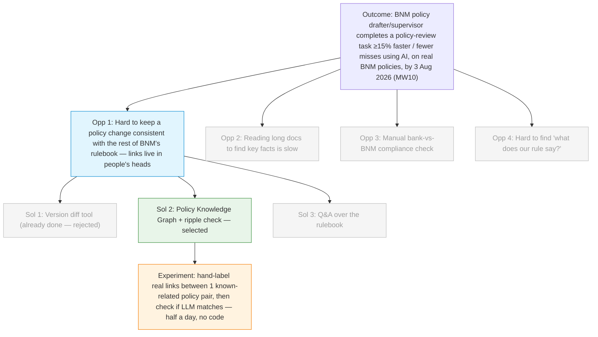

# Discovery Brief: AI for Policy Consistency (COPA Hackathon 2026)

> Context: This brief scopes a use case for the **COPA Hackathon Challenge 2026**
> (3 August 2026, BNM internal). Judging weights **Problem Relevance & Impact (30)**
> highest, followed by Technical Execution (20), Innovation (15), MVP Quality (15),
> Feasibility & Scalability (10), Presentation (10). Final judges include the CIO,
> DG, AG and Directors. Solutions must align with **BP2026 Must-Wins**.

## Desired Outcome

A BNM policy drafter/supervisor completes one real policy-review task **at least 15%
faster or with fewer missed issues** using an AI tool, demonstrated on a real cluster
of BNM policy documents by the hackathon (3 Aug 2026).

This is taken directly from **BP2026 Must-Win 10 (AI roadmap)**, Key Result 3:
_"Improved efficiency by >15% across 10 supervisory processes from staff usage of AI
tools."_ It also supports **MW9 (Resource discipline** — non-IT process improvement
with >20% productivity gains) and **MW6 (Financial sector strategy** — a coherent,
non-contradictory rulebook).

## Opportunity Map

| #   | Opportunity (user pain)                                                                                                                                                                           | Evidence                                                                                                   | Strength | Size                                                 |
| --- | ------------------------------------------------------------------------------------------------------------------------------------------------------------------------------------------------- | ---------------------------------------------------------------------------------------------------------- | -------- | ---------------------------------------------------- |
| 1   | When a policy drafter revises one policy, checking it stays consistent with the rest of BNM's rulebook is slow and error-prone — the links between policies live in people's heads, not in a map. | User's direct read + drafter contacts (to be confirmed); mirrors the AI Tinkerers KL #4 challenge framing. | Moderate | Policy-drafting teams (focused group, not all staff) |
| 2   | Reading long submissions/reports to find a few key facts is slow.                                                                                                                                 | Generic; matches BIS Project Gaia problem statement.                                                       | Weak     | Many supervisors                                     |
| 3   | Checking a bank's internal policy against BNM's current rules (compliance gap) is manual.                                                                                                         | AI Tinkerers KL #4 (bank-side framing) — already run as a hackathon.                                       | Weak     | Supervisors, but needs banks' internal docs          |
| 4   | Answering "what does our rule say about X?" means digging through many policy docs.                                                                                                               | Generic; a Q&A-over-documents need.                                                                        | Weak     | Broad                                                |

## Selected Opportunity

**Opportunity #1 — policy-consistency pain for drafters.** Selected because:

- **Outcome alignment:** directly a policy-review task → cleanly hits MW10's ">15%
  efficiency" target, and touches MW9 and MW6.
- **Feasibility / data:** all BNM policy documents are **public** (confirmed: BNM
  publishes standards & guidelines across Banking & Islamic Banking, Insurance &
  Takaful, DFIs, Payment Systems, AML/DNFBPs, etc.), so the team can build and demo
  now without waiting on internal data.
- **Evidence:** user confirms this is a **real pain** felt by **policy drafters**; to
  be firmed up with supervisor/drafter contacts.
- **Novelty:** the common framing is "banks chase BNM's changes" (already done at AI
  Tinkerers KL #4). Flipping it to BNM's own seat — _"when we change one policy, does
  the rest of our rulebook still line up?"_ — is a fresh angle the judges are less
  likely to have seen.

**Deferred (not discarded):** #2 (document reading) and #4 (Q&A) remain useful future
branches; #3 (bank-side compliance) is deferred because it is close to an
already-run hackathon and needs banks' internal documents that may not be available
in time.

## Solution Candidates

| #   | Solution                                                                                                                                                                                                                                                                                    | Riskiest Assumption                                                                                                     | PRD |
| --- | ------------------------------------------------------------------------------------------------------------------------------------------------------------------------------------------------------------------------------------------------------------------------------------------- | ----------------------------------------------------------------------------------------------------------------------- | --- |
| 1   | **Version diff tool** — compare old vs new version of one policy, highlight additions/edits/removals.                                                                                                                                                                                       | Low technical risk, but **not novel** (this is the AI Tinkerers KL #4 idea). Rejected on innovation grounds.            | —   |
| 2   | **Policy Knowledge Graph + ripple check (SELECTED)** — build a linked map of a cluster of BNM policies (references / depends-on / overlaps). When one policy changes, trace the ripple: which other documents are affected and where a change may contradict or duplicate an existing rule. | An LLM can surface **real** cross-policy connections/conflicts without hallucinating fake ones or missing obvious ones. | —   |
| 3   | **Q&A over the rulebook** — ask "which policies mention X?" in plain language.                                                                                                                                                                                                              | Useful but less tied to the "ripple/consistency" pain, and less novel.                                                  | —   |

**Leading solution: #2, Policy Knowledge Graph + ripple check.** It moves beyond
"spot the changes" (the done idea) into "**understand the connections**" — harder for
a judge to dismiss as seen-before, and it plays to a knowledge-graph strength.

## Opportunity Solution Tree

## Recommended Experiment

**Test the riskiest assumption (LLM finds real connections, not fake ones) cheaply,
before building the full thing.**

- **What:** Pick **one pair of BNM policies you already know overlap** (from the chosen
  cluster). By hand, write down the 3–5 real connections/overlaps between them.
- **How:** Ask an LLM to find the connections between the same two documents. Compare
  its answers to your hand-made list.
- **Effort:** ~half a day, no code.
- **"Good" looks like:** the LLM finds most of the real connections with few or no
  made-up ones. → green light to build the graph.
- **If it fails:** it hallucinates or misses obvious links → add guardrails (e.g.
  force it to quote the exact clause it's citing) before the hackathon build.

_Note: Project Gaia (BIS) hit exactly this hallucination risk with LLMs on financial
documents and designed around it — so it is a known, solvable problem, not a dead end._

### Experiment result — GREEN (run 2026-07-06, on real BNM documents)

A first real dry-run was completed on two **current, real** BNM policy documents:
**RMiT (reissued 28 Nov 2025)** and **Outsourcing (23 Oct 2019)**, both fetched from
bnm.gov.my.

- **Ingestion — SOLVED, tool chosen:** plain PDF text extraction produced gibberish
  (custom font encoding). **Microsoft MarkItDown** converted both PDFs to clean
  markdown with clause numbers intact (Outsourcing ~52KB, RMiT ~204KB). This is the
  recommended ingestion pipeline for the build. Budget setup time for it; do NOT assume
  naive PDF-to-text works on BNM documents.
- **Verified real cross-policy interaction** (hand-found, quotable):
  - _Outsourcing 12.1:_ "A financial institution must obtain the Bank's written approval
    before entering into a new material outsourcing arrangement." (11.1/11.2 bring cloud
    arrangements into this policy.)
  - _RMiT clause 17:_ 17.1 requires consulting the Bank before first-time public-cloud
    adoption for critical systems; 17.2 requires notifying the Bank for subsequent
    adoption. Amending 17.1 to "notify-after" collides with Outsourcing 12.1's
    "approve-before" whenever a critical cloud service is also a material outsourcing.
- **Blind LLM test — PASSED:** a fresh agent with NO access to this project, given only
  the two markdown files, independently found the 12.1 ↔ 17 conflict (and correctly
  scoped it to "only where the cloud service is a material outsourcing", even checking
  the 12.4 affiliate exemption). It also surfaced real issues a human missed: 17.2(a)
  depends on a prior 17.1 consultation the amendment deletes; 17.5 ties cloud into the
  annual outsourcing plan. **Every clause it cited was verified to exist verbatim** —
  no hallucinated clause numbers or wording (one trivial 11.1/11.2 label slip).
- **Conclusion:** the riskiest assumption ("LLM finds real links without hallucinating")
  is retired for this pair. The **verbatim-citation guardrail is what made verification
  possible in ~2 minutes** — keep it as a hard product rule.
- **Caveat / remaining action:** this is ONE test on ONE document pair. Before the
  hackathon, repeat on 2–3 more pairs to confirm it generalises. A single green is
  encouraging, not conclusive.

## Architecture Assumptions (for `/prd`)

Where documents live and who owns edits — decided during POC review:

- **Corpus (read side):** BNM's _published_ policy documents (PDFs on bnm.gov.my).
  Rulebook Radar reads these, extracts clauses, and builds the knowledge graph +
  clause index. This is the derived layer the tool owns.
- **In-progress draft (write side):** a **living Word document on SharePoint** — the
  single source of truth for a policy being revised. Rulebook Radar **reads and writes
  to it directly** (via SharePoint / Microsoft Graph). There is no separate "working
  draft" inside the tool and no export step; the SharePoint doc _is_ the record.
- **Node status is derived, not invented:** a graph node is **"In progress"** exactly
  when a live SharePoint draft exists for that policy. "In force" and "Superseded"
  come from the published corpus.
- **Copilot can edit the live doc, but AI proposes / human commits:** accepted redrafts
  are written into the Word doc as **tracked changes** for a human drafter to Accept or
  Reject. The copilot never silently finalises policy text.
- **Guardrail carried through:** every copilot answer and every ripple finding cites the
  exact clause it is based on (the anti-hallucination measure = the riskiest assumption).

_POC reflects this: `review.html` shows side-by-side PDF viewers of the published
versions; `chat.html` shows a live SharePoint Word-doc viewer where accepted redrafts
appear as tracked changes. (POC uses mock viewers; real build embeds the actual PDF
viewer and the live SharePoint document.)_

### Session = workspace, and role-based access

- **A session is a person's workspace, not a single document.** The user always sees
  the whole cluster (read), plus the set of documents relevant to _them_. It is NOT
  scoped per-policy — that would break the tool's core value (acting on a cross-policy
  ripple requires seeing more than one document at once).
- **Each node carries the user's _role_ for that document, which sets what they can do:**
  - **Edit** (assigned drafter) — open the review/edit flow, apply copilot redrafts to
    the SharePoint draft. Shown with a green ring. A user may have 1..n editable docs.
  - **Review** (assigned reviewer) — read and **comment**; **cannot edit the text**.
    **Approval is a separate manager/approver action** and is disabled for a plain
    reviewer. Shown with a teal ring.
  - **Locked** — another team's in-progress draft the user has no role on: read-only,
    visible so the ripple _toward_ it is understood, but not openable.
  - **In force / Superseded** — read-only corpus documents.
- **When two related docs are both assigned to the same drafter, a ripple between them
  is directly actionable** (fix both), rather than a hand-off. This is the strongest
  demonstration of the tool's value and should be preserved in the build.

### Provenance / traceability — "Why this changed"

- Each policy **version** can carry a provenance trail: the supporting documents and
  decisions behind the change. This answers "why did this clause change?" and links a
  change back to the discussion/decision that drove it — hard to reconstruct months later.
- **Confidentiality-aware by design:**
  - **Public** supporting docs (discussion papers, consultation feedback, FAQs, policy
    amendment notes) are shown with real titles + dates.
  - **Internal** supporting docs (committee/JPP minutes, working-group notes) appear as
    **locked, access-controlled placeholders** — the trail is visible, the sensitive
    content is not. The real build must enforce access control on these.
- **Placement:** shown in the node **detail panel** ("Why this changed" section), NOT as
  extra graph nodes — keeps the graph uncluttered.
- **Real anchors exist:** the Operational Resilience Discussion Paper (19 Dec 2025) and
  the RMiT FAQ update (1 Jul 2026) are genuine public provenance for the demo's RMiT
  change — provenance is grounded, not hypothetical.

_POC reflects this: both editable nodes (RMiT v2, Operational Resilience v2) show a
"Why this changed" trail with public docs listed and internal minutes shown locked._

### Cross-cluster ripple = future phase (scoped OUT of MVP1)

- MVP1 is deliberately **one cluster** (technology-risk). The graph shows a single
  greyed, dashed **out-of-cluster node** (e.g. AML/CFT) as a _preview_ that a change's
  ripple can cross cluster boundaries — but full cross-cluster mapping is **not built**
  in MVP1. Keep it clearly labelled "preview / what's next" so the tool never implies a
  capability it doesn't have. This doubles as the pitch's roadmap slide.

_POC reflects this: `index.html` is a role-aware workspace (green = edit, teal = review,
locked/​read-only/​other-cluster states); `review-opres.html` shows a second editable doc
with an actionable cross-doc link; `review-outsourcing.html` is a reviewer view
(comment enabled, approve locked to manager); the AML node is a greyed cross-cluster
preview._

### Two users: drafter AND supervisor (closing the MW10 wording gap)

MW10's exact target is efficiency across **supervisory** processes. The drafter use case
(rulebook self-consistency) is adjacent to that wording, so the tool serves **two users
on the same knowledge graph**:

- **Drafter** — when revising a policy, keep it consistent with the rest of the rulebook
  (the ripple check). _Built in the POC._
- **Supervisor** — when a bank submits an application (e.g. cloud outsourcing), check it
  against **every** requirement across the linked policies, and flag what is **missing**.
  This is a genuine supervisory process: per **Outsourcing 12.6**, such applications are
  submitted to **Jabatan Penyeliaan (JP)** — the supervision department — for assessment.

_POC reflects this: `supervisor.html` is a supervisor persona (JP) assessing a
critical + material public-cloud application against a rulebook-assembled checklist,
each line marked Met / Missing / Unclear and cited to its clause (RMiT 17.1, 10.50,
Outsourcing 12.1/12.3/11.2). Reachable via "Switch to supervisor view" on the graph._

**Graph is the ENGINE, not the interface, for supervisors.** For the frontline
supervisory task the valuable output is the **checklist** (a list + gaps), not the graph
visualisation — supervisors consume the graph's output, they don't operate the graph.
The graph's job is invisible but essential: it knows which policies connect for a given
arrangement (cloud + critical + material), so the checklist is assembled across RMiT +
Outsourcing + Cyber Risk rather than one policy the supervisor happened to recall. The
one place a supervisor wants the graph directly is **traceability** — "why is this a
requirement?" — provided as an on-demand per-line trace, not a graph-first screen. (The
rich graph view remains most valuable to the DRAFTER and to judges/leadership.)

_POC reflects this: each checklist line has a "Why is this required?" expander showing
the graph trace behind that requirement — checklist-first, graph-on-demand._

**Supervisor entry point = UPLOAD → auto-checklist.** The supervisor's flow starts by
uploading the bank's application. Because the tool already holds every policy and how
they connect, it: (1) reads/extracts the submission, (2) classifies the arrangement
(e.g. public cloud · critical system · material outsourcing), (3) matches it against the
rulebook graph to assemble the applicable requirement set across multiple policies, and
(4) checks the submission against each, producing the cited Met/Missing/Unclear checklist.
The supervisor never has to know which policies to look in — the graph does that.

_POC reflects this: `supervisor.html` opens on an upload dropzone → shows an analyse
sequence (read → classify → match graph → assemble → check) → reveals the checklist.
(Demo uses a sample submission; real build ingests the uploaded PDF/DOCX, e.g. via
MarkItDown, same as the policy corpus.)_

**Drafter edge-explanation (correlation insight).** For the drafter, the graph's _edges_
are now clickable: selecting a link between two policies explains **why they are
connected** (e.g. "RMiT clause 17 ↔ Outsourcing 12.1 — a public cloud is often also a
material outsourcing"). This closes the gap between "the graph shows THAT two policies
link" and "WHY they link" — the correlation understanding a drafter wants. (Distinct from
provenance, which explains why a single policy _version_ changed.)

_POC reflects this: `index.html` graph edges are clickable → detail panel shows a
"Why these are connected" explanation per link._

### Closed loops — both personas now ACT, not just diagnose

An end-to-end walkthrough of both personas surfaced one shared gap: the tool _diagnosed_
(showed conflicts / gaps) but let neither user _act_ on the result. Both loops are now closed:

- **Drafter — fix clears the finding:** applying a copilot redraft marks the matching
  Impact finding **resolved** (shared state), and the copilot links back to re-run the
  check. When all findings are resolved, the Impact report shows a **"Submit draft to
  reviewer / manager"** action — closing the drafter's part and handing to the review persona.
- **Supervisor — decide, don't just diagnose:** the checklist now has a **decision bar**.
  **Approve** is disabled while any requirement is Missing/Unclear; **Return to bank —
  request missing items** generates a draft return letter auto-populated from the gaps
  (each citing its clause), then **Send**. Turns the report into a supervisory workflow.
- **Supervisor — evidence drill-in:** each requirement has a **"Show evidence"** expander
  revealing _where in the submission_ the tool looked (or confirming genuine absence) —
  directly addresses the false-negative trust concern.

_POC reflects this: `impact.html` (resolved-state + submit), `chat.html` (apply redraft →
resolves finding), `supervisor.html` (evidence drill-in + Approve/Return/Send decision bar)._

**Key supervision-specific design point — false negatives matter most.** The blind test
validated that the AI does not _invent_ conflicts (false positives). For supervision the
dangerous failure is _missing_ a required control (false negative → compliance gap slips
through). The evaluation must measure **recall** (what did it miss), not just precision —
the AI Tinkerers KL #4 F1-score metric captures exactly this.

**Confidentiality note:** the drafter use case runs entirely on PUBLIC policy documents.
The supervisor use case ingests a **bank's submission** = sensitive supervised-entity
data → heavier data governance / access control. Name this trade-off explicitly; for the
hackathon demo the submission is mock data.

**Why the graph beats a plain RAG chatbot (one-line pitch defence):** a chatbot answers
"what does the rule say"; Rulebook Radar answers "what breaks if the rule changes" and
"what's missing from this submission" — the consistency/supervision job a chatbot can't do.

**Broader SET2027 alignment (not just MW10 efficiency):** a coherent, consistently-
enforced rulebook supports **Trusted Institution / Credible Regulator**; less manual
cross-checking supports **Engaged Employees**. Name all three to widen appeal beyond the CIO.

## Recommendation

Proceed toward `/prd` (or `/poc` for a clickable demo) for **Solution #2 (Policy
Knowledge Graph + ripple check)** targeting **Opportunity #1**, now serving **both the
drafter and supervisor** users. First resolve the action items below (confirm the pain
with drafter AND supervisor contacts; lock the policy cluster; define the >15% measurement),
then run the half-day experiment. Scope the hackathon build to a **single cluster of
5–10 related BNM policies**, not the whole rulebook.

## Decision Log

- **Focus area = MW10 (AI for supervision)** chosen by user over anti-scam, internal
  process, and digital-finance angles. Strong fit: Board-backed, CIO is a final judge.
- **Reframed away from the AI Tinkerers KL #4 challenge** ("help banks track BNM's
  changes") because it has already been run — low Innovation score. Flipped to BNM's
  own seat (rulebook self-consistency) for freshness.
- **Selected the knowledge-graph "ripple" solution over a simple diff tool** because
  user explicitly wants a novel angle; the graph reframes the problem from
  change-detection to connection-understanding.
- **Chose public BNM policy documents as the data source** (confirmed public via
  bnm.gov.my/regulations) so the team can build without waiting on internal/bank data.
- **Research note:** Live web research confirmed BIS **Project Gaia** (LLMs extracting
  structured data from unstructured financial disclosures — 20 KPIs × 187 institutions),
  **Project Ellipse** (ML/NLP over regulatory + unstructured data for real-time risk
  alerts), and **Project Neo** (ML for faster macro data). These validate that
  "AI reading regulatory documents" is a proven, high-impact central-bank pattern.
  Other regulators' initiatives (MAS MindForge/Veritas, HKMA GenA.I. Sandbox, BoE/FCA
  Digital Regulatory Reporting) are from prior knowledge (Jan 2026 cutoff) and were
  NOT live-verified — confirm before quoting. News sources for exact Malaysian scam
  statistics could not be fetched (sites blocked automated access).

## Action Items

| #   | Question to resolve                                                                                                                                                                        | Who to consult                            | Blocks step                                          |
| --- | ------------------------------------------------------------------------------------------------------------------------------------------------------------------------------------------ | ----------------------------------------- | ---------------------------------------------------- |
| 1   | Confirm the pain: "Today, when you revise a policy, how do you check it doesn't clash with other policies?" Is there already a manual index/taxonomy that partly solves this?              | Policy-drafter / supervisor contacts      | Firms up Opportunity #1 evidence (Moderate → Strong) |
| 2   | Lock the demo cluster: which 5–10 related BNM policies to use (e.g. tech-risk/RMiT + operational resilience, or AML/fraud). Pick the set contacts know best.                               | User + contacts                           | Experiment + build scope                             |
| 3   | Run the half-day LLM connection-finding experiment on one known-related policy pair.                                                                                                       | Hackathon team                            | Go/no-go on the graph build                          |
| 4   | Validate the SUPERVISOR pain: "Today, how do you check a bank's submission meets all relevant policy requirements?" Confirm JP assesses cloud/outsourcing applications (Outsourcing 12.6). | Supervision (Jabatan Penyeliaan) contacts | Firms up the MW10 supervision use case               |
| 5   | Define the ">15% efficiency" measurement: baseline time for a consistency review / submission check today, and how the tool's improvement is measured (time-to-complete on N items).       | User + contacts                           | Needed for the "Impact" pitch (30 pts)               |
| 6   | Add recall (false-negative) to the eval: test whether the AI MISSES real requirements/conflicts, not just whether flags are real. Use F1 (precision + recall).                             | Hackathon team                            | Trust in the supervisor use case                     |

## Spec Notes for Build (surfaced in end-to-end walkthrough)

Buildable items to decide when specced in `/prd` (the POC handles the happy path; these
define real-build behaviour):

- **"Dismiss" vs "resolve" for submission:** the drafter can reach the "Submit for review"
  state by dismissing findings, not only fixing them. Define whether a dismissed finding
  counts as resolved, and whether a dismissal reason must be recorded (audit trail).
- **Approve success path must be demonstrable:** in the supervisor demo, Approve is
  (correctly) disabled because the sample submission has gaps, so the _approved_ end-state
  is never shown. Provide a second "clean" sample submission, or let a resubmission flip
  the checklist to all-met, so the approve path is visible.
- **Reviewer loop closed:** reviewer can now comment AND "Complete review → send to
  drafter" (was previously a dead-end). Real build: route comments to the drafter and
  change document state to "in revision".
- **Cross-page state:** the POC syncs "resolved" findings via browser localStorage (fine
  for a single-machine demo, won't carry across devices). Real build needs server-side
  state per document/version.
- **Authoring moment:** POC opens on a diff of an already-made change; the real drafter
  flow starts when the drafter _makes_ an edit and the tool reacts live. Spec the
  edit-then-analyse trigger.
- **Ingestion of uploaded submissions:** supervisor upload is simulated. Real build must
  parse an uploaded PDF/DOCX (e.g. MarkItDown, as validated for the policy corpus) and
  extract facts before matching.

## Open Questions

- Should the tool flag only **conflicts**, or also **duplications** and **gaps** (a
  rule that _should_ exist given a change but doesn't)? Gaps are more impressive but
  harder.
- How to present the "ripple" so a non-technical judge (DG/AG) instantly gets it — a
  visual graph, a plain-language impact report, or both?
- Candidate demo clusters, pending contact input: **tech-risk / operational
  resilience** (also supports MW2 crisis resilience) or **AML / fraud** (also supports
  MW3 rakyat/anti-scam — high judge appeal).
