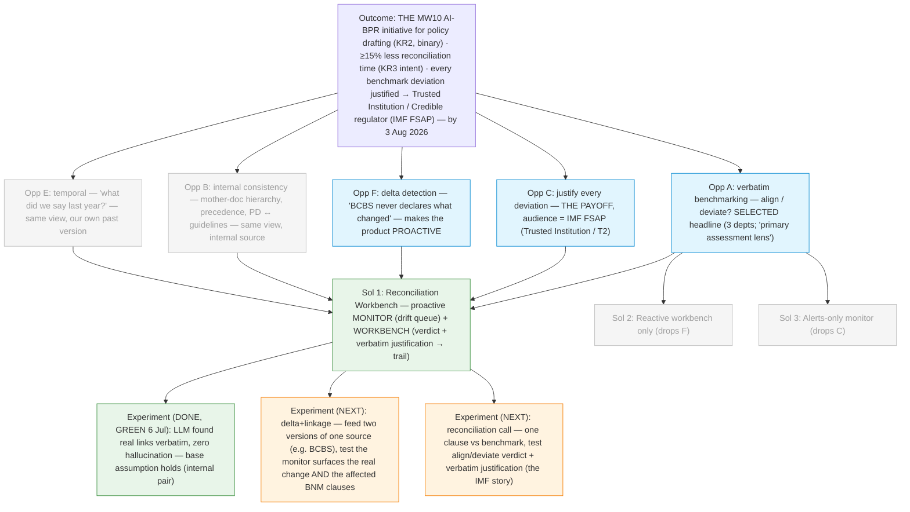

# Discovery Brief: The Reconciliation Workbench (greenfield vision, COPA Hackathon 2026)

> **Greenfield re-envisioning (11 Jul 2026).** Given the five reconciled drafter
> interviews, this brief asks: _if we started from scratch knowing only the one
> validated pain, what is the ideal product?_ It builds on — and is grounded by —
> [`../drafter-knowledge-graph/brief.md`](../drafter-knowledge-graph/brief.md)
> (the interview evidence and the "one common pain" synthesis), but re-anchors the
> outcome to the **actual BP2026 Must-Wins and COPA judging criteria** read from
> `docs/references/` (BP2026 deck + COPA Hackathon 2026 doc, both git-ignored).
>
> **Two things changed here vs. the prior brief:** (1) the product shape steps up
> from a reactive lookup tool to a **proactive monitor + workbench**; (2) the
> outcome is corrected from **MW9** (wrong — see below) to **MW10**, and tied to
> the **Trusted Institution** strategic outcome via the IMF FSAP.

## The one pain (broadened 11 Jul 2026 — the definitive essence)

> **A policymaker with an open (in-progress) document does due diligence by
> scouring _scattered_ sources — guidelines, principles, government &
> international acts/policies, and current happenings (political, technological) —
> to strengthen their draft. Each source lives somewhere different; today they
> hunt through all of them by hand. The product pulls those sources in, _links_
> them to the open document, and uses AI to extract what must/should guide the
> policy, judge how the draft stands against them, and surface what a human
> might miss.**
>
> `open document → pull in the scattered sources that bear on it → link them → AI extracts the guiding principles, judges consensus / conflict / gap / duplicate, and surfaces unseen insights.`

**Why this is broader than "reconciliation" (correcting an earlier over-narrowing):**
the 10–11 Jul framing collapsed the product to _align/deviate/gap_ verdicts. That
is **one output**, not the whole product. The real shape is two moves:

1. **Connect** — pull the scattered sources in and link each to the parts of the
   open document it bears on. This is the due-diligence work made automatic.
2. **Analyse over the connections** — AI then (a) **extracts the guiding
   principles** the draft must/should follow, (b) **judges the relationship** —
   _consensus · conflict · gap · duplicate_ (the reconciliation verdict is this
   step), and (c) **surfaces unseen insights** — connections or implications a
   human reading source-by-source would likely miss. _AI catches what a human
   might not._

The verdict labels (consensus/conflict/gap/duplicate — formerly "align/deviate/
gap") therefore **survive as the analysis layer**, not as the product's whole
identity. The **"unseen insights"** dimension is new and distinct — value beyond
"did we align", and a strong novelty beat.

### The end-to-end flow (settled 11 Jul 2026)

**Entry = upload.** The user uploads their open document; it becomes the canvas.
The demo uses a **real upload + real extraction** (proven: the AI DP extracted to
79,666 clean chars) matched against a **preset curated source library** — an
honest hybrid, labelled as curated.

The pipeline has **two branches** — this split is load-bearing, not cosmetic:

```
upload → extract the document's OWN cited sources → retrieve → connect   → CONSENSUS / DUPLICATE
       ↘ match the document's TOPICS against the curated source library →
         surface relevant sources it did NOT cite → connect              → GAP / CONFLICT / MISSED
       → AI analyses every connection (verdict + impact) → user pulls guiding principles into the draft
```

- **Cited branch** answers "what does the document already lean on?" — parse its
  footnotes/references, fetch them, link them. This solves the cold-start
  problem: **the document seeds its own source pool.** _(Parse + retrievability-
  judgment proven GREEN — Experiment 4. Actual web-retrieval is the residual
  build risk.)_

**Loading model — what's preloaded vs. pulled on upload (clarified 11 Jul 2026):**

- **Branch ② (curated library) is PRELOADED, by necessity.** You cannot surface an
  _un-cited_ source from the document itself — the tool must already hold a
  maintained benchmark pool to match against. In the current build this is real on
  disk (`data/corpus/` BNM policies + `data/references/` MAS/PDPA/Basel, wired in
  `engine/config.py`). Maintaining this library is an ongoing operational task, not
  a per-upload one.
- **Branch ① (the document's own cited sources) is PULLED ON UPLOAD** in the real
  product — parse → retrieve → link, dynamically, per document. **In the current
  POC/demo this is _not_ live** — the DP's citations were catalogued by hand and
  the connections are hand-authored mock analysis; the "analyse sequence" animates
  a pre-prepared result. Honest demo label: _real upload + real extraction, but
  pre-prepared sources + illustrative analysis_. Experiment 4 shows the parse step
  is buildable; live retrieval is the piece still to engineer.
- **Un-cited branch** is where the real value lives. Extract-and-retrieve can only
  find what the draft already cites — so **gap, conflict, and "what you might have
  missed" all depend on matching the draft's _topics_ against sources it did NOT
  cite** (the curated library). Without this branch the tool only reflects back
  what the drafter already knew. **The missed-insight value is in the un-cited
  branch.**

### Source types — including industry feedback (added 11 Jul 2026)

The source library spans **top-down** authority (what the policy _should_ follow)
and, newly, **bottom-up** industry feedback (what the regulated industry says
_back_):

- International standard / principle (BCBS, FSB, OECD, NIST)
- Peer regulator (MAS, OSFI, APRA…)
- Act / law (PDPA, FSA)
- Internal BNM policy (RMiT, FTFC, MCIPD…)
- **Industry feedback (NEW, in MVP).** An open discussion paper _exists to
  collect industry feedback_ (the DP → Exposure Draft → **Feedback** → PD
  lifecycle). Feedback is a first-class source type: linked to the paragraph it
  concerns, categorised agree / partial / disagree, analysed for impact like any
  other connection (e.g. _"para 4.6 — 3 respondents: the consent requirement is
  unworkable for existing datasets"_). This directly serves the interview ask for
  "a system to submit ED-consultation feedback." The connect→analyse→enhance loop
  is identical for feedback; only the source direction (bottom-up) differs.

**Why feedback fits, not forks:** the tool's job is the same for a BCBS principle
and an industry comment — link it to the paragraph it bears on and show how it
affects the draft. Feedback is just a fourth+ source type on the same engine.

**The DP embodies this dual nature.** The _Discussion Paper on AI in the Malaysian
Financial Sector_ (Aug 2025, now extracted into the corpus) is **published to
gather industry feedback** — but it **came about** through exactly this
scattered-source research by policymakers (its footnotes cite OECD, BCBS 239,
FSB, NIST, MAS, and more). The product amplifies that research side: pull those
real cited sources in, link them to the DP's paragraphs, and let AI extract /
judge / surface. This is why the DP is the strongest _storyteller_ — it is
visibly research-heavy — even though any document works (the engine is
document-agnostic).

Validated across five interviews (RMiT · FS/CLS · PFP/capital · Monetary/EMR ·
RSTS), which differ only in _what sits on the source side_ (peer regulator ·
international benchmark · our own past version · parent policy · standards ·
current happenings). See the prior brief's "one common pain point" table.

## Desired Outcome (re-grounded in BP2026 + COPA criteria)

**A three-part outcome, staked on the real targets:**

1. **Be the Must-Win-10 AI initiative for policy drafting.** BP2026 **MW10 (AI
   roadmap) KR2** = _"Identified **1 business process re-engineering initiative
   per sector using AI**."_ The Reconciliation Workbench **is** that AI-BPR
   initiative for the policy-drafting process — a **binary, literal** Must-Win
   hit (not restricted to "supervisory"). This is the primary anchor.
2. **Move the efficiency needle.** MW10 **KR3** intent = _"Improved efficiency by
   > 15%… from staff usage of AI tools."_ Target: **≥15% less time** spent
   > reconciling a draft against its sources, on one real drafting task, by the
   > hackathon (**3 Aug 2026**).
3. **Make the rulebook defensible by construction.** Every deviation from an
   international benchmark carries a **verbatim, verifiable justification** at
   authoring time — directly serving **Trusted Institution → T2 "Credible
   regulator"** (_"exemplify good governance… protect and strengthen public
   trust"_). The audience is concrete and **already in the building**: the **IMF
   FSAP** (`docs/references/01. FSAP Full Report - Malaysia.pdf`) is the
   assessment that checks how closely BNM follows international standards.

**Measurable · time-bound · within influence · tied to business value** — all
four hold: a binary MW10-KR2 outcome + a ≥15% efficiency delta, by 3 Aug 2026,
on a process the team controls, serving the top-weighted judging criterion.

### Must-Win / criteria mapping (read from the source docs, 11 Jul 2026)

- **COPA judging weights:** Problem Relevance & Impact **30** · Technical
  Execution **20** · Innovation **15** · MVP Quality **15** · Feasibility &
  Scalability **10** · Presentation **10**. Strategic outcomes the solution must
  serve: **Stability · Engaged Employees · Trusted Institution**.
- **MW10 (AI roadmap)** — primary. KR2 (AI business-process-reengineering, one
  per sector) is the clean binary fit; KR3 (>15% efficiency) supplies the metric.
- **MW6 (Financial sector strategy)** — supporting. A coherent, benchmarked
  regulatory posture / work programme.
- **Trusted Institution / T2 Credible regulator** — the Impact (30 pts) unlock,
  evidenced by the IMF FSAP already in the corpus.
- **⚠️ CORRECTION — drop MW9.** The prior brief leaned on **MW9 (Resource
  discipline) KR2** (">20% productivity, non-IT process improvement"). BP2026
  footnotes _non-IT_ explicitly as _"process improvements which do **not**
  require building or acquiring new software."_ Our tool **is** software, so
  **MW9-KR2 does not apply** — citing it would be a factual error in front of a
  panel that wrote the plan. MW10 is the correct and stronger home.

## Product Vision — the Reconciliation Workbench

**One-line vision:** the drafter's home surface, where the draft lives _on top
of_ a live graph of every source that bears on it — and where the tool
**proactively tells the drafter when a clause has fallen out of sync**, then
gives them the workbench to reconcile it (align / deviate / gap), justify the
call, and accumulate a defensible, IMF-ready trail.

**Two halves — decided proactive, 11 Jul 2026:**

1. **The Monitor (proactive — the "why now" and the moat).** The tool
   continuously watches the source universe — peer regulators, international
   benchmarks (e.g. BCBS), and BNM's own past positions — and pushes the drafter
   a live **queue of drift**: _"BCBS d424 changed — 12 BNM clauses are now out of
   sync"_ or _"MAS updated its AI guidance — 3 clauses in your DP draft diverge."_
   This directly answers **Opportunity F** (_"BCBS never declares what changed"_)
   and flips the product from _a lookup tool you visit_ to _a monitor that comes
   to you_. It is also the sharpest answer to **"why can't an FI do this?"** — an
   FI sees only published output; only BNM sits at the vantage point that can
   watch the whole source web against its own in-flight drafts.
2. **The Workbench (the resolution surface).** For each queued (or manually
   chosen) clause, the drafter opens the **Reconciliation view**: draft clause ↔
   authoritative source, a verdict badge **Aligned / Deviates / Gap / No source
   found**, the verbatim quote, and a **"why this call"** note. The accumulated
   notes _are_ the decision trail — the IMF-ready justification record.

**One engine, every persona.** A **source-type legend** (peer · benchmark · our
own past · parent policy) shows the same view serving all five interviewed
drafters. The flexible-tool claim is made literal — and honest, because the
interviews prove it.

**The verbatim-citation guardrail is the hard product rule** (carried through):
every verdict, quote, and justification cites the exact clause; if no source
matches, the tool says "No source found" — never invents one. This is also the
anti-hallucination measure that made blind-verification fast in the 6 Jul
experiment.

## Opportunity Map

All are facets of the one pain; the source type or the trigger differs.

| #   | Opportunity (drafter pain)                                                                                                   | Evidence                                                                 | Strength                              |
| --- | ---------------------------------------------------------------------------------------------------------------------------- | ------------------------------------------------------------------------ | ------------------------------------- |
| A   | **Verbatim benchmarking** — for a clause, what do the authoritative sources say, and did we follow _bulat-bulat_ or deviate? | Three drafters, three depts; PFP: _"the primary assessment lens."_       | **Strong**                            |
| C   | **Justify every deviation** — a defensible record of why a clause follows / departs from the benchmark.                      | PFP: IMF validation checks closeness + whether deviations are warranted. | **Strong** (named audience: IMF FSAP) |
| F   | **Delta detection** — know _when_ a source changed and which clauses it hits, without manual diffing.                        | PFP: _"BCBS never declares what changed."_                               | **Strong** (the proactive trigger)    |
| B   | **Internal consistency** — mother-doc hierarchy, precedence, "read in conjunction with", PD ↔ its guidelines.                | PFP (hierarchy/subsumption); RSTS (PD ↔ detailed guidelines).            | Moderate driver; strong feasibility   |
| E   | **Temporal self-consistency** — "what did we say last year?" vs our own past versions.                                       | Monetary/EMR direct interview.                                           | Moderate                              |

## Selected Opportunity

**A (the reconciliation act) is the headline; C (the justification trail) is the
payoff; F (delta detection) is what makes the product _proactive_.** B and E are
the same view with a different source type. Selected because A is the
best-evidenced pain (three depts), C has a named institutional audience (IMF →
top-weighted Impact criterion), and F is the capability that turns a lookup tool
into a monitor — the strongest novelty (15 pts) and moat answer.

**Deferred (not discarded):** D (AI synthesis insight) — a layer once A/C/F land;
the **supervisor persona** — ranked #2 "what else / next", shares the engine; and
**full cross-source / cross-jurisdiction breadth** — MVP proves the pattern on a
narrow slice.

## Solution Candidates

| #   | Solution                                                                                                                                                                                                 | Riskiest Assumption                                                                                                                                                                                                                               | PRD                          |
| --- | -------------------------------------------------------------------------------------------------------------------------------------------------------------------------------------------------------- | ------------------------------------------------------------------------------------------------------------------------------------------------------------------------------------------------------------------------------------------------- | ---------------------------- |
| 1   | **Reconciliation Workbench (proactive monitor + workbench) — SELECTED.** Monitor watches sources → drift queue; workbench resolves each clause with a verdict + verbatim justification → decision trail. | The monitor can reliably detect a _material_ source change and correctly map it to the affected BNM clauses (delta + linkage), on top of the base assumption that the LLM finds genuine equivalents with verbatim citations and no false matches. | — (greenfield; feeds `/prd`) |
| 2   | **Reactive workbench only** — no monitor; drafter opens the tool and reconciles on demand (the current POC).                                                                                             | That on-demand reconciliation delivers enough value without the proactive queue — but this drops F, the sharpest novelty + moat.                                                                                                                  | —                            |
| 3   | **Alerts-only monitor** — push "source X changed" notifications, no reconciliation surface.                                                                                                              | That knowing _what changed_ is enough without the resolve/justify loop — but this drops C (the Impact payoff) and leaves the drafter to do the hard part alone.                                                                                   | —                            |

**Leading solution: #1.** Only #1 delivers all of A + C + F from one artifact and
answers both novelty and moat. #2 and #3 are the halves — useful in the pitch to
show why the whole is more than either.

**Phasing (honest scope for a 3 Aug demo):** the **Workbench is MVP-1** (proven —
a POC exists at `docs/poc/drafter-knowledge-graph/`); the **Monitor is the north
star**, demonstrated in the pitch as a _live drift queue_ over a single prepared
source-change (e.g. one BCBS delta) rather than a continuously-running service.
Build the workbench so the same engine can later _watch_ sources and push, not
just answer on demand.

## Opportunity Solution Tree



## Recommended Experiment

The base assumption ("LLM finds genuine equivalents, verbatim, no false matches")
is already **GREEN** on an internal pair (6 Jul). The greenfield shape adds one
_new_ riskiest assumption — the **monitor** — so test it cheaply before building:

**Delta + linkage test (the proactive assumption).**

- **What:** take **two versions of one source** (ideally a BCBS chapter, or two
  dated versions of a peer-regulator guidance). By hand, list what materially
  changed and which BNM clauses each change touches.
- **How:** give a fresh LLM both versions + the relevant BNM clauses and ask it
  to (a) surface the material deltas and (b) map each to the affected BNM
  clause(s). Score against the hand list — every citation verbatim.
- **"Good":** it catches the material changes, maps them to the right clauses,
  and doesn't manufacture spurious "changes". → the monitor is viable.
- **If it fails:** fall back to the reactive workbench for MVP-1 and keep the
  monitor as a labelled roadmap phase.
- **Effort:** ~half a day; pair it with **Experiment 3** (the reconciliation
  call + verbatim justification) from the prior brief, which tests the IMF story.

### Experiment results — BOTH GREEN (run 11 Jul 2026, blind, on real corpus docs)

Both tests ran on **real, verbatim-verified documents already in the corpus** (no
sourcing needed): the **PDPA §129** 2010→2024 amendment (`data/references/`) as
the delta case, and **RMiT v2 17.1 ↔ MAS TRM §3.4.2** as the reconciliation case.
Method: a pre-registered answer key written first, then a **fresh agent given only
the raw text** answered blind, then compared.

- **Test A — delta + linkage → PASS (exceeded).** Given the old/new PDPA §129, the
  blind agent correctly stated the change (whitelist regime removed → self-assessed
  "substantially similar law OR adequate protection" test; also caught the
  default-flip and the "data user → data controller" rename), and mapped it to the
  **exact** affected RMiT clauses (**10.50(c), 10.50(j), 17.1**) with correct
  per-clause reasons. It **explicitly listed the not-affected clauses** (8.1, 11.1,
  17.1(b)/(c)) — no hallucinated links — and volunteered the right caveat (no clause
  literally cites the PDPA, so the link is topical inference). **The monitor's core
  reasoning is viable.**
- **Test B — reconciliation call → PASS (with a design finding).** Given RMiT 17.1
  vs MAS §3.4.2, the blind agent reached the right substance (shared "assess before
  proceeding" principle; RMiT adds a 14-day notification + board confirmation +
  independent review that MAS omits), quoted both sides verbatim, and raised an
  unprompted **false-equivalence warning** — even sharpening it (the true overlap
  lives in RMiT **10.50**, not 17.1). It labelled the verdict **GAP** where the key
  expected **DEVIATES**.
- **Design finding (feeds `/prd`):** the split between GAP and DEVIATES is a real
  **taxonomy ambiguity**, not a test failure — "RMiT adds an obligation MAS lacks"
  reads as both. Resolve in the spec by either (a) defining the labels crisply
  (_Deviates_ = same obligation, different bar; _Gap_ = obligation absent on one
  side), or (b) letting the drafter confirm/override the AI's suggested verdict —
  which fits the "AI proposes, human commits" rule. **The demo should show the
  drafter confirming the verdict, never trusting it blindly.**
- **Net:** both riskiest assumptions cleared the bar cheaply, in one session. The
  proactive-monitor shape and the reconciliation/justification loop are both
  green — go-ahead to `/prd`.

### Experiment 4 — Branch ① citation parsing (run 11 Jul 2026, blind) → GREEN

Tests the flow's newly-surfaced assumption: **can the tool read an uploaded
document and work out what sources it leans on** (branch ①: extract → judge
retrievability)? A fresh agent got only the raw extracted DP reference text.

- ✅ **Parse — GREEN.** Extracted every citation with correct org / year /
  verbatim title, and classified each by source type (standard body · peer
  regulator · int'l org · act · industry) — this _is_ the source-type taxonomy
  the product needs, produced automatically.
- ✅ **Retrievability judgment — GREEN (exceeded).** Unprompted, it separated
  **formal published documents** (BCBS 239, MAS FEAT, NIST AI RMF, BoE DP 5/22,
  FRB SR 11-7) from **non-retrievable** items (a Deputy Governor's closing
  remarks, a keynote speech, a _forthcoming_ AICB framework). It even surfaced the
  stable retrieval keys (BCBS 239, BIS WP 1194, DP 5/22, PS 6/23, SR 11-7) a
  fetch step would use, and flagged a verbatim typo ("Inteligence") — proof it
  read real text, not hallucinated.
- ⚠️ **Actual retrieval — STILL UNPROVEN.** It correctly flagged EU (2023) as
  borderline: the citation _string_ is ambiguous about which exact artifact it
  points to (Parliament explainer vs. the Act's legal text). So **parse ≠ fetch
  the right file**. The residual risk narrows to _retrieval mechanics_ (allowlist
  fetch + disambiguation + human confirm) — an **engineering** problem, not a
  "can AI do this at all" problem.
- **Net:** branch ① ("read the doc, know what it leans on") is viable. Branch ②
  matching (topic → un-cited library source) and live retrieval remain the parts
  to prove in build; spec them as their own stories with risk flags.

## Recommendation

1. **Run the delta+linkage experiment and the reconciliation-call experiment**
   (~1 day combined) — go/no-go on the proactive shape and the IMF story. The
   base connection-finding assumption is already green.
2. **Pull the two owed verbatim citations** (Basel III output floor / OSFI freeze)
   from `docs/references/` so the demo quotes them exactly.
3. **Then `/prd`** the Reconciliation Workbench: **Workbench = MVP-1** (extend the
   existing POC + engine), **Monitor = demonstrated as a prepared drift queue**,
   graph carries the structural metadata (mother-doc / precedence / legislated /
   standard-setter / technical-vs-principle), verbatim-citation guardrail is a
   hard requirement. Anchor the pitch on **MW10-KR2 (binary) + ≥15% (KR3) +
   Trusted Institution / IMF FSAP (30-pt Impact)** — and **do not cite MW9**.

Scope stays deliberately small: **one Reconciliation view**, **one prepared
source-change** for the monitor beat, on one vehicle draft — not two corpora, not
a continuously-running service, not every source the drafters named.

## Decision Log

- **Greenfield shape = proactive monitor + workbench (11 Jul 2026).** Chosen over
  "reactive workbench only" and "both, phased". The monitor is the sharpest
  novelty (15 pts) and the strongest "why can't an FI do this" answer, and it is
  what Opportunity F (delta detection) actually points to. Honestly phased:
  workbench is MVP-1, monitor is demonstrated as a prepared drift queue.
- **Outcome re-grounded in the real BP2026 + COPA docs (11 Jul 2026).** Read from
  `docs/references/`. Anchored to **MW10-KR2** (AI business-process-reengineering,
  a binary Must-Win hit) + **KR3** (>15% efficiency, the metric) + **Trusted
  Institution / T2 Credible regulator** (the 30-pt Impact unlock, evidenced by the
  IMF FSAP already in the corpus).
- **CORRECTION — dropped MW9 (11 Jul 2026).** BP2026 defines MW9-KR2's "non-IT"
  as process improvements that do **not** require building or acquiring software.
  Our tool is software, so MW9 does not apply; the prior briefs' MW9 citation is
  an error to fix. MW10 is the correct, stronger home.
- **Carried forward from the prior brief:** the single common pain
  (reconciliation), the source-type legend as the flexibility proof, the
  verbatim-citation guardrail as the hard rule, the supervisor persona deferred,
  and the structural-metadata requirement for the graph.

## Action Items

| #   | Question to resolve                                                                                                                                                                                                                                           | Who to consult                           | Blocks step                                                        | Status                                                                                                                                                                                                                                                                                                                                                       |
| --- | ------------------------------------------------------------------------------------------------------------------------------------------------------------------------------------------------------------------------------------------------------------- | ---------------------------------------- | ------------------------------------------------------------------ | ------------------------------------------------------------------------------------------------------------------------------------------------------------------------------------------------------------------------------------------------------------------------------------------------------------------------------------------------------------ |
| 1   | Run the **delta + linkage** experiment (two versions of one source → detect change + map to affected BNM clauses).                                                                                                                                            | Hackathon team                           | Go/no-go on the proactive monitor shape                            | **RESOLVED 11 Jul 2026 — GREEN.** Blind test on PDPA §129 2010→2024: correct change + exact affected clauses (10.50(c)/(j), 17.1), no hallucinated links.                                                                                                                                                                                                    |
| 2   | Run the **reconciliation-call** experiment (verdict + verbatim justification on one clause vs benchmark — IMF story).                                                                                                                                         | Hackathon team                           | Go/no-go on the C payoff                                           | **RESOLVED 11 Jul 2026 — GREEN.** Blind test RMiT 17.1 ↔ MAS §3.4.2: right substance, verbatim quotes, unprompted false-equivalence warning. Surfaced the taxonomy finding (#6).                                                                                                                                                                             |
| 6   | Resolve the **verdict taxonomy** (Deviates vs Gap boundary) in the spec, and make the drafter confirm/override the AI's suggested verdict (AI proposes, human commits).                                                                                       | Hackathon team (in `/prd`)               | Trust + correctness of the reconciliation call                     | **Open — new (11 Jul 2026).** Surfaced by Test B: two reasonable readers split GAP vs DEVIATES.                                                                                                                                                                                                                                                              |
| 3   | Extract the two owed **verbatim citations** — Basel III output floor (BCBS d424 / RBC20) and OSFI output-floor freeze.                                                                                                                                        | Hackathon team                           | Demo credibility for A + C                                         | **CORRECTED 11 Jul 2026 — sources are NOT local (prior briefs wrongly said "already in `docs/references/`").** Only Basel _Operational Resilience_ (d516) is local — wrong doc. d424 PDF downloaded but custom-font encoded → needs `markitdown` (not installed here). OSFI release still to source. Public, obtainable; a build/tooling task, not fakeable. |
| 4   | Confirm with a drafter that a **proactive drift queue** matches how they'd want to be alerted (vs. on-demand only).                                                                                                                                           | Drafter contacts                         | Validates the monitor is wanted, not just possible                 | **Open — materials ready.** 4-question script drafted (see Validation Kit). Needs a real drafter conversation; cannot be done from the desk.                                                                                                                                                                                                                 |
| 5   | Define the **≥15% baseline**: time to reconcile a draft against its sources today, and how the delta is measured.                                                                                                                                             | User + contacts                          | The efficiency half of the outcome (MW10-KR3)                      | **Open — method ready.** Measurement designed (see Validation Kit). Needs real timing data / a drafter estimate; cannot be measured from the desk.                                                                                                                                                                                                           |
| 7   | **Pick the demo corpus** (bug #2): Option A RMiT/tech-risk cluster vs Option B AI-DP vs middle path.                                                                                                                                                          | User                                     | Gates `/prd` scope                                                 | **RESOLVED 11 Jul 2026 — Option B (AI DP).** DP extracted cleanly (79,666 chars) → corpus. Product essence broadened (connect sources → AI extracts/judges/insights), which makes the discussion-paper DP a strong fit, not a poor one.                                                                                                                      |
| 10  | Catalogue the AI DP's **actual cited sources** (not assumed) and source the top ones for the demo corpus.                                                                                                                                                     | Hackathon team                           | Real reference set for the DP demo                                 | **PARTIALLY RESOLVED 11 Jul 2026.** Catalogued from the real extract: OECD (×14), BCBS/BCBS 239 (×9), FSB (×7), NIST (×6), MAS/FEAT (×5), Basel (×5), PDPA, EU AI Act, MOSTI/NAIO. **DP does NOT cite RMiT** (assumed edge dropped). Still to source: the actual OECD/BCBS 239/FSB/NIST texts for verbatim linking.                                          |
| 8   | Fix the **"RMiT v1 · 2020" mislabel** (bug #1): the only RMiT PDF is the 28 Nov 2025 reissue, labelled as "2020" via `document_id: rmit-v1-2020` across config, 4 test files, and generated artifacts. Relabel to truth (v1 · 2025) + rebuild + update tests. | Hackathon team (scoped task / in `/prd`) | Demo credibility — a version node shown to judges must be truthful | **Open — new (11 Jul 2026).** ~100+ occurrences; a code refactor, deliberately NOT hacked live during discovery. See [`corpus-reality.md`](./corpus-reality.md) bug #1.                                                                                                                                                                                      |
| 9   | **Label the RMiT v2 draft as a constructed what-if** in every brief and the pitch — not "a real draft". The real quotes are the _references_; the draft (17.1 hand-bent to "notify-after") is the fiction the drafter edits.                                  | Hackathon team                           | Keeps the verbatim-citation promise credible                       | **Open — new (11 Jul 2026).** Config already tags it `source:"draft"`/`MOCK_DIR`; the briefs' prose overstates it.                                                                                                                                                                                                                                           |
| 11  | Prove **live retrieval** (branch ①): given parsed citations, fetch the right document from an approved allowlist, handling ambiguity (e.g. EU AI Act explainer vs. legal text) and non-retrievables (speeches/forthcoming) with human confirm.                | Hackathon team (build)                   | The one unproven part of branch ① — an engineering risk            | **Open — new (11 Jul 2026).** Parse + retrievability-judgment are GREEN (Exp 4); actual fetch is the residual risk. Spec as its own story.                                                                                                                                                                                                                   |
| 12  | Prove **branch ② matching**: given a draft paragraph's topic, retrieve the right _un-cited_ source from the curated library (this is where gap/conflict/missed come from). Not yet tested end-to-end.                                                         | Hackathon team (build)                   | The un-cited branch = the differentiation; unproven retrieval step | **Open — new (11 Jul 2026).** Analysis-on-known-pairs is GREEN; topic→un-cited-source retrieval is not. Spec as its own story with a risk flag.                                                                                                                                                                                                              |

## Validation Kit — ready-to-use materials for the open items (11 Jul 2026)

These items each need a human (a drafter conversation, real timing data, or a
tooling step) — they cannot be settled from the desk. To make them zero-friction
to run, here are the actual materials.

### #3 — Sourcing checklist for the two verbatim citations

**Reality check (corrected):** these are **not** in `docs/references/` today.
Both are public; get them the same way the existing reference corpus was built.

- **Basel III output floor** — target the exact wording of the 72.5% aggregate
  output floor. Canonical sources: **BCBS d424** (_Basel III: Finalising
  post-crisis reforms_, Dec 2017) or the consolidated **Basel Framework chapter
  RBC20**. The d424 PDF has been downloaded but is custom-font encoded → run it
  through **`markitdown`** (the engine's ingestion tool; not installed in the
  discovery environment), then copy the paragraph verbatim and check word-for-word.
- **OSFI output-floor freeze** — target OSFI's announcement holding the floor
  constant. Likely the **Jun 2023** capital-treatment communication (and/or the
  annual Domestic Stability Buffer release). Source from osfi-bsif.gc.ca; the URL
  in this brief 404'd — find the current release page, then extract verbatim.
- **Guardrail:** if either can't be verified word-for-word before the demo, show
  it as a **labelled "pending extraction"** placeholder — never an approximated
  quote. An approximated Basel figure in front of the panel violates the product's
  own core rule.

### #4 — Drafter validation script (the proactive-monitor assumption)

Ask **1–2 benchmarking drafters** (PFP/capital ideal, since they track BCBS).
Keep it about the _behaviour_, not the tool. Suggested questions, in order:

1. "When an external standard you benchmark against — say BCBS — changes, **how
   do you find out today**, and how long does it typically take you to realise a
   change affects one of our clauses?"
2. "If a system could tell you _'BCBS d424 changed — here are the 12 BNM clauses
   now out of sync'_ **the day it happened**, would that change how you work — or
   would you rather check on your own schedule?" _(the core proactive-vs-reactive
   question)_
3. "What would make such an alert **noise** rather than signal — how do you decide
   a change is _material_ enough to act on?" _(feeds the "what counts as material"
   open question)_
4. "Would you trust the system's _'these clauses are affected'_ list enough to act
   on it, or only as a prompt to go check yourself?" _(confirms AI-proposes /
   human-commits)_

**What "validated" looks like:** the drafter says an at-the-moment alert would
meaningfully change their workflow (not just "nice to have"). **If instead** they
prefer to check on their own cadence → the monitor drops to a labelled roadmap
phase and MVP-1 is the reactive workbench (the shape still works, just less bold).

### #5 — The ≥15% efficiency baseline (MW10-KR3 metric)

Measure the _reconciliation_ task specifically, not "drafting" broadly.

- **Baseline to capture (from 2–3 drafters, or a recalled estimate):** for one
  clause being benchmarked, how long today to (a) find the relevant external/
  internal sources, (b) read and pull the exact passages, (c) decide align/
  deviate and note why? Sum across a representative set of clauses in one draft.
- **Tool-side measure:** the same set of clauses reconciled in the workbench —
  time to first suggested source, to verified verbatim quote, to a recorded call.
- **The metric:** `(baseline_time − tool_time) / baseline_time ≥ 15%` on a real
  drafting task. Also report **evidential completeness** (share of clauses that
  end with a verbatim, verifiable justification vs. from-memory) — the "sound
  draft" half of the outcome.
- **Honesty note for the pitch:** with hackathon timing, a **small hand-timed
  sample or a credible drafter estimate** is acceptable evidence — label it as
  such; don't imply a rigorous study.

## Open Questions

- **How "live" must the monitor look in the demo?** A prepared single drift event
  (one BCBS delta) is honest and low-risk; a continuously-running watcher is not
  buildable in the window. Where exactly do we draw and _label_ that line?
- **What counts as a "material" change** worth queuing? A source edits wording
  constantly; the monitor's value depends on filtering noise from substance —
  who/what defines the threshold?
- **Vehicle document for the single demo** — still the AI DP or the Basel/capital
  slice? The reconciliation view is identical either way; this stays a staging
  choice, resolved in `/prd`. **Readiness reality (checked 11 Jul 2026 — neither
  is turnkey):** the AI DP has a POC, but that POC uses **mock/illustrative
  content** — the real DP PDF is **not in the corpus** (fetched once, custom-font
  encoded, never extracted). The Basel slice has the sharper IMF story but its
  **output-floor / OSFI PDFs are not local either** (must be sourced + extracted).
  By contrast, the docs used in the two GREEN experiments (PDPA, MAS TRM, RMiT
  v1/v2) _are_ real and extracted — a Malaysian-cross-border-transfer slice is
  the lowest-prep vehicle if time is tight.
- **Confidentiality** — the monitor watches external (public) sources, but "our
  own past positions" and the RH may be internal; keep the confidential-source
  handling (locked placeholder, never a tracked path) from the prior brief.
