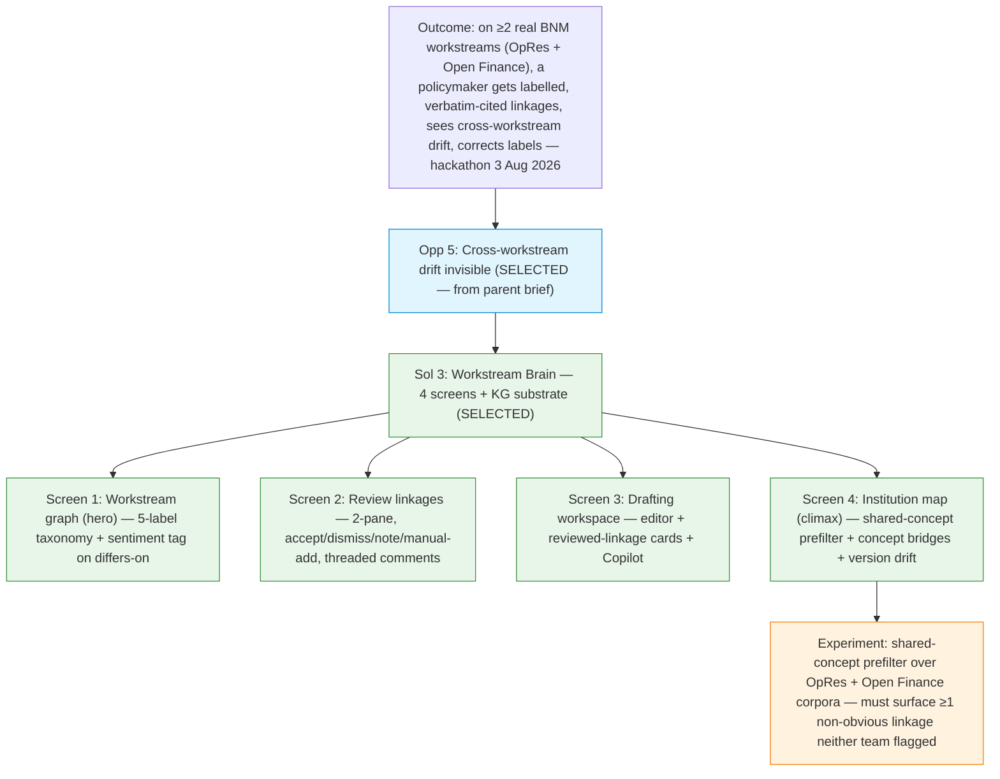

# Discovery Brief: Workstream Brain — MVP1 Scope Lockdown

> **Continuation, not restart.** The parent brief
> (`docs/discovery/workstream-brain/brief.md`, status: complete) framed the
> outcome, retired the riskiest assumption (12 real cross-workstream linkages
> found in the OpRes × Open Finance experiment), and locked in the strategic
> pitch (institutional-continuity, cross-workstream drift becomes explicit).
> **This brief locks the four-screen MVP1 scope, the linkage taxonomy, and the
> institution-map analyses before the POC build starts.** Assume the parent
> brief unless a decision here overrides it.

## Desired Outcome

Unchanged from the parent brief. By hackathon day (3 Aug 2026), on **at least
two real BNM workstreams running in parallel** (Operational Resilience
continuation + Open Finance ED response), a BNM policymaker can:

1. See labelled, verbatim-cited linkages between their workstream and its
   anchors (BCBS / peer / act / industry / other internal docs);
2. See cross-workstream linkages where two workstreams touch the same concept
   — the demo climax;
3. Correct any label in one click, with the tool re-running nearby linkages
   using that correction as a few-shot example.

Success is defined by the demo landing, not a numeric metric — recall is
delivered through the correction UX (`b` in the parent brief's open questions),
not offline F1.

## Opportunity Map

Also unchanged. Selected opportunity is **#5 — cross-workstream drift is
invisible today** (parent brief L62–L63). #2 (peer benchmarking rot), #4
(sub-task grounding), and #1 (no single home for sources) are absorbed into
the workspace as demo-supporting mechanics rather than deferred.

This brief does not re-open the opportunity selection. It focuses on
**Solution Candidates** and **Recommendation** below.

## Selected Opportunity

**#5 — Cross-workstream drift.** Rationale in parent brief L74–L98.

## Solution Candidates

The parent brief selected **Solution #3 — Workstream Brain**. This brief
narrows that solution to four concrete screens plus a KG substrate. Screens
1–4 replace the six Rulebook Radar POC screens (`docs/poc/policy-consistency-ai/`
had: index, review, review-opres, review-outsourcing, impact, chat, supervisor
— none survive verbatim; supervisor is dropped, chat/impact merge into others).

| #   | Screen             | Purpose                                                                                                                                                                                                                                                                                               | Replaces                                   |
| --- | ------------------ | ----------------------------------------------------------------------------------------------------------------------------------------------------------------------------------------------------------------------------------------------------------------------------------------------------- | ------------------------------------------ |
| 1   | Workstream graph   | Per-workstream KG — one document is one node, structural edges labelled `supersedes` / `references` / `contributes-to` / `parallel-to`. NODE DETAIL and EDGE DETAIL panels. Add-node modal with 7 flat node types + ≥1 required edge. Zoomable graph canvas. **Hero.**                                | Rulebook graph (renamed)                   |
| 1a  | Task               | Reached by clicking **Open task** on a `task`-type node. Shows source doc + neighbour nodes defined at creation + a pairwise-comparison card (finder→critic linkages between the working draft and each neighbour, filterable). Top-right: **Assign** / **Open draft**.                               | (new — pre-drafting task home)             |
| 2   | Review linkages    | Two-pane finding review — source doc left, target doc right, clauses highlighted by selected finding; vertical stack of finder cards on right with accept/dismiss/note, comment thread, manual-add via dropdown, guided "find more".                                                                  | Review change + Impact (merged)            |
| 3   | Drafting workspace | Split view — styled doc editor right; left has 3 tabs: (a) **Reviewed linkages** (findings the user accepted in review), (b) **Related · 1 hop** (linkages that already exist between the task's neighbour nodes — extra drafting context), (c) **Drafting Copilot** with a 7-intent preset dropdown. | Drafting Copilot (merged into a workspace) |
| 4   | Institution map    | Zoom-out view — management picks workstreams (filter-pill UI), tool merges shared concept nodes across corpora and surfaces cross-workstream linkages neither team flagged. **Demo climax.**                                                                                                          | Supervisor view (dropped); new screen      |

### Node model (screens 1 & 4)

**Flat 7-value node-type vocabulary**, chosen at add-time in a single
picker (no kind-vs-type nesting). `task` is one of the 7 — it is the only
editable type; the other 6 are read-only anchors.

| Node type                | Editable? | Examples                                                                               | Notes                                                                    |
| ------------------------ | :-------: | -------------------------------------------------------------------------------------- | ------------------------------------------------------------------------ |
| `task`                   |     ✓     | Working draft PD/ED/DP, benchmarking artefact, FAQ, engagement deck, feedback template | Action button: **Open task** → task.html                                 |
| `internal-published`     |     —     | BNM PD, ED, DP (already issued)                                                        | Action button: **Open source**                                           |
| `international-standard` |     —     | BCBS, IOSCO, FSB, ISO 27001                                                            | Non-binding mother docs; anchors for adoption                            |
| `peer-regulator`         |     —     | HKMA SPM, MAS Notice, APRA CPS, OSFI E-21                                              | One label for both the doc and its issuer                                |
| `act-law`                |     —     | FSA 2013, IFSA 2013, CCA 2025                                                          | Statutory; `conflicts-with` here reads as legal red flag                 |
| `industry-input`         |     —     | PCI-DSS; ABM position; DP/ED industry submissions                                      | MVP1 scope is industry-standards; feedback is E1-deferred (parent brief) |
| `others`                 |     —     | Anything unclassified                                                                  | Escape hatch                                                             |

**Why 7 flat types (not 2 kinds × 6 subtypes):**

- The add-node modal shows a single grid — cognitively lighter than a
  two-step picker.
- Working drafts double-classified as "resource + internal-published" was
  the friction point in the earlier design; keeping `task` as its own
  type kills that ambiguity.
- The linkage taxonomy's register still depends on the target type
  (`differs-on` against a `peer-regulator` reads as benchmarking; against
  an `act-law` it reads as compliance risk). Register lives on the
  finding, not on the graph edge.
- Institution map filters need per-type facets ("show only
  `international-standard` targets"; "which workstreams are `silent-on`
  any `act-law`") — 7 flat types serve these directly.

**Reconciliation with the ontology-pipeline spec.** The pipeline
(`docs/superpowers/specs/2026-07-12-kg-ontology-pipeline-poc-design.md`,
§4 MECE-7) models these anchors as `Instrument` class nodes with
`jurisdiction` (`MY` / `INT`) and `issuer` (`BNM`, `BCBS`, …) attributes.
The POC's 6 resource types are a UI-friendly rollup of that richer model.
A mapping table lives in the PRD to prevent vocabulary drift between the
POC UI and the pipeline output.

**Clause-level content is never a node.** No clause-level nodes exist in
the graph. Clause text surfaces only inside edge-detail cards, quoted
verbatim from `engine/connections.py`'s `ClauseCitation` payload.

**Concepts are not authored** and don't appear on the workstream graph
(screens 1–3). They surface in two places only:

1. Under a "Concepts" disclosure inside the node-detail card — top NER
   concepts for this document, extracted by the ontology pipeline;
2. As first-class map nodes on the Institution map (screen 4), where
   shared concepts across workstreams are the demo's whole point.

Terminology note: **concept** is the user-facing term throughout this
brief and the POC UI. The ontology-pipeline spec calls the same thing
**entity** (its MECE-7 `Entity` type-hierarchy). Both refer to the same
extracted noun-phrase — the two vocabularies are aliases across the
UI ↔ pipeline boundary.

### Two edge layers: structural (on the graph) + semantic (on findings)

Edges appear at two different levels in the product, and they carry
different labels because they answer different questions.

**Structural edges** live on the workstream graph itself (screen 1). They
describe _why the user added the node_ — a shape a user can defend without
having run finder→critic yet. Four types, MECE, defined at node-creation
time in the add-node modal:

| Structural edge  | Reads as                                                                    | Example                                                        |
| ---------------- | --------------------------------------------------------------------------- | -------------------------------------------------------------- |
| `supersedes`     | Newer version replaces an older version of the same source                  | RMiT PD 28 Nov 2025 `supersedes` RMiT PD 1 Jun 2023            |
| `references`     | One doc cites the other as authoritative (statutory basis, mother doc)      | Open Finance ED `references` Personal Data Protection Act 2010 |
| `contributes-to` | Anchor doc feeds into a drafting task (benchmarking, mother-doc adaptation) | HKMA SPM OR-2 `contributes-to` OpRes PD drafting task          |
| `parallel-to`    | Two live docs on adjacent domains that touch the same regulated concepts    | RMiT PD `parallel-to` Open Finance ED                          |

**Semantic labels** live on findings — the pairwise linkages the
finder→critic loop produces after **Analyze linkages** runs on a
structural edge. These are what the workstream member reads on the review
screen and inside a task's pairwise-comparison card. Convention:
`doc_a_id` = "we/ours" (the workstream's own doc), `doc_b_id` =
"they/theirs" (the anchor).

| Semantic label   | Reads as                                                                   | Sentiment tag (differs-on only) |
| ---------------- | -------------------------------------------------------------------------- | ------------------------------- |
| `aligns-with`    | We say the same thing they do                                              | —                               |
| `differs-on`     | Same axis, different position (scope/threshold) — deliberate policy choice | tighten / loosen / neutral      |
| `conflicts-with` | Applying both is incompatible — must resolve                               | —                               |
| `silent-on`      | They cover it; our doc doesn't (candidate gap in our doc)                  | —                               |
| `goes-beyond`    | We cover it; their doc doesn't                                             | —                               |

Why two layers: the graph is meant to be readable _before_ the LLM has run
on any pair. Putting semantic labels on graph edges implies findings exist
where they don't. The structural edge type is the shape of the
relationship; the semantic labels are what the LLM discovered inside it.

MECE check:

- `aligns-with` / `differs-on` / `conflicts-with` partition the case where
  both sides speak to the same axis (agreement, deliberate disagreement,
  incompatible disagreement).
- `silent-on` / `goes-beyond` partition the coverage-asymmetry case.
- Every linkage is exactly one of these five.

Directional-preposition trap avoided: earlier drafts tried `calibrates-from`
but that implied derivation ("we adapted from them"), which is wrong for
lateral peer comparison (HKMA/MAS). `differs-on` is neutral for all pair
types including BCBS-mother-doc, peer benchmarking, and internal-internal.

**Sentiment tag on `differs-on`** applies to all pair types including
internal↔internal — tighten/loosen between two published BNM PDs surfaces
inconsistency and is a legitimate finding, not a category error.

Absorbs the finder-prompt taxonomy (conflict/dependency/duplication/scoping)
and the parent brief's 7-label taxonomy (adopts/adapts/tightens/loosens/
deviates/silent-on/extends) without loss:

- adopts + duplication → `aligns-with`
- adapts + tightens + loosens + scoping → `differs-on` (+ sentiment)
- deviates + conflict → `conflicts-with`
- silent-on → `silent-on`
- extends → `goes-beyond`
- dependency (bare cite with no substantive stance) → not emitted as a
  labelled edge; captured as a "cites" reference in the node-detail card.

### Node-detail card contents (screen 1)

Detail panel on the workstream graph carries a **NODE DETAIL** section
header. Contents, top-to-bottom, each in its own boxed sub-card:

1. **Header block** — node-type badge (one of the 7 types), sub-badge
   (issuer / date / short type), doc title, one-line description.
2. **First-order neighbours** — clickable chips coloured by target
   node-type. No linkage-label grouping (those live per-finding, not
   per-graph-edge). Primary navigation into the rest of the graph.
3. **Second-order neighbours** — "N/A in demo" placeholder. Enabled after
   v2 corpus expansion.
4. **Recent activity** — edits and comments with author + timestamp
   (workstream-scoped).
5. **Concepts (disclosure)** — top concepts for this doc from the ontology
   pipeline, collapsed by default; opens with a class breakdown
   (`Requirement`, `Party`, `Topic`, …) using the pipeline's MECE-7 labels.
6. **Action button** — **Open task** for `task` nodes (opens `task.html`);
   **Open source** for resource nodes (URL / attached file).

### Edge-detail card contents (screen 1)

Detail panel carries an **EDGE DETAIL** section header. Contents:

1. **Header block** — structural edge-type badge (one of the 4
   structural types), status badge (`not analysed` amber / `N linkage(s)`
   emerald), pair title (source ↔ target).
2. **Pre-analysis state** — if the pair has never been run, show an
   **Analyze linkages** call-to-action; no summary/scope/clause content
   yet, because none exists.
3. **Post-analysis state** — list of finding cards, each carrying its
   semantic label pill + one-line summary. **Review** button navigates to
   screen 2 for the full clause-by-clause finding review.

Verbatim clause text (`ClauseCitation.text`) shows on the finding cards
inside screen 2 (Review linkages), never fabricated in the edge panel.

### Institution map — what analysis it actually runs

The parent brief nominates the zoom-out reveal as the demo climax but does
not name the algorithms. MVP1 locks in three analyses (all deterministic
graph queries plus one LLM prefilter step); a fourth is a nice-to-have.

| #   | Analysis                                 | What it produces                                                                                                                                                                                                                                                                                                                  | Cost                                                                                         | Demo weight |
| --- | ---------------------------------------- | --------------------------------------------------------------------------------------------------------------------------------------------------------------------------------------------------------------------------------------------------------------------------------------------------------------------------------- | -------------------------------------------------------------------------------------------- | ----------- |
| 1   | Shared-concept prefiltered LLM discovery | For 2+ selected workstreams, resolve concepts across all their docs. For every doc-pair sharing ≥N canonical concepts, run finder→critic. Output cross-workstream linkages the individual workstream teams didn't flag. **The climax.**                                                                                           | Reuses `engine/connections.py` + concept resolver from the ontology-pipeline spec. Moderate. | High        |
| 2   | Concept bridges                          | Concepts appearing in ≥2 workstreams become first-class map nodes. Click a concept (e.g. "RTO", "critical business service") → see every clause across every workstream that references it, verbatim. The substrate management most cares about.                                                                                  | Cheap once concepts are resolved. **Highest value-per-line-of-code.**                        | High        |
| 3   | Version-drift detection                  | Zero-LLM graph query. For every resource of type `international-standard` / `peer-regulator` / `internal-published` cited by version, flag workstream pairs anchoring to different versions of the same source. Hits parent brief L83–L87 (Open Finance → RMiT 2023; OpRes → RMiT 2025). **Deterministic backstop for the demo.** | Trivial once resources are versioned.                                                        | High        |
| 4   | External-anchor coverage matrix          | Per workstream, tabulate which `international-standard` / `peer-regulator` / `act-law` resources are referenced and which are silent. Surfaces coverage asymmetry management cares about. Nice-to-have.                                                                                                                           | Trivial, tabular not graph.                                                                  | Medium      |

**Cut list (rejected).** Centrality/PageRank on concepts, Louvain
communities, doc-doc Jaccard, top-concepts-per-doc dashboards. All fail the
"what does the workstream member _do_ with this?" test — they explain the
corpus to itself rather than surface an action. This addresses the overall
open question head-on: yes, most classic KG analytics don't fit this UX.

### Why the KG is genuinely a KG (framing for the pitch)

The overall open question — "is our KG really a network graph if there's no
ML pipeline?" — resolves as follows:

- **Screens 1–3 (workstream-member-facing) don't need a network graph.**
  The member knows which doc-pair they care about; the pairwise
  finder→critic is the right primitive. Presenting this as a "graph" is
  UI shorthand, not a claim about the underlying algorithm.
- **Screen 4 (institution map) is where the KG earns its title.** All three
  chosen analyses require a shared substrate — resolved concepts across the
  corpus — that only a network representation can provide:
  - #1 needs concept overlap to prefilter which pairs to LLM-analyse
    (combinatorial reduction — 9 workstreams = 36 pairs, unaffordable
    without prefilter);
  - #2 needs the same substrate to surface concept-bridge navigation;
  - #3 needs versioned-resource typing to run transitively.
- **Ontology-pipeline spec (`docs/superpowers/specs/2026-07-12-kg-ontology-
pipeline-poc-design.md`) is the substrate for screen 4.** MECE-7 classes,
  gazetteer + GLiNER extraction, `same-as` edges linking cited references
  to ingested source documents — that spec becomes screen 4's engine.
  Screens 1–3 do not depend on it.

The two-layer story is honest and defensible: pairwise LLM at the
workstream-member layer, network graph at the institution layer, each
doing the job the other can't.

## Opportunity Solution Tree

## Recommended Experiment

The parent brief's experiment retired the pairwise-linkage assumption
(12 supported linkages, 0 unsupported, on the OpRes × Open Finance BNM×BNM
pair). This brief carries one **residual assumption** worth testing before
demo day:

**Assumption:** shared-concept prefiltering surfaces ≥1 cross-workstream
linkage that the LLM pairwise finder would not have proposed on its own
(i.e. concept overlap catches something the clause-language pairwise
scan misses).

**Test:** run the ontology-pipeline extractor over the two workstreams'
corpora, compute concept overlap, run finder→critic only on the top-K
overlap-scored doc-pairs, and compare against the parent-brief experiment's
12 linkages. Success = at least one linkage in the new set that was not in
the 12 AND passes verbatim validation.

**Timeframe:** 1–2 days during build week. If it fails (all "new" linkages
were already in the 12, or none pass validation), fall back to Institution
Map analyses #2 + #3 (concept bridges + version drift) as the demo climax —
both are deterministic and independently defensible without the LLM
prefilter story.

## Recommendation

Proceed to build POC #2 (Workstream Brain) at `docs/poc/workstream-brain/`
covering the four screens above. The clickable HTML prototype should:

1. Use the existing `docs/poc/workstream-brain/` HTML scaffold as a starting
   point (index, workstream, linkage, task, new-workstream already exist);
2. Add or refactor to hit the four locked screens: **workstream graph**
   (from `workstream.html`), **review linkages** (new, replacing `review*.html`
   from the old POC), **drafting workspace** (new), **institution map** (new,
   replacing `index.html`'s institution view with the analyses above);
3. Pre-seed three workstreams: **Operational Resilience Roadmap** (in
   progress), **Open Finance PD** (in progress), **RMiT PD** (delivered —
   reference only);
4. Preserve the verbatim-citation guarantee end-to-end — every linkage card
   must show source clause text quoted exactly from the `ClauseCitation`
   payload, never paraphrased in the HTML.

Do **not** build the ontology pipeline as part of this POC; screen 4's
data can be mocked from a curated concept-overlap file for the hackathon
demo. The pipeline is a separate deliverable (its own spec) that plugs into
screen 4 later.

## Decision Log

- **Screen count locked at 4.** Drops supervisor view entirely; merges
  Impact into Review linkages; merges Drafting Copilot into Drafting
  workspace. User confirmed all three collapses. Rationale: judging
  criteria weight MVP quality (15) and presentation (10) — fewer polished
  screens outperform more shallow ones.
- **5-label linkage taxonomy, not 7 or 8.** Started at 7 (parent brief),
  expanded to 8 mid-session (added `references`), then compressed to 5 by
  merging structural cases into directional labels. Directional convention:
  doc_a = "we", doc_b = "they". User pushback drove `differs-on` over
  `diverges-from` (too adversarial) and `differs-on` over `calibrates-from`
  (implied one-way derivation, wrong for lateral peer comparison).
- **Sentiment tag universal, not scoped to external anchors.** User
  correction: internal↔internal tighten/loosen is a legitimate finding
  (catches inconsistency between published BNM PDs), not a category error.
- **One doc = one node.** No clause-level nodes in the graph. Clause
  content surfaces only inside edge-detail cards. Keeps the graph readable
  at the workstream and institution levels.
- **Node types flattened to 7, no kind/type nesting.** Earlier design
  had `kind ∈ {task, resource}` × 6 resource types. Compressed to a single
  7-value picker: `task` / `internal-published` / `international-standard`
  / `peer-regulator` / `act-law` / `industry-input` / `others`. `task` is
  the only editable type. Rationale: two-step picker was cognitive
  overhead the modal did not need. `working-draft` stays out of the list
  because it is a `task` by definition (avoiding double-classification).
  `others` retained as escape hatch. Concept nodes are not authored and
  appear only in the institution map.
- **Two edge layers: structural (graph) + semantic (findings).**
  Structural edges are the graph edges — 4 MECE types authored at
  node-creation: `supersedes` / `references` / `contributes-to` /
  `parallel-to`. Semantic labels — `aligns-with` / `differs-on` /
  `conflicts-with` / `silent-on` / `goes-beyond` — live on findings
  produced by finder→critic and appear only on review screen, task
  pairwise-comparison card, and inside the edge-detail panel _after_
  analysis. Previous design that put semantic labels on graph edges was
  wrong: it implied findings existed where none had been generated.
- **Analyze linkages is explicit and gated.** Edges start `not analysed`
  with no summary. User clicks **Analyze linkages** to run finder→critic
  on the pair. Cards appear only after that. No fabricated summaries.
- **Terminology standardised: "concept" not "entity" in user-facing
  copy.** The ontology-pipeline spec's `Entity` type-hierarchy remains the
  pipeline-internal vocabulary; both refer to the same extracted noun-
  phrase. A mapping table between POC resource types and the pipeline's
  `Instrument` / `jurisdiction` / `issuer` attributes lives in the PRD.
- **Institution map runs three analyses, not seven.** Shared-concept LLM
  discovery + concept bridges + version drift. Rejected: centrality,
  community detection, doc-doc Jaccard, top-concepts dashboards. Rationale:
  the user tested these against the workstream-member/management UX and
  found none produced a next action.
- **Institution map renamed from "birds-eye view".** Chose "Institution
  map" — matches the parent brief's L44 language and management-register
  vocabulary.
- **KG framing is two-layer.** Pairwise LLM (drafter screens 1–3) +
  network graph (institution map, screen 4). Neither layer pretends to be
  the other. This resolves the "is our KG a real KG?" doubt without
  either overclaiming or dropping the KG pitch.
- **Ontology pipeline is a separate deliverable.** Screen 4 uses it once
  it exists; the POC HTML mocks its output from a curated file for the
  hackathon demo. Building the pipeline inside the POC blows scope.
- **Screen 4 mock-vs-compute policy: mock concept extraction, live-run
  version drift.** Concept extraction on screen 4 is mocked from a curated
  JSON file (POC has no runtime pipeline); the version-drift query runs
  live over resource-node metadata because it is deterministic, cheap, and
  lands the parent brief's L83–L87 exhibit on stage.
- **Live demo trigger uses the retired trace, not a live LLM call.**
  Clicking **Analyze linkages** on the OpRes × Open Finance pair replays
  `data/artifacts/connection-trace-opres-v1-2025-draft__open-finance-v1-
2025-ed.json` with a short artificial delay. A live finder→critic run
  on stage risks nondeterministic output and network flakiness; the trace
  is the demo backstop the parent brief committed to.
- **Manual-add linkage UX = clause dropdown, not free-text.** On screen 2,
  users pick source-clause and target-clause from a dropdown of parsed
  clauses (populated from `ClauseIndex`). Free-text is rejected because it
  can produce claims the tool can't verbatim-cite — violates the CLAUDE.md
  product rule.
- **Drafting workspace editor = styled div, not real Word/PPT/Excel
  embed.** MVP1 fakes the editor with Tailwind-styled HTML. A real Office
  embed is out of scope for a static HTML POC and would gate the demo on
  auth/CORS/licensing.
- **Drafting Copilot intent presets: 7-item dropdown, non-functional.**
  Intent presets on screen 3's Copilot tab are: **DP** (Discussion Paper),
  **PD** (Policy Document), **ED** (Exposure Draft), **FAQ**, **Engagement
  Deck**, **Feedback Template for Industry**, **Peer Benchmarking**.
  Rendered as a dropdown only — selection does not need to alter Copilot
  behaviour in MVP1. Signals the surface area to judges without committing
  to intent-conditional prompting for the hackathon build.
- **Task screen is a first-class screen, not a modal.** Entry point:
  clicking **Open task** on a `task`-type node in the workstream graph
  (renamed from "Edit in workspace"). Task screen shows the source doc
  card, neighbour-nodes list (from node creation), and a pairwise-
  comparison card scanning linkages between the working draft and each
  neighbour. Filterable by neighbour. Blank if the draft is empty. Top-
  right actions: **Assign** (workflow) + **Open draft** (replaces "Run AI
  agent"; navigates to drafting.html).
- **Drafting workspace has 3 tabs, not 2.** Added **Related · 1 hop** tab
  alongside **Reviewed linkages** and **Copilot**. Related pulls linkages
  that already exist between the task's neighbour nodes themselves (1 hop
  from the task, not against the draft). Gives the drafter context
  neighbours have already established without hunting through screens.
  2-hop deferred to post-MVP1.
- **Collapsible workstream sidebar shared across screens.** All screens
  route through a collapsible sidebar listing every workstream the user is
  added to plus `+ New workstream` and Institution map. Icon-only rail
  when collapsed. Sidebar is the primary cross-screen nav — reachable from
  workstream, task, drafting, review, index, new-workstream.
- **new-workstream.html rewritten, prior-version/anchor/benchmark/
  constraint labels dropped.** These were legacy scaffold from an earlier
  taxonomy and did not map to the current 7 node types + 4 edge types.
  New form has three cards: Basics (name, description, deliverable type,
  target publication), People (owner, reviewers), Access (team-only /
  department-wide). `linkage.html` deleted entirely — its role is served
  by the edge-detail panel on workstream.html and finding cards on
  review.html.
- **Graph zoom controls added.** SVG scale via zoom-in / zoom-out / reset
  buttons on workstream graph. Addresses "graph is in your face" feedback
  without introducing pan/drag complexity.
- **Institution map picker uses filter-pill UI, not tile chips.**
  Leftmost is `+ Add workstream` (opens a dropdown of remaining
  workstreams). Selected workstreams appear as compact pills with `×` to
  remove. Cleaner than the tile grid; standard filter idiom users
  recognise.
- **Institution map version-drift alert card removed.** The drift
  detection story lives inside the workstream graph (edge detail on
  `supersedes` edges) and the pairwise-comparison card on the task
  screen. Duplicating it as a dedicated alert on the institution map
  overweighted a single finding.

## Open Questions

Carried forward — resolved before or during `/prd`:

- **Institution map inner-card design.** Three cards below the concept-
  bridge canvas — the shared-concept detail panel, the external-anchor
  coverage matrix, and the cross-workstream linkage list — need a
  `/grill-me` round to settle their story. The concern user raised: it's
  unclear what workstream-member or management action each card
  supports. Design tasks blocked on this: what data each card queries,
  what the click target is, and whether all three earn their space or one
  should be dropped. Blocks: institution-map final polish before demo.

## References

- **Parent brief:** `docs/discovery/workstream-brain/brief.md` — outcome,
  opportunity, retired experiment.
- **Ontology-pipeline spec:** `docs/superpowers/specs/2026-07-12-kg-ontology-
pipeline-poc-design.md` — MECE-7 classes, extractor, entity resolution;
  becomes screen 4's engine.
- **Engine primitive:** `engine/connections.py` — finder → critic →
  citation validator; primitive for screens 1, 2, and institution-map
  analysis #1.
- **POC HTML build:** `docs/poc/workstream-brain/` — 6 screens: `index`
  (institution map), `workstream` (workstream graph, hero), `task`
  (task home), `review` (review linkages), `drafting` (drafting
  workspace), `new-workstream` (create-workstream form). `linkage.html`
  removed as legacy.
- **Prior POC (retired):** `docs/poc/policy-consistency-ai/` — kept for
  reference; supervisor / review-opres / review-outsourcing / impact / chat
  are superseded and should not be reused verbatim.
- **Retired experiment trace:** `data/artifacts/connection-trace-opres-v1-
2025-draft__open-finance-v1-2025-ed.json` — 12 supported linkages,
  demo backstop.
