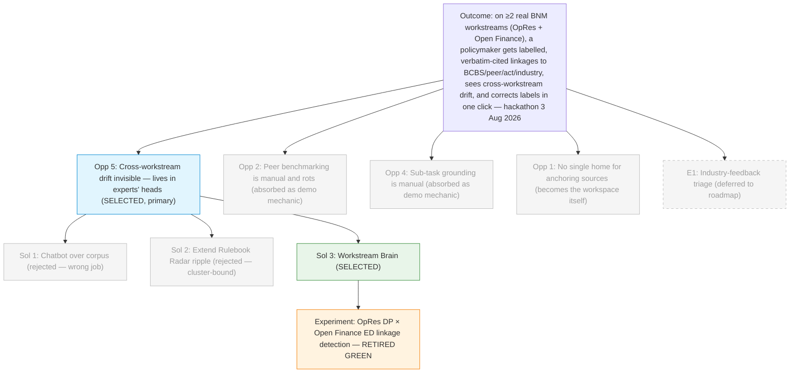

# Discovery Brief: Workstream Brain (COPA Hackathon 2026)

> A **new POC**, hackathon-scoped (3 Aug 2026), replacing the Rulebook Radar
> discovery focus. The unit of work is a **policy workstream** — one Discussion
> Paper / Exposure Draft / Policy Document under active drafting — and each
> workstream is anchored by its own knowledge graph. When zoomed out, all
> workstreams combine into an institution-wide map of BNM's live policy
> thinking.
>
> Judging weights (unchanged from prior discovery): **Problem Relevance &
> Impact (30)** > Technical Execution (20) > Innovation (15) > MVP Quality (15)
>
> > Feasibility & Scalability (10) > Presentation (10). Final judges include
> > the CIO, DG, AG, and Directors. Solutions must align with BP2026 Must-Wins.

## Desired Outcome

By the hackathon (3 Aug 2026), on **at least two real BNM workstreams running
in parallel** (proposed: **Operational Resilience** continuation + **Open
Finance** ED response), a BNM policymaker can:

1. Receive an initial set of **linkages** from each workstream to BCBS / peer
   regulator / Malaysian Act / industry input, labelled with a relationship
   type (**adopts / adapts / tightens / loosens / deviates / silent-on /
   extends**);
2. See **both sides of every linkage quoted verbatim from source** (no
   paraphrase, clause number attached to every quote);
3. See **cross-workstream linkages** where the two workstreams touch the same
   underlying concept — the demo climax;
4. **Correct any label in one click, or add any missed linkage**, with the
   tool re-running nearby linkages using that correction as a few-shot
   example in the finder/critic prompts — demonstrably improving the graph
   without any upfront training data.

The strategic frame is **institutional-continuity**: cross-workstream drift
that today lives only in an expert policymaker's head becomes explicit, cited,
and inspectable — so the map survives when the policymaker rotates, retires,
or is on leave. This supports **MW6 (coherent rulebook)**, **MW9 (resource
discipline)**, **MW10 (AI for supervision)**, and BNM's SET2027 credibility
narrative in AR2025's "Going Forward" section.

**Definitions kept honest:**

- **"Verbatim"** applies to _citations_, not to _equivalence_. BNM never
  copy-pastes from BCBS; the tool never claims equivalence between paraphrases.
  Every asserted linkage shows both sides quoted **exactly from their source
  documents**, with clause numbers; the _relationship_ between them is a
  labelled claim, judgeable by a human at a glance.
- **"Digital twin of expert judgement"** is a pitch analogy, not a technical
  claim. What the tool actually captures is one narrow slice: **the linkage
  judgements** experts make between clauses across documents. Not the whole
  brain — just the cross-doc mapping.

## Opportunity Map

| #     | Opportunity (user pain)                                                                                                                                                                                                                                                                                                                                                                                                              | Evidence                                                                                                                                                                    | Strength   | Size                                                       |
| ----- | ------------------------------------------------------------------------------------------------------------------------------------------------------------------------------------------------------------------------------------------------------------------------------------------------------------------------------------------------------------------------------------------------------------------------------------ | --------------------------------------------------------------------------------------------------------------------------------------------------------------------------- | ---------- | ---------------------------------------------------------- |
| **5** | **Cross-workstream drift is invisible today.** Nine concurrent workstreams (AR2025 Diagram 1) touch each other constantly. Today, senior policymakers carry these linkages in their heads; when a policymaker rotates out, retires, or is on leave, the institutional memory goes with them. New-staff pickup takes years of apprenticeship. Management feels this as a _strategic-continuity_ risk, not a Tuesday-morning nuisance. | User's direct read + AR2025's 9-workstream list; **retired by the OpRes×OpenFinance experiment (see below): 12 real cross-workstream linkages found in one document pair**. | **Strong** | All senior policy staff, on every workstream, permanently. |
| **2** | **Peer benchmarking is manual and rots.** Reading HKMA/MAS/PRA/APRA/OSFI docs and mapping their clauses to the workstream is a slog; when the peer updates their doc, the mapping quietly dies. This is the loudest short-term pain even for an experienced hand.                                                                                                                                                                    | AR2025 §"Building Resilience Through Local and Global Partnerships" (supervisory colleges, MoU with BoT); prior drafter-workstream stories B1/B3.                           | Moderate   | Every workstream that benchmarks internationally (most).   |
| **4** | **Sub-task grounding is manual.** When drafting a specific section (e.g. board-roles clause, cyber-controls clause), the drafter switches windows to remember which BCBS clauses and peer positions they were adapting from — the pairwise-compare-then-merge workflow.                                                                                                                                                              | User's own vision statement; extends existing ripple/impact work.                                                                                                           | Moderate   | Every drafter, every day, mid-workstream.                  |
| **1** | **No single home for anchoring sources.** Every workstream reinvents its own filing system — sources scatter across email, SharePoint folders, personal laptops. This is what the _workstream workspace_ itself fixes; the collaboration/task-assignment mechanics from earlier notes are a manifestation of this.                                                                                                                   | User's direct statement; matches the "living Word doc on SharePoint" pattern from prior discovery.                                                                          | Moderate   | Every workstream, every member.                            |
| ~~3~~ | ~~"Jira-for-policy" project management pain — absorbed into #1.~~ Task/roadmap mechanics are part of the workstream workspace, not a separate pain. Framing it as project management weakens Innovation; framing it as "tasks live on graph nodes/edges" preserves the differentiation.                                                                                                                                              | —                                                                                                                                                                           | —          | —                                                          |
| E1    | _(Deferred, not discarded)_ **Industry-feedback triage** during the DP → ED → PD lifecycle. Scoped out to avoid saturating the platform's core value proposition; kept in the roadmap as a "nice to have".                                                                                                                                                                                                                           | —                                                                                                                                                                           | —          | —                                                          |

## Selected Opportunity

**#5 — Cross-workstream drift is invisible today.**

Selection rationale:

- **Outcome alignment:** #5 _is_ the reason for the outcome — the whole
  "institutional memory becomes explicit" pitch hangs on this pain. #2 and #4
  are important but they are _how_ the tool proves its value, not what it is
  fundamentally for.
- **Evidence:** the OpRes × Open Finance experiment (see "Recommended
  Experiment", below) retired the riskiest assumption in an afternoon — 12
  real cross-workstream linkages were found by the engine, verbatim-cited,
  including a version-drift catch (Open Finance cites "RMiT issued 1 June
  2023" while OpRes cites "RMiT 28 November 2025") and a policy-gap catch
  (Open Finance §7 does not assign a single ultimately-accountable person
  cf. OpRes 6.3 Responsibility Mapping). These are the exact "surface what
  an expert would have caught but a new staff would miss" moments the
  digital-twin analogy points at.
- **Demo hero:** **the zoom-out reveal** (Grill #3 answer) — two concurrent
  workstreams, tool surfaces cross-workstream linkages neither team's members
  had personally noticed. Management sees the map. This is the moment the
  CIO/DG remembers when they close their laptop.
- **Novelty vs. Rulebook Radar:** the prior POC (Rulebook Radar) worked on a
  single, closed cluster of published policies and asked "does a _change_
  break other rules?". This POC works on **live in-progress workstreams**,
  each open to external anchors (BCBS/peer/act/industry), and asks "do these
  workstreams line up with each other and with the world _while being
  written_?" — a genuinely different job with a genuinely different UI.

**#2 and #4 are absorbed as demo-supporting mechanics inside the workstream
workspace**, not deferred. They earn their place by making #5 tangible: #2
gives the workstream its outward-facing anchors (BCBS/peer), #4 gives the
drafter the pairwise-compare moment inside a sub-task.

**Deferred (not discarded):** #1 becomes the workspace itself (background
plumbing); #3 (project-management framing) is absorbed and reframed;
E1 (industry-feedback triage) remains on the roadmap as future scope.

## Solution Candidates

| #     | Solution                                                                                                                                                                                                                                                                                                                                                                                                                                                                                                                                                                                                                                                                                                                                                                                     | Riskiest Assumption                                                                                                                                                                                                                                           | PRD |
| ----- | -------------------------------------------------------------------------------------------------------------------------------------------------------------------------------------------------------------------------------------------------------------------------------------------------------------------------------------------------------------------------------------------------------------------------------------------------------------------------------------------------------------------------------------------------------------------------------------------------------------------------------------------------------------------------------------------------------------------------------------------------------------------------------------------- | ------------------------------------------------------------------------------------------------------------------------------------------------------------------------------------------------------------------------------------------------------------- | --- |
| 1     | **Chatbot over a workstream corpus** — policymaker asks natural-language questions about their workstream + anchors, gets cited answers.                                                                                                                                                                                                                                                                                                                                                                                                                                                                                                                                                                                                                                                     | _Reject._ The chatbot answers "what does the rule say" — it can't answer "what breaks if I change this" or "which workstreams drift". Fails the outcome.                                                                                                      | —   |
| 2     | **Extend Rulebook Radar's ripple check** — treat each workstream as a cluster and reuse the existing engine as-is.                                                                                                                                                                                                                                                                                                                                                                                                                                                                                                                                                                                                                                                                           | _Reject._ Rulebook Radar's cluster is one policy area (technology-risk); its ripple works _within_ a cluster. Cross-workstream is a different job (different clusters), and the UI moment is a ripple report, not a workstream workspace.                     | —   |
| **3** | **Workstream Brain (SELECTED)** — a per-workstream workspace where (i) sources of six node types (internal DP/ED/PD, working drafts, industry standards, other-jurisdiction policy docs, acts/laws, international standards, peer regulators) are added by upload/URL/SharePoint; (ii) a task board lets members split work by graph subgraph and assign to humans or AI agents; (iii) the workstream's graph is the _primary object_, tasks attach to nodes/edges; (iv) a zoom-out view shows all workstreams and their cross-workstream linkages as an institution-wide map; (v) every linkage is labelled and verbatim-cited from both sides; (vi) users correct labels in one click, corrections are stored per workstream and injected as few-shot examples to sharpen nearby linkages. | The engine can **find real cross-workstream linkages between concurrent in-progress workstreams** (not just between published policies in one cluster), and can do so without curated seed edges. **RETIRED — 12 real linkages found; see experiment below.** | —   |

**Leading solution: #3, Workstream Brain.** Reuses the existing finder → critic → validator engine (from `engine/connections.py`) as the primitive; widens the corpus model to 6 node types and the linkage schema to add a `linkage_type` label; adds a correction store that feeds few-shot examples back into the prompts (the "learn as we go" loop); adds the workstream workspace + zoom-out view as new UI.

## Opportunity Solution Tree

## Recommended Experiment

**Ran 2026-07-11. Result: GREEN. Riskiest assumption retired.**

**What was tested:** the engine's ability to discover cross-workstream
linkages between two real, concurrent 2025 BNM workstreams — with **zero
curated seed edges** between them — using only the existing finder → critic
→ citation-validator loop.

**How:**

1. Added the Open Finance Exposure Draft (BNM/RH/ED 028-36, 18 Nov 2025) to
   `data/corpus/` alongside the existing OpRes Discussion Paper
   (`dp_operationalresilience_Dec2025.pdf`).
2. Registered `open-finance-v1-2025-ed` in `engine/config.py` under a
   _different cluster_ to the OpRes DP (no cluster-boundary logic in the
   engine — a valid cross-cluster probe).
3. Ran a subset build: `uv run python -m engine.build --docs
opres-v1-2025-draft open-finance-v1-2025-ed`.
4. Ran the live finder+critic:
   `uv run scripts/run_finder_trace.py opres-v1-2025-draft open-finance-v1-2025-ed`.
5. Trace persisted at
   `data/artifacts/connection-trace-opres-v1-2025-draft__open-finance-v1-2025-ed.json`.

**Result:** **12 supported, 0 unsupported.** Every one of the 12 linkages
carries verbatim clause quotes from both sides. Concrete highlights:

- **BCM continuity theme (linkage #1):** OF 7.6(b) _"develop and ensure
  effective implementation of business continuity plans…"_ ↔ OpRes 4.3
  _"In the context of preserving continuity of critical operations…"_ — with
  a scope note flagging that OF frames continuity around data-availability
  while OpRes frames it around critical-operation preservation.
- **Accountability gap (linkage #4):** OF 7.1 (general board oversight) ↔
  OpRes 6.3 (Responsibility Mapping), with the critic explicitly noting
  _"Open finance does not mandate a single ultimately-accountable person
  for operational resilience outcomes."_ The tool is **surfacing a real
  policy gap** between two in-flight workstreams — a demo-hero moment.
- **Version drift (linkage #5):** OF 6.1(h) cites _"Policy Document on Risk
  Management in Technology issued on 1 June 2023"_; OpRes footnote 6 cites
  the _28 November 2025_ reissuance. **Two policymakers writing in parallel
  and anchoring to different versions of the same document** — exactly the
  pain #5 was about, caught by the tool.
- **Systemic-risk analytical linkage (linkage #7):** OF 8.6 (mandated
  platform participation) ↔ OpRes 2.6/2.6(a) (shared-infrastructure
  concentration risk); the critic correctly labels this as _"analytical
  rather than textual"_ — no overclaim.

**Two mechanical defects surfaced and fixed inline** (recorded as Learnings
for the build):

1. **Segmenter blind spot on ED/DP standards prefixes.** BNM's ED/DP
   convention prefixes each clause with `S ` (Standard) or `G ` (Guidance).
   The `_NUMBERED_CLAUSE_RE` in `engine/clauses.py` did not accept the
   prefix, so 52 of the Open Finance ED's clauses were silently missed on
   the first run. Fixed by widening the regex to
   `^(?:[SG]\s+)?(\d+(?:\.\d+)+)(?:\s|$)`. Open Finance clause count went
   from 60 → 127.
2. **Sub-item citation truncation.** The LLM occasionally serialises
   `Operational Resilience 3.3(a)` as `Operational Resilience 3.3(a` — a
   missing closing paren. Added a narrow `_normalize_clause_number`
   pre-step in `engine/connections.py` that appends `)` only when there is
   an unbalanced `(`. No other rewriting.

**What "green" means for this brief:** it means the _thesis_ is validated —
cross-workstream linkages between two real concurrent BNM workstreams exist
in quantity, the engine finds them without seed edges, and the citations
survive verbatim validation. It does **not** yet prove that the same works
against BCBS / peer regulators / Acts / industry inputs (still BNM×BNM). That
extension is a Day-1 build task, not a discovery blocker.

## Architecture Assumptions (for `/prd`)

- **Reuse `engine/connections.py` as the linkage primitive.** The
  finder → critic → citation-validator loop already implements the
  verbatim-citation guardrail correctly; do not reimplement. Widen its
  `Connection` schema to carry a `linkage_type` field with the taxonomy
  (adopts / adapts / tightens / loosens / deviates / silent-on / extends)
  and update the finder/critic system prompts to require it. **Do not
  touch `_validate_candidates` / `_cite`** — those are the guardrail that
  makes the tool trustworthy.
- **Widen `ClauseIndex` to be multi-corpus / multi-source-type.** Today it
  treats every entry as a BNM clause with a `policy_id` prefix. For the
  new POC, add a `source_type` on each entry (internal / industry /
  peer-policy / peer-standard / act / international) and generalise
  clause-number formats (BCBS uses paragraph numbers; MAS uses letter
  codes; Acts use §; peer regulators use their own conventions).
  Add each new short-name to `POLICY_SHORT_NAMES`.
- **Correction store as the moat.** A per-workstream JSON store of
  `{clause_pair, corrected_label, correction_rationale}` records is
  injected as few-shot examples into the finder/critic system prompts.
  Scoped per-workstream by default (drafting judgement is not always
  transferable across policy areas); cross-workstream propagation is a
  governance question deferred to a later phase.
- **Six node types are locked.** `internal (DP/ED/PD/working-draft)`,
  `industry-standard`, `peer-policy-document`, `act-law`,
  `international-standard`, `peer-regulator`. One file = one node.
  Sources added by upload, URL fetch, or SharePoint link.
- **Task board attaches to graph, not the other way round.** Tasks are
  owned by nodes or subgraphs (e.g. "Aisyah owns the linkages between
  OpRes-DP-3.x and HKMA-SPM-OR-1"). The roadmap view is the workstream
  graph coloured by task status.
- **Zoom-out view is the demo climax.** Two concurrent workstreams
  minimum for MVP1. The reveal must show ≥1 cross-workstream linkage
  neither team's members had personally noticed — the OpRes × Open
  Finance experiment gives 12 to choose from.
- **AI proposes, human commits.** Working drafts are edited by humans;
  the tool proposes linkage labels and clause redrafts, never silently
  applies them. Same guardrail as the earlier POC.
- **Confidentiality-aware.** Every workstream + node carries an access
  tag; the zoom-out map shows the shape (which workstreams touch which)
  even when a user cannot open a particular node. The demo runs on
  public documents only.

## Recommendation

Proceed to **`/prd`** for Solution #3 (Workstream Brain), targeting
Opportunity #5 (cross-workstream drift). Scope the hackathon MVP1 to:

1. **Two concurrent workstreams** in the corpus: **Operational Resilience**
   (continuation of the 2025 DP) and **Open Finance** (response to the
   2025 ED). Both are real, public, and have the retired experiment as a
   linkage exhibit already.
2. **At least one external anchor per workstream** — a BCBS document
   (e.g. _Principles for Operational Resilience_, 2021) and one peer
   regulator (proposed: **MAS** Notice on Business Continuity or HKMA
   Supervisory Policy Manual) — to move beyond the BNM×BNM case the
   experiment validated. The finder+critic already handles arbitrary
   pairs; the widening work is on `ClauseIndex` schema, not the engine.
3. **The six-node-type workspace** with source-adding by upload / URL /
   SharePoint link.
4. **The correction feedback loop** — one-click relabel, correction store
   per workstream, nearby linkages re-run using the correction as a
   few-shot example.
5. **The zoom-out demo climax** — surface at least one non-obvious
   cross-workstream linkage the audience can inspect verbatim.

The Rulebook Radar epic (`docs/specs/rulebook-radar/`) is **not extended** —
this is a fresh POC with a different unit of work and a different user
moment. Rulebook Radar remains on file as prior discovery; some of its
engine code is reused (see Architecture Assumptions).

## Decision Log

- **Fresh POC, not an extension of Rulebook Radar.** Different unit (a
  workstream, not a policy cluster), different user moment (upstream
  scoping + mid-workstream research, not downstream review), different
  anchor set (BCBS / peer / act / industry — four external anchors, not
  just intra-BNM). User explicit: _"redo the poc because my use case is
  more focused than rulebook radar now."_
- **Hero user moment = kick-off / scoping, with mid-workstream research as
  a subset.** User explicit: _"I want 2 as a subset of 1, deliver both."_
  This is the unified user flow — a policymaker owns a workstream from
  kick-off through drafting; the tool travels with them.
- **Outcome anchored on groundedness + coverage, NOT speed.** User
  explicit: _"b+c"_ (both). Speed / MW10 wording was considered and
  deprioritised in favour of "every claim anchored" and "surface most of
  the material anchors". Speed is a downstream _benefit_ of groundedness,
  not the primary metric.
- **"Verbatim" = citation, not equivalence.** User pushback: _"BNM is
  never gonna copy paste from BCBS but they will refer and adapt to it
  with more specific outcome."_ The linkage taxonomy (adopts / adapts /
  tightens / loosens / deviates / silent-on / extends) carries the
  nuance; both sides are quoted verbatim from source; the _relationship_
  is the labelled claim.
- **No upfront labelled truth set; evaluation is in-product via
  corrections.** User explicit: _"the evaluation occurs as the tool is
  getting used, no labelling upfront."_ Pivots away from an offline F1
  score toward a live "trust curve" demo (correct a handful, watch the
  graph improve). Correction store is the moat — pitched as _"no chatbot
  has BNM's accumulated linkage judgements."_
- **Digital-twin framing is analogy, not a technical claim.** User
  explicit: _"a (the digital twin framing cant be taken literally, i
  merely used it as an analogy/marketing)."_ The technical claim is
  narrower: the tool captures the **linkage judgements** experts make, so
  those judgements survive the person.
- **Demo climax = zoom-out (option iii of Grill #2).** User explicit:
  _"iii."_ This locks: at least two concurrent workstreams in MVP1, real
  cross-workstream linkage detection (not mocked), a visually distinct
  zoom-out surface, and ≥1 non-obvious linkage in the demo corpus. All
  requirements are satisfied by the OpRes × Open Finance experiment
  retirement.
- **Task board reframed away from Jira analogy.** Same UI, different
  pitch. Tasks attach to graph nodes/edges (e.g. "own the linkages
  between OpRes-DP-3.x and HKMA-SPM-OR-1") rather than floating in a
  Kanban. Preserves Innovation score; avoids the _"isn't this just
  Jira?"_ dismissal.
- **Corpus decision: reuse `data/corpus/` rather than isolate the
  experiment.** The engine builds one clause index from
  `engine.config.DOCUMENTS`; a parallel folder would need parallel
  artifacts. The `--docs` subset flag on `python -m engine.build` gives
  the same isolation with less scaffolding. Confirmed by running the
  experiment successfully with this arrangement.

## Open Questions

- **Cluster of workstreams for the demo — which pair?** OpRes + Open
  Finance is the current recommendation because the experiment ran on
  exactly this pair. An alternative that would exercise the peer anchor
  more strongly is **OpRes + Fraud Response ED** (peer-heavy, MW3-adjacent
  for judge appeal). To confirm at `/prd` time.
- **Which peer regulator(s) for the hackathon corpus?** Proposed MAS
  (BCM notice) + HKMA (SPM). AR2025 lists supervisory-college engagement
  as a benchmarking channel; the MoU with Bank of Thailand is a candidate
  too but scoped to cyber only. Prior drafter-workstream stories named
  UK / Canada / Australia / Singapore / Indonesia / New Zealand as
  AI-usable jurisdictions; HK / EU / US were out of scope.
- **Correction store scope: per-workstream vs institution-wide.** MVP1
  should keep corrections scoped per-workstream (drafting judgement is
  not always transferable across policy areas). Whether corrections
  eventually propagate across workstreams is a governance decision that
  belongs in a later phase — flag in the PRD but do not build.
- **Confidentiality tiers for real-world use.** MVP1 runs entirely on
  public documents. Real-world deployment will need role-based access on
  every node (visible vs. openable) and audit trails on corrections.
  Flag as a "what's next" for the roadmap slide.
- **Recall measurement.** The experiment retired the precision half of
  the concern (no hallucinated citations, no overclaimed linkages).
  Recall — did the tool _miss_ linkages a human would have found? — is
  not measured here. Two options for the pitch: (a) hand-label 5–8
  clauses on one workstream during hackathon build and report recall
  against them; (b) skip the number and rely on the correction loop UX
  as the recall story ("if it missed something, add it in one click, the
  graph learns"). Recommend (b) — consistent with the "no upfront
  labelling" decision.

## References

- **Recorded evidence artifact:**
  `data/artifacts/connection-trace-opres-v1-2025-draft__open-finance-v1-2025-ed.json`
  — 12 supported cross-workstream linkages, verbatim quotes both sides,
  full finder + critic + validation trace.
- **AR2025 Chapter 1B, Promoting Financial Stability:**
  `/home/yenmaylee/Downloads/ar2025_en_ch1b.pdf` — the 9 workstreams
  delivered in 2025, self-declared BNM operating model of "align with
  global best practices while tailoring to Malaysia's unique
  environment", explicit BCBS + peer + Act + industry anchor set.
- **Prior discovery (Rulebook Radar):**
  `docs/discovery/policy-consistency-ai/brief.md` — retained for context;
  not superseded by this brief (different unit of work, different user
  moment).
- **Prior drafter-workstream stories:**
  `docs/specs/policy-workstream/drafter-workstream-stories.md` — Section
  A (enhancement-vs-new, principle-vs-technical), Section B (BCBS delta
  watch, verbatim/_bulat-bulat_ diff, jurisdictional scan, deviation
  register) — inform this brief's linkage taxonomy and external-anchor
  requirements but are not directly used as scope.
- **Reused engine code:** `engine/connections.py` (finder → critic →
  validator loop), `engine/clauses.py` (segmenter, now widened for
  S/G-prefixed clauses), `engine/config.py` (document manifest).
