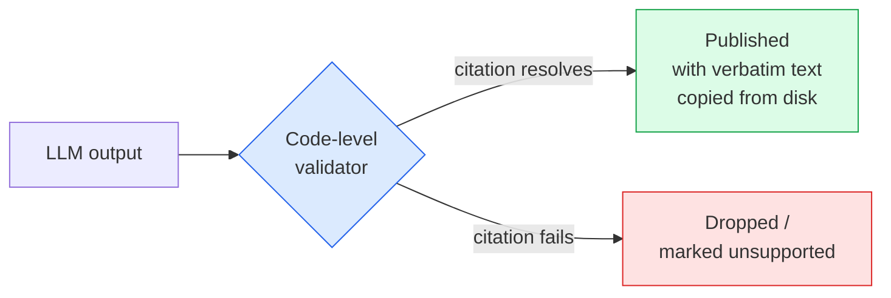
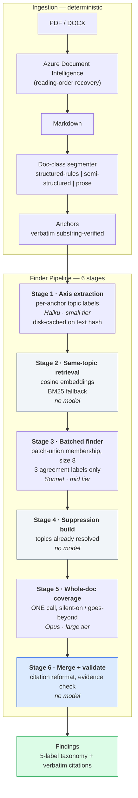
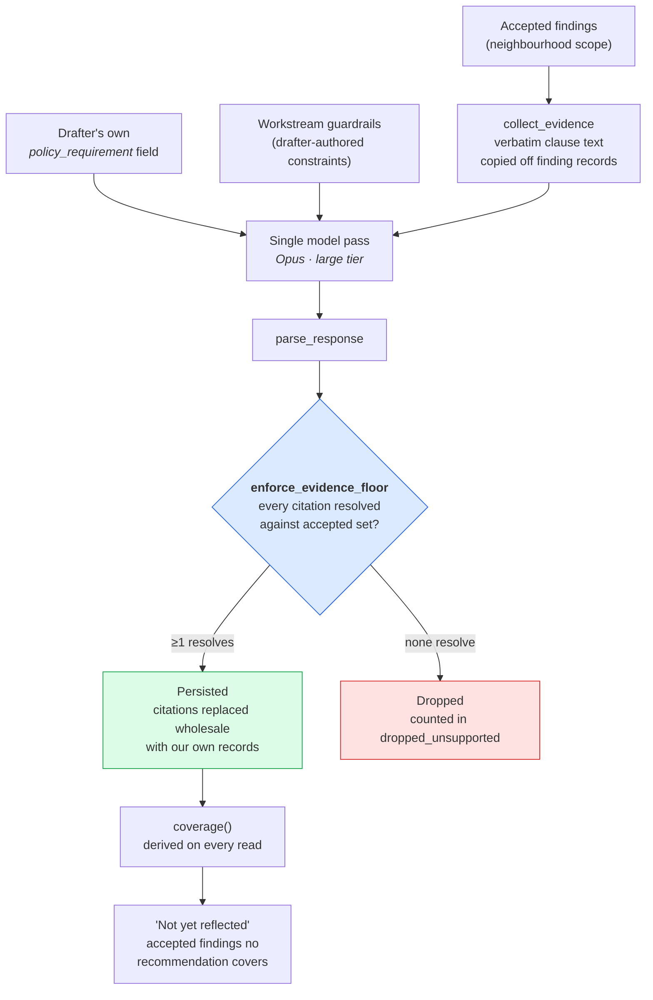
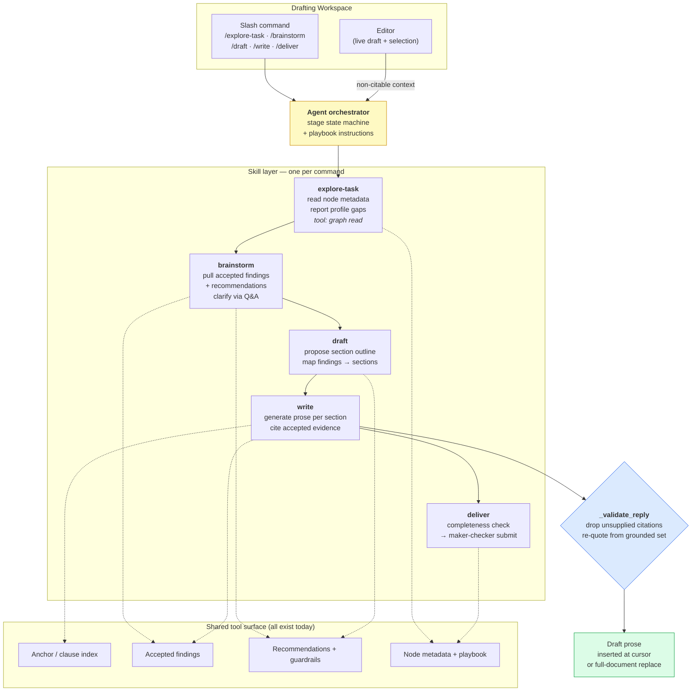

# Project SELARAS — Backend Technical Innovation

> Three engines, one guarantee. Every claim SELARAS makes is traceable to a
> verbatim clause, enforced in **code** rather than requested in a prompt.

---

## The Cross-Cutting Innovation: Structural Citation Integrity

Before the three engines, the property that makes them credible in a regulatory
setting. Most RAG systems ask the model politely not to hallucinate. SELARAS
makes hallucination **structurally impossible to publish**, at three independent
layers:

| Layer              | Mechanism                                                                                                          | Where                                    |
| ------------------ | ------------------------------------------------------------------------------------------------------------------ | ---------------------------------------- |
| **Extraction**     | Every passage is verified to be a literal substring of the source markdown — no paraphrase, no LLM-quoted text     | `anchors.verify_substring`               |
| **Finding**        | Every cited anchor id is resolved against the index; any unresolved citation demotes the finding to `unsupported`  | `finder_pipeline` Stage 6                |
| **Recommendation** | Every citation is resolved against accepted findings; clause text is copied from disk, never from the model's echo | `recommendations.enforce_evidence_floor` |

**Why it matters:** a model that invents a clause number gets its output
_dropped_, not published. This is the difference between a demo and a tool a
regulator can defend in front of an audit committee.

---

## 1. Extraction → Finder Pipeline

**The problem:** comparing two 80-page policy documents clause-by-clause is
O(n×m). Naive pairwise comparison of ~400 passages per document is 160,000 model
calls — impossible on cost and latency. Sending both whole documents in one call
loses the clause-level precision that citation demands.

**The innovation:** a six-stage pipeline that splits the problem into two
complementary passes — _targeted_ same-topic comparison and _global_ coverage
detection — with three model tiers matched to the reasoning difficulty of each
stage.

### What is genuinely novel

- **Two-pass design solves a recall problem single-pass RAG cannot.** Retrieval
  finds clauses that _are_ about the same topic. But the highest-value regulatory
  finding is the **absence** of a clause — "HKMA governs this, we are silent."
  A retrieval-only system can never surface that, because there is nothing on our
  side to retrieve. Stage 5 reads whole documents specifically to catch
  `silent-on` / `goes-beyond`, with Stage 4 suppressing topics Stage 3 already
  resolved so the expensive pass isn't re-litigating settled ground.
- **Three model tiers, matched to task difficulty.** Topic-phrase extraction is
  not reasoning — it runs on the small tier. Per-pair semantic judgment runs
  mid-tier. Only whole-document coverage inference — the hardest call, requiring
  the model to hold both documents at once — reaches the large tier. Cost scales
  with difficulty, not uniformly.
- **No critic loop.** The earlier finder→critic architecture was retired after
  ablation experiments showed the finder-only design matched it. Half the model
  calls, same output quality — a result, not an assumption.
- **Deterministic citation repair.** When a model returns `RMiT 2.2(b):` with
  trailing punctuation, Stage 6 recovers it (strip punctuation, restore document
  prefix) and logs the rewrite. But **no fuzzy or semantic matching** — an id that
  only partially resembles a real anchor is demoted to `unsupported`. Repair
  never becomes guessing.
- **Doc-class-aware segmentation.** BNM policy documents, BIS papers, and MAS
  playbooks are structured completely differently. Three registered segmenter
  strategies handle each; the drafter chooses, the tool never guesses (a wrong
  guess yields unusable passages).

---

## 2. Recommendations Engine

**The problem:** triage leaves the drafter holding thirty accepted comparisons —
"our clause 8.4 is silent where HKMA's 4.2 is not" — and no answer to _what the
policy document should actually say_. This is the step most policy-AI tools stop
short of.

### What is genuinely novel

- **The evidence floor is enforced after generation, not requested during it.**
  Every citation is resolved against the accepted-findings set. A recommendation
  whose citations _all_ fail to resolve is dropped **before anything is
  persisted**. Surviving citations are then replaced wholesale by records built
  from the findings themselves — so clause number and clause text are ours,
  copied from disk, never the model's paraphrase.
- **Dimensions come from the drafter, never the tool.** The generation axes are
  read from the working draft's own `policy_requirement` field, which the drafter
  maintains. No requirements recorded → generation refuses and says why. A
  recommendation is always framed in vocabulary the drafter authored, and
  therefore trusts.
- **Guardrails are constraints inside one pass, not a second scoring stage.**
  Deliberately unlike the finder pipeline. This is also why **no relevance score
  reaches the interface**: there is no independent judgement to report, and a
  self-assigned score would invite trust it has not earned.
- **Coverage is derived on every read, never stored.** `not_yet_reflected` — the
  accepted findings no recommendation has drawn on — is recomputed per request,
  because a persisted figure would silently drift as findings are accepted after
  generation.
- **Rewrite preserves the audit chain.** Rewriting one recommendation from the
  drafter's comments keeps its id, bookmark, dimensions and comments, and appends
  the superseded text to `revisions`. The evidence floor applies to the rewrite
  too — a rewrite may never launder a card past the citation rule.

---

## 3. Drafting Copilot — Current State and the Agentic Target

**Honest current state.** Two of three layers already exist and are tested:

| Layer                                                          | Status                                                                                                                     |
| -------------------------------------------------------------- | -------------------------------------------------------------------------------------------------------------------------- |
| **Live model backend** (`engine/copilot.py`)                   | ✅ Built — real `call_chat`, streaming SSE, prompt + code citation guardrail (`_validate_reply`), playbook-stage injection |
| **API surface + typed client**                                 | ✅ Built — `POST .../copilot`, `POST .../copilot/stream`, `sendCopilotMessage` / `streamCopilotMessage`                    |
| **Slash-command orchestration** (`/explore-task` → `/deliver`) | ⚠️ Scripted in the UI, grounded in verbatim fixture clauses — **not yet wired to the live backend**                        |

The gap is **not** "build a copilot." It is: connect the built backend to the UI,
and add the agentic orchestration layer the five commands imply.

### Target architecture: five commands as five agent skills

### What the real implementation requires

- **A stage state machine, not five independent prompts.** `/write` is only
  meaningful after `/draft` has produced an outline; `/deliver` only after prose
  exists. The orchestrator must gate commands on prior-stage output and carry
  accumulated state (chosen focus, approved outline, drafted sections) forward.
- **Tool-calling over the existing read surface.** Every tool the skills need is
  already an API route — graph reads, accepted findings, recommendations,
  guardrails, node metadata, playbook sections. The skills become tool-callers
  over routes that exist and are tested, rather than new infrastructure.
- **Per-stage prompt injection is already built.** `playbook.section_for_stage`
  already resolves the drafter's own instructions for the active stage and injects
  them into the system prompt. The playbook UI writes them; the backend reads
  them. Only the command→stage dispatch is missing.
- **The citation guardrail already covers the hardest case.** `/write` produces
  the output most likely to hallucinate a clause. `_validate_reply` already drops
  any citation not present in the grounding context and re-quotes text from the
  grounded set — so the riskiest skill is the one already protected.
- **Streaming is already solved.** The `<<<META>>>` sentinel splits Markdown prose
  from trailing JSON metadata, so prose streams as tokens while citations and
  draft snippets are parsed after the stream exhausts. No re-engineering needed
  for a token-streaming agent UI.

---

## Why these three, in one line each

| Engine                     | The hard problem it solves                                              | Why it's defensible                                                              |
| -------------------------- | ----------------------------------------------------------------------- | -------------------------------------------------------------------------------- |
| **Finder pipeline**        | Finding what a document _doesn't_ say — invisible to retrieval-only RAG | Two-pass + 3 model tiers, validated by ablation, not assumed                     |
| **Recommendations engine** | Turning triage output into drafted policy language                      | Evidence floor drops uncited output before persistence                           |
| **Drafting copilot**       | Multi-stage authoring where each step depends on the last               | Live backend + guardrail built; orchestration is composition, not new capability |
