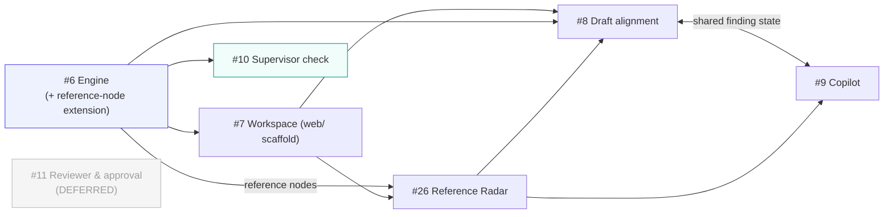
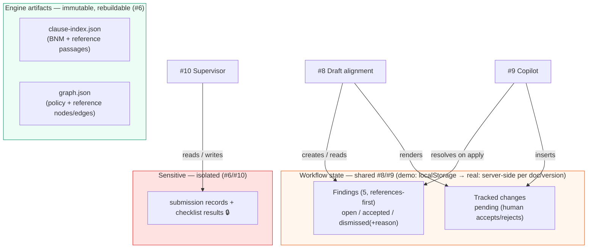
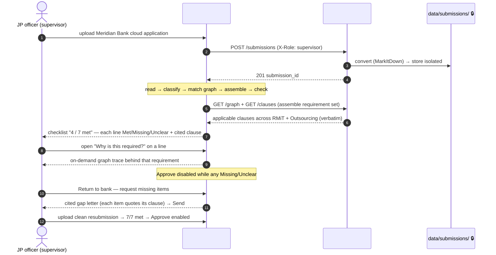

# Rulebook Radar — System Architecture

Cross-story architecture for the whole product. It stitches together the stories in
[`spec.md`](spec.md) around one shared knowledge graph, and shows how two personas
(drafter and supervisor) operate on it.

> **Grounding note (updated for the 9 Jul 2026 pivot + technical refinement).** The
> engine (#6) is a built, refined FastAPI read service — its components, artifacts,
> and API are exact (see [`spec-knowledge-graph-engine.md`](spec-knowledge-graph-engine.md)).
> The four **drafter** stories (#7 workspace, #26 Reference Radar, #8 Draft alignment,
> #9 copilot) are now technically refined too (each has a "Technical Refinement"
> section binding to the real engine API + a React/TypeScript SPA). #10 supervisor is
> business-level and unchanged. **#11 reviewer & approval is deferred** to a future
> phase — MVP1 is single-draft, and approval is folded into #8. The drafter side leads
> with the **Reference Radar** (external references, cited verbatim); internal
> Conflict/Duplication/Gap consistency is the secondary layer and the supervisor-
> checklist engine. Decisions are captured in [`../../adr/`](../../adr/) (ADRs 0001–0005).

## Layered system context

Everything reads from the engine. The engine owns the derived data (clause index +
graph, now including **external-reference nodes**); the consuming experiences are a
React/TypeScript SPA (drafter) and the supervisor app, split across two personas but
sharing one graph.

```mermaid
flowchart TB
    subgraph PEOPLE["👤 Personas"]
        DRAFT["Aisyah R. — drafter (RMiT v2, the one editable draft)"]
        MGR["Approving manager"]
        SUP["JP officer — supervisor"]
    end

    subgraph DRAFTER_APP["✍️ Drafter SPA (React/TypeScript · web/)"]
        WS["#7 Single-draft workspace<br/>(React Flow graph, references, provenance)"]
        RAD["#26 Reference Radar<br/>(per-clause verbatim external excerpts)"]
        ALN["#8 Draft alignment<br/>(references-first findings + submit for approval)"]
        COP["#9 Drafting copilot<br/>(5 modes · mock tracked-change write-back)"]
    end

    subgraph SUP_APP["🏦 Supervisor experience"]
        SUPCHK["#10 Submission completeness check<br/>(upload → cited checklist → decide)"]
    end

    subgraph ENGINE["🛰️ #6 Knowledge-graph engine (foundation)"]
        API["Read API (FastAPI)"]
        CI["clause-index.json<br/>(verbatim clauses — BNM + reference passages)"]
        GJ["graph.json<br/>(policy + reference nodes · edges · reasons · status)"]
        SUBSTORE["data/submissions/ 🔒<br/>(git-ignored, isolated)"]
        API --- CI
        API --- GJ
        API --- SUBSTORE
    end

    subgraph STATE["🗒️ Drafter workflow state (localStorage · demo)"]
        FIND["Findings<br/>open / accepted / dismissed(+reason)"]
        TC["Tracked changes<br/>(pending — human commits)"]
    end

    subgraph EXT["🌐 External / demo stand-ins"]
        PDFS["Public BNM policy PDFs (bnm.gov.my)"]
        REFS["Public reference PDFs<br/>(MAS TRM · PDPA · Basel POR)"]
        SP["Living Word doc (SharePoint via MS Graph — demo: mock viewer)"]
        UPLOAD["Bank submission upload (sample data)"]
    end

    DRAFT --> WS & RAD & ALN & COP
    MGR --> ALN
    SUP --> SUPCHK

    WS --> API
    RAD --> API
    ALN --> API
    COP --> API
    ALN <--> FIND
    COP <--> FIND
    COP --> TC
    COP -->|tracked-change write-back| SP
    SUPCHK --> API
    SUPCHK -->|upload| SUBSTORE

    PDFS -->|build pipeline| CI & GJ
    REFS -->|build pipeline (reference nodes)| CI & GJ
    UPLOAD --> SUPCHK

    style ENGINE fill:#eef2ff,stroke:#4f46e5
    style SUBSTORE fill:#fee2e2,stroke:#dc2626
    style SUP_APP fill:#f0fdfa,stroke:#0d9488
    style DRAFTER_APP fill:#fefce8,stroke:#ca8a04
    style STATE fill:#fff7ed,stroke:#ea580c
```

## Story dependency graph

Build order from the epic. Everything gates on the engine; the supervisor path runs
parallel to the drafter path once the engine exists. The workspace (#7) scaffolds the
shared `web/` SPA that #26/#8/#9 build on; #8 and #9 share one finding state.



## Shared state — who owns what

The engine owns the derived, read-only corpus data (now including reference nodes). A
small amount of **mutable workflow state** (finding resolution, tracked changes) is
shared between #8 and #9 and is _not_ part of the engine's immutable artifacts. For
MVP1 it lives in the browser (`localStorage`, cross-tab sync via the `storage` event);
production moves it server-side per document/version (ADR 0001).



> **Key design point:** finding state is keyed per draft (`rr.findings.rmit-v2-2026-draft`)
> and **#8 is its single owner** — #9 reads and updates the same key, so the open/resolved
> counts on both pages cannot diverge. The engine's immutable artifacts are deliberately
> separate so a corpus rebuild never touches in-flight workflow state.

## Drafter SPA architecture (React/TypeScript · `web/`)

The drafter experience is a Vite + React 18 + TypeScript + Tailwind single-page app that
reads the engine's HTTP API. #7 scaffolds it; #26/#8/#9 add screens/components (ADR 0002).

- **`web/src/lib/engineApi.ts`** — typed client for `GET /graph`, `GET /nodes/{id}`,
  `GET /clauses/{n}`, `POST /connections/find`. Base URL from `VITE_ENGINE_BASE_URL`.
- **`web/src/types.ts`** — shared types: `GraphNode` (with reference `kind`/`source_type`/
  `access`/`preview`), `GraphEdge`, `Clause`, `Connection`, and client view-models
  `Finding`, `ReferenceItem`, `TrackedChange`.
- **`web/src/lib/workflowState.ts`** — the localStorage store (findings + tracked changes)
  with cross-tab sync; the single seam production swaps for a server store.
- **Screens** — `/` workspace (#7, React Flow), the Reference Radar panel (#26, opened for
  a selected clause), `/alignment` (#8), `/copilot` (#9). `DraftDocViewer.tsx` renders the
  mock living Word doc and its pending tracked changes.
- **Fixtures (demo stand-ins)** — `copilot-responses.json` (curated copilot prose, clauses
  fetched live — ADR 0004), `trend-allowlist.json` (grounded-search preview), mock
  provenance for the "Why this changed" trail (provenance is not in the engine graph).
- **Tests** — Vitest + React Testing Library (components); Playwright E2E under
  `web/tests/e2e/` (scaffolded by #7; each user-facing Key Scenario maps to a spec file).

## Engine reference-node extension (#6, reopened by the pivot — build once, shared by #26/#8)

External references are modelled as **new node types on the same graph** — no separate
store. Backward compatible: existing policy nodes default `kind:"policy"`.

- **Reference documents** added to `engine/config.py` `DOCUMENTS`: `mas-trm-2021`
  (`source_type:"peer_regulator"`), `pdpa-2010` (`source_type:"act"`), `basel-por-2021`
  (`source_type:"standard"`), all `kind:"reference"`, `access:"public"`, `preview:false`.
  Ingested via the same MarkItDown pipeline; their passages become clauses `MAS TRM Cloud`,
  `PDPA 129`, `Basel POR TP-1`.
- **`GraphNode`** gains `kind`, `source_type`, `access` (`public`|`restricted`), `preview`.
  The regulatory **handbook** is a `access:"restricted"` node with **no ingested passages**;
  a build-validator carve-out exempts restricted/preview edge targets from the "clause
  resolves" check, so **no confidential text is ever ingested** — the radar renders a locked
  placeholder. Trend nodes are `preview:true`, curated, labelled preview.
- **Reference↔clause edges** anchor the drafted clause to a reference passage
  (`source: rmit-v2-2026-draft`, `target: <reference node>`, `source_clauses:["RMiT 17.1"]`,
  `target_clauses:["PDPA 129"]`). Public reference edges are `provenance:"llm-found"` (a
  frozen finder pass) so they carry sub-1.0 confidence (0.88 / 0.81 / 0.90) — the source of
  the reference-tier findings' confidence in #8; handbook/trend placeholders are `curated, 1.0`.
- **Read path (MVP1) = client-side** (ADR 0003): the Radar filters `GET /graph` edges by
  clause + `target.kind=="reference"`, then `GET /clauses/{n}` per public passage. A
  convenience endpoint `GET /clauses/{n}/references` is the documented future alternative,
  not built for MVP1.

## End-to-end sequence — the drafter loop (#7 → #26 → #8 → #9 → submit)

The full "workspace → references → align → fix → submit for approval" loop, all reading
clauses from the engine and all obeying the verbatim-citation guardrail. No reviewer in MVP1.

```mermaid
sequenceDiagram
    autonumber
    actor A as Aisyah (drafter)
    participant WS as #7 Workspace
    participant RAD as #26 Reference Radar
    participant ALN as #8 Draft alignment
    participant ENG as #6 Engine API
    participant COP as #9 Copilot
    participant SP as Living doc (mock)
    actor M as Manager

    A->>WS: open workspace
    WS->>ENG: GET /graph
    ENG-->>WS: policy + reference nodes, edges, status
    A->>RAD: open Reference Radar on RMiT 17.1
    RAD->>ENG: filter reference edges + GET /clauses (MAS TRM Cloud, PDPA 129, Basel POR TP-1)
    ENG-->>RAD: verbatim external passages + "why it matters"
    A->>ALN: save RMiT 17.1 change → check alignment
    ALN->>ENG: POST /connections/find (rmit-v2 × each reference & internal doc; self-pair for 17.1↔17.2)
    ENG-->>ALN: clause-anchored connections (verbatim) + unsupported[]
    Note over ALN: #8 classifies client-side → 5 findings<br/>reference gaps → supports → internal (C/D/G)
    ALN-->>A: references-first findings, each cited (+confidence from graph edge)
    A->>COP: open copilot on the PDPA reference gap
    COP->>ENG: GET /clauses (RMiT 17.1, 10.50, Outsourcing 12.1, PDPA 129)
    ENG-->>COP: verbatim clause/passage text
    COP-->>A: proposed redraft (curated prose, clauses fetched live)
    A->>COP: apply redraft
    COP->>SP: insert mock tracked change (pending — localStorage)
    COP->>ALN: mark matching finding resolved (shared state)
    A->>ALN: dismiss a finding with recorded reason
    Note over ALN: all findings resolved → submit unlocked
    A->>ALN: submit draft for manager approval
    ALN-->>M: notify (approving manager only — no reviewer)
```

## End-to-end sequence — the supervisor loop (#10 on the same graph — unchanged)

Runs parallel to the drafter path. The graph is the _engine, not the interface_: the
officer sees a checklist, and the graph only surfaces on demand ("why is this required?").
Submission text stays in the isolated store throughout.



## Cross-cutting concerns

These rules hold across **every** story — they are the product's spine, not per-story choices:

- **Verbatim-citation guardrail (hard rule).** Every reference (#26), finding (#8), copilot
  answer (#9), and checklist line (#10) quotes the exact clause/passage it relies on, with its
  number, or states "No matching clause found". Enforced at the data layer by the engine's
  citation validator (#6): a claim whose cited clause does not resolve in `clause-index.json`
  is reported unsupported (`unsupported[]`), never invented — extended unchanged to reference
  passages. (Note: `Operational Resilience 6.11` is a **phantom** clause; the real register/
  continuity anchor is `RMiT 10.50 ↔ Operational Resilience 1.1`.)
- **AI proposes, human commits.** No story lets the AI finalise policy text or make an
  approve/return decision. The copilot inserts tracked changes for a human to accept (#9);
  the manager approves (#8); the supervisor decides (#10).
- **Single editable draft (MVP1).** Exactly one in-progress editable draft (`rmit-v2-2026-draft`);
  every other BNM policy is published (in force/superseded) read-only context. No reviewer role
  and no second editable draft — the deferred #11 reviewer/multi-draft workflow is a future phase.
- **Node status is derived, not invented (#6).** "In progress" iff a live draft exists;
  "In force"/"Superseded" from the corpus. #7 displays it; nobody sets it by hand.
- **References-first for the drafter.** #26/#8 lead with external references; internal
  Conflict/Duplication/Gap is the secondary layer and the #10 supervisor-checklist engine.
- **Public vs. sensitive data (#6, #10).** The drafter path is entirely public documents (BNM
  policies + public references). Bank submissions are sensitive supervised-entity data, held in
  the git-ignored, access-restricted store, never mixed into the public artifacts. The regulatory
  handbook is confidential — a locked placeholder, no content ingested.
- **Single cluster (MVP1).** All stories operate on one technology-risk cluster; cross-cluster
  reach is a single labelled preview node (#7), not built.

## Tech stack

### Engine (#6) — built

- **Python 3.11+** (uv), **FastAPI** + **uvicorn** read API, **MarkItDown** ingestion,
  **azure-ai-inference** (build-time model: clause parser + finder/critic), **pytest**.
- **Storage — no database.** Flat JSON artifacts (`clause-index.json`, `graph.json`,
  `connection-trace-*.json`); in-memory graph. Reference-node extension adds reference docs
  - node fields; no new storage engine.
- Models — Azure AI Foundry, build-time only; the served read API needs no model access. The
  one live model moment is #8's `POST /connections/find`.

### Drafter frontend (#7/#26/#8/#9) — to build

- **React 18 + TypeScript + Vite + Tailwind** SPA in `web/`; **react-router-dom**;
  **React Flow** (`reactflow`) for the workspace graph (ADR 0002).
- **Workflow state** in `localStorage` for the demo, server-side per doc/version for
  production (ADR 0001). Copilot prose from curated fixtures with live clause fetch (ADR 0004);
  write-back is a mock tracked change (ADR 0005).
- **Tests** — Vitest + React Testing Library; **Playwright** E2E (`web/tests/e2e/`).

## Architecture Decision Records

- [ADR 0001](../../adr/0001-workflow-state-localstorage-demo.md) — workflow state: localStorage (demo) → server-side (prod)
- [ADR 0002](../../adr/0002-graph-viz-react-flow.md) — workspace graph rendering: React Flow
- [ADR 0003](../../adr/0003-reference-radar-read-path.md) — Reference Radar read: client-side graph filtering
- [ADR 0004](../../adr/0004-copilot-generation-curated-demo.md) — copilot generation: curated demo-safe fixtures
- [ADR 0005](../../adr/0005-writeback-mock-tracked-change.md) — copilot write-back: mock tracked change

## Where the detail lives

- **Engine components, pipeline, data model, API, guardrail, submission sequence:**
  [`spec-knowledge-graph-engine.md`](spec-knowledge-graph-engine.md).
- **Per-story behaviour, acceptance criteria, and Technical Refinement:** each `spec-*.md`
  in this directory (`spec-drafter-workspace.md` #7, `spec-reference-radar.md` #26,
  `spec-ripple-impact-report.md` #8, `spec-drafting-copilot.md` #9, `spec-supervisor-check.md` #10).
- **Validated assumptions and stack rationale (MarkItDown, blind LLM test, the pivot):**
  [`../../discovery/policy-consistency-ai/brief.md`](../../discovery/policy-consistency-ai/brief.md).
