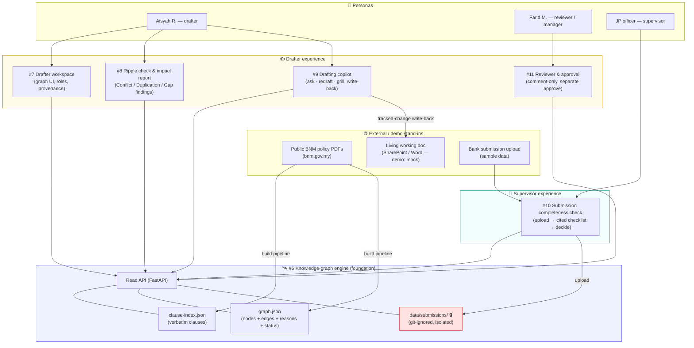
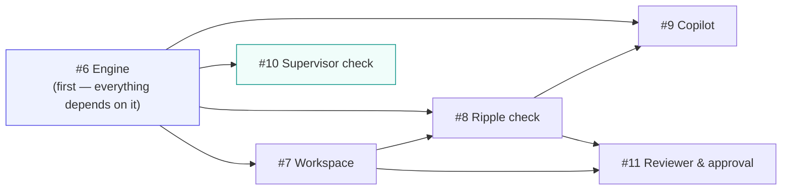
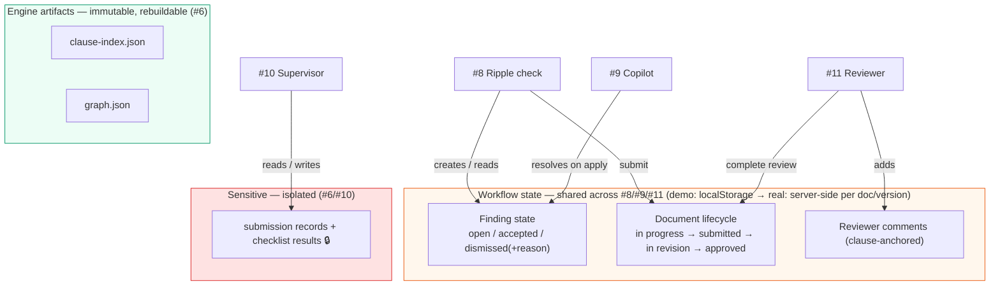
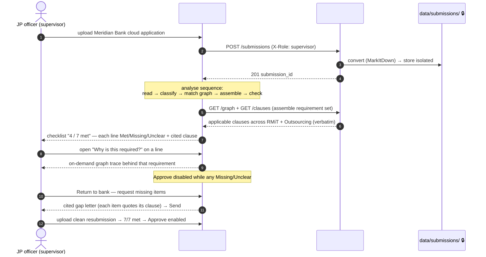

# Rulebook Radar — System Architecture

Cross-story architecture for the whole product. It stitches together the six
stories in [`spec.md`](spec.md) around one shared knowledge graph, and shows how
two personas (drafter and supervisor) operate on it.

> **Grounding note.** The engine layer (#6) is the only story with a refined
> technical spec — its components, artifacts, and API are exact and drawn from
> [`spec-knowledge-graph-engine.md`](spec-knowledge-graph-engine.md). The
> consuming stories (#7–#11) are still business-level specs; their internal
> components below are the intended shape and will firm up when each is refined.
> Story boundaries, dependencies, and the shared rules are authoritative today.

## Layered system context

Everything reads from the engine. The engine owns the derived data (clause index

- graph); the five consuming stories are experiences layered on top, split across
  the two personas but sharing one graph.



## Story dependency graph

Build order from the epic. Everything gates on the engine; the supervisor path
runs parallel to the drafter path once the engine exists.



## Shared state — who owns what

The engine owns the derived, read-only corpus data. A small amount of **mutable
workflow state** (finding resolution, document lifecycle, comments) is shared
between the drafter-side stories and is _not_ part of the engine's immutable
artifacts.



> **Key design point (from the discovery brief):** the POC syncs finding state
> via browser `localStorage` — fine for a single-machine demo. The real build
> needs server-side workflow state keyed per document/version. This layer is
> deliberately separate from the engine's immutable artifacts so a corpus rebuild
> never touches in-flight workflow state.

## End-to-end sequence — the drafter loop (#7 → #8 → #9 → #11)

The full "change → findings → fix → submit → review" loop across four stories,
all reading clauses from the engine and all obeying the verbatim-citation
guardrail.

```mermaid
sequenceDiagram
    autonumber
    actor A as Aisyah (drafter)
    participant WS as #7 Workspace
    participant RIP as #8 Ripple check
    participant ENG as #6 Engine API
    participant COP as #9 Copilot
    participant SP as Living doc (SharePoint)
    participant REVW as #11 Reviewer & approval
    actor F as Farid (reviewer)
    actor M as Manager

    A->>WS: open workspace
    WS->>ENG: GET /graph
    ENG-->>WS: nodes + edges + reasons + status
    A->>WS: revise RMiT clause 17 (notify-after)
    WS->>RIP: analyse ripple
    RIP->>ENG: POST /connections/find + GET /clauses
    ENG-->>RIP: clause-anchored connections (verbatim)
    RIP-->>A: Conflict + Duplication + Gap (each cited, +confidence)
    A->>COP: open copilot on the Conflict
    COP->>ENG: GET /clauses (Outsourcing 12.1, RMiT 17.1, 10.50)
    ENG-->>COP: verbatim clause text
    COP-->>A: proposed redraft, grounded on cited clauses
    A->>COP: apply redraft
    COP->>SP: write tracked change (strike old / insert new)
    COP-->>RIP: mark matching finding resolved
    A->>RIP: dismiss Gap with recorded reason
    Note over RIP: all findings resolved → submit unlocked
    A->>RIP: submit draft to reviewer / manager
    RIP-->>F: notify (assigned reviewer)
    RIP-->>M: notify (approving manager)
    F->>REVW: open draft (read-only), comment on clause 17.1
    Note over REVW: reviewer cannot edit text; approve disabled
    F->>REVW: complete review → routes back, doc "in revision"
    M->>REVW: approve (separate action; cannot approve own draft)
```

_`REVW` = #11 Reviewer & approval workflow._

## End-to-end sequence — the supervisor loop (#10 on the same graph)

Runs parallel to the drafter path. The graph is the _engine, not the interface_:
the officer sees a checklist, and the graph only surfaces on demand ("why is this
required?"). Submission text stays in the isolated store throughout.



## Cross-cutting concerns

These rules hold across **every** story — they are the product's spine, not
per-story choices:

- **Verbatim-citation guardrail (hard rule).** Every finding (#8), copilot answer
  (#9), checklist line (#10), and reviewer comment (#11) quotes the exact clause
  it relies on, with its number, or states "No matching clause found." Enforced at
  the data layer by the engine's `citation_validator` (#6): a claim whose cited
  clause does not resolve in `clause-index.json` is reported unsupported, never
  invented.
- **AI proposes, human commits.** No story lets the AI finalise policy text or make
  an approve/return decision. The copilot inserts tracked changes for a human to
  accept (#9); the supervisor and manager make every decision (#10, #11).
- **Node status is derived, not invented (#6).** "In progress" iff a live draft
  exists (`draft_registry.json`); "In force"/"Superseded" from the corpus. #7
  displays it; nobody sets it by hand.
- **Role-based access per document (#7, #11).** Edit (assigned drafter), comment
  (assigned reviewer), read-only (locked/in-force/superseded); approval is a
  separate manager action with separation of duties.
- **Public vs. sensitive data (#6, #10).** The drafter path is entirely public
  policy documents. Bank submissions are sensitive supervised-entity data, held in
  the git-ignored, access-restricted store, never mixed into the public artifacts
  or any tracked path.
- **Single cluster (MVP1).** All stories operate on one technology-risk cluster;
  cross-cluster reach is a single labelled preview node (#7), not built.

## Tech stack (engine, #6)

The engine (#6) is the only story with a fixed technical stack today. Consuming
stories (#7–#11) add a UI layer TBD when refined. **Not yet installed** — `/build`
creates the `engine/` package; the stack below is the target.

**Language & tooling**

- **Python 3.11+**, dependency-managed with **uv** (`pyproject.toml` + `uv.lock`).

**Core libraries**

| Library                    | Role                                                                               |
| -------------------------- | ---------------------------------------------------------------------------------- |
| **MarkItDown** (Microsoft) | PDF/DOCX → clean markdown (validated ingestion; naive extraction garbles BNM PDFs) |
| **azure-ai-inference**     | Azure AI Foundry SDK — calls Claude for clause parsing + finder/critic             |
| **FastAPI** + **uvicorn**  | Read API over the built artifacts                                                  |
| **pytest**                 | Test suite (model stubbed; no credentials in CI)                                   |

**Models — Azure AI Foundry** (`aih-semantic-kernel-swc`, swedencentral; Anthropic format, build-time only)

| Stage             | Deployment        | Model           |
| ----------------- | ----------------- | --------------- |
| 2 · clause parser | `claude-sonnet-5` | Claude Sonnet 5 |
| 4 · finder/critic | `claude-opus-4-8` | Claude Opus 4-8 |

`text-embedding-3-large` is deployed but reserved for the future RAG extension (not MVP1).

**Storage — no database.** Flat JSON artifacts (`clause-index.json`, `graph.json`,
`connection-trace-*.json`); in-memory graph, optionally `networkx` for traversal if
a consumer needs it. No Neo4j, no vector DB.

**Config/secrets (env, build-time only).** Foundry endpoint URL + API key + the two
deployment names; `modelProviderData` (org "Bank Negara Malaysia", country `MY`,
industry `finance`). The served read API and CI need no model access.

**Deliberately not in scope:** UI/frontend (#7/#10), graph database, vector store,
live-service infra — the build is offline; only the #8 ripple check calls the model live.

Full rationale and the deployment gotcha (lowercase `industry` enum) are in the
engine spec's "Model access & config" and "Storage choice" sections.

## Where the detail lives

- **Engine components, pipeline, data model, API, guardrail, and submission
  sequence:** [`spec-knowledge-graph-engine.md`](spec-knowledge-graph-engine.md)
  → "System architecture" and the two sequence diagrams there.
- **Per-story behaviour and acceptance criteria:** each `spec-*.md` in this
  directory.
- **Validated assumptions and stack rationale (MarkItDown, blind LLM test):**
  [`../../discovery/policy-consistency-ai/brief.md`](../../discovery/policy-consistency-ai/brief.md).
