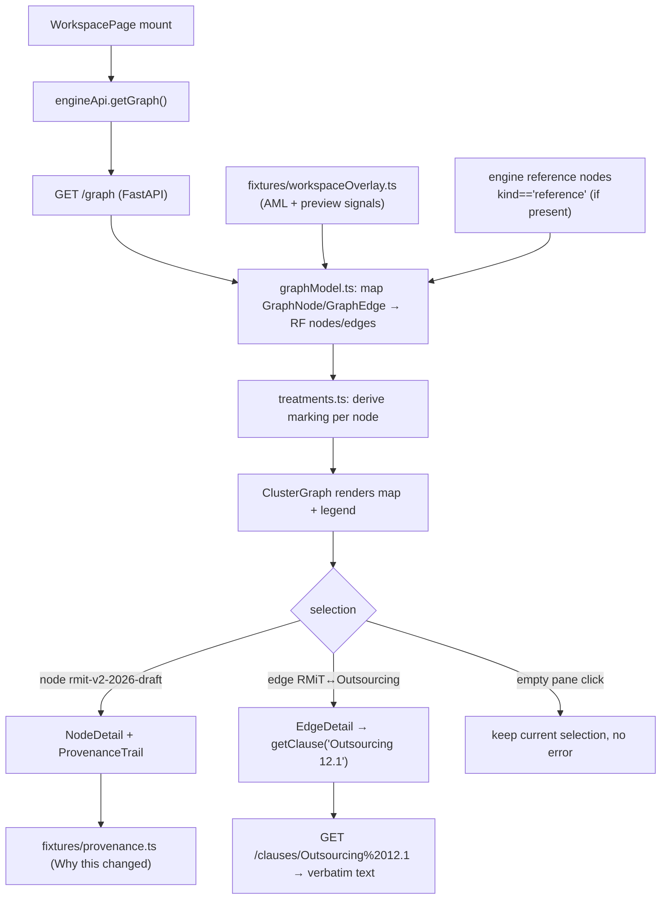
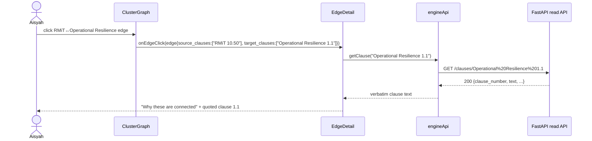

# Single-draft Rulebook Workspace

**Ticket:** [#7](https://github.com/dzaffren/copa-hackathon/issues/7)

The drafter's home in Rulebook Radar: one screen that always shows the whole
technology-risk policy cluster as a connected map, with RMiT v2 as the single
editable draft at its centre and every other Bank Negara Malaysia policy shown as
published, read-only context. The draft's external references — a peer regulator's
technology-risk policy, a national act, an international standard — orbit it as
their own nodes, every connection can be clicked to learn in plain language why it
matters, and the draft carries a "Why this changed" trail. It gives a policy
drafter the at-a-glance picture of the rulebook and its reference universe that
today lives only in experienced staff's heads.

## User Story

As a policy drafter, I want to open one workspace that shows my single editable
draft at the centre of the whole technology-risk cluster — with every other policy
as published context and its external references as first-class nodes — and that
explains why each policy and reference connects and why the draft changed, so that
I can see how my draft fits the rest of the rulebook and its external sources
without hunting through separate documents.

## Background & Context

**Current state:**

- The connections between Bank Negara Malaysia's policies — which rules overlap,
  depend on, or reference each other — live in the heads of experienced policy
  staff, not in any shared map.
- The external sources that most shape a draft — other central banks' equivalent
  technology-risk policies, national acts such as the Personal Data Protection Act,
  and international standards — are researched by hand, scattered across the web
  and personal notes, with nothing tying them to the specific clause being drafted.
- A drafter opens one policy document at a time. To understand how a revision
  relates to the rest of the rulebook, she must recall which other policies might
  be affected and open each separately.
- Why a clause changed, and which discussion papers or committee decisions drove
  the change, is hard to reconstruct months later.

**Problem:**

- Working document-by-document hides both the external references that lead the
  drafting and the cross-policy overlaps that keep the rulebook consistent. There
  is no single place that shows the draft, its sources, and its neighbours together.
- Nothing tells a drafter, at a glance, which document is hers to edit and which
  are published context she can only read — so effort and access are ambiguous.
- The reasoning behind a change and the connection between a draft and a source is
  undocumented, so knowledge is lost and research stays slow and memory-dependent.

## Target User & Persona

- **Who:** Aisyah R., a Bank Negara Malaysia policy drafter working in the
  technology-risk area.
- **Context:** She is revising Risk Management in Technology (RMiT), producing
  RMiT v2 — her single working draft. She opens the workspace whenever she starts
  or resumes work on the cluster.
- **Current workaround:** She keeps a mental list of related policies and external
  sources, opens each document and web page separately, and relies on memory and
  colleagues to know what connects to what and why a version changed.

## Goals

- Give the drafter one workspace that always shows the whole cluster with RMiT v2
  as her single editable draft at the centre, never a single isolated document.
- Make it immediately clear that RMiT v2 is the only editable node and that every
  other BNM policy is published, read-only context.
- Show the draft's external references as first-class nodes that orbit it, so the
  drafter can see at a glance which peer regulator, act, and standard connect to
  her clause — and, on demand, a plain-language "why this reference matters."
- Explain, on demand, why any two policies are connected and why the draft version
  changed — with real supporting documents, and with sensitive supporting
  documents visible as a trail but withheld in content.
- Make clear that reaching another cluster is a preview of a future capability, and
  provide a clean hand-off to the supervisor view from the same screen.

## Non-Goals

- **The Reference Radar's deep content.** This workspace shows that an external
  reference exists, that it connects to the draft, and a short "why this reference
  matters." The verbatim, clause-by-clause excerpts of what each reference _says_
  belong to the **Reference Radar story (#26)**, which this workspace hands off to.
- **Draft alignment findings.** Surfacing reference gaps, peer support, and
  internal overlaps as actionable findings belongs to the **Draft alignment story
  (#8)**, not this one.
- **Editing or redrafting policy text, and the copilot.** Opening the draft to
  change its text and the drafting copilot are the **Drafting copilot story (#9)**;
  this workspace only routes the drafter to the right action per node.
- **Cross-cluster analysis.** Only a single labelled preview of a cross-cluster
  ripple (AML / CFT) is shown; full cross-cluster mapping is a future phase.
- **Approval decisions.** Submitting the draft for manager approval is folded into
  the Draft alignment story (#8); approving is a separate manager action and is
  never offered on this screen.

## User Workflow

1. **Open the workspace** — Aisyah opens Rulebook Radar and lands on her workspace.
   She sees the whole technology-risk cluster laid out as a connected map, RMiT v2
   at its centre as her only editable draft, its external references orbiting it in
   a dedicated band, a strip naming her and her working draft, and a legend
   explaining what each marking means.
2. **Scan the map** — Without opening anything, she can tell which node she edits
   (RMiT v2), which BNM policies are published read-only, which node is the
   superseded previous version, which references connect to her draft, which are
   restricted or preview, and which single node belongs to another cluster.
3. **Inspect the draft** — She selects RMiT v2 and a detail panel shows its derived
   status, version, a short note, the policies and references it is linked to, its
   "Why this changed" trail, and one action to open the draft.
4. **Understand a connection** — She selects the link between two policies and the
   panel explains, in plain language and citing the real clauses, why they
   correlate; selecting a reference link shows a short "why this reference matters"
   and a hand-off to the Reference Radar for the verbatim detail.
5. **Understand the change** — On RMiT v2, the panel's "Why this changed" trail
   lists public supporting documents with their real titles and dates, and internal
   supporting documents as locked, content-withheld entries.
6. **Act or hand off** — She opens her draft to continue, or uses "Switch to
   supervisor view" to move to the supervisor experience.

## Acceptance Criteria

> Scenarios are written from Aisyah's point of view. Visual treatments (rings,
> bands, locked and preview states) are described as observable labels; their exact
> styling lives in the UI/Frontend Requirements section.

### Background

```gherkin
Given I am Aisyah R., a policy drafter, signed in to Rulebook Radar
  And RMiT v2 is my one and only editable draft
  And my workspace covers the technology-risk cluster with these nodes
    | node                                                          | version / kind           | derived treatment               |
    | Risk Management in Technology (RMiT) v2                        | v2 · 2026 draft          | your draft — you edit           |
    | Risk Management in Technology (RMiT) v1                        | v1 · 2020                | published · superseded          |
    | Outsourcing                                                   | v1 · 2019                | published · in force            |
    | Operational Resilience                                        | v1 · 2026                | published · in force            |
    | Business Continuity Management                                | v1 · 2022                | published · in force            |
    | Recovery Planning                                             | v1 · 2021                | published · in force            |
    | Management of Customer Information                            | v1 · 2017                | published · in force            |
    | AML / CFT                                                     | in force · other cluster | cross-cluster preview           |
    | Technology Risk Management Guidelines (peer central bank)     | 2021 · peer regulator    | external reference              |
    | Personal Data Protection Act (PDPA)                          | Act 709 · 2010           | external reference              |
    | Principles for Operational Resilience (international standard) | 2021 · int'l standard    | external reference              |
    | Regulatory Handbook                                           | restricted               | external reference · restricted |
    | In-country cloud regions (Malaysia)                          | trend                    | external signal · preview       |
    | EU DORA                                                      | foreign regulation       | external signal · preview       |
    | Major cloud provider outage                                  | news                     | external signal · preview       |
```

### Scenario: Opening the workspace shows the whole cluster with one editable draft

```gherkin
Given I open Rulebook Radar
When my workspace loads
Then I see the whole technology-risk cluster on one connected map
  And RMiT v2 sits at the centre as my single editable draft
  And every other BNM policy appears as published, read-only context
  And the draft's external references appear as their own nodes orbiting it
  And a workspace strip names me as "Aisyah R." and shows "Drafting: RMiT v2 — your only working draft"
  And the workspace is never scoped to a single document
```

### Scenario: RMiT v2 is the only node I can edit

```gherkin
Given my workspace has loaded
When I scan every node without opening anything
Then only RMiT v2 is marked "your draft — you edit"
  And no other BNM policy offers an edit or review marking
  And I see no second editable draft and no policy marked "for your review"
  And I see no other team's locked in-progress draft
```

### Scenario: The workspace opens with my draft already selected

```gherkin
Given I open Rulebook Radar
When my workspace finishes loading and I have not yet clicked anything
Then RMiT v2 is already selected in the detail panel
  And the detail panel is never blank
```

### Scenario: Clicking empty map space keeps the current detail

```gherkin
Given I have RMiT v2 selected
When I click an empty part of the map that is neither a node nor a connection
Then the RMiT v2 detail stays shown
  And no error message appears
```

### Scenario Outline: Each node's marking matches its derived treatment

```gherkin
Given my workspace has loaded
When I look at <node>
Then it is marked "<marking>"

Examples:
  | node                                    | marking                                     |
  | Risk Management in Technology (RMiT) v2 | your draft — you edit                       |
  | Risk Management in Technology (RMiT) v1 | published · superseded (read-only history)  |
  | Outsourcing                             | published · in force (read-only)            |
  | Operational Resilience                  | published · in force (read-only)            |
  | Business Continuity Management          | published · in force (read-only)            |
  | Recovery Planning                       | published · in force (read-only)            |
  | Management of Customer Information       | published · in force (read-only)            |
  | AML / CFT                               | other cluster (preview only)                |
  | Personal Data Protection Act (PDPA)     | external reference                          |
  | Regulatory Handbook                     | external reference · restricted (locked)    |
  | EU DORA                                 | external signal · preview                   |
```

### Scenario: Inspecting my editable draft

```gherkin
Given my workspace has loaded
When I select the RMiT v2 draft
Then the detail panel shows its derived status "in progress"
  And it shows the version "v2 · 2026 draft"
  And it lists what RMiT v2 is linked to, including Outsourcing, Operational Resilience, Business Continuity Management, Recovery Planning, Management of Customer Information, and its external references
  And it includes a "Why this changed" trail
  And it shows a single action to open the draft
```

### Scenario Outline: Published BNM policies offer no editing action

```gherkin
Given my workspace has loaded
When I select <policy>
Then the detail panel shows it as published and read-only
  And the only action shown is labelled "Read-only" and cannot be selected
  And I am offered no way to edit or comment on its text

Examples:
  | policy                                  |
  | Outsourcing                             |
  | Operational Resilience                  |
  | Business Continuity Management          |
  | Recovery Planning                       |
  | Management of Customer Information       |
  | Risk Management in Technology (RMiT) v1 |
```

### Scenario: Node status is derived, never set by hand

```gherkin
Given my workspace has loaded
When I select the RMiT v2 draft and then the RMiT v1 policy
Then RMiT v2 shows "in progress" because a live working draft exists for it
  And RMiT v1 shows "superseded" from the published corpus
  And nowhere am I offered a control to set or change a node's status
```

### Scenario: Understanding the core cluster connection

```gherkin
Given my workspace has loaded
When I select the connection between RMiT and Outsourcing
Then the panel shows a "Why these are connected" explanation
  And it explains that a public-cloud arrangement is often also a material outsourcing
  And it cites that RMiT clause 17 interacts with Outsourcing clause 12.1 as the core conflict in this cluster
  And it quotes Outsourcing clause 12.1: "A financial institution must obtain the Bank's written approval before entering into a new material outsourcing arrangement."
```

### Scenario: A different connection shows a different real overlap

```gherkin
Given my workspace has loaded
When I select the connection between RMiT and Operational Resilience
Then the panel shows a "Why these are connected" explanation
  And it explains that both govern the continuity of critical services that depend on cloud and third parties
  And it cites RMiT clause 10.50 overlapping Operational Resilience clause 1.1
```

### Scenario: An external reference node shows that it exists and why it matters

```gherkin
Given my workspace has loaded
When I select the Personal Data Protection Act (PDPA) reference node
Then the detail panel shows it as an external reference connected to my draft
  And it shows a short "why this reference matters" note explaining that cloud regions outside Malaysia engage the PDPA's limits on transferring personal data abroad
  And it offers an action to see what the reference says in the Reference Radar
  And it does not show the verbatim, clause-by-clause excerpts here
```

### Scenario Outline: Each reference connection carries an at-a-glance "why this reference matters"

```gherkin
Given my workspace has loaded
When I select the connection between RMiT and <reference>
Then the panel shows a "why this reference matters" explanation about <topic>
  And it offers a hand-off to the Reference Radar for the verbatim detail

Examples:
  | reference                                                    | topic                                                                                          |
  | the peer central bank's Technology Risk Management Guidelines | how a peer regulator governs public-cloud adoption through risk management rather than pre-approval |
  | the Personal Data Protection Act (PDPA)                      | the legal limits on transferring personal data to cloud regions abroad                          |
  | the international Principles for Operational Resilience       | the international baseline for managing third-party and cloud dependencies for critical operations |
```

### Scenario: The deep reference content is deferred to the Reference Radar

```gherkin
Given I have selected a reference node or its connection
When I read its detail in this workspace
Then I see only that the reference exists, that it connects to my draft, and a short why-it-matters note
  And the verbatim, clause-by-clause excerpts of what the reference says are not shown here
  And I am pointed to the Reference Radar to read them
```

### Scenario: The Regulatory Handbook reference is a locked, content-withheld placeholder

```gherkin
Given my workspace has loaded
When I select the Regulatory Handbook reference node
Then the detail panel shows that it connects to my draft
  And it states the content is restricted and access-controlled, like internal committee minutes
  And its guidance text is not shown to me
  And the only action shown is labelled restricted and cannot be selected
```

### Scenario Outline: The trend and news signals are a labelled preview

```gherkin
Given my workspace has loaded
When I select the <signal> preview node
Then the detail panel marks it as an external signal shown as a preview
  And it explains the trend and news layer is not yet built and joins the MVP only if more drafters confirm the need
  And the only action shown is labelled preview and cannot be selected

Examples:
  | signal                              |
  | In-country cloud regions (Malaysia) |
  | EU DORA                             |
  | Major cloud provider outage         |
```

### Scenario: The "Why this changed" trail lists public supporting documents

```gherkin
Given my workspace has loaded
When I select the RMiT v2 draft
Then the detail panel includes a "Why this changed" trail
  And it lists the public document "Operational Resilience — Discussion Paper" dated 19 Dec 2025, marked public with its title shown
  And it lists the public document "RMiT FAQs (updated)" dated 1 Jul 2026, marked public with its title shown
```

### Scenario: An internal supporting document appears locked and content-withheld

```gherkin
Given I have selected the RMiT v2 draft
  And its "Why this changed" trail is shown
When I look at the internal document "JPP Committee minutes — cloud policy review"
Then it is listed so the trail stays complete
  And it is marked restricted and access-controlled
  And its content is not shown to me
```

### Scenario: Provenance lives in the detail panel, never on the map

```gherkin
Given my workspace has loaded
When I look at the cluster map
Then supporting documents such as the discussion paper, the FAQs, and the committee minutes do not appear as their own nodes
  And they appear only inside the "Why this changed" trail when I select the RMiT v2 draft
```

### Scenario: The AML/CFT cross-cluster node is preview only

```gherkin
Given my workspace has loaded
When I select the AML / CFT node
Then the detail panel states it is outside the technology-risk cluster
  And it explains that a change in RMiT touched it, so it surfaces as a preview
  And it states that full cross-cluster mapping is a future phase
  And the only action shown is labelled "Outside your cluster · preview only" and cannot be selected
```

### Scenario: Selecting a node after a connection returns to node detail

```gherkin
Given I have selected the connection between RMiT and Outsourcing
  And the "Why these are connected" explanation is shown
When I then select the Operational Resilience policy
Then the panel switches to the Operational Resilience detail with its status, version, note, linked-to list, and read-only action
  And the connection explanation is no longer shown
```

### Scenario: Approval is never offered in the workspace

```gherkin
Given my workspace has loaded
When I select the RMiT v2 draft and read every available action
Then I am offered no approve or return-to-bank action
  And approval remains a separate manager step handled elsewhere
```

### Scenario: Switching to the supervisor view

```gherkin
Given my workspace has loaded
When I select "Switch to supervisor view"
Then I am taken to the supervisor experience
  And my drafter workspace remains available to return to
```

## Business Rules & Constraints

- **A single editable draft — no reviewer role.** The workspace centres on exactly
  one in-progress editable draft, RMiT v2, the only editable node in the graph.
  Every other BNM policy appears as published (in force or superseded), read-only
  context. There is no separate reviewer persona, no "for your review" marking, no
  second editable draft, and no other team's locked in-progress draft in this
  phase. The drafter's closing action — submit for manager approval — is handled in
  the Draft alignment story and is never offered on this screen.
- **Status is derived, not entered.** A node is "in progress" exactly when a live
  working draft exists for it (RMiT v2); "in force" and "superseded" come from the
  published corpus. The workspace shows the derived status; nobody sets it by hand.
- **Real, verifiable connection and change explanations.** A connection explanation
  cites the actual clauses that correlate — RMiT clause 17 with Outsourcing clause
  12.1 (the core cluster conflict), and RMiT clause 10.50 with Operational Resilience
  clause 1.1 (the continuity of critical services that depend on cloud and third
  parties). A
  "Why this changed" trail lists real supporting documents — the Operational
  Resilience Discussion Paper dated 19 Dec 2025 and the RMiT FAQs updated 1 Jul 2026. Nothing asserts a clause or document that does not exist; where no
  supporting clause exists, the tool says so rather than inventing one.
- **Confidentiality-aware provenance.** Public supporting documents are shown with
  real titles and dates. Internal supporting documents (for example the JPP
  Committee minutes) and the Regulatory Handbook are shown as locked,
  access-controlled entries: the connection or trail is visible, the content is not.
- **Provenance lives in the detail panel only.** Supporting documents are never
  added as their own nodes on the map; they appear only inside the "Why this
  changed" trail when a policy is selected.
- **External references are first-class nodes, but their deep content is #26.**
  Peer regulators' equivalent policies, national acts, and international standards
  appear as their own nodes orbiting the draft, showing that they exist, that they
  connect to a specific clause, and a short "why this reference matters." The
  verbatim, clause-by-clause excerpts of what each reference _says_ belong to the
  Reference Radar story (#26), which this workspace hands off to.
- **Cross-cluster is preview-only.** Exactly one node from another cluster (AML /
  CFT) appears as a clearly-labelled preview that cannot be opened, and the tool
  never implies it can analyse across clusters in this phase.

## UI/Frontend Requirements

> Observable visual states referenced by the scenarios above. Colours and exact
> styling are indicative for the demo, not contractual, and never appear inside the
> Gherkin.

- **Workspace strip** across the top naming the drafter and role ("Aisyah R.,
  policy drafter"), showing "Drafting: RMiT v2 — your only working draft," and a
  "Switch to supervisor view" control.
- **The cluster map** with a legend. Each node carries a visible state:
  - Your draft — you edit: a green ring around RMiT v2, the single editable node,
    visually the centre of the graph.
  - Published · in force: a read-only corpus treatment (no ring).
  - Published · superseded: a read-only history treatment, visually distinct from
    in force.
  - Other cluster (AML / CFT): greyed with a dashed outline, clearly
    non-actionable.
  - External reference: a distinct reference-source treatment, grouped in an
    "External References" band orbiting the draft.
  - External reference · restricted (Regulatory Handbook): a locked, withheld
    treatment within the band.
  - External signal · preview (in-country cloud regions, EU DORA, cloud outage): a
    preview treatment in a clearly-labelled "Trends · News (preview)" sub-band.
- **Connections between nodes are selectable** and, when selected, are visually
  emphasised while the panel shows the explanation. Internal-overlap links and
  external-reference links are visually distinguishable.
- **Detail panel** showing, for a selected node: a status/treatment label, version,
  note, "Linked to" list, the "Why this changed" trail where applicable (draft
  only), and exactly one action appropriate to the node — open the draft, see it in
  the Reference Radar, Read-only, restricted, preview, or "Outside your cluster ·
  preview only." Read-only, restricted, preview, and cross-cluster actions are
  visibly disabled.

## Success Metrics

- A drafter can, within seconds of opening the workspace and without opening any
  document, correctly identify her single editable draft, the published policies
  she can only read, and the external references connected to her clause.
- 100% of connection explanations, reference "why it matters" notes, and "Why this
  changed" entries reference an existing clause or a real supporting document; any
  reference that cannot be verified against the source is treated as a defect.
- No drafter can edit or comment on any node other than RMiT v2 (published,
  restricted, preview, or cross-cluster), in demo testing.
- The cross-cluster and trend/news previews and the restricted placeholders are
  understood by demo observers as "not yet built" or "content withheld," never as
  working analysis or exposed confidential content.

## Dependencies

- **Knowledge-graph engine (#6).** The workspace displays the cluster, its links,
  the connection explanations, the external-reference nodes, and the provenance
  trails produced by the ingestion and knowledge-graph engine.
- **Reference Radar (#26).** The reference nodes' actions hand off to the Reference
  Radar, which owns the verbatim, clause-by-clause content of what each reference
  says; this workspace only shows that references exist and why they matter.
- **Locked demo cluster and corpus.** The final set of technology-risk policies and
  their published versions — RMiT, Outsourcing, Business Continuity Management,
  Operational Resilience, Recovery Planning, Management of Customer Information —
  must be confirmed so the map, statuses, and links are real.
- **External reference corpus.** The public external references for the cloud-
  adoption topic (a peer central bank's technology-risk policy, the Personal Data
  Protection Act, an international operational-resilience standard) are illustrative
  until the reference-radar experiment (discovery Experiment 2) locks the final set.
- **Real provenance anchors.** The public supporting documents (Operational
  Resilience Discussion Paper dated 19 Dec 2025; RMiT FAQs updated 1 Jul 2026) and
  the internal locked entry (JPP Committee minutes — cloud policy review) must be
  available to populate the "Why this changed" trail.
- **Supervisor experience (#10).** The "Switch to supervisor view" control routes
  into the supervisor submission-check story.

## Open Questions

- [x] ~~Should the workspace keep a separate reviewer persona and multiple editable
      drafts?~~ — **Resolved (9 Jul 2026 pivot):** No. MVP1 has a single editable
      draft (RMiT v2); every other BNM policy is published, read-only context. The
      reviewer role, the "for your review" marking, and any second or locked
      in-progress draft are deferred to a future phase.
- [x] ~~Should supporting documents appear as their own nodes on the map?~~ —
      **Resolved:** No. Provenance is shown only in the detail panel's "Why this
      changed" trail, to keep the map uncluttered.
- [x] ~~Should this workspace show what each external reference says, clause by
      clause?~~ — **Resolved:** No. This workspace shows that a reference exists,
      that it connects, and a short "why this reference matters"; the verbatim,
      clause-by-clause content belongs to the Reference Radar story (#26).
- [x] ~~Should the cross-cluster node be openable?~~ — **Resolved:** No. It is a
      single, clearly-labelled preview that cannot be opened; full cross-cluster
      mapping is a future phase.
- [x] ~~Does the RMiT↔Operational Resilience connection really cite "Operational
      Resilience 6.11" and a "register of critical services"?~~ — **Resolved
      (10 Jul 2026, `prd-refine`):** No — corrected the phantom clause `6.11 → real
  1.1` to satisfy the verbatim-citation guardrail. `Operational Resilience 6.11`
      does not exist in the parsed corpus; the real curated edge is `RMiT 10.50 ↔
  Operational Resilience 1.1` (continuity of critical services amid deeper
      third-party dependencies), confirmed in `engine/config.py`
      (`CURATED_SEED_EDGES`) and the clause index. Both the Gherkin scenario and the
      business-rule bullet were updated. No other spec cited 6.11.
- [ ] **Should the workspace surface an unread/updated indicator when a linked
      policy or reference changes since the drafter last visited?** — **Deferred
      (non-blocking):** useful for continuity but not required for the demo; the
      workspace can show current state without change-since-last-visit tracking.

---

# Technical Refinement (`/prd-refine`)

> Appended by `/prd-refine` (10 Jul 2026). Everything above the rule is the approved,
> non-technical story (unchanged except the single §7 clause correction — the phantom
> `Operational Resilience 6.11` → real `1.1`). This half is buildable detail bound to the
> shared technical brief and the already-built engine (`engine/api.py`, `engine/graph.py`,
> `engine/config.py`). **#7 is the FOUNDATION story: it scaffolds the shared `web/` project
> (Vite + React 18 + TS + Tailwind + React Router + React Flow), the typed engine client,
> `types.ts`, the `workflowState` localStorage store, the mock `DraftDocViewer`, and the
> Playwright E2E harness that #26, #8 and #9 all depend on** — so the scaffold sub-tasks below
> are gating for the whole drafter epic.

## Functional Requirements

- **Read-only over the engine.** The workspace is a pure read client. It calls **only**
  `GET /graph`, `GET /nodes/{node_id}`, and `GET /clauses/{clause_number}` on the engine's
  read API (`engine/api.py`). It never calls `POST /connections/find` (that is #8) and never
  calls the supervisor routes `POST /submissions` / `GET /submissions/{id}`.
- **Single source of truth for the map.** The cluster map is built from **`GET /graph`** — the
  one call that returns full edges with `source_clauses` / `target_clauses` / `confidence` /
  `provenance`. `GET /nodes/{node_id}` is used only as a node-detail convenience (it returns
  `{id, title, status, edges:[{target,type,reason}]}` — outgoing edges only, **no clause
  anchors**), and `GET /clauses/{n}` hydrates verbatim clause text lazily when a connection or
  reference is selected. Rationale: `GET /nodes/{id}` omits clause anchors and returns only
  edges where `source == node_id`, so it cannot render the full "Linked to" list or a
  connection's cited clauses on its own.
- **Derived treatment, never hand-set.** Each node's on-screen marking is **computed** from the
  engine node's `status` (`"In force" | "Superseded" | "In progress"`), its `cluster`, and the
  reference fields (`kind`, `access`, `preview`) by `web/src/lib/treatments.ts`. There is no UI
  control anywhere to set or change a node's status (enforces "Status is derived, not entered").
- **Auto-select the draft on load.** When `GET /graph` resolves, the workspace selects the node
  whose `id == "rmit-v2-2026-draft"` and renders its detail; the detail panel is never blank.
  If that id is absent from the graph (corpus misconfiguration), fall back to the first
  `cluster == "technology-risk"` node and log a console warning — never render an empty panel.
- **Clicking empty canvas is a no-op.** A click on React Flow pane background (`onPaneClick`)
  keeps the current selection and shows no error.
- **Provenance is client-side, not from the engine.** The "Why this changed" trail is **not**
  in `graph.json` (the engine graph has no provenance edges). It is read from a mock fixture
  `web/src/fixtures/provenance.ts`, keyed by document id, and rendered only inside the detail
  panel for `rmit-v2-2026-draft` — never as its own graph node.
- **Cross-cluster + preview signals are client-side synthetic nodes.** The AML/CFT node is
  **not** in the technology-risk corpus and is **not** an engine node; it (and the trend/news
  preview signals, if the engine reference extension has not yet seeded them) are supplied by
  `web/src/fixtures/workspaceOverlay.ts` and merged into the React Flow model after the engine
  nodes. They carry non-actionable, disabled actions.
- **Reference nodes render when present, tolerate absence.** External-reference nodes come from
  the engine reference extension (brief §3, a #6 reopening owned as a dependency of #26/#8).
  `web/src/lib/graphModel.ts` renders any `GET /graph` node with `kind == "reference"`; when the
  extension has not yet landed it renders the reference band from the overlay fixture so #7 is
  demoable standalone. The verbatim reference passages are **out of scope** here (that is #26).
- **Validation:** `VITE_ENGINE_BASE_URL` must be a non-empty absolute URL at build time; the
  engine client throws a typed `EngineConfigError` at module load if it is missing. Every engine
  response is narrowed against `web/src/types.ts` before use; a shape mismatch surfaces the
  workspace error state, never a silent `undefined` render.
- **Atomicity / idempotency:** N/A for reads — `GET` calls are safe and repeatable. The only
  writable state #7 touches is `localStorage` via `workflowState.ts`; #7 itself only **reads**
  the store (to reflect any findings #8/#9 wrote), and re-mounting the workspace never mutates
  it. Writes (findings, tracked changes) belong to #8/#9 and are keyed per document id so
  repeated writes replace, never duplicate.

### Validation & Business Rules

- Only `rmit-v2-2026-draft` may show the `your draft — you edit` treatment and the "Open the
  draft" action; every other engine policy node renders a **disabled** `Read-only` action.
- A `Superseded` node (`rmit-v1-2020`) renders `published · superseded (read-only history)`,
  visually distinct from `In force`, and is never editable.
- A node whose `cluster != "technology-risk"` (the AML/CFT overlay node) renders
  `other cluster (preview only)` with a disabled action; the workspace never calls any
  cross-cluster analysis.
- A `kind == "reference"` node with `access == "restricted"` (Regulatory Handbook) renders a
  **locked** placeholder and the workspace **must not** call `GET /clauses/{n}` for it.
- A `kind == "reference"` node with `preview == true` (trend/news signals) renders
  `external signal · preview` with a disabled action.
- Connection and reference explanations quote only text fetched verbatim from `GET /clauses/{n}`
  by clause number; if a cited clause does not resolve (`404 CLAUSE_NOT_FOUND`), the panel shows
  **"No matching clause found"** rather than inventing text (verbatim-citation guardrail).

## Permissions & Security

- **Scope:** Public read API. The clause/graph/node routes in `engine/api.py` are public by
  design (all derived from published BNM documents); there is **no auth** on the read API for
  MVP1 and the workspace sends no credentials and no `X-Role` header.
- **Authorization:** None enforced client-side for the demo — the "single editable draft" and
  "read-only everywhere else" rules are **UX affordances** (disabled actions), not a security
  boundary. The workspace exposes no write path to any node, so there is nothing to authorise.
- **Real-build path (documented, not built):** production adds staff SSO in front of the read
  API and a server-side per-document/version workflow store (replacing `localStorage`); the
  "only RMiT v2 is editable" rule becomes a server-enforced document-ownership check. See ADR
  `docs/adr/0001-workflow-state-localstorage-demo.md`.
- **Input validation / injection:** clause text and edge `reason` strings from the engine are
  rendered through React's default text escaping — **never** `dangerouslySetInnerHTML`. Clause
  numbers placed in URLs (e.g. `GET /clauses/Outsourcing 12.1`) are `encodeURIComponent`-encoded
  by the client (`Outsourcing%2012.1`), matching the engine's `:path` + `unquote` handling.
- **No PII in the drafter path.** The draft (`data/mock/rmit-v2-2026-draft.md`) and every policy
  clause are public regulatory text; `localStorage` holds only finding/tracked-change metadata,
  no personal data.

## System Design

### Components

| Component                     | File                                                         | Responsibility                                                                                         |
| ----------------------------- | ------------------------------------------------------------ | ------------------------------------------------------------------------------------------------------ |
| App shell + router            | `web/src/App.tsx`, `web/src/main.tsx`                        | React Router routes: `/` (workspace, #7), `/alignment` (#8), `/copilot` (#9), `/supervisor` (#10 stub) |
| Engine API client             | `web/src/lib/engineApi.ts`                                   | Typed `getGraph()`, `getNode(id)`, `getClause(n, version?)`, `findConnections()` (used by #8)          |
| Shared types                  | `web/src/types.ts`                                           | `GraphNode`, `GraphEdge`, `Clause`, `Connection`, client-only `Finding`, `ReferenceItem`               |
| Workflow store                | `web/src/lib/workflowState.ts`                               | `localStorage`-backed findings + tracked-change markers; cross-tab `storage`-event sync (shared #8/#9) |
| Mock draft viewer             | `web/src/components/DraftDocViewer.tsx`                      | Word/SharePoint-style render of the living draft + tracked-change insertions from `workflowState`      |
| Workspace page                | `web/src/pages/WorkspacePage.tsx`                            | Owns selection state, loads graph, wires map ↔ detail panel                                            |
| Cluster graph                 | `web/src/components/graph/ClusterGraph.tsx`                  | React Flow canvas: nodes, selectable edges, `onNodeClick` / `onEdgeClick` / `onPaneClick`              |
| Custom nodes / edges          | `web/src/components/graph/nodeTypes.tsx`, `edgeTypes.tsx`    | Policy / reference / preview node renderers; internal-overlap vs reference edge styling                |
| Graph model mapper            | `web/src/lib/graphModel.ts`                                  | Map engine `GraphNode`/`GraphEdge` → React Flow `Node`/`Edge`; merge overlay + reference band          |
| Treatment deriver             | `web/src/lib/treatments.ts`                                  | Pure fn: engine node fields → observable marking string + action affordance                            |
| Detail panel                  | `web/src/components/DetailPanel.tsx`                         | Routes selection → `NodeDetail` / `EdgeDetail` / keeps last on empty click                             |
| Node / edge detail            | `web/src/components/detail/NodeDetail.tsx`, `EdgeDetail.tsx` | Node status/version/note/Linked-to/action; edge "why connected" + verbatim clause                      |
| Provenance trail              | `web/src/components/detail/ProvenanceTrail.tsx`              | "Why this changed" list from `provenance.ts` (public shown, internal locked)                           |
| Workspace strip               | `web/src/components/WorkspaceStrip.tsx`                      | Drafter name/role, "Drafting: RMiT v2", "Switch to supervisor view" nav                                |
| Legend                        | `web/src/components/Legend.tsx`                              | Marking legend for the map                                                                             |
| Overlay / provenance fixtures | `web/src/fixtures/workspaceOverlay.ts`, `provenance.ts`      | AML preview + signal nodes; mock "Why this changed" trails                                             |

### Interfaces

**Engine calls (HTTP, read-only):**

- `getGraph(): Promise<Graph>` → `GET {VITE_ENGINE_BASE_URL}/graph`
- `getNode(id): Promise<NodeDetail>` → `GET /nodes/{id}` (404 → typed `EngineNotFound`)
- `getClause(n, version?): Promise<Clause>` → `GET /clauses/{encodeURIComponent(n)}?version=`

**localStorage contracts (owned by `workflowState.ts`, consumed by #8/#9):**

- Key `rr:findings:v1:{documentId}` → `Finding[]`
- Key `rr:tracked-changes:v1:{documentId}` → `TrackedChange[]`
- Cross-tab sync: `window.addEventListener("storage", …)` re-reads the touched key and notifies
  subscribers (the POC pattern). #7 only reads these; #8/#9 write.

### Data flow (load → select)



### Connection-detail sequence (verbatim citation)



### Tradeoffs

- **Graph rendering: React Flow vs d3-force vs hand-rolled SVG.** Chosen **React Flow** —
  first-class node/edge click handlers, custom node components, and pane events map directly onto
  the scenarios (selectable edges, custom markings, empty-pane no-op) with no physics tuning; the
  tiny curated corpus does not need force layout. Cost: a ~40 KB dep and a fixed/computed layout.
  ADR: `docs/adr/0002-graph-viz-react-flow.md`.
- **Workflow state: `localStorage` vs server store.** Chosen **`localStorage`** for the MVP1
  demo — zero backend, instant, and cross-tab sync via the `storage` event mirrors the existing
  POC; the trade is no multi-user persistence and no server authorisation, both explicitly the
  **real-build path**. ADR: `docs/adr/0001-workflow-state-localstorage-demo.md`.
- **Reference/preview/AML nodes: engine-sourced vs client fixture.** Chosen a **hybrid** — real
  policy nodes always from `GET /graph`; reference nodes from the engine extension when present;
  the AML cross-cluster node (genuinely not in the corpus) and provenance trail from client
  fixtures. Keeps #7 demoable before the #6 reference reopening lands, at the cost of two node
  provenances the mapper must merge deterministically.

## Threat Model Checklist

- **Data classification:** Public regulatory text only (published BNM policies + a synthetic
  mock draft). **No PII, no confidential submissions** in the drafter path. The restricted
  Regulatory Handbook and internal JPP minutes are _withheld by design_ — their content is never
  fetched or rendered (locked placeholders only).
- **Attack surface:** A static SPA + the public read API over HTTP. No user input is sent to the
  engine except path params (clause numbers, node ids) which are `encodeURIComponent`-encoded and
  which the engine resolves against a fixed in-memory index (no query/DB injection sink).
  `localStorage` is per-origin, per-browser; a hostile browser extension could read/alter
  finding metadata — acceptable for a public, no-PII demo.
- **XSS:** Clause text and edge `reason` are attacker-irrelevant (public corpus) but still
  rendered via React text nodes only — **no `dangerouslySetInnerHTML`** anywhere in `web/`.
- **AuthN/AuthZ:** None on the read API for MVP1 (documented above); the supervisor submission
  routes are **not** reachable from #7. Real build adds SSO + server-side per-document store.
- **Dependencies (new npm):** `react`, `react-dom`, `react-router-dom`, `reactflow` (runtime);
  `vite`, `@vitejs/plugin-react`, `typescript`, `tailwindcss`, `postcss`, `autoprefixer`,
  `vitest`, `@testing-library/react`, `@testing-library/jest-dom`, `jsdom`, `@playwright/test`
  (dev). Pin exact versions in `web/package-lock.json`; all are self-hosted at build time (no
  runtime CDN), so the deployed bundle makes no third-party network calls except to the engine.
- **Secrets:** none in `web/`. `VITE_ENGINE_BASE_URL` is a non-secret base URL in `web/.env`;
  `.env` is git-ignored, `web/.env.example` is committed.

## API Design

> #7 consumes three engine endpoints, all public GETs. Shapes bind exactly to `engine/api.py`.
> Concrete examples use REAL corpus ids and clause numbers (brief §2).

### `GET /graph`

**Response (200)** — whole graph (trimmed to the nodes/edges #7 renders):

```json
{
  "nodes": [
    {
      "id": "rmit-v2-2026-draft",
      "policy_id": "rmit",
      "title": "Risk Management in Technology (RMiT)",
      "version": "v2 · 2026 draft",
      "status": "In progress",
      "cluster": "technology-risk"
    },
    {
      "id": "rmit-v1-2020",
      "policy_id": "rmit",
      "title": "Risk Management in Technology (RMiT)",
      "version": "v1 · 2020",
      "status": "Superseded",
      "cluster": "technology-risk"
    },
    {
      "id": "outsourcing-v1-2019",
      "policy_id": "outsourcing",
      "title": "Outsourcing",
      "version": "v1 · 2019",
      "status": "In force",
      "cluster": "technology-risk"
    },
    {
      "id": "opres-v1-2025-draft",
      "policy_id": "opres",
      "title": "Operational Resilience",
      "version": "draft · Discussion Paper 2025",
      "status": "In force",
      "cluster": "technology-risk"
    }
  ],
  "edges": [
    {
      "source": "rmit-v2-2026-draft",
      "target": "outsourcing-v1-2019",
      "type": "overlaps",
      "reason": "A public-cloud arrangement is often also a material outsourcing. RMiT clause 17 (cloud consultation/notification) interacts with Outsourcing 12.1 (written approval) — the core conflict in this cluster.",
      "source_clauses": ["RMiT 17.1", "RMiT 17.2"],
      "target_clauses": ["Outsourcing 12.1"],
      "provenance": "curated",
      "confidence": 1.0
    },
    {
      "source": "rmit-v2-2026-draft",
      "target": "opres-v1-2025-draft",
      "type": "overlaps",
      "reason": "Both govern the continuity of critical services that depend on cloud/third parties. RMiT 10.50 (cloud risk assessment) overlaps Operational Resilience 1.1 (continuity of critical financial services amid deeper third-party dependencies) — a change in one can duplicate or contradict the other.",
      "source_clauses": ["RMiT 10.50"],
      "target_clauses": ["Operational Resilience 1.1"],
      "provenance": "curated",
      "confidence": 1.0
    },
    {
      "source": "rmit-v1-2020",
      "target": "rmit-v2-2026-draft",
      "type": "version-lineage",
      "reason": "rmit-v1-2020 is superseded by rmit-v2-2026-draft of the same policy.",
      "source_clauses": [],
      "target_clauses": [],
      "provenance": "structural",
      "confidence": 1.0
    }
  ]
}
```

**Reference-extension node (rendered when brief §3 lands — else supplied by the overlay fixture):**

```json
{
  "id": "pdpa-2010",
  "policy_id": "pdpa",
  "title": "Personal Data Protection Act (PDPA)",
  "version": "Act 709 · 2010",
  "status": "In force",
  "cluster": "technology-risk",
  "kind": "reference",
  "source_type": "act",
  "access": "public",
  "preview": false
}
```

### `GET /nodes/{node_id}`

**Request:** `GET /nodes/rmit-v2-2026-draft`

**Response (200)** — note: **outgoing edges only, no clause anchors** (why #7 also reads `/graph`):

```json
{
  "id": "rmit-v2-2026-draft",
  "title": "Risk Management in Technology (RMiT)",
  "status": "In progress",
  "edges": [
    {
      "target": "outsourcing-v1-2019",
      "type": "overlaps",
      "reason": "A public-cloud arrangement is often also a material outsourcing. …"
    },
    {
      "target": "opres-v1-2025-draft",
      "type": "overlaps",
      "reason": "Both govern the continuity of critical services that depend on cloud/third parties. …"
    },
    {
      "target": "bcm-v1-2022",
      "type": "overlaps",
      "reason": "Cloud services supporting critical operations must have continuity arrangements. …"
    },
    {
      "target": "customer-info-v1-2025",
      "type": "overlaps",
      "reason": "Cloud adoption for critical systems often processes customer data offshore. …"
    }
  ]
}
```

### `GET /clauses/{clause_number}`

**Request:** `GET /clauses/Outsourcing%2012.1` (client `encodeURIComponent("Outsourcing 12.1")`)

**Response (200):**

```json
{
  "clause_number": "Outsourcing 12.1",
  "text": "A financial institution must obtain the Bank's written approval before entering into a new material outsourcing arrangement.",
  "policy_id": "outsourcing",
  "document_id": "outsourcing-v1-2019",
  "source": "published",
  "heading": "Application for approval",
  "parent": "Outsourcing 12",
  "children": [],
  "superseded_versions": []
}
```

**Request:** `GET /clauses/Operational%20Resilience%201.1` → 200 with the corrected overlap clause
`Operational Resilience 1.1`.

### Errors (for the routes #7 consumes)

| Status | Code                       | Condition                                                                                                         |
| ------ | -------------------------- | ----------------------------------------------------------------------------------------------------------------- |
| 404    | `NODE_NOT_FOUND`           | `GET /nodes/{id}` for an unknown id (e.g. `GET /nodes/does-not-exist`)                                            |
| 404    | `CLAUSE_NOT_FOUND`         | `GET /clauses/{n}` for a clause absent from the index (e.g. `RMiT 99.9`) → panel shows "No matching clause found" |
| 404    | `CLAUSE_VERSION_NOT_FOUND` | `GET /clauses/RMiT 17.1?version=v3` — clause exists, requested version does not                                   |

Uniform error body: `{"error": "<CODE>", "message": "<text>"}`. #7 never triggers
`400 INVALID_DOCUMENT_IDS` (that is `POST /connections/find`, owned by #8).

## Data Model

> **No database.** #7 has two data surfaces: client-side `localStorage` shapes (the shared store)
> and the engine's reference-node extension it _renders_ (owned as a #6 reopening for #26/#8).

### Client-side `localStorage` (owned by `web/src/lib/workflowState.ts`)

**Key `rr:findings:v1:{documentId}` → `Finding[]`** (e.g. `rr:findings:v1:rmit-v2-2026-draft`):

| Field     | Type                                                        | Notes                                                    |
| --------- | ----------------------------------------------------------- | -------------------------------------------------------- |
| `id`      | `string`                                                    | Stable finding id (e.g. `finding-rmit-17-1-outsourcing`) |
| `tier`    | `"reference-gap" \| "supports-draft" \| "internal-overlap"` | Set by #8's client-side classifier                       |
| `type`    | `"conflict" \| "duplication" \| "gap" \| "supports"`        | Internal sub-type / reference polarity (#8)              |
| `status`  | `"open" \| "accepted" \| "dismissed"`                       | Workflow state                                           |
| `reason`  | `string?`                                                   | Required when `status == "dismissed"`                    |
| `inDraft` | `boolean`                                                   | True once an accepted fix is a tracked change            |

**Key `rr:tracked-changes:v1:{documentId}` → `TrackedChange[]`**:

| Field          | Type     | Notes                                                                  |
| -------------- | -------- | ---------------------------------------------------------------------- |
| `id`           | `string` | Marker id                                                              |
| `findingId`    | `string` | The `Finding.id` this change resolves                                  |
| `clauseNumber` | `string` | Anchor clause, e.g. `"RMiT 17.1"`                                      |
| `insertedText` | `string` | The redraft inserted by the copilot (#9), rendered in `DraftDocViewer` |
| `acceptedAt`   | `string` | ISO timestamp                                                          |

> #7 defines and **reads** these; #8/#9 write them. Cross-tab sync fires on the `storage` event.

### Engine reference-node extension (brief §3 — a #6 reopening, dependency of #26/#8; #7 renders it)

`GraphNode` gains (backward-compatible; existing nodes default `kind: "policy"`):

| Field         | Type                                                               | Notes                                           |
| ------------- | ------------------------------------------------------------------ | ----------------------------------------------- |
| `kind`        | `"policy" \| "reference"`                                          | Existing nodes default `"policy"`               |
| `source_type` | `"peer_regulator" \| "act" \| "standard" \| "handbook" \| "trend"` | reference nodes only                            |
| `access`      | `"public" \| "restricted"`                                         | `handbook` = restricted → passages NOT ingested |
| `preview`     | `boolean`                                                          | trends = `true` (labelled preview)              |

Reference↔clause `GraphEdge`: `source = rmit-v2-2026-draft`, `target = <reference node>`,
`type = "references"`, `source_clauses = ["RMiT 17.1"]`, `target_clauses = ["PDPA 129"]`,
`provenance = "curated"` (seeded) or `"llm-found"`, `confidence` per edge. #7 renders these as
the "External References" band; the **verbatim passages behind them are #26**.

## Architecture Notes

- **New dependencies:** the entire `web/` project is new (see Threat Model dep list). Runtime:
  `react@18`, `react-dom@18`, `react-router-dom@6`, `reactflow@11`. Tooling: Vite 5, TypeScript 5,
  Tailwind 3, Vitest, Testing Library, Playwright.
- **Integration points:**
  - **Engine (#6):** HTTP read API at `VITE_ENGINE_BASE_URL` (dev default `http://127.0.0.1:8000`,
    `uvicorn engine.api:app`). #7 is the first HTTP consumer — it locks the client contract in
    `engineApi.ts` + `types.ts` that #8/#9/#26 reuse.
  - **#26 Reference Radar:** reference-node actions in `NodeDetail`/`EdgeDetail` route to the
    `ReferenceRadar` panel (owned by #26); #7 provides the hand-off affordance only.
  - **#8 alignment / #9 copilot:** share `workflowState.ts` + `DraftDocViewer.tsx`; #7 owns the
    skeleton and the localStorage key contract.
  - **#10 supervisor:** "Switch to supervisor view" navigates to `/supervisor`; #7 ships the nav
    control + a placeholder route, #10 owns the destination page.
- **ADRs authored by #7:** `docs/adr/0001-workflow-state-localstorage-demo.md`,
  `docs/adr/0002-graph-viz-react-flow.md`. `docs/adr/0003-reference-radar-read-path.md` is
  referenced (owned by #26).

### Exemplar Files

- `docs/poc/policy-consistency-ai/index.html` — the clickable POC's hand-drawn cluster map, edge
  list, and the `localStorage` + `storage`-event workflow pattern to mirror in React.
- `engine/api.py` — the exact response shapes to type in `engineApi.ts` / `types.ts`.
- `engine/config.py` (`DOCUMENTS`, `CURATED_SEED_EDGES`) — the real ids, versions, and edge
  reasons the map renders.

## Implementation Plan

### Sub-tasks

**Task 1: Scaffold the `web/` project (Vite + React 18 + TS + Tailwind + Router)** — _medium_

- Files: `web/package.json`, `web/vite.config.ts`, `web/tsconfig.json`, `web/tailwind.config.ts`,
  `web/postcss.config.js`, `web/index.html`, `web/.env.example`, `web/.gitignore`,
  `web/src/main.tsx`, `web/src/App.tsx`, `web/src/index.css`
- INDEPENDENT — gates every other `web/` task and all sibling stories.

**Task 2: Shared types + typed engine client** — _medium_

- Files: `web/src/types.ts`, `web/src/lib/engineApi.ts`
- SEQUENTIAL (depends on Task 1). Implements `getGraph` / `getNode` / `getClause` /
  `findConnections`; bind to `engine/api.py` shapes; `EngineConfigError` / `EngineNotFound`.

**Task 3: `workflowState.ts` localStorage store skeleton** — _small_

- Files: `web/src/lib/workflowState.ts`
- SEQUENTIAL (depends on Task 2 for the `Finding` type). Keys `rr:findings:v1:*`,
  `rr:tracked-changes:v1:*`; `storage`-event cross-tab sync; read + write + subscribe API.

**Task 4: Mock `DraftDocViewer.tsx`** — _small_

- Files: `web/src/components/DraftDocViewer.tsx`
- SEQUENTIAL (depends on Task 3). Renders `data/mock/rmit-v2-2026-draft.md` styling + tracked
  changes from `workflowState`; shared by #8/#9.

**Task 5: Graph model mapper + treatment deriver + overlay/provenance fixtures** — _medium_

- Files: `web/src/lib/graphModel.ts`, `web/src/lib/treatments.ts`,
  `web/src/fixtures/workspaceOverlay.ts`, `web/src/fixtures/provenance.ts`
- SEQUENTIAL (depends on Task 2). Maps engine nodes/edges → React Flow model, merges AML preview +
  reference band, derives marking strings; provenance trail fixture keyed by document id.

**Task 6: React Flow cluster graph + custom node/edge types** — _large_

- Files: `web/src/components/graph/ClusterGraph.tsx`,
  `web/src/components/graph/nodeTypes.tsx`, `web/src/components/graph/edgeTypes.tsx`,
  `web/src/components/Legend.tsx`
- SEQUENTIAL (depends on Task 5). Selectable nodes/edges, `onPaneClick` no-op, legend.

**Task 7: Detail panel (node / edge / provenance)** — _large_

- Files: `web/src/components/DetailPanel.tsx`, `web/src/components/detail/NodeDetail.tsx`,
  `web/src/components/detail/EdgeDetail.tsx`, `web/src/components/detail/ProvenanceTrail.tsx`
- SEQUENTIAL (depends on Tasks 2, 5). Node status/version/note/Linked-to + single action;
  edge "why connected" hydrating verbatim clause via `getClause`; provenance trail with locked
  internal entries; reference hand-off affordance to #26.

**Task 8: Workspace page + strip + switch-to-supervisor** — _medium_

- Files: `web/src/pages/WorkspacePage.tsx`, `web/src/components/WorkspaceStrip.tsx`
- SEQUENTIAL (depends on Tasks 6, 7). Owns selection state, auto-selects `rmit-v2-2026-draft`,
  wires map ↔ panel; strip nav to `/supervisor`.

**Task 9: Playwright E2E harness + config** — _small_

- Files: `web/playwright.config.ts`, `web/tests/e2e/fixtures/engineStub.ts`
- INDEPENDENT of the component tasks (can start after Task 1). Scaffolds the harness the sibling
  stories reuse; `engineStub.ts` serves the real corpus JSON so tests are deterministic offline.

**Task 10: ADRs** — _small_

- Files: `docs/adr/0001-workflow-state-localstorage-demo.md`,
  `docs/adr/0002-graph-viz-react-flow.md`
- INDEPENDENT.

**Task 11: (engine dependency, flagged — owned with #26/#8) reference-node extension** — _medium_

- Files: `engine/config.py` (reference DOCUMENTS + reference↔clause seed edges),
  `engine/graph.py` (`GraphNode` `kind`/`source_type`/`access`/`preview`), `engine/tests/`
- SEQUENTIAL, **cross-story** — reopens #6 per brief §3. #7 renders the result but does **not**
  own building it; #7 works standalone via the overlay fixture until this lands.

### Negative Constraints

- Do **NOT** modify the approved business content above the `---` (except the completed §7 clause
  correction).
- Do **NOT** change the engine's immutable-artifact design (`clause-index.json`, `graph.json`) or
  the read routes' response shapes — beyond the additive, backward-compatible reference-node
  extension in Task 11.
- Do **NOT** call or alter the supervisor routes `POST /submissions` / `GET /submissions/{id}`,
  and never send an `X-Role` header from `web/`.
- Do **NOT** classify connections into Conflict / Duplication / Gap here (that is #8) and do NOT
  call `POST /connections/find` from #7.
- Do **NOT** render reference verbatim passages in the workspace (that is #26) — show only "why
  it matters" + a hand-off.
- Do **NOT** use `dangerouslySetInnerHTML` for any engine-supplied text.

## Test Scenarios

> Implementation-level (exact endpoints, ids, error codes, localStorage keys). Component tests use
> Vitest + Testing Library against a stubbed `engineApi`; E2E uses Playwright against `engineStub`.

**Test 1: Map loads from `GET /graph` with the draft auto-selected**

- Setup: `engineStub` serves the real corpus graph (7 policy nodes incl. `rmit-v2-2026-draft`
  `status:"In progress"`).
- Action: mount `WorkspacePage`.
- Expected: React Flow shows all technology-risk nodes; `NodeDetail` for `rmit-v2-2026-draft` is
  rendered on load (panel not blank); no `POST /connections/find` request is made.

**Test 2: Derived markings**

- Setup: graph as above + overlay AML node (`cluster:"aml-cft"`) + a `kind:"reference"`
  `access:"restricted"` handbook node.
- Action: read each node's marking via `treatments.ts`.
- Expected: `rmit-v2-2026-draft` → `your draft — you edit`; `rmit-v1-2020` →
  `published · superseded (read-only history)`; `outsourcing-v1-2019` →
  `published · in force (read-only)`; AML → `other cluster (preview only)`; handbook →
  `external reference · restricted (locked)`. No engine call fetches the handbook's clauses.

**Test 3: Core connection quotes Outsourcing 12.1 verbatim**

- Setup: select the `rmit-v2-2026-draft → outsourcing-v1-2019` `overlaps` edge
  (`target_clauses:["Outsourcing 12.1"]`).
- Action: `EdgeDetail` calls `getClause("Outsourcing 12.1")` → `GET /clauses/Outsourcing%2012.1`.
- Expected: 200; panel quotes "A financial institution must obtain the Bank's written approval
  before entering into a new material outsourcing arrangement." with clause number `Outsourcing 12.1`.

**Test 4: Corrected overlap quotes Operational Resilience 1.1**

- Setup: select the `rmit-v2-2026-draft → opres-v1-2025-draft` edge
  (`source_clauses:["RMiT 10.50"]`, `target_clauses:["Operational Resilience 1.1"]`).
- Action: `getClause("Operational Resilience 1.1")` → `GET /clauses/Operational%20Resilience%201.1`.
- Expected: 200; panel cites `RMiT 10.50` overlapping `Operational Resilience 1.1`; **no** cite of
  `6.11`.

**Test 5: Missing clause → guardrail message**

- Setup: an edge whose `target_clauses` includes a clause the stub returns
  `404 CLAUSE_NOT_FOUND` for.
- Action: select the edge.
- Expected: panel shows **"No matching clause found"**, no invented text, no crash.

**Test 6: Unknown node id**

- Action: `getNode("does-not-exist")` → `GET /nodes/does-not-exist`.
- Expected: `404` `NODE_NOT_FOUND`; client throws typed `EngineNotFound`; workspace shows the
  error state, never a blank panel.

**Test 7: Empty-pane click keeps selection**

- Setup: `rmit-v2-2026-draft` selected.
- Action: fire `onPaneClick`.
- Expected: `NodeDetail` for `rmit-v2-2026-draft` still shown; no error toast.

**Test 8: Node after connection returns to node detail**

- Setup: RMiT↔Outsourcing edge selected (`EdgeDetail` shown).
- Action: click the `opres-v1-2025-draft` node.
- Expected: panel switches to `NodeDetail` for Operational Resilience; the "why connected"
  explanation is gone.

**Test 9: Provenance trail — public shown, internal locked**

- Setup: `rmit-v2-2026-draft` selected; `provenance.ts` holds two public docs + one internal.
- Action: render `ProvenanceTrail`.
- Expected: "Operational Resilience — Discussion Paper" (19 Dec 2025) and "RMiT FAQs (updated)"
  (1 Jul 2026) shown with titles; "JPP Committee minutes — cloud policy review" listed but marked
  restricted with content withheld. None appear as graph nodes.

**Test 10: workflowState round-trip + cross-tab sync**

- Setup: write a `Finding` to `rr:findings:v1:rmit-v2-2026-draft`.
- Action: dispatch a `storage` event for that key.
- Expected: subscribers re-read the key and receive the updated `Finding[]`; a repeated write of
  the same finding id replaces (no duplicate).

**Test 11: Switch to supervisor**

- Action: click "Switch to supervisor view" in `WorkspaceStrip`.
- Expected: router navigates to `/supervisor`; back navigation returns to `/` with the workspace
  intact.

**Test 12 (engine, Task 11): reference-node extension is additive**

- Setup: build the graph with a reference DOCUMENT added to the manifest.
- Action: `pytest engine/tests/` build + `GET /graph`.
- Expected: existing policy nodes still validate and default `kind:"policy"`; the reference node
  carries `kind:"reference"`, `source_type`, `access`, `preview`; a restricted handbook node
  ingests **no** passages; existing curated edges and their clause anchors still resolve.

## Verification

Run the verifier skill (Node/Vitest for `web/`, pytest for `engine/`) to confirm changes are clean.

### Component tests (Vitest + Testing Library)

- `web/src/lib/treatments.test.ts` — Test 2 (all marking derivations).
- `web/src/lib/graphModel.test.ts` — engine nodes + overlay merge; reference band tolerance.
- `web/src/lib/engineApi.test.ts` — Tests 3–6 (success + `404` typed errors, URL encoding).
- `web/src/lib/workflowState.test.ts` — Test 10 (round-trip, `storage`-event sync, no-dup).
- `web/src/components/detail/EdgeDetail.test.tsx` — Tests 3–5 (verbatim quote + guardrail).

### Backend tests (pytest, only for Task 11 engine extension)

- `engine/tests/test_graph.py` — reference-node fields additive; existing nodes default
  `kind:"policy"`; restricted node ingests no passages (Test 12).
- `engine/tests/test_api.py` — `GET /graph` returns reference nodes/edges unchanged in shape for
  existing consumers.

### E2E tests (Playwright — #7 scaffolds `web/tests/e2e/`)

Each user-facing Key Scenario maps to a Playwright spec. Specs run against `engineStub`
(deterministic real-corpus JSON) served on the dev origin.

| Key Scenario (from Acceptance Criteria)                                       | Test file                                 | Sub-task |
| ----------------------------------------------------------------------------- | ----------------------------------------- | -------- |
| Opening the workspace shows the whole cluster with one editable draft         | `web/tests/e2e/workspace-load.spec.ts`    | Task 8   |
| RMiT v2 is the only node I can edit                                           | `web/tests/e2e/workspace-load.spec.ts`    | Task 8   |
| The workspace opens with my draft already selected                            | `web/tests/e2e/workspace-load.spec.ts`    | Task 8   |
| Approval is never offered in the workspace                                    | `web/tests/e2e/workspace-load.spec.ts`    | Task 8   |
| Node status is derived, never set by hand                                     | `web/tests/e2e/node-markings.spec.ts`     | Task 6   |
| Each node's marking matches its derived treatment                             | `web/tests/e2e/node-markings.spec.ts`     | Task 6   |
| Published BNM policies offer no editing action                                | `web/tests/e2e/node-markings.spec.ts`     | Task 6   |
| Inspecting my editable draft                                                  | `web/tests/e2e/node-detail.spec.ts`       | Task 7   |
| Clicking empty map space keeps the current detail                             | `web/tests/e2e/node-detail.spec.ts`       | Task 7   |
| Selecting a node after a connection returns to node detail                    | `web/tests/e2e/node-detail.spec.ts`       | Task 7   |
| Understanding the core cluster connection                                     | `web/tests/e2e/connection-detail.spec.ts` | Task 7   |
| A different connection shows a different real overlap                         | `web/tests/e2e/connection-detail.spec.ts` | Task 7   |
| An external reference node shows that it exists and why it matters            | `web/tests/e2e/reference-nodes.spec.ts`   | Task 7   |
| Each reference connection carries an at-a-glance "why this reference matters" | `web/tests/e2e/reference-nodes.spec.ts`   | Task 7   |
| The deep reference content is deferred to the Reference Radar                 | `web/tests/e2e/reference-nodes.spec.ts`   | Task 7   |
| The Regulatory Handbook reference is a locked, content-withheld placeholder   | `web/tests/e2e/reference-nodes.spec.ts`   | Task 7   |
| The trend and news signals are a labelled preview                             | `web/tests/e2e/preview-nodes.spec.ts`     | Task 6   |
| The AML/CFT cross-cluster node is preview only                                | `web/tests/e2e/preview-nodes.spec.ts`     | Task 6   |
| The "Why this changed" trail lists public supporting documents                | `web/tests/e2e/provenance-trail.spec.ts`  | Task 7   |
| An internal supporting document appears locked and content-withheld           | `web/tests/e2e/provenance-trail.spec.ts`  | Task 7   |
| Provenance lives in the detail panel, never on the map                        | `web/tests/e2e/provenance-trail.spec.ts`  | Task 7   |
| Switching to the supervisor view                                              | `web/tests/e2e/switch-supervisor.spec.ts` | Task 8   |

**Locator strategies:** nodes expose `data-testid="node-{id}"` (e.g. `node-rmit-v2-2026-draft`)
and `data-marking="{marking}"`; edges `data-testid="edge-{source}__{target}"`; the detail panel
`data-testid="detail-panel"` with `role="region"`; actions use accessible names ("Open the
draft", "Read-only", "See in the Reference Radar", "Switch to supervisor view"); the provenance
trail `data-testid="why-this-changed"`.

## Acceptance Criteria (technical)

- [ ] `GET /graph` drives the map; `rmit-v2-2026-draft` is auto-selected on load; the panel is
      never blank.
- [ ] Every marking is derived by `treatments.ts` from engine fields; no status-setting control
      exists anywhere.
- [ ] Connection detail quotes clause text fetched verbatim by number; a missing clause shows
      "No matching clause found".
- [ ] Only `rmit-v2-2026-draft` offers an edit action; all other nodes show a disabled action.
- [ ] Restricted handbook and preview/AML nodes never fetch or render withheld content.
- [ ] The `web/` scaffold, `engineApi.ts`, `types.ts`, `workflowState.ts`, `DraftDocViewer.tsx`,
      and the Playwright harness exist and are importable by #26/#8/#9.
- [ ] No type errors, no lint warnings, all Vitest + Playwright specs green; engine `pytest`
      green for Task 11.
