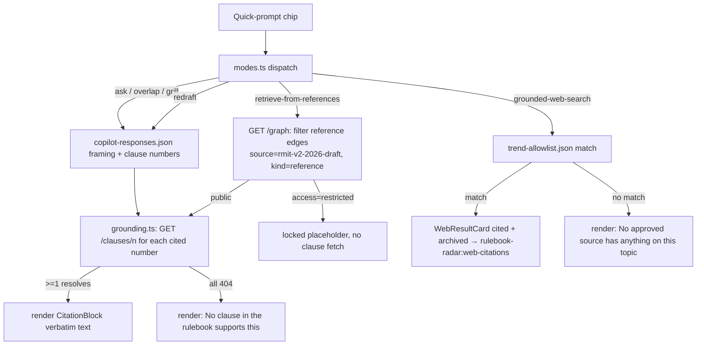

# Drafting Copilot with Live Write-Back

**Ticket:** [#9](https://github.com/dzaffren/copa-hackathon/issues/9)

A grounded drafting partner that a policy drafter uses to understand and close the
alignment findings on their one editable draft, RMiT v2. It answers questions about
the rulebook, retrieves what the connected external references say, searches the web
only within an approved source allowlist for technology trends and news, proposes
redrafted clause wording that fixes an alignment finding, and — on request — pushes
back on the drafter's own wording with pointed challenges. Every answer quotes the
exact clause or reference passage it relies on, with its number and source. When the
drafter accepts a redraft, the copilot writes it into the living working document as a
tracked change (the old wording struck through, the new wording inserted and
highlighted) for a human to accept or reject; the copilot never finalises policy text
on its own. Applying a redraft marks the matching alignment finding resolved, updates
the shared open/resolved status strip, and offers to re-run the alignment check,
closing the drafter's fix loop.

## User Story

As a policy drafter, I want a copilot grounded in my RMiT v2 draft that answers
questions about the rulebook, retrieves what the connected external references say,
runs grounded web search on an approved source allowlist for technology trends,
redrafts a clause to fix an alignment finding, and grills my own wording — always
quoting the exact clause or passage it relies on — and that writes an accepted redraft
into my living working document as a tracked change I accept or reject, marking the
matching alignment finding resolved and keeping both my pages in sync, so that I can
close alignment findings quickly and confidently without ever trusting an unsupported
claim or letting the tool change the policy text on its own.

## Background & Context

**Current state:**

- When an alignment finding flags that a revised clause is out of step with an
  external reference or another BNM policy, the drafter must work out the fix by hand:
  re-read the affected clauses, hunt down what the peer regulator or the relevant act
  actually says, reason about how to reconcile them, and retype the corrected wording
  into the working document.
- Researching what external references and current technology trends say is the
  drafter's slowest, most scattered task, yet it is what most directly shapes the
  wording. A general assistant that might help is untethered from the real rulebook and
  the approved reference set — it can assert a rule that does not exist, paraphrase a
  clause inaccurately, or cite a source no one can find again.
- There is no fast way for the drafter to have their own proposed wording challenged
  before they commit to it, so weak drafts survive until much later.

**Problem:**

- Turning a flagged finding into corrected, defensible, cited clause wording is slow
  and memory-dependent, and re-reading the source clauses and references to get the fix
  right takes as long as finding the issue did.
- An assistant that cannot be trusted to quote the real clause or the real reference
  passage — and to say so plainly when nothing supports an answer — is worse than no
  assistant: a plausible but invented citation can slip into a policy.
- Manually copying corrected text between a helper and the working document is
  error-prone and loses the trail of what changed and why; and a trend or news claim
  that cannot be traced back to an approved source cannot be relied on later.

## Target User & Persona

- **Who:** Aisyah R., a policy drafter, is the assigned drafter of the one editable
  draft in the technology-risk cluster, RMiT v2.
- **Context:** She reaches the copilot from the Draft alignment report after it flags
  findings on the cloud-adoption clause (RMiT 17.1) she is revising. She wants to
  understand each finding, see what the references and current trends say, get corrected
  wording she can stand behind, and get it into the working document without retyping.
- **Current workaround:** She re-reads the clashing clauses and hunts down the peer
  regulator's policy and the relevant act by hand, reasons out a fix, retypes it into
  the working document, and relies on memory — not a cited trail — that the fix actually
  satisfies the reference or the other policy.

## Goals

- Give the drafter five grounded ways to work a finding on RMiT v2: **ask** a question
  about the rulebook or the finding; **retrieve from the connected references** what a
  peer regulator, an act, or a standard says on the topic; run **grounded web search**
  on an approved source allowlist for technology trends and news; request a **redraft**
  that fixes the finding; and have the copilot **grill** her own draft with pointed
  challenges.
- Guarantee every answer quotes the exact clause or reference passage it relies on —
  with its number and source — and that a question with no supporting clause returns an
  explicit "no clause in the rulebook supports this" rather than an invented one.
- Keep grounded web search inside an approved source allowlist, cite and archive every
  result so a finding stays reproducible, and never use an off-allowlist source — saying
  so plainly when the allowlist yields nothing.
- Write an accepted redraft into the living working document as a tracked change — old
  wording struck through, new wording inserted and highlighted — for a human to accept
  or reject, with a visible saving-then-synced indicator.
- Close the fix loop on one shared state: applying a redraft marks the matching
  alignment finding resolved, updates the open/resolved status strip the drafter sees
  without leaving the page, syncs both pages live, and offers to re-run the alignment
  check.

## Non-Goals

- **Producing the alignment findings, and the submit-for-approval step.** Detecting the
  reference gaps, peer support, and internal overlaps, listing them, and the closing
  "submit draft for manager approval" action all belong to the Draft alignment story
  (#8). This copilot consumes those findings and reports back that one is resolved.
- **The standing reference research surface.** The Reference Radar panel of verbatim
  external excerpts per clause is the Reference Radar story (#26). The copilot retrieves
  from the same connected reference nodes only when the drafter asks, inside the
  conversation.
- **The graph canvas and provenance trail.** Seeing and navigating the cluster graph,
  the nodes, and the "why this connects" edge explanations belong to the Single-draft
  rulebook workspace story (#7).
- **The human's final accept/reject of the tracked change.** The copilot inserts the
  tracked change as a proposal; a human accepting or rejecting it inside the working
  document is a human action the copilot does not perform.
- **A second editable draft.** MVP1 has exactly one editable draft, RMiT v2. There is no
  switching between drafts and no write-back to any other document; every other policy
  is read-only published context the copilot may cite but never edit.

## User Workflow

1. **Open the copilot on RMiT v2** — From the Draft alignment report for the clause she
   is revising, Aisyah opens the copilot. It greets her, confirms it is connected to the
   live RMiT v2 draft and grounded in that draft's technology-risk cluster, and shows
   quick-prompt chips: ask about references, search the web, ask about an overlap,
   redraft the clause, and grill my draft. A live view of the working document sits
   beside the chat, and a status strip shows the current open and resolved finding
   counts.
2. **Retrieve from the references** — She asks what the peer regulator and the Personal
   Data Protection Act expect for cloud adoption of critical systems. The copilot pulls
   from the connected reference nodes and answers with each passage quoted verbatim and
   its source.
3. **Search the web, grounded** — She asks about recent cloud-resilience trends. The
   copilot searches only the approved source allowlist and returns each result cited and
   archived; if the allowlist has nothing, it says so and uses no other source.
4. **Ask about an overlap** — She asks what in the published rulebook her clause is out
   of step with. The copilot explains the overlap in plain language and quotes the exact
   clause it relies on.
5. **Request a redraft** — She asks the copilot to redraft the clause. It proposes new
   wording that fixes the finding, names the clauses and references it is grounded on,
   and offers an action to apply it to the draft.
6. **Grill the draft (optional)** — She asks the copilot to grill her draft. It pushes
   back with pointed challenges, each tied to a real clause or reference, and offers to
   redraft to address them.
7. **Accept the redraft** — She applies the redraft. The copilot writes it into the
   living working document as a tracked change — the old wording struck through, the new
   wording inserted and highlighted for a human to accept or reject — showing a saving
   indicator that settles to synced, and confirming nothing is committed without a human.
8. **Loop closes** — The copilot tells her the matching alignment finding is now marked
   resolved, the status strip updates its open/resolved counts, the Draft alignment page
   reflects the same state live, and it offers to re-run the alignment check.

## Acceptance Criteria

### Scenario: Retrieving from the connected references quotes each external passage verbatim with its source

```gherkin
Given Aisyah has the RMiT v2 draft open in the copilot
  And clause 17.1 currently reads "A financial institution shall notify the Bank within 14 days of the first-time adoption of a public cloud for critical systems."
When she asks what the peer regulator and the Personal Data Protection Act expect for cloud adoption of critical systems
Then the copilot answers from the connected reference nodes
  And it quotes the peer-regulator passage verbatim with its source, for example the MAS Technology Risk Management Guidelines (2021): "The financial institution should perform the necessary due diligence and apply sound governance and risk management practices when subscribing to cloud services."
  And it quotes the act passage verbatim with its source, the Personal Data Protection Act 2010, section 129: "A data user shall not transfer any personal data of a data subject to a place outside Malaysia unless to such place as specified by the Minister."
  And it labels the external reference set as candidate excerpts pending the reference-radar validation, without presenting any invented passage as a citation
```

### Scenario: Grounded web search returns only allowlisted results, each cited and archived

```gherkin
Given Aisyah has the RMiT v2 draft open in the copilot
When she asks the copilot to search the web for recent cloud-resilience trends
Then the copilot searches only the approved source allowlist of central banks, standard-setters, and major wires
  And it returns a BIS bulletin on cloud concentration in financial services, cited to bis.org (2026) and archived
  And it returns a European resilience-rules item on EU DORA and in-country cloud regions, cited to its allowlisted source and archived
  And it returns a regional cloud-outage news item, cited to a major wire (June 2026) and archived
  And it states that only allowlisted sources were queried and that every result is archived so the finding stays reproducible
```

### Scenario: Grounded web search says so when the allowlist yields nothing rather than using an off-allowlist source

```gherkin
Given Aisyah has the RMiT v2 draft open in the copilot
When she asks the copilot to search the web for a niche trend that no allowlisted source covers
  And no central bank, standard-setter, or major wire on the allowlist has anything on it
Then the copilot answers that no approved source has anything on this topic
  And it does not use or quote any off-allowlist source
  And it presents no result rather than inventing one
```

### Scenario: Asking about an overlap returns a plain-language answer with a verbatim citation

```gherkin
Given Aisyah has the RMiT v2 draft open in the copilot
  And clause 17.1 currently reads "A financial institution shall notify the Bank within 14 days of the first-time adoption of a public cloud for critical systems."
When she asks what in the published rulebook her clause is out of step with
Then the copilot answers that there is an overlap with the Outsourcing policy, which still requires the Bank's prior written approval
  And it quotes the exact clause, Outsourcing 12.1: "A financial institution must obtain the Bank's written approval before entering into a new material outsourcing arrangement."
  And it explains in plain language that a public cloud for a critical system is often also a material outsourcing, so RMiT's "notify within 14 days" needs to state how it interacts with 12.1's "approve before"
```

### Scenario: Requesting a redraft returns proposed wording with the grounding clauses and references cited

```gherkin
Given Aisyah has the RMiT v2 draft open in the copilot
  And clause 17.1 has the flagged alignment finding involving Outsourcing 12.1
When she asks the copilot to redraft the clause
Then the copilot proposes the wording "A financial institution shall, prior to the first-time adoption of a public cloud for critical systems, complete the risk assessment required under paragraph 10.50 and Appendix 10, and shall notify the Bank within 14 days of adoption. Where the cloud service is also a material outsourcing arrangement, paragraph 12.1 of the Outsourcing policy continues to apply."
  And it states the redraft is grounded on RMiT 17.1, RMiT 10.50, and Outsourcing 12.1
  And it offers an action to apply the redraft to the RMiT v2 draft
```

### Scenario: Grilling the draft returns pointed challenges each tied to a real clause or reference

```gherkin
Given Aisyah has the RMiT v2 draft open in the copilot
  And clause 17.1 currently reads "A financial institution shall notify the Bank within 14 days of the first-time adoption of a public cloud for critical systems."
When she asks the copilot to grill her draft
Then the copilot pushes back that the draft asks for no data-residency detail, though the Personal Data Protection Act 2010, section 129, restricts transferring personal data outside Malaysia
  And it pushes back that notification may not satisfy Outsourcing 12.1, which still demands prior written approval for a material outsourcing
  And it pushes back that the draft dropped the pre-adoption checkpoint, so the risk assessment under paragraph 10.50 and Appendix 10 is no longer required before go-live
  And it offers to redraft to address the challenges
```

### Scenario: Accepting a redraft writes it into the living working document as a highlighted tracked change

```gherkin
Given the copilot has proposed the RMiT clause 17.1 redraft
When Aisyah applies the redraft to the draft
Then the living working document shows the old wording "A financial institution shall notify the Bank within 14 days of the first-time adoption of a public cloud for critical systems." struck through
  And it shows the new wording "A financial institution shall, prior to the first-time adoption of a public cloud for critical systems, complete the risk assessment required under paragraph 10.50 and Appendix 10, and shall notify the Bank within 14 days of adoption. Where the cloud service is also a material outsourcing arrangement, paragraph 12.1 of the Outsourcing policy continues to apply." inserted and highlighted for a human to accept or reject
  And the copilot confirms the change was inserted as a tracked change and that nothing is committed without a human
```

### Scenario: The write-back shows a saving indicator that settles to synced

```gherkin
Given the copilot has proposed the RMiT clause 17.1 redraft
When Aisyah applies the redraft to the draft
Then she sees a saving indicator while the change is written to the living working document
  And once the write completes the indicator settles to synced
```

### Scenario: Applying a redraft marks the matching finding resolved, updates the status strip, and offers to re-run the check

```gherkin
Given the Draft alignment report has an open finding for RMiT clause 17.1 involving the Outsourcing policy
  And the copilot's status strip reads "5 open · 0 resolved"
When Aisyah applies the RMiT clause 17.1 redraft in the copilot
Then the copilot tells her the matching alignment finding is now marked resolved
  And the status strip updates to read "4 open · 1 resolved"
  And it offers a link to re-run the alignment check
  And when she opens the Draft alignment report that finding is shown resolved
```

### Scenario: Both pages sync live on one shared state

```gherkin
Given Aisyah has the copilot open beside the Draft alignment report
  And the copilot's status strip reads "5 open · 0 resolved"
When she accepts a fix on the Draft alignment report that resolves one finding
Then the copilot's status strip updates to "4 open · 1 resolved" without her switching pages
  And the accepted insertion appears highlighted in the living working document view beside the copilot
```

### Scenario: The copilot never commits the change on its own

```gherkin
Given Aisyah has applied the RMiT clause 17.1 redraft
  And it appears in the living working document as the old wording struck through and the new wording inserted
When she reviews the living working document
Then the change is still a proposed tracked change awaiting a human decision
  And the copilot has not finalised the clause text on its own
  And it is up to her to accept or reject the tracked change in the document
```

### Scenario: An ask with no supporting clause returns "no clause supports this" rather than inventing one

```gherkin
Given Aisyah has the RMiT v2 draft open in the copilot
When she asks whether any clause sets a maximum contract length for a cloud provider
  And no clause in the rulebook addresses a maximum cloud-contract length
Then the copilot answers that no clause in the rulebook supports this
  And it does not present any invented clause number or wording as a citation
```

### Scenario Outline: Every grounded mode cites the exact clause or reference it relies on

```gherkin
Given Aisyah has the RMiT v2 draft open in the copilot
When she uses the "<mode>" quick prompt
Then the copilot's answer quotes at least one exact clause or reference passage
  And it names the source it relies on as "<grounded on>"

Examples:
  | mode                    | grounded on                                      |
  | ask about the overlap   | Outsourcing 12.1                                 |
  | retrieve from references | Personal Data Protection Act 2010, section 129   |
  | redraft the clause      | RMiT 17.1, RMiT 10.50, Outsourcing 12.1          |
  | grill my draft          | Outsourcing 12.1, RMiT 17.1, PDPA 2010 section 129 |
```

### Scenario: The copilot writes back only to RMiT v2

```gherkin
Given Aisyah has the RMiT v2 draft open in the copilot
When she asks the copilot to redraft the clause and applies the redraft
Then only the RMiT v2 draft is changed
  And no other policy in the cluster is edited
  And the copilot's citations are drawn from the RMiT v2 draft's technology-risk cluster and its connected references
```

## Business Rules & Constraints

- **Verbatim-citation guardrail (hard rule).** Every ask, reference-retrieval,
  grounded-web-search, redraft, and grill response must quote the exact clause or
  reference passage it relies on, with its number and source (for example, Outsourcing
  12.1, RMiT 17.1, or the Personal Data Protection Act 2010, section 129). A redraft
  must name the clauses and any references it is grounded on. If no clause or passage
  supports an answer, the copilot must say so explicitly (for example, "No clause in the
  rulebook supports this") and must never present an invented citation.
- **Grounded web search stays on the allowlist.** When the copilot searches the web it
  queries only the approved source allowlist (central banks, standard-setters, major
  wires); every result is cited to its source and archived so a finding stays
  reproducible later. An off-allowlist source is never used, and when the allowlist
  yields nothing the copilot says so and returns no result.
- **AI proposes, human commits.** The copilot may answer, propose a redraft, and insert
  it as a tracked change, but it never finalises policy text. An accepted redraft appears
  as the old wording struck through and the new wording inserted and highlighted,
  awaiting a human to accept or reject it in the living working document. Nothing is
  committed without a human.
- **The living working document is the single source of truth.** The copilot reads from
  and writes to the living working document directly; there is no separate in-tool draft
  and no export step. The tracked change appears in that document, and the write-back
  shows a saving indicator that settles to synced.
- **One shared state.** Applying a redraft marks the matching alignment finding resolved
  on the state shared with the Draft alignment report, updates the copilot's open/resolved
  status strip, and both pages sync live — the drafter never has to switch pages to learn
  the current state. After applying, the copilot offers to re-run the alignment check.
- **Single-draft grounding.** The copilot is grounded in the one editable draft, RMiT v2,
  and its technology-risk cluster and connected references. It writes back only to RMiT
  v2; every other policy is read-only published context it may cite but never edit. There
  is no second editable draft and no switching between drafts in MVP1.
- **Five grounded modes.** The copilot offers ask (answer questions about the rulebook or
  a finding), retrieve-from-references (quote what the connected reference nodes say),
  grounded-web-search (approved-allowlist trends and news, each cited and archived),
  redraft (propose corrected wording that fixes a finding), and grill (push back on the
  drafter's own wording with pointed challenges) — each surfaced as a quick-prompt chip
  and each subject to the citation guardrail.

## Success Metrics

- **Faster fixes (MW10 KR3):** a drafter turns a flagged alignment finding into
  corrected, cited clause wording written into the working document at least 15% faster
  with the copilot than by researching the references and retyping the fix by hand.
- **Zero unsupported claims:** 100% of ask, reference-retrieval, web-search, redraft, and
  grill responses quote an existing clause or passage verbatim, and every answer with no
  supporting clause says so explicitly; any citation that cannot be verified against its
  source is treated as a defect.
- **Reproducible web results:** 100% of grounded-web-search results come from the
  approved allowlist and are cited and archived; an off-allowlist result is treated as a
  defect.
- **Nothing auto-committed:** 100% of accepted redrafts appear as tracked changes
  awaiting a human decision; no clause is ever finalised by the copilot.
- **Loop closure:** in the demo, a drafter can go from a flagged finding, through a
  redraft written into the working document, to the matching finding shown resolved on
  both pages and an offer to re-run the alignment check.

## Dependencies

- **Knowledge-graph engine (#6).** Supplies the exact clause text the copilot quotes and
  the cluster and reference grounding for the RMiT v2 draft.
- **Draft alignment (#8).** Produces the alignment findings the copilot helps fix, holds
  the shared resolved state the copilot updates when a redraft is applied, and owns the
  submit-for-manager-approval closing step.
- **Reference Radar (#26).** Owns the standing panel of verbatim external excerpts per
  clause; the copilot retrieves from the same connected reference nodes on request.
- **Single-draft rulebook workspace (#7).** Establishes RMiT v2 as the one editable draft
  and the drafter's edit role for it.
- **Living working-document location.** The agreed place where the in-progress RMiT v2
  draft lives and can be edited with tracked changes, so the copilot can write an accepted
  redraft back into it.
- **Approved source allowlist.** The agreed list of central banks, standard-setters, and
  major wires the grounded web search may query; who owns and edits it is a build-time
  decision.
- **Locked demo cluster and reference set.** The confirmed technology-risk policies (RMiT,
  Outsourcing, and the other linked policies) and the candidate external references (a
  peer regulator's technology-risk policy, the Personal Data Protection Act, and an
  international standard) the copilot is grounded in.

## Open Questions

- [x] ~~Does the copilot write back to the live document, or only suggest text?~~ —
      **Resolved:** it writes the accepted redraft into the living working document as a
      tracked change (AI proposes, human commits), and shares finding state with the Draft
      alignment report.
- [x] ~~Should every copilot answer be forced to cite a clause or passage?~~ —
      **Resolved:** yes; the verbatim-citation guardrail applies to every ask,
      reference-retrieval, web-search, redraft, and grill response, and an answer with no
      supporting clause or passage must say so rather than invent one.
- [x] ~~Should the copilot be able to switch between editable drafts?~~ — **Resolved
      (9 Jul 2026 pivot):** no. MVP1 has exactly one editable draft, RMiT v2; the copilot
      grounds in it and writes back only to it. There is no multi-draft switching.
- [x] ~~How does grounded web search stay trustworthy?~~ — **Resolved:** it queries only
      the approved source allowlist, cites and archives every result, and never uses an
      off-allowlist source; when the allowlist yields nothing it says so.
- [ ] Should the copilot allow the drafter to lightly edit a proposed redraft before
      applying it, or only accept it as-is? — **Deferred (non-blocking):** the demo applies
      the proposed wording as-is; inline editing before apply can follow once drafters give
      feedback, and does not change the write-back or citation rules.
- [ ] Which exact external references and allowlisted sources make the demo cut? —
      **Deferred (non-blocking):** the candidate references (a peer regulator's tech-risk
      policy, the Personal Data Protection Act, an international standard) are marked
      candidate pending the reference-radar validation (discovery Experiment 2); the copilot
      behaviour and guardrails do not change when the final set is confirmed.

---

> **Technical refinement (added by `/prd-refine`).** Everything below the rule is
> implementation detail for the builder. The business content above is unchanged. This
> story is a **client-side React feature** in the shared `web/` SPA (scaffolded by #7); it
> **consumes** the engine's read API (`GET /clauses`, `GET /graph`) and the shared
> `localStorage` workflow state, and adds **no** new engine routes. The verbatim-citation
> guardrail is enforced by fetching every quoted clause live from `GET /clauses/{n}`;
> nothing is quoted from a fixture or a model.

## Functional Requirements

- **Five grounded modes (client-side dispatch).** The copilot must offer exactly five modes,
  each a quick-prompt chip: `ask`, `retrieve-from-references`, `grounded-web-search`,
  `redraft`, `grill`. Each mode is dispatched in `web/src/lib/copilot/modes.ts`; each mode's
  answer must pass the citation guardrail (below) before it renders.
- **Citation guardrail (hard rule, mechanically enforced).** Every clause/passage a mode
  quotes must be fetched live from `GET /clauses/{clause_number}` via
  `web/src/lib/engineApi.ts` (`getClause`). The rendered quote is the response `text` field —
  never a value from a fixture, a model, or the finding cache. If a cited clause number
  returns `404 CLAUSE_NOT_FOUND`, that citation is dropped; if a mode ends with **zero**
  resolved citations, it must render exactly `No clause in the rulebook supports this` and no
  proposed wording. `retrieve-from-references` / `grounded-web-search` empty results render
  their own explicit "nothing found" copy (below), never an invented one.
- **Grounding source of the wording.** For MVP1 the redraft/grill/ask/overlap **prose framing**
  is a curated demo-safe fixture (`web/src/fixtures/copilot-responses.json`), keyed by
  `mode` + `findingId`; every clause quote embedded in that prose is a **placeholder resolved
  live** from `GET /clauses/{n}` at render time. The curated framing never contains clause
  text. (Live model generation is the documented real-build path — see Architecture Notes and
  `docs/adr/0004-copilot-generation-curated-demo.md`.)
- **Reference-retrieval reads the same edges as #26.** `retrieve-from-references` must NOT
  invent a reference set: it calls `GET /graph`, keeps edges where
  `source == "rmit-v2-2026-draft"` AND `source_clauses` contains the selected clause AND the
  `target` node has `kind == "reference"`, then calls `GET /clauses/{target_clause}` for each
  passage — the identical read path the Reference Radar (#26) uses. A reference node with
  `access == "restricted"` renders a locked placeholder and **must not** call `GET /clauses`
  for it.
- **Grounded web search is fixture-bound (no live search API).** `grounded-web-search` reads
  only `web/src/fixtures/trend-allowlist.json`. An off-allowlist source is impossible by
  construction (only allowlisted records exist in the fixture). Each returned record is
  already an archived snapshot; surfacing it writes a `WebCitation` into
  `rulebook-radar:web-citations` so the finding stays reproducible. No query match ⇒ render
  `No approved source has anything on this topic` and no result.
- **Redraft write-back is a mock tracked change (AI proposes, human commits).** Applying a
  redraft writes one `TrackedChange` record (status `"pending"`) into
  `rulebook-radar:tracked-changes`; `DraftDocViewer` (from #7) renders `oldText` struck
  through and `newText` inserted-and-highlighted. The copilot never sets the tracked change to
  accepted/rejected — that is a human action in the document (out of scope). Microsoft Graph
  is the documented real path, not built for MVP1.
- **Single-draft write target.** The write target is **always** `rmit-v2-2026-draft`. An apply
  against any other `documentId` is rejected `COPILOT_WRITEBACK_TARGET_INVALID` and no record
  is written.
- **Loop closure on shared state.** Applying a redraft, in one `workflowState.applyRedraft()`
  call, must (1) write the `TrackedChange`, (2) set the matching #8 `Finding` to
  `status: "accepted"`, `inDraft: true`, and (3) emit the `storage` event so the status strip
  and the Draft alignment page (#8) update live. The status strip reads open/resolved counts
  from the shared findings; the demo instance starts at **5 open · 0 resolved** (matches #8's
  five findings) and reads **4 open · 1 resolved** after the RMiT 17.1 redraft resolves the
  Outsourcing conflict.
- **Atomicity (client-side).** `applyRedraft()` persists the tracked-change marker and the
  finding-status change as one merged write to `localStorage`; a partial write must never
  leave a tracked change without a resolved finding, or vice versa. Failure rolls back to the
  prior state and surfaces `COPILOT_WRITEBACK_FAILED`.
- **Idempotency (client-side).** Applying the same redraft twice (same `findingId` +
  `clauseNumber`) upserts the single `TrackedChange` and leaves the finding resolved once — no
  duplicate marker, no double-decrement of the open count.
- **Saving→synced indicator.** The apply action shows a `saving` state that settles to
  `synced` (an intentional async transition mirroring the real Graph PATCH; `localStorage` is
  synchronous, so this is a short simulated latency, documented as such).

### Validation & Business Rules

- The engine base URL comes from `web/.env` (`VITE_ENGINE_BASE_URL`); if the engine is
  unreachable the copilot must **not** answer from memory — it renders
  `COPILOT_ENGINE_UNREACHABLE` and offers retry, because it cannot honour the citation
  guardrail without a live clause fetch.
- A clause number is passed to `getClause` URL-encoded (`RMiT 17.1` → `RMiT%2017.1`,
  `Outsourcing 12.1` → `Outsourcing%2012.1`, `PDPA 129` → `PDPA%20129`).
- `redraft`/`grill` require a `findingId` (the copilot is opened from a specific #8 finding).
  Apply with no matching open finding still writes the tracked change but resolves nothing and
  warns `COPILOT_REDRAFT_NO_FINDING` (the status strip is unchanged).

## Permissions & Security

- **Scope:** Public engine read routes only. `GET /clauses`, `GET /graph` are derived from
  public BNM documents and carry **no** auth (see `engine/api.py` — the confidentiality note
  gates only the two `/submissions` routes behind `X-Role: supervisor`).
- **Authorization:** None in MVP1. The copilot never sends `X-Role` and never touches
  `/submissions`. The drafter "edit role" for RMiT v2 is established by #7; there is no
  server-side auth on the demo. **Real build:** the write-back and the copilot's model proxy
  move behind authenticated per-user sessions (documented, not built) — see Threat Model.
- **Input validation:** free-text chat input is used only to select a mode fixture key and to
  filter the local allowlist fixture; it is never interpolated into an engine URL except as a
  known clause number resolved through `engineApi.getClause` (encoded). No user text is
  `eval`'d, rendered as HTML, or sent to a model in MVP1.
- **No PII in the drafter path:** the copilot reads public policy/reference clauses and a
  curated trend fixture only. No submission text, no personal data, is read or written.

## System Design

### Components

| Component                                                                       | Path                                                                                                                                       | Responsibility                                                                                          |
| ------------------------------------------------------------------------------- | ------------------------------------------------------------------------------------------------------------------------------------------ | ------------------------------------------------------------------------------------------------------- |
| `CopilotPage`                                                                   | `web/src/pages/CopilotPage.tsx`                                                                                                            | The `/copilot` route: chat transcript, quick-prompt chips, status strip, live `DraftDocViewer` pane     |
| `QuickPromptChips`                                                              | `web/src/components/copilot/QuickPromptChips.tsx`                                                                                          | The five mode chips (ask / references / web / redraft / grill)                                          |
| `CopilotChat`                                                                   | `web/src/components/copilot/CopilotChat.tsx`                                                                                               | Transcript rendering; dispatches a chip to a mode handler; renders answer + citations                   |
| `CitationBlock`                                                                 | `web/src/components/copilot/CitationBlock.tsx`                                                                                             | Renders one verbatim clause/passage quote with its number + source (from `getClause`)                   |
| `RedraftProposal`                                                               | `web/src/components/copilot/RedraftProposal.tsx`                                                                                           | Proposed wording, grounded-on chips, **Apply** action                                                   |
| `ReferenceAnswer`                                                               | `web/src/components/copilot/ReferenceAnswer.tsx`                                                                                           | Reference-retrieval answer; verbatim passages + locked placeholder for restricted nodes                 |
| `WebResultCard`                                                                 | `web/src/components/copilot/WebResultCard.tsx`                                                                                             | One allowlisted trend result, cited + "archived" badge                                                  |
| `StatusStrip`                                                                   | `web/src/components/copilot/StatusStrip.tsx`                                                                                               | "N open · M resolved" read from shared workflow state; re-renders on `storage` events                   |
| `modes` / `grounding` / `referenceRetrieval` / `webSearch` / `redraftWriteBack` | `web/src/lib/copilot/*.ts`                                                                                                                 | Mode dispatch, citation-guardrail resolver, reference edge read, allowlist search, tracked-change write |
| **Reused (owned by #7, do not re-scaffold)**                                    | `web/src/lib/engineApi.ts`, `web/src/lib/workflowState.ts`, `web/src/components/DraftDocViewer.tsx`, `web/src/types.ts`, `web/src/App.tsx` | Engine client, shared localStorage store, mock Word viewer, shared types, router                        |

### Interfaces

- **Engine (HTTP, read-only):** `engineApi.getClause(number, version?)` → `GET /clauses/{n}`;
  `engineApi.getGraph()` → `GET /graph`. The copilot does **not** call
  `POST /connections/find` — that live finder/critic call is #8's hero moment; the copilot
  reads the connections #8 already ran and stored as findings.
- **Shared state (localStorage, `rulebook-radar:` namespace):** `workflowState.getFindings()`,
  `workflowState.applyRedraft({findingId, trackedChange})`, `workflowState.subscribe(cb)`
  (wraps `window.addEventListener("storage", …)`). Keys: `rulebook-radar:findings` (owned by
  #8), `rulebook-radar:tracked-changes` (written here, read by `DraftDocViewer`),
  `rulebook-radar:web-citations` (written here).
- **Fixtures (bundled, no network):** `web/src/fixtures/trend-allowlist.json`,
  `web/src/fixtures/copilot-responses.json`.

### Data flow — mode dispatch + citation guardrail



### Sequence — redraft apply (write-back + loop closure)

```mermaid
sequenceDiagram
  actor Aisyah
  participant CP as CopilotPage
  participant EA as engineApi
  participant WS as workflowState (localStorage)
  participant DV as DraftDocViewer
  participant A8 as Draft alignment page (#8)
  Aisyah->>CP: Apply RMiT 17.1 redraft (findingId)
  CP->>EA: getClause("RMiT 17.1")
  EA-->>CP: verbatim oldText
  CP->>CP: state = "saving"
  CP->>WS: applyRedraft({ trackedChange(pending), finding→accepted+inDraft })
  WS-->>DV: storage event → render old struck / new highlighted
  WS-->>A8: storage event → finding shown resolved, open count 5→4
  WS-->>CP: persisted
  CP->>CP: state = "synced", strip "4 open · 1 resolved"
  CP-->>Aisyah: "Inserted as a tracked change; nothing committed without a human" + re-run offer
```

### Tradeoffs

- **Write-back: mock tracked change in `localStorage` vs Microsoft Graph.** Chosen: mock
  (`TrackedChange` in `rulebook-radar:tracked-changes`, rendered by `DraftDocViewer`).
  Rationale: zero external dependency, demo-reproducible, cross-tab sync via the `storage`
  event the POC already uses; Graph tracked-change insertion (`PATCH` a `.docx` in SharePoint)
  is the real path. ADRs: `docs/adr/0001-workflow-state-localstorage-demo.md`,
  `docs/adr/0005-writeback-mock-tracked-change.md`.
- **LLM prose: curated demo-safe fixture vs live model call.** Chosen: curated framing +
  live-fetched citations. Rationale: the engine read API has **no** model (model access is
  build-time only, per `engine/api.py`); the one live model moment is #8's
  `POST /connections/find`; a curated path is latency-stable and demo-safe while the
  guardrail stays real (every quote via `GET /clauses`; unsupported → the honest-absence
  string). A thin server proxy to Azure AI Foundry is the real path. ADR:
  `docs/adr/0004-copilot-generation-curated-demo.md`.
- **Grounding read: consume #8's stored findings vs re-run `POST /connections/find`.** Chosen:
  consume the stored findings + re-quote via `GET /clauses`. Rationale: avoids a second
  2–3 round-trip model call, keeps the "live AI" moment singular and owned by #8, and keeps
  clause text verbatim from the engine.

## Threat Model Checklist

- **Data classification:** public BNM policy clauses, public candidate reference passages
  (`PDPA 129`, `MAS TRM Cloud`, `Basel POR TP-1`), and a curated public-source trend fixture.
  **No PII, no submission text, no restricted-handbook text** enters the drafter path (a
  restricted reference node is a locked placeholder — passages are never ingested or fetched).
- **Attack surface:** the SPA + two public GET routes + `localStorage`. No cookies, no tokens,
  no server session in MVP1. Chat input never reaches an engine URL except as an encoded,
  known clause number.
- **AuthN/AuthZ:** none in MVP1 (public reads). **Real build:** authenticated per-user
  sessions; the model proxy and the Graph write-back become the two guarded server surfaces;
  the write target stays pinned to the caller's editable draft.
- **Injection / XSS:** clause text is rendered as text, not HTML; user chat text is not
  interpolated into HTML or a model prompt in MVP1. Clause numbers are URL-encoded before
  `GET /clauses`.
- **Guardrail integrity:** the anti-hallucination control is that quotes come only from
  `getClause` responses; a fixture that names a clause the engine cannot resolve degrades to
  `No clause in the rulebook supports this` rather than showing fixture prose as a citation.
- **Dependencies (npm):** **no new runtime dep** beyond the #7 scaffold
  (`react`, `react-dom`, `react-router-dom`, `tailwindcss`, `vite`). `reactflow` is a
  workspace (#7) dep, not used here. Test deps `@playwright/test`, `vitest`,
  `@testing-library/react`, `jsdom` come from the #7 scaffold. Supply-chain surface is
  therefore unchanged by this story.

## API Design

The copilot **consumes** these existing engine routes (defined in `engine/api.py`); it adds
none. Uniform error body: `{"error":"<CODE>","message":"<text>"}` at the HTTP status.

### `GET /clauses/{clause_number}` — verbatim clause/passage (the citation guardrail)

Used by every mode for verbatim quotes. Example (overlap ask):

**Request:** `GET /clauses/Outsourcing%2012.1`

**Response (200):**

```json
{
  "clause_number": "Outsourcing 12.1",
  "text": "A financial institution must obtain the Bank's written approval before entering into a new material outsourcing arrangement.",
  "policy_id": "outsourcing",
  "document_id": "outsourcing-v1-2019",
  "source": "Outsourcing (2019)",
  "heading": "Prior approval",
  "parent": null,
  "children": [],
  "superseded_versions": []
}
```

Example (reference passage, redraft grounding): `GET /clauses/PDPA%20129` →
`{"clause_number":"PDPA 129","text":"A data user shall not transfer any personal data of a data subject to a place outside Malaysia unless to such place as specified by the Minister.","policy_id":"pdpa","document_id":"pdpa-2010","source":"Personal Data Protection Act 2010","heading":"Transfer outside Malaysia","parent":null,"children":[],"superseded_versions":[]}`

Example (redraft `oldText`): `GET /clauses/RMiT%2017.1` → the verbatim current draft text of
RMiT 17.1 (`document_id: "rmit-v2-2026-draft"`).

**Errors:**

| Status | Code                       | Condition                                                                   | Copilot handling                                                              |
| ------ | -------------------------- | --------------------------------------------------------------------------- | ----------------------------------------------------------------------------- |
| 404    | `CLAUSE_NOT_FOUND`         | Clause number not in the corpus (e.g. a maximum cloud-contract-length rule) | Drop the citation; if none remain → `No clause in the rulebook supports this` |
| 404    | `CLAUSE_VERSION_NOT_FOUND` | `?version=` given for a known clause with no such version                   | Surface `COPILOT_CLAUSE_UNRESOLVED`; fall back to current version             |

### `GET /graph` — nodes + edges (reference-retrieval read)

`retrieve-from-references` reads the whole graph (the corpus is tiny) and filters
client-side. Relevant reference edge (seeded by the engine reference extension — a #6
reopening owned by #26/#8, not this story):

```json
{
  "source": "rmit-v2-2026-draft",
  "target": "pdpa-2010",
  "type": "references",
  "reason": "RMiT 17.1 notifies cloud adoption but records no data-residency detail the Act restricts",
  "source_clauses": ["RMiT 17.1"],
  "target_clauses": ["PDPA 129"],
  "provenance": "curated",
  "confidence": 1.0
}
```

Filter: `source == "rmit-v2-2026-draft"` AND `"RMiT 17.1" ∈ source_clauses` AND the `target`
node has `kind == "reference"`; then `GET /clauses/PDPA%20129`, `GET /clauses/MAS%20TRM%20Cloud`.
A `target` node with `access == "restricted"` (e.g. a licensed handbook) renders a locked
placeholder and is **not** fetched. Convenience endpoint `GET /clauses/{n}/references` is the
documented future alternative (ADR `docs/adr/0003-reference-radar-read-path.md`), not built
for MVP1.

### Client-side error codes (copilot UI, not engine)

| Code                               | Condition                                         | Message shown                                                                                     |
| ---------------------------------- | ------------------------------------------------- | ------------------------------------------------------------------------------------------------- |
| `COPILOT_ENGINE_UNREACHABLE`       | `GET /clauses` or `GET /graph` network failure    | "The rulebook service is unreachable — the copilot won't answer without a live citation." + retry |
| `COPILOT_CLAUSE_UNRESOLVED`        | A cited clause number 404s                        | Citation dropped silently; logged for the demo trace                                              |
| `COPILOT_NO_ALLOWLIST_MATCH`       | Web search yields no allowlisted record           | "No approved source has anything on this topic."                                                  |
| `COPILOT_NO_REFERENCE_EDGE`        | No reference edge for the selected clause         | "No connected reference covers this clause."                                                      |
| `COPILOT_REFERENCE_RESTRICTED`     | Reference node `access == "restricted"`           | Locked placeholder; no passage shown                                                              |
| `COPILOT_WRITEBACK_TARGET_INVALID` | Apply target `documentId != "rmit-v2-2026-draft"` | "The copilot can only write back to RMiT v2." — no record written                                 |
| `COPILOT_REDRAFT_NO_FINDING`       | Apply with no matching open finding               | Tracked change written; "No open finding matched this redraft." (strip unchanged)                 |
| `COPILOT_WRITEBACK_FAILED`         | `applyRedraft` persistence failed (rolled back)   | "Couldn't save the change — nothing was applied." + retry                                         |

## Data Model

**No database.** All copilot state is client-side in `localStorage` under the shared
`rulebook-radar:` namespace (the engine keeps its immutable flat-JSON artifacts unchanged).

**`rulebook-radar:findings`** — `Finding[]` (owned & seeded by #8; the copilot only mutates a
finding's `status`/`inDraft` on apply). Shape (from the shared `workflowState`):

```json
{
  "id": "finding-outsourcing-conflict",
  "tier": "internal-overlap",
  "type": "Conflict",
  "status": "open",
  "reason": null,
  "inDraft": false,
  "clauseNumber": "RMiT 17.1",
  "affected": "Outsourcing (2019)"
}
```

The demo instance holds **five** findings (2 reference gaps `PDPA 129` / `Basel POR TP-1`,
1 supports-draft `MAS TRM Cloud`, 2 internal overlaps: Outsourcing 12.1 conflict + RMiT
17.1-vs-17.2 duplication) → status strip starts **5 open · 0 resolved**.

**`rulebook-radar:tracked-changes`** — `TrackedChange[]` (written here, read by
`DraftDocViewer`):

```json
{
  "id": "tc-rmit-17-1",
  "documentId": "rmit-v2-2026-draft",
  "clauseNumber": "RMiT 17.1",
  "findingId": "finding-outsourcing-conflict",
  "oldText": "A financial institution shall notify the Bank within 14 days of the first-time adoption of a public cloud for critical systems.",
  "newText": "A financial institution shall, prior to the first-time adoption of a public cloud for critical systems, complete the risk assessment required under paragraph 10.50 and Appendix 10, and shall notify the Bank within 14 days of adoption. Where the cloud service is also a material outsourcing arrangement, paragraph 12.1 of the Outsourcing policy continues to apply.",
  "groundedOn": ["RMiT 17.1", "RMiT 10.50", "Outsourcing 12.1"],
  "status": "pending",
  "insertedAt": "2026-07-10T09:00:00Z"
}
```

`status` is **always** `"pending"` from the copilot — the human's in-document accept/reject is
out of scope. Upsert key: `findingId` + `clauseNumber` (idempotency).

**`rulebook-radar:web-citations`** — `WebCitation[]` (the "archived when cited" trail):

```json
{
  "id": "wc-bis-cloud",
  "resultId": "trend-bis-cloud-concentration",
  "source": "bis.org",
  "title": "Cloud concentration in financial services",
  "url": "https://www.bis.org/…",
  "publishedDate": "2026",
  "excerpt": "…",
  "archivedAt": "2026-07-10T09:01:00Z",
  "allowlisted": true
}
```

**`web/src/fixtures/trend-allowlist.json`** — the curated allowlist + pre-archived results:

```json
{
  "allowlist": ["bis.org", "eba.europa.eu", "reuters.com"],
  "results": [
    {
      "id": "trend-bis-cloud-concentration",
      "source": "bis.org",
      "sourceType": "standard_setter",
      "title": "Cloud concentration in financial services",
      "url": "https://www.bis.org/…",
      "publishedDate": "2026",
      "topics": ["cloud", "concentration", "resilience"],
      "archivedSnapshot": "…",
      "allowlisted": true
    },
    {
      "id": "trend-eba-dora-regions",
      "source": "eba.europa.eu",
      "sourceType": "central_bank",
      "title": "EU DORA and in-country cloud regions",
      "url": "https://www.eba.europa.eu/…",
      "publishedDate": "2026",
      "topics": ["cloud", "resilience", "dora"],
      "archivedSnapshot": "…",
      "allowlisted": true
    },
    {
      "id": "trend-reuters-outage",
      "source": "reuters.com",
      "sourceType": "major_wire",
      "title": "Regional cloud outage disrupts banking services",
      "url": "https://www.reuters.com/…",
      "publishedDate": "2026-06",
      "topics": ["cloud", "outage"],
      "archivedSnapshot": "…",
      "allowlisted": true
    }
  ]
}
```

**Engine reference-node extension (dependency, NOT this story's code).** The reference
documents (`pdpa-2010`, `mas-trm-2021`, `basel-por-2021`) and their reference↔clause edges are
seeded by the engine reference extension (§3 of the shared brief — a modest #6 reopening owned
by #26/#8). This story consumes `kind`/`source_type`/`access`/`preview` on the node and the
reference edges; it does not create them.

## Architecture Notes

- **New dependencies:** none beyond the #7 scaffold. This story adds pages, components,
  `web/src/lib/copilot/*`, and two fixtures only.
- **Integration points:** reuses `web/src/lib/engineApi.ts` (engine reads),
  `web/src/lib/workflowState.ts` (shared findings + tracked changes; #9 adds the
  `applyRedraft` write path and the `TrackedChange` type — coordinate the type addition with
  the #7 owner), `web/src/components/DraftDocViewer.tsx` (renders the tracked change),
  `web/src/App.tsx` (registers the `/copilot` route). Shared state with **#8** (findings) and
  **#26** (reference edge/passage read path).
- **Model-access decision (recommended, MVP1):** the copilot's redraft/grill wording is a
  **curated demo-safe path**, not a live browser model call — because the engine read API has
  no model (model access is build-time only) and the single live-AI moment is #8's
  `POST /connections/find`. The prose framing lives in `copilot-responses.json`; **every clause
  it quotes is fetched live from `GET /clauses`**, so the verbatim-citation guardrail is real
  and an unsupported citation degrades to `No clause in the rulebook supports this`. The
  real-build alternative — a **thin server proxy** to Azure AI Foundry that applies the same
  guardrail server-side (validate every generated citation against the clause index before
  returning) — is recorded in `docs/adr/0004-copilot-generation-curated-demo.md`. The browser
  must never hold Foundry credentials.
- **Exemplar files:** `docs/poc/policy-consistency-ai/chat.html` (copilot chat + citation +
  redraft-apply interaction to port to React); `docs/poc/policy-consistency-ai/index.html`
  (the localStorage cross-tab pattern); `engine/api.py` (`GET /clauses` / `GET /graph`
  contracts and the uniform error body); `engine/connections.py` (the `unsupported[]` /
  "No matching clause found" guardrail this story mirrors client-side).

## Implementation Plan

### Sub-tasks

**Task 1: Copilot route, page shell, quick-prompt chips, status strip** — _medium_

- Files: `web/src/pages/CopilotPage.tsx`, `web/src/components/copilot/QuickPromptChips.tsx`,
  `web/src/components/copilot/StatusStrip.tsx`; register `/copilot` in `web/src/App.tsx`.
- SEQUENTIAL (depends on the #7 scaffold: `App.tsx`, `engineApi.ts`, `workflowState.ts`,
  `DraftDocViewer.tsx`, `types.ts`).

**Task 2: Citation-guardrail resolver + citation block** — _medium_

- Files: `web/src/lib/copilot/grounding.ts`, `web/src/components/copilot/CitationBlock.tsx`.
- Resolves each cited clause number via `engineApi.getClause`; drops 404s; emits the
  honest-absence string when zero remain.
- SEQUENTIAL (depends on Task 1).

**Task 3: ask / overlap / grill modes** — _large_

- Files: `web/src/lib/copilot/modes.ts`, `web/src/fixtures/copilot-responses.json`,
  `web/src/components/copilot/CopilotChat.tsx`.
- Curated framings keyed by `mode` + `findingId`; all clause text live-fetched via Task 2.
- SEQUENTIAL (depends on Task 2).

**Task 4: retrieve-from-references mode** — _medium_

- Files: `web/src/lib/copilot/referenceRetrieval.ts`,
  `web/src/components/copilot/ReferenceAnswer.tsx`.
- `GET /graph` reference-edge filter (§3) + verbatim passages + restricted locked placeholder.
- SEQUENTIAL (depends on Task 2); INDEPENDENT of Task 3 (can run in parallel).

**Task 5: grounded-web-search mode (fixture-bound)** — _medium_

- Files: `web/src/lib/copilot/webSearch.ts`, `web/src/fixtures/trend-allowlist.json`,
  `web/src/components/copilot/WebResultCard.tsx`.
- Allowlist match + archive to `rulebook-radar:web-citations` + no-match copy.
- INDEPENDENT (no engine call; only the scaffold).

**Task 6: redraft proposal + apply write-back** — _large_

- Files: `web/src/lib/copilot/redraftWriteBack.ts`,
  `web/src/components/copilot/RedraftProposal.tsx`; extend `web/src/lib/workflowState.ts` with
  the `TrackedChange` type + `applyRedraft()` (coordinate with #7 owner).
- Writes `rulebook-radar:tracked-changes`, resolves the matching finding, atomic + idempotent,
  target pinned to `rmit-v2-2026-draft`, saving→synced indicator.
- SEQUENTIAL (depends on Task 2 and the shared `workflowState`).

**Task 7: shared-state sync + tracked-change rendering** — _small_

- Files: `web/src/components/copilot/StatusStrip.tsx` (subscribe), wire
  `web/src/components/DraftDocViewer.tsx` to render `rulebook-radar:tracked-changes` (the
  viewer is #7's; this task consumes it).
- Cross-tab `storage`-event sync of the status strip and draft view.
- SEQUENTIAL (depends on Task 6).

**Task 8: ADRs** — _small_

- Files: `docs/adr/0004-copilot-generation-curated-demo.md`,
  `docs/adr/0005-writeback-mock-tracked-change.md`.
- INDEPENDENT.

**Task 9: component + E2E tests** — _large_

- Files: `web/src/lib/copilot/__tests__/grounding.test.ts`,
  `web/src/lib/copilot/__tests__/redraftWriteBack.test.ts`,
  `web/tests/e2e/copilot-reference-retrieval.spec.ts`,
  `web/tests/e2e/copilot-web-search.spec.ts`, `web/tests/e2e/copilot-ask-overlap.spec.ts`,
  `web/tests/e2e/copilot-redraft.spec.ts`, `web/tests/e2e/copilot-grill.spec.ts`,
  `web/tests/e2e/copilot-writeback.spec.ts`, `web/tests/e2e/copilot-shared-state.spec.ts`.
- SEQUENTIAL (depends on Tasks 3–7).

### Negative Constraints

- Do NOT call `POST /connections/find` from this story — the live finder/critic call is #8's
  hero moment; the copilot reads #8's stored findings and re-quotes via `GET /clauses`.
- Do NOT re-scaffold `web/` — reuse `engineApi.ts`, `workflowState.ts`, `DraftDocViewer.tsx`,
  `types.ts`, `App.tsx` (all owned by #7).
- Do NOT change the engine's immutable-artifact design or add engine routes. The reference-node
  extension is a separate #6 reopening owned by #26/#8, not this story.
- Do NOT touch the supervisor routes (`POST /submissions`, `GET /submissions/{id}`) or send
  `X-Role`.
- Do NOT write back to any document other than `rmit-v2-2026-draft`.
- Do NOT use Microsoft Graph in MVP1 (mock tracked change only); do NOT call a live LLM from
  the browser for redraft/grill prose in MVP1.
- Do NOT quote clause/passage text from a fixture or a model — every quote comes from
  `GET /clauses`.
- Do NOT modify the approved business content above the `---`.

## Test Scenarios

**Test 1: Overlap ask quotes Outsourcing 12.1 verbatim**

- Setup: findings seeded in `rulebook-radar:findings` (5 open); engine reachable.
- Action: use the "ask about the overlap" chip; the mode cites `Outsourcing 12.1`.
- Expected: `getClause("Outsourcing 12.1")` returns 200; `CitationBlock` renders the exact
  `text` "A financial institution must obtain the Bank's written approval before entering into
  a new material outsourcing arrangement." with source "Outsourcing (2019)".

**Test 2: Ask with no supporting clause returns the honest-absence string**

- Setup: engine reachable; the framing cites a non-existent max-contract-length clause.
- Action: ask whether any clause sets a maximum cloud-contract length.
- Expected: `getClause` → `404 CLAUSE_NOT_FOUND`; zero citations remain; render exactly
  `No clause in the rulebook supports this`; no proposed wording; no invented clause number.

**Test 3: Reference retrieval reads reference edges and quotes PDPA 129 verbatim**

- Setup: `GET /graph` includes the `rmit-v2-2026-draft → pdpa-2010` reference edge
  (`source_clauses:["RMiT 17.1"]`, `target_clauses:["PDPA 129"]`) and a `mas-trm-2021` edge.
- Action: ask what the peer regulator and the PDPA expect for cloud adoption of critical
  systems (selected clause `RMiT 17.1`).
- Expected: filter yields both edges; `getClause("PDPA 129")` and `getClause("MAS TRM Cloud")`
  render verbatim with sources; a restricted node (if present) shows a locked placeholder and
  is never fetched.

**Test 4: Grounded web search returns only allowlisted, archived results**

- Setup: `trend-allowlist.json` with `bis.org` / `eba.europa.eu` / `reuters.com` records.
- Action: search for recent cloud-resilience trends.
- Expected: three `WebResultCard`s cited to their sources, each with an "archived" badge; a
  `WebCitation` per result written to `rulebook-radar:web-citations`; no off-allowlist source
  possible.

**Test 5: Grounded web search with no match**

- Setup: `trend-allowlist.json`; query matches no record's `topics`.
- Action: search for a niche trend no allowlisted source covers.
- Expected: `COPILOT_NO_ALLOWLIST_MATCH` → render `No approved source has anything on this
topic`; no result; no `WebCitation` written.

**Test 6: Redraft apply writes a pending tracked change and resolves the finding**

- Setup: `rulebook-radar:findings` has open `finding-outsourcing-conflict`
  (`clauseNumber:"RMiT 17.1"`); status strip "5 open · 0 resolved".
- Action: apply the RMiT 17.1 redraft.
- Expected: one `TrackedChange` in `rulebook-radar:tracked-changes` with `status:"pending"`,
  `documentId:"rmit-v2-2026-draft"`, `groundedOn:["RMiT 17.1","RMiT 10.50","Outsourcing 12.1"]`;
  finding → `status:"accepted"`, `inDraft:true`; strip "4 open · 1 resolved";
  `DraftDocViewer` shows old struck / new highlighted.

**Test 7: Apply is idempotent**

- Setup: after Test 6.
- Action: apply the same redraft again.
- Expected: still one `TrackedChange` (upsert on `findingId`+`clauseNumber`); finding stays
  resolved once; strip stays "4 open · 1 resolved".

**Test 8: Write-back rejects a non-RMiT-v2 target**

- Setup: a redraft whose `documentId` is `outsourcing-v1-2019`.
- Action: attempt apply.
- Expected: `COPILOT_WRITEBACK_TARGET_INVALID` with message "The copilot can only write back
  to RMiT v2."; no `TrackedChange` written; no finding changed.

**Test 9: Cross-tab live sync**

- Setup: copilot open in one tab; the Draft alignment page (#8) resolves a finding in another
  tab (writes `rulebook-radar:findings`).
- Action: the `storage` event fires.
- Expected: the copilot status strip re-reads shared counts and updates without a page switch
  (e.g. "5 open · 0 resolved" → "4 open · 1 resolved").

## Verification

Run the verifier skill after each task. Unit/component tests use **Vitest + React Testing
Library**; end-to-end tests use **Playwright** (both from the #7 scaffold). The engine is
stubbed at the `engineApi` seam (or MSW) in component tests so `GET /clauses` / `GET /graph`
are deterministic; E2E runs against a seeded `localStorage` and a stub/served engine.

### Component tests (Vitest/RTL)

- `web/src/lib/copilot/__tests__/grounding.test.ts` — verbatim rendering from a 200; citation
  drop + honest-absence string on `404 CLAUSE_NOT_FOUND`; `COPILOT_ENGINE_UNREACHABLE` on
  network failure (no answer-from-memory).
- `web/src/lib/copilot/__tests__/redraftWriteBack.test.ts` — atomic write of tracked change +
  finding resolution; idempotent upsert; `COPILOT_WRITEBACK_TARGET_INVALID`;
  `COPILOT_REDRAFT_NO_FINDING`; rollback → `COPILOT_WRITEBACK_FAILED`.
- Component tests for `WebResultCard` (allowlist + archive), `ReferenceAnswer` (locked
  placeholder for `access:"restricted"`), `StatusStrip` (reads shared counts, re-renders on
  `storage`).

### E2E mapping (Playwright)

| Key Scenario                                                                        | Test file                                           | Sub-task |
| ----------------------------------------------------------------------------------- | --------------------------------------------------- | -------- |
| Retrieving from the connected references quotes each external passage verbatim      | `web/tests/e2e/copilot-reference-retrieval.spec.ts` | Task 9   |
| Grounded web search returns only allowlisted results, each cited and archived       | `web/tests/e2e/copilot-web-search.spec.ts`          | Task 9   |
| Grounded web search says so when the allowlist yields nothing                       | `web/tests/e2e/copilot-web-search.spec.ts`          | Task 9   |
| Asking about an overlap returns a plain-language answer with a verbatim citation    | `web/tests/e2e/copilot-ask-overlap.spec.ts`         | Task 9   |
| An ask with no supporting clause returns "no clause supports this"                  | `web/tests/e2e/copilot-ask-overlap.spec.ts`         | Task 9   |
| Requesting a redraft returns proposed wording with grounding clauses and references | `web/tests/e2e/copilot-redraft.spec.ts`             | Task 9   |
| Grilling the draft returns pointed challenges each tied to a real clause/reference  | `web/tests/e2e/copilot-grill.spec.ts`               | Task 9   |
| Accepting a redraft writes it in as a highlighted tracked change                    | `web/tests/e2e/copilot-writeback.spec.ts`           | Task 9   |
| The write-back shows a saving indicator that settles to synced                      | `web/tests/e2e/copilot-writeback.spec.ts`           | Task 9   |
| The copilot never commits the change on its own                                     | `web/tests/e2e/copilot-writeback.spec.ts`           | Task 9   |
| The copilot writes back only to RMiT v2                                             | `web/tests/e2e/copilot-writeback.spec.ts`           | Task 9   |
| Applying a redraft marks the finding resolved, updates the strip, offers re-run     | `web/tests/e2e/copilot-shared-state.spec.ts`        | Task 9   |
| Both pages sync live on one shared state                                            | `web/tests/e2e/copilot-shared-state.spec.ts`        | Task 9   |
| Every grounded mode cites the exact clause or reference (Scenario Outline)          | `web/tests/e2e/copilot-ask-overlap.spec.ts`         | Task 9   |

**Locator strategies:** `data-testid` on: `copilot-chip-{ask|references|web|redraft|grill}`,
`citation-block`, `citation-source`, `redraft-proposal`, `redraft-apply`, `web-result`,
`web-archived-badge`, `status-strip` (with `data-open` / `data-resolved`), `save-indicator`
(`data-state="saving|synced"`), `tracked-change-old`, `tracked-change-new`, `locked-reference`,
`no-clause-support`, `no-allowlist-match`.

### Engine-extension tests (dependency, not this story)

The reference-node extension (`kind`/`source_type`/`access`/`preview` on `GraphNode`,
reference↔clause edges) is verified by pytest in `engine/tests/` under #26/#8's engine
reopening (e.g. `engine/tests/test_reference_nodes.py`) — this story asserts only that it
consumes those fields correctly, via the component tests above.
