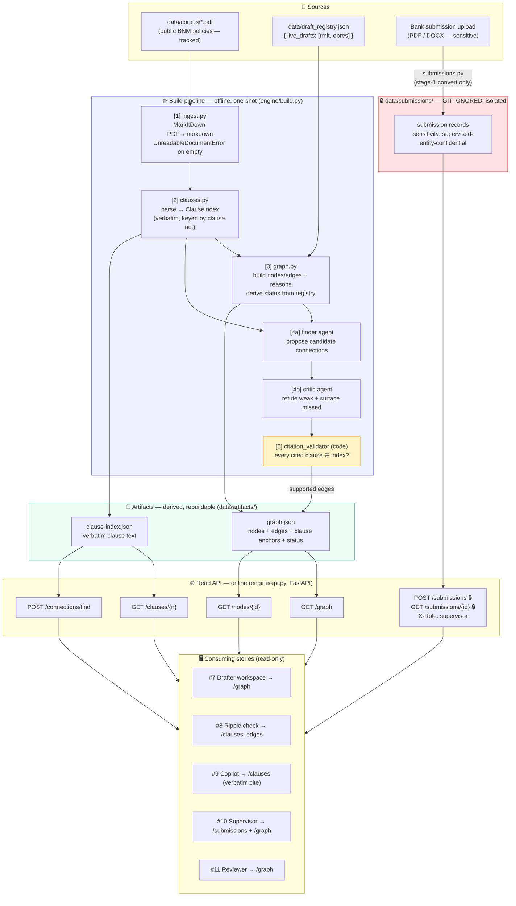
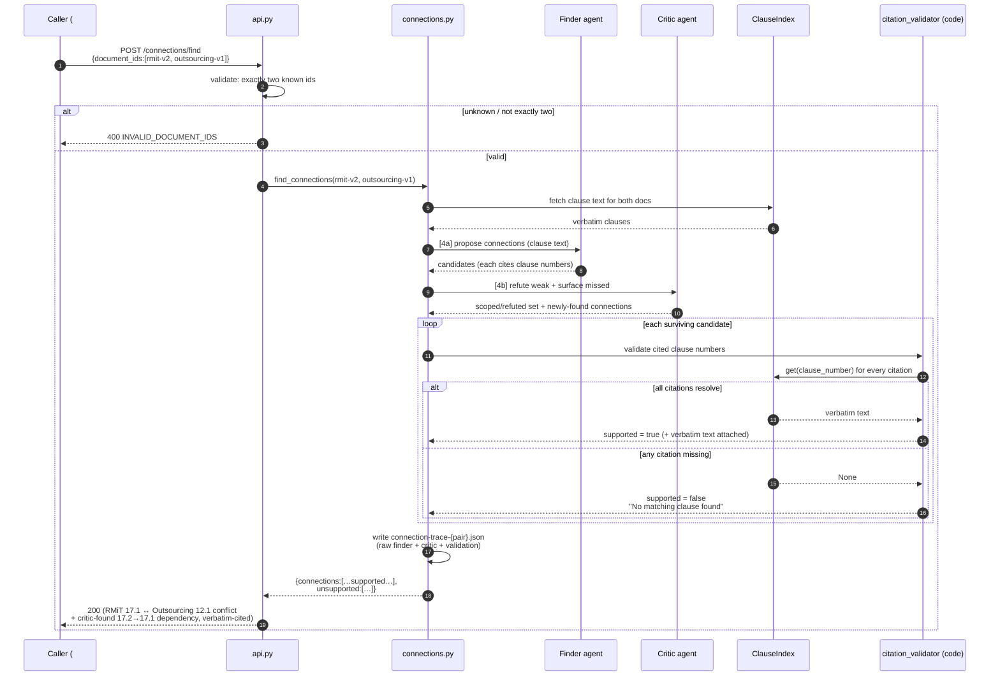

# Policy ingestion & rulebook knowledge-graph engine

**Ticket:** [#6](https://github.com/dzaffren/copa-hackathon/issues/6)
**Type:** Technical — Data pipeline / Infrastructure

This is the foundational data layer for Rulebook Radar. It turns a cluster of
Bank Negara Malaysia's published policy documents into clean, structured text
with every clause individually addressable and quotable, and assembles those
documents into a knowledge graph whose links describe how the policies connect,
overlap, depend on, and supersede one another. It has no screen of its own —
every other story (drafter workspace, ripple check, drafting copilot, supervisor
completeness check, reviewer workflow) reads from this engine. It also ingests
sensitive bank submissions for the supervisor story using the same clean-text
pipeline.

## Motivation

**Current state:** There is no machine-readable map of how BNM's policies
connect — the relationships live in the heads of experienced staff. Worse, the
published policy documents themselves cannot simply be read by software: a
dry-run on the real RMiT and Outsourcing documents showed that naive
text extraction produces gibberish because the documents use custom font
encoding. Without clean text and a way to name and quote each clause exactly,
none of the product's guardrails or features are possible.

**Desired state:** Every document in the demo cluster is converted to clean,
readable text with its clause numbering intact; every clause is retrievable and
quotable word-for-word by its clause number (for example, "Outsourcing 12.1" or
"RMiT 17.1"); and the cluster is represented as a graph where each link carries a
plain-language explanation of why the two policies are connected. The graph can
surface the real cross-policy connections in the corpus without inventing false
ones, and every connection it asserts points to an exact clause that a human can
verify in seconds.

**Trigger:** This is the first thing built and everything depends on it (per the
epic rollout order). The riskiest project assumption — that connections can be
found reliably without hallucination — was validated in a blind test on the real
RMiT and Outsourcing documents, which independently found the clause 17 versus
12.1 conflict and cited every clause word-for-word. That result was made
verifiable only because each claim quoted an existing clause. This engine
operationalises that finding as the permanent foundation.

## Scope

- **In scope:**
  - Converting each published policy document in the demo cluster (RMiT,
    Outsourcing, Business Continuity Management, Operational Resilience, Recovery
    Planning, Management of Customer Information) into clean, structured text with
    clause numbers preserved, including documents that naive extraction would garble.
  - A clause index: every clause is individually addressable and quotable
    word-for-word by its clause number, faithful to the source document.
  - A knowledge graph: policy documents are the points on the map; the links
    between them describe overlap, reference, and depends-on relationships, and
    each link carries a plain-language explanation of why the two policies are
    connected.
  - Version-lineage links: representing that an older version is superseded by a
    newer version of the same policy.
  - Derived node status: "In progress" when a live working draft exists for a
    policy, otherwise "In force" or "Superseded" as read from the published
    corpus.
  - The connection-finding capability: given the corpus, surfacing the real
    cross-policy connections and conflicts, each anchored to the exact clauses
    it rests on.
  - The anti-hallucination guardrail at the data layer: a candidate connection
    or claim that cannot be anchored to an existing clause is reported as
    unsupported, never invented.
  - Ingesting an uploaded bank submission (in common document formats) into the
    same clean-text form for the supervisor story, held under heavier governance
    than public policy documents.

- **Out of scope:**
  - Any end-user screen or visualisation (owned by the drafter workspace and
    supervisor stories).
  - The ripple/impact analysis that runs when a draft changes (owned by the
    ripple check story) — this engine provides the graph it runs on, not the
    change analysis itself.
  - Writing changes back into a live working draft (owned by the drafting
    copilot story).
  - The supervisor's checklist assembly and Met/Missing/Unclear decision (owned
    by the supervisor story) — this engine provides the clean submission text
    and the graph, not the assessment.
  - Cross-cluster analysis beyond a single labelled preview link — full
    cross-cluster mapping is a future phase.

## Goals

- Convert every document in the demo cluster to clean text with clause numbers
  intact, including documents that naive extraction garbles, with zero
  unreadable output.
- Make 100% of clauses retrievable by clause number, with the returned text
  identical to the source document (the basis for the word-for-word citation
  guardrail).
- Build a graph in which every link carries a human-readable reason and points
  to the specific clauses that justify it.
- On the validated document pair, surface the known real connections (including
  the clause 17 versus Outsourcing 12.1 conflict) while introducing no invented
  connections.
- Derive every node's status correctly from whether a live draft exists and from
  the published corpus, with no manually invented statuses.

## Non-Goals

- Covering the whole BNM rulebook — the engine is scoped to one cluster of 5–10
  related policies.
- Guaranteeing perfect recall across the entire rulebook — the engine targets
  the demo cluster; broad-corpus tuning is a later phase.
- Real-world production data governance for bank submissions — the demo uses
  sample submission data; production access control and retention design is
  deferred and named explicitly in the pitch.

## Success Criteria

- Every document in the locked demo cluster is ingested to clean text; a manual
  spot-check of clause numbers against the original document finds no missing or
  garbled clauses.
- For any clause number in the cluster, the engine returns text that matches the
  source word-for-word, or explicitly reports that no such clause exists.
- Every link in the graph has both a plain-language reason and at least one
  clause reference on each side; no link exists without a reason.
- On the validated RMiT/Outsourcing pair, the engine surfaces the real
  connections found in the blind test and produces no connection that cannot be
  traced to real clauses.
- Every node reports a status that matches the rule "In progress if a live draft
  exists, else In force or Superseded from the corpus."

## Acceptance Criteria

### Scenario: A published policy document is ingested into clean, structured text

```gherkin
Given the published Outsourcing policy document from the demo cluster
When the document is ingested
Then its full text is available in clean, readable form
  And the clause numbering from the original document is preserved
  And clause "Outsourcing 12.1" reads "A financial institution must obtain the Bank's written approval before entering into a new material outsourcing arrangement."
```

### Scenario: A document that naive extraction would garble is ingested cleanly

```gherkin
Given the published RMiT policy document, which uses a custom font encoding that produces unreadable output under naive text extraction
When the document is ingested
Then the resulting text is clean and readable rather than garbled
  And clause "RMiT 17.1" and clause "RMiT 17.2" are each present and readable
  And no clause is reduced to unreadable symbols
```

### Scenario: Every clause is individually addressable and quoted word-for-word

```gherkin
Given the demo cluster has been ingested
When a clause is requested by its clause number
Then the exact text of that clause is returned, identical to the source document
  And the clause number that was requested is returned alongside the text

Examples:
  | clause number   | expected text quoted word-for-word from the source                                                                                          |
  | Outsourcing 12.1 | A financial institution must obtain the Bank's written approval before entering into a new material outsourcing arrangement.                |
  | RMiT 17.1        | The clause governing first-time public-cloud adoption for critical systems, quoted exactly as published                                     |
  | RMiT 17.2        | The clause governing subsequent public-cloud adoption, quoted exactly as published                                                          |
```

### Scenario: Requesting a clause that does not exist is reported honestly

```gherkin
Given the demo cluster has been ingested
When a clause is requested by a clause number that does not exist in the corpus, such as "Outsourcing 99.9"
Then the engine reports that no matching clause was found
  And no substitute or invented clause text is returned
```

### Scenario: The knowledge graph is built with an explanation on every link

```gherkin
Given the demo cluster has been ingested
When the knowledge graph is assembled
Then each policy in the cluster appears as a point on the graph
  And each link between two policies carries a plain-language reason for the connection
  And the link between RMiT and Outsourcing explains that a public-cloud arrangement is often also a material outsourcing, connecting RMiT clause 17 with Outsourcing 12.1
  And the link between RMiT and Operational Resilience explains that both govern the register of critical cloud and third-party services
```

### Scenario: The connection-finding capability surfaces the real cross-policy conflict

```gherkin
Given the RMiT and Outsourcing documents have been ingested
  And RMiT clause 17.1 has been amended so that first-time public-cloud adoption requires notifying the Bank after the fact rather than obtaining approval before
When the engine searches for cross-policy connections between the two documents
Then it surfaces a conflict between RMiT clause 17.1 and Outsourcing clause 12.1
  And the conflict quotes Outsourcing 12.1 word-for-word as requiring written approval before a material outsourcing arrangement
  And the conflict is scoped to cases where the cloud service is also a material outsourcing
  And it surfaces the dependency that RMiT 17.2 relies on a prior 17.1 consultation that the amendment removes
```

### Scenario: A claim with no supporting clause is reported as unsupported, not invented

```gherkin
Given the demo cluster has been ingested
When a candidate connection is considered that cannot be traced to any existing clause in the corpus
Then the engine reports the candidate connection as unsupported
  And it states that no matching clause was found
  And it does not fabricate a clause number or clause text to support the claim
```

### Scenario: Node status is derived from whether a live draft exists

```gherkin
Given the published corpus marks RMiT as the current version and its earlier version as superseded
  And a live working draft exists for RMiT
  And a live working draft exists for Operational Resilience
When the graph reports each node's status
Then RMiT is reported as "In progress" because a live draft exists for it
  And Operational Resilience is reported as "In progress" because a live draft exists for it
  And Business Continuity is reported as "In force" because no live draft exists for it
  And the earlier RMiT version is reported as "Superseded" from the published corpus
  And no node's status is set manually against these rules
```

### Scenario: Version lineage is represented in the graph

```gherkin
Given both the current and the earlier version of RMiT have been ingested
When the graph is assembled
Then a version-lineage link records that the earlier RMiT version is superseded by the current version
  And the current version is reachable from the earlier version through that link
```

### Scenario: A sensitive bank submission is ingested under heavier governance

```gherkin
Given a supervision officer uploads Meridian Bank's cloud outsourcing application as a document
When the submission is ingested
Then its full text is available in clean, readable form using the same conversion as the policy corpus
  And the submission is held as sensitive supervised-entity data, separate from the public policy corpus
  And access to the submission is restricted more tightly than access to the public policy documents
```

### Scenario: An unreadable or unsupported upload is rejected clearly

```gherkin
Given a supervision officer uploads a file that cannot be converted into readable text
When the submission is ingested
Then the engine reports that the document could not be read
  And no partial or garbled text is stored as if it were the submission
  And the officer is told the upload could not be processed
```

## Constraints

- **Backwards compatibility:** New foundational layer; no existing consumers to
  preserve. Later stories will depend on the shape of the clause index and
  graph, so those must be stable once the first consuming story is built.
- **Downtime:** Not applicable for the hackathon demo — the engine builds the
  graph and clause index ahead of the demo from a fixed corpus; there is no live
  service to keep available.
- **Compliance:** Public policy documents carry no confidentiality constraint.
  Uploaded bank submissions are sensitive supervised-entity data and must be
  kept separate from the public corpus and access-restricted; the demo uses
  sample submission data, and real-world data governance is a named
  post-hackathon concern. The word-for-word citation guardrail is a hard rule at
  this layer: no asserted connection or claim without an existing quoted clause.
- **Rollback:** The engine's output (clean text, clause index, graph) is
  derived from the source documents and can be rebuilt from scratch at any time,
  so any faulty build is fully reversible by re-ingesting the corpus.

## Dependencies

- **Locked demo cluster (confirmed):** the 6-document technology-risk cluster —
  RMiT, Outsourcing, Business Continuity Management, Operational Resilience,
  Recovery Planning, Management of Customer Information — plus a greyed AML/CFT
  cross-cluster preview node. All are real published BNM documents (bnm.gov.my).
  (There is no standalone "Cyber Risk" policy — cyber lives inside RMiT — so the
  POC's Cyber node is dropped.)
- **Published policy documents:** the current published BNM policy documents for
  the cluster (all public).
- **Sample bank submission:** at least one representative cloud outsourcing
  application (sample data) for the supervisor ingestion path, plus a clean
  version so the approve path can be demonstrated downstream.
- **Signal of a live draft:** an agreed way to know that a live working draft
  exists for a policy, so node status can be derived (the draft itself is owned
  by the drafter and copilot stories; this engine only needs to know it exists).

## Open Questions

- [x] ~~Does naive text extraction work on BNM policy documents?~~ —
      **Resolved:** No. A dry-run on the real RMiT and Outsourcing documents
      produced gibberish under naive extraction; a clean-markdown conversion
      preserved clause numbers on both, and is the chosen ingestion approach.
- [x] ~~Should the engine flag only conflicts, or also duplications and gaps?~~ —
      **Resolved:** the engine surfaces the raw connections and their supporting
      clauses; classifying a connection as Conflict, Duplication, or Gap is the
      job of the ripple check story that consumes this engine. The engine must
      provide enough clause-anchored connection detail to make all three
      possible.
- [x] ~~What is the exact final cluster (which policies)?~~ — **Resolved:** a
      6-document technology-risk cluster — RMiT, Outsourcing, Business Continuity
      Management, Operational Resilience, Recovery Planning, Management of Customer
      Information — plus a greyed AML/CFT preview. All real published BNM docs. The
      POC's "Cyber Risk" node is dropped (no standalone cyber PD; it lives in RMiT).
- [ ] **What governance applies to uploaded bank submissions in a real
      deployment?** — **Deferred (non-blocking):** the demo uses sample data;
      the engine keeps submissions separate and access-restricted, and
      production-grade governance is a named post-hackathon concern.

---

## Solution Design

The engine is a **Python build pipeline plus a thin read API**. There is no UI.
A one-shot build converts the corpus into two immutable, versioned JSON
artifacts — a **clause index** and a **knowledge graph** — and a small
[FastAPI](https://fastapi.tiangolo.com/) service serves those artifacts (and the
connection-finding endpoint) to every consuming story. Because the artifacts are
derived from source documents, the whole thing rebuilds from scratch at any time
(satisfies the Rollback constraint).

Stack choices are grounded in the discovery brief's validated dry-run:

- **Ingestion:** [Microsoft MarkItDown](https://github.com/microsoft/markitdown)
  PDF→markdown. The brief proved naive `pdftotext`/PyPDF extraction produces
  gibberish on BNM's custom-font PDFs, and that MarkItDown preserves clause
  numbers on both RMiT (~204 KB) and Outsourcing (~52 KB). Do **not** substitute
  a naive extractor.
- **Connection-finding:** **Claude served via Azure AI Foundry** (resource
  `aih-semantic-kernel-swc`, swedencentral) — deployment **`claude-opus-4-8`** for
  the finder/critic (high reasoning + recall), run as a **two-agent finder + critic
  loop** with a deterministic code verifier (see "Stage 4 is a two-agent loop").
  Deployment names are configurable in `config.py`. Because the deployed model is
  **Claude — the same family as the validated blind test** (which independently
  found the RMiT 17 ↔ Outsourcing 12.1 conflict, verbatim) — the result transfers
  directly; the earlier cross-family risk is retired. The **citation guardrail
  protects correctness regardless of model** (code verifies every citation), and a
  recall spot-check on `claude-opus-4-8` remains a light confidence step before the
  demo (Opus 4-8 on Azure vs. whatever ran the blind test), not a re-validation from
  scratch.
- **Storage:** flat versioned JSON artifacts on disk — the corpus is 5–10
  documents, so a graph database is unwarranted. The graph is small enough to
  hold in memory.

### Pipeline stages

```
PDF/DOCX ─▶ [1] convert (MarkItDown) ─▶ clean markdown
                                            │
                    [2] parse clauses ──────┤─▶ clause-index.json  (verbatim, keyed by clause number)
                                            │
   draft_registry.json ─▶ [3] build graph ─┴─▶ graph.json          (nodes + edges + reasons + clause anchors + status)
                                            │
                    [4] find connections ───┘
                          │
                          ├─▶ [4a] finder agent   ─▶ candidate connections
                          ├─▶ [4b] critic agent   ─▶ refute weak + surface missed
                          └─▶ [5]  citation validator (code) ─▶ supported | unsupported
```

Stage 5 is the anti-hallucination guardrail: **every** clause number an LLM (or
any candidate connection) cites is looked up in `clause-index.json`; if it is
absent, the connection is emitted with `"supported": false` and reason `"No
matching clause found"` — never with an invented clause. A connection is only
`"supported": true` when every clause it references resolves in the index.

#### Stage 4 is a two-agent loop: finder → critic → verifier

Connection-finding is not a single LLM call — it is a small **agentic loop** with
a genuine division of labour, and the guardrail (stage 5) is deterministic **code**,
not an agent:

- **[4a] Finder agent** — reads the two documents' clause text and proposes
  candidate connections, each citing clause number(s).
- **[4b] Critic agent** — a second agent with a different lens that does two jobs:
  (i) **refute** weak candidates ("is this really a conflict, or only where the
  cloud service is a material outsourcing? cite the exemption") and (ii) **surface
  what the finder missed** — re-read for connections the first pass didn't catch.
  This directly targets **recall**, the dangerous failure for supervision (missing
  a requirement). The discovery brief's blind test already exhibited this: beyond
  the obvious 12.1↔17 conflict it found that 17.2 depends on a prior 17.1
  consultation and correctly scoped the conflict using the 12.4 affiliate
  exemption — exactly critic behaviour, now productised.
- **[5] Verifier (code)** — validates every cited clause on whatever survives the
  critic; unsupported candidates are dropped and reported, never invented.

**Ownership vs. demonstration.** This whole loop is a **#6 engine capability**
(`find_connections(doc_a, doc_b)` behind `POST /connections/find`) — the finder
needs clause text, the critic needs both documents, and the verifier needs the
clause index, all engine-owned, and the anti-hallucination guardrail must not be
split into a UI story. The **#8 ripple check calls this endpoint live** on the
amended RMiT 17.1 during the demo and classifies the results
(Conflict/Duplication/Gap); it does not re-implement the loop. Engine emits raw
clause-anchored connections; #8 classifies (per Negative Constraints).

**Live in the demo, with a mandatory recorded-trace backstop.** The ripple moment
runs the loop **live against the model** — this is the one place the product proves
the AI is real (a judge watches the guardrail discard a hallucinated clause). Live
means 2–3 sequential model round-trips on stage, so a **recorded real trace**
(`data/artifacts/connection-trace-*.json`: model id, timestamp, raw finder output,
raw critic output, and the full validation trace) is **required, not optional** —
it both proves the connections were AI-found (not curated) and is the deterministic
fallback if the API hiccups mid-pitch. The build is a _separate_ pipeline and is
**always** pre-baked (never live); only stage 4 / the ripple check is live.

Sensitive bank submissions run through **stage 1 only**, into a separate
git-ignored store (`data/submissions/`), never into the public clause index or
graph.

#### Clause parsing (stage 2): LLM finds boundaries, code slices verbatim text

BNM clause numbering is irregular (`17.1`, `17.1(a)`, `12.3(e)`, `10.50`,
`Appendix 10`, numbers that wrap lines, items inside tables), so a pure regex over
line starts is too brittle — a mis-split or dropped clause becomes a silent 404
downstream, which reads as a false "no such requirement" on the supervisor
checklist (#10). Parsing is therefore **LLM-assisted, but the LLM never produces
clause text** — that would put the verbatim guarantee at the mercy of the model's
transcription fidelity (a silently "cleaned" quote mark or dropped footnote would
pass unnoticed). The two jobs are split:

1. **LLM emits structure + anchors, not text.** Given the document markdown (with
   a few-shot system prompt teaching BNM numbering), the LLM returns, in document
   order, one record per clause: `{ clause_number, starts_with, heading, parent }`
   — where `starts_with` is a short **verbatim opening phrase** the LLM quotes back.
   Structural reasoning and quoting a short snippet are things LLMs do reliably;
   counting characters is not, so it never returns offsets.
2. **Code locates each anchor** by string-searching `starts_with` in the raw
   markdown → a real, code-verified position.
3. **Code slices each clause** as the span from its anchor to the **next** clause's
   anchor. The stored `text` is therefore `markdown[start:end]` — a literal
   substring of the source, **byte-for-byte verbatim by construction** (Test 1
   passes mechanically, not on trust). For a parent with children, the parent's
   span ends at its **first child's** anchor (parent `text` = stem only, per the
   Option C data model).

**Failure modes become loud build errors, never silent corruption:**

- `starts_with` **not found** in the markdown (LLM hallucinated the phrase) or
  **found more than once** (ambiguous anchor) → build fails on that clause; fix by
  widening the anchor or re-emitting. Nothing bad is stored.
- **Completeness reconciliation:** the emitted clause set is checked against the
  clauses expected for that document (every clause number referenced by curated
  edges, the demo's expected clauses, and a per-document expected-count in
  `config.py`); a missing clause fails the build rather than shipping a 404.

This runs **offline at build time** on 5–10 documents, so the extra LLM pass and
its verification cost nothing at demo time and buy robustness on the gnarly
numbering without ever risking the verbatim payload.

#### Three kinds of link (do not conflate)

The word "connection" covers three distinct things, made in three different ways:

| Link                  | Example                                                           | How it is made                                                                      | LLM?                                      |
| --------------------- | ----------------------------------------------------------------- | ----------------------------------------------------------------------------------- | ----------------------------------------- |
| **Version lineage**   | RMiT v1 → RMiT v2                                                 | Structural: same `policy_id`, older→newer version. Emitted in stage 3.              | No                                        |
| **Cross-policy edge** | RMiT ↔ Outsourcing, RMiT ↔ Operational Resilience                 | The overlap / reference / depends-on edges in `graph.json`.                         | Curated seed and/or LLM-found (see below) |
| **Ripple finding**    | "RMiT 17.1's notify-after change conflicts with Outsourcing 12.1" | Clause-level consequence of a _specific_ change; consumed by the ripple story (#8). | Yes (stage 4)                             |

Version lineage is purely structural and never touches the LLM — it is the
`version-lineage` edge type. The other two are what stage 3 and stage 4 produce.

#### Curated seed vs. LLM-found edges

The cross-policy edges in `graph.json` have **two sources**, both writing the
same edge shape (see Data Model):

- **Curated seed (stage 3):** the baseline "which policies connect at all" for the
  locked demo cluster is seeded deterministically from `config.py`. This makes the
  graph the drafter workspace (#7) renders stable and reproducible — it matches the
  POC's hand-written edges and does not depend on an LLM call at build time.
- **LLM-found (stage 4):** the _specific, clause-level_ connections and conflicts
  are surfaced by the connection-finder — this is the capability the blind test
  validated and the impressive part of the demo. Stage 4 enriches or adds edges;
  every clause it anchors to is validated by stage 5 before it lands in the graph.

Curated seeds guarantee a sensible baseline graph even if a stage-4 call is skipped
or fails; LLM-found connections add the depth. Both are indistinguishable in the
artifact — an edge is an edge.

#### Connection-finding is pairwise, run once per candidate pair

Stage 4 (and `POST /connections/find`) operates on **a pair of documents at a
time**, not on the whole cluster at once. The _graph_ is one-to-many (RMiT links
to Outsourcing, Operational Resilience, Business Continuity, Customer Information —
as the graph shows), but that fan-out is built by running the pairwise operation
**once per candidate pair** and aggregating the resulting edges:

```
RMiT ↔ Outsourcing    → edge (RMiT 17 ↔ Outsourcing 12.1)
RMiT ↔ OpRes          → edge (RMiT 10 ↔ OpRes 6.11)
RMiT ↔ BCM            → edge (…)
RMiT ↔ Customer Info  → edge (…)
   ⇒ RMiT ends up with 4 cross-policy edges = the one-to-many graph
```

Pairwise is the unit for two reasons: (1) each edge needs its own clause anchors
and its own `reason`, so the model must attribute clauses to a specific pair; and
(2) it bounds context — RMiT (~204 KB) + Outsourcing (~52 KB) is ~65 k tokens,
comfortable and exactly what the blind test used, whereas one document plus all its
neighbours would overflow context and dilute attention, hurting recall (the
dangerous failure). The demo cluster is small (≤ ~45 within-cluster pairs), so the
build simply runs **every within-cluster pair** — maximising recall at trivial
cost. When #8 traces a change to one document, it runs the pairwise finder for
that document against each _linked_ document and aggregates the findings.

### Changes

- `engine/` — new top-level package (this story creates it; the repo is
  docs-only today).
- `engine/ingest.py` — MarkItDown conversion; raises `UnreadableDocumentError`
  when conversion yields no usable text.
- `engine/clauses.py` — clause parser + `ClauseIndex` (verbatim fetch by number).
- `engine/graph.py` — node/edge model, graph builder (curated seed edges +
  LLM-found edges from stage 4), status derivation.
- `engine/connections.py` — two-agent connection-finding (finder + critic) +
  deterministic `citation_validator`; records a trace per pair.
- `engine/submissions.py` — sensitive-submission ingest into the restricted store.
- `engine/api.py` — FastAPI read service (clauses, graph, nodes, connections, submissions).
- `engine/build.py` — CLI entrypoint that runs stages 1–3 and dumps artifacts.
- `data/corpus/` — real published source PDFs of the demo cluster (public; tracked).
- `data/mock/` — the frozen mock RMiT v2 draft (LLM-expanded once, hand-pinned
  conflict clauses, reviewed; tracked, clearly non-real — never a real BNM doc).
- `data/artifacts/` — build output `clause-index.json`, `graph.json`, and
  `connection-trace-*.json` (finder+critic+validation traces; tracked, rebuildable).
- `data/submissions/` — sensitive uploads (**git-ignored**, local only).
- `data/draft_registry.json` — the "live draft exists" signal for status derivation.
- `engine/config.py` — cluster manifest (policies/versions, source paths incl.
  the frozen mock, effective dates, curated seed edges, per-document mock
  provenance), the Azure Foundry deployment name, and the Foundry endpoint/key
  from env (never committed).
- `.gitignore` — add `data/submissions/` so no submission is ever committed.

## Data Model

Artifacts are JSON, not a database. Shapes below are the stable contract every
consuming story (#7–#11) reads.

**`clause-index.json`** — a map keyed by canonical clause number:

```json
{
  "Outsourcing 12.1": {
    "clause_number": "Outsourcing 12.1",
    "policy_id": "outsourcing",
    "document_id": "outsourcing-v1-2019",
    "text": "A financial institution must obtain the Bank's written approval before entering into a new material outsourcing arrangement.",
    "heading": "12 Approval for material outsourcing arrangements",
    "source": "published",
    "parent": null,
    "children": [],
    "superseded_versions": []
  },
  "RMiT 17.1": {
    "clause_number": "RMiT 17.1",
    "policy_id": "rmit",
    "document_id": "rmit-v2-2026-draft",
    "text": "A financial institution shall notify the Bank within 14 days of the first-time adoption of a public cloud service for a critical system, having first:",
    "heading": "17 Cloud services",
    "source": "draft",
    "parent": null,
    "children": ["RMiT 17.1(a)", "RMiT 17.1(b)", "RMiT 17.1(c)"],
    "superseded_versions": ["rmit-v1-2020"]
  },
  "RMiT 17.1(b)": {
    "clause_number": "RMiT 17.1(b)",
    "policy_id": "rmit",
    "document_id": "rmit-v2-2026-draft",
    "text": "a senior management and board readiness confirmation; and",
    "heading": "17 Cloud services",
    "source": "draft",
    "parent": "RMiT 17.1",
    "children": [],
    "superseded_versions": []
  }
}
```

- `text` is byte-for-byte from the converted markdown — the basis of the citation
  guardrail. Never normalised, summarised, or paraphrased. See "Clause parsing"
  in Solution Design for how the verbatim guarantee is enforced (the LLM emits
  boundaries; code slices the text).
- Clause numbers are canonicalised as `"{PolicyShortName} {number}"` (e.g.
  `"Outsourcing 12.1"`, `"RMiT 17.2"`), matching how the corpus labels them and
  how the POC and Acceptance Criteria quote them.
- **`source` ∈ `published` | `draft`.** `published` = verbatim from a real BNM PDF
  (Outsourcing 12.1, RMiT v1). `draft` = verbatim from an authored mock draft
  (RMiT v2 — the version Aisyah "edits"). Both are byte-for-byte from _their_ source;
  the label lets a consumer distinguish "conflict against a **real, published**
  regulation" from "conflict against a draft", which is what makes the demo's pitch
  honest. This is **distinct from node status**: `source` is about where a clause's
  _text_ came from; node status (`In progress`/`In force`/`Superseded`) is about the
  document _version_. A superseded RMiT v1 clause is still `source: "published"`.
- **Sub-clauses are stored atomically (Option C).** Each clause — parent (`17.1`)
  and each sub-item (`17.1(a)`, `17.1(b)`, …) — is its own entry mapping to exactly
  **one non-overlapping span** of the source. A parent's `text` is the **stem only**
  (up to its first sub-item); sub-item text is never duplicated inside the parent.
  This keeps the "one clause = one source span" audit invariant and prevents
  double-counting when retrieval or connection-finding consumes clauses.
- `parent` / `children` link the hierarchy (free — the numbers already imply it).
  Sub-items (`RMiT 17.1(b)`) are independently addressable because #10's checklist
  cites them as distinct requirements. The **composed** view (parent stem + children
  in document order) is assembled at read time by the API, not stored — see
  `GET /clauses/{n}` `full_text`.
- **Same clause number in two versions → current wins (keying rule).** When a policy
  has both an in-progress draft and an older version, the **primary index holds only
  the active version** keyed by bare clause number (in-progress > in-force >
  superseded, per node-status derivation), so `RMiT 17.1` resolves to the draft — the
  version consumers actually mean. Older versions are recorded in
  `superseded_versions` (a list of `document_id`s) and their clause text is stored
  under the node, reachable only via `?version=` (see clause API). **Build invariant:**
  for any clause number, exactly one entry lands in the primary index; a collision
  that would overwrite fails the build.

**`graph.json`** — nodes and edges:

```json
{
  "nodes": [
    {
      "id": "rmit-v2-2026-draft",
      "policy_id": "rmit",
      "title": "Risk Management in Technology (RMiT)",
      "version": "v2 · 2026 draft",
      "status": "In progress",
      "cluster": "technology-risk"
    },
    {
      "id": "rmit-v1-2020",
      "policy_id": "rmit",
      "title": "Risk Management in Technology (RMiT)",
      "version": "v1 · 2020",
      "status": "Superseded",
      "cluster": "technology-risk"
    },
    {
      "id": "bcm-v1-2022",
      "policy_id": "bcm",
      "title": "Business Continuity Management",
      "version": "v1 · 2022",
      "status": "In force",
      "cluster": "technology-risk"
    }
  ],
  "edges": [
    {
      "source": "rmit-v2-2026-draft",
      "target": "outsourcing-v1-2019",
      "type": "overlaps",
      "reason": "A public-cloud arrangement is often also a material outsourcing. RMiT clause 17 (cloud consultation/notification) interacts with Outsourcing 12.1 (written approval).",
      "source_clauses": ["RMiT 17.1", "RMiT 17.2"],
      "target_clauses": ["Outsourcing 12.1"],
      "provenance": "curated",
      "confidence": 1.0
    },
    {
      "source": "rmit-v2-2026-draft",
      "target": "outsourcing-v1-2019",
      "type": "depends-on",
      "reason": "RMiT 17.2 relies on a prior 17.1 consultation that the amendment removes, leaving subsequent adoption without its predicate step.",
      "source_clauses": ["RMiT 17.2"],
      "target_clauses": ["RMiT 17.1"],
      "provenance": "llm-found",
      "confidence": 0.82
    },
    {
      "source": "rmit-v1-2020",
      "target": "rmit-v2-2026-draft",
      "type": "version-lineage",
      "reason": "RMiT v1 (2020) is superseded by the v2 (2026) draft of the same policy.",
      "source_clauses": [],
      "target_clauses": [],
      "provenance": "structural",
      "confidence": 1.0
    }
  ]
}
```

- `type` ∈ `overlaps` | `references` | `depends-on` | `version-lineage` |
  `cross-cluster-preview`.
- `provenance` ∈ `structural` (version lineage; no LLM) | `curated` (seeded from
  `config.py` for the locked cluster) | `llm-found` (surfaced by stage 4). This is
  the graphify EXTRACTED/INFERRED distinction: `structural` and `curated` are
  ground truth (`confidence` 1.0), `llm-found` carries a model confidence score.
- `confidence` ∈ `0.0–1.0`. For `llm-found` edges this is the score the ripple
  story (#8) surfaces to the drafter (its "AI confidence 93% / 82% / 74%"
  indicators read this field). `structural`/`curated` edges are always `1.0`.
  A candidate that fails citation validation is **never** written as a low-confidence
  edge — it is reported unsupported and dropped (see the guardrail); confidence
  grades _supported_ connections, it does not rescue unsupported ones.
- Every non-lineage edge **must** carry a non-empty `reason` and at least one
  entry in both `source_clauses` and `target_clauses` (Success Criteria). Every
  clause listed must resolve in `clause-index.json` — enforced at build time.
- `status` ∈ `"In progress"` | `"In force"` | `"Superseded"`, derived — never
  hand-set. Rule: `"In progress"` iff the node's `policy_id` (for a
  non-superseded version) appears in `draft_registry.json`; otherwise `"In
force"` for the current published version and `"Superseded"` for older
  versions.

**`draft_registry.json`** — the "live draft exists" signal (dependency):

```json
{ "live_drafts": ["rmit", "opres"] }
```

**Submission record** (in `data/submissions/`, git-ignored, not part of the graph):

```json
{
  "submission_id": "sub-meridian-cloud-001",
  "source_filename": "meridian-cloud-outsourcing-application.pdf",
  "text": "<clean converted submission text>",
  "sensitivity": "supervised-entity-confidential",
  "ingested_from": "supervisor-upload"
}
```

## Architecture Notes

- **New dependencies:** `markitdown` (ingestion), `azure-ai-inference` (Azure AI
  Foundry chat model — clause parsing + finder/critic connection-finding),
  `fastapi` + `uvicorn` (read service), `pytest` (tests). None exist yet — this
  story introduces the `engine/` package managed with **`uv`** (`pyproject.toml` +
  `uv.lock`). The Foundry **endpoint URL + API key** and **deployment name** are
  read from env (build-time only; the served read API needs no model access; tests
  stub the model).
- **Dependencies & integration:** this is the foundation; the shape of
  `clause-index.json` and `graph.json` becomes a **frozen contract**, but frozen
  **per field when its first real consumer validates it**, not all-at-once when #7
  builds. #7 is the first consumer yet only exercises a fraction of the surface, so
  freezing everything at #7 would lock fields that #8/#10 haven't tested. See
  "Contract freeze surface" below. Consuming stories: #7 reads `graph.json` for the
  workspace; #8 reads clauses + edges for the ripple check; #9 the copilot cites
  clauses; #10 reads submission text + graph for the checklist; #11 reads the graph.
- **Confidentiality (hard rule):** the read API exposes public clauses and graph
  freely; the submissions endpoint is access-restricted (see Permissions). No
  submission text is ever written to `data/artifacts/`, `clause-index.json`,
  `graph.json`, or any tracked path.

### Contract freeze surface (per-field, by first consumer)

The artifacts are a contract every downstream story reads, but a field can only be
_validated_ by a story that actually exercises it — and the build order (#6 → #7 →
#8 → #9 → #10 ∥ → #11) means #7 (the first consumer) touches only part of the
surface. So each field is **provisional until its first real consumer builds green
against it, then frozen** — not frozen wholesale at #7.

| Field(s)                                              | Artifact            | First real consumer                  | Frozen after |
| ----------------------------------------------------- | ------------------- | ------------------------------------ | ------------ |
| node `id`, `title`, `version`, `status`, `cluster`    | `graph.json`        | #7 workspace                         | #7           |
| edge `source`/`target`/`type`/`reason`/clause anchors | `graph.json`        | #7 (renders edges + why)             | #7           |
| clause `text`, `clause_number`, `heading`, `source`   | `clause-index.json` | #7 (citations in edge explanations)  | #7           |
| edge `confidence`, `provenance`                       | `graph.json`        | **#8** (ripple confidence indicator) | #8           |
| clause `parent`/`children`, `full_text`               | clause API          | **#10** (checklist cites sub-items)  | #10          |
| `superseded_versions`, `?version=`                    | clause API          | demo before/after (#7/#8)            | #7           |

**Practical rule:** the two tiers are (1) the **graph-shape + citation** contract,
safe to freeze at #7 (nodes, edges, `reason`, `status`, `source`, verbatim
`text`); and (2) the **finding/sub-clause** contract (`confidence`, `provenance`,
`full_text`, sub-item addressing), held provisional until #8 and #10 each read it
once. Changing a tier-2 field before its consumer builds is free; changing it after
is a contract break. This turns "frozen contract" from a date into a checkpoint.

**`confidence` is per-connection = per-edge = per-finding (1:1).** The finder+critic
emit atomic _connections_, each with its own `confidence`; the graph persists **one
edge per connection**; #8 classifies **each connection as exactly one** finding
(Conflict _or_ Duplication _or_ Gap) and inherits the edge's `confidence` 1:1. #8
never invents a second confidence number. If #8 ever needs to split one connection
into two findings, that is a signal the **finder should have emitted two
connections** — granularity is pushed into the engine, keeping `confidence` #6's
single source of truth (as the #8 engine-contract section states).

### Storage choice: JSON (+ networkx if needed), not a graph database

The graph is stored as flat JSON, **not** in Neo4j or another graph database.
This is a deliberate, defensible choice — not a shortcut:

- **The graph is tiny.** 5–10 nodes (policy versions) and ~a dozen edges fit in
  memory as a dict. Graph databases earn their cost at millions of nodes with deep
  multi-hop traversal and concurrent writes — none of which applies here.
- **The intelligence is in the LLM, not in graph queries.** Neo4j's value is
  Cypher traversal and graph algorithms. Rulebook Radar does not _compute_
  connections by traversing the graph — the LLM _finds_ them (validated in the
  blind test) and the graph merely **records** them. A graph DB's core strength
  would sit largely unused.
- **Feasibility / demo risk.** JSON has zero infra to stand up or break mid-demo,
  and rebuilds from source at any time (the Rollback constraint). A graph DB adds
  an ops dependency for no MVP payoff.

If a consuming story needs real traversal (e.g. #8 wanting "all clauses within 2
hops of RMiT 17"), load `graph.json` into **`networkx`** (in-memory Python graph
lib) for neighbours/paths/centrality — JSON stays the persistence format,
networkx becomes the query layer. No database required. A graph DB becomes the
right tool only at **full-rulebook / cross-cluster scale** (hundreds of policies,
thousands of clauses, persistent multi-user queryable graph) — the named
post-hackathon roadmap, aligned with the cross-cluster preview.

> **Prior art.** This mirrors [`ai_graphify`](https://github.com/collabsoft/ai_graphify),
> a GraphRAG builder that persists to `graph.json` and queries with
> **NetworkX + Leiden (graspologic)** and _no vector database_ — independent
> confirmation that JSON + in-memory graph is the right tool at this scale, and
> that graph intelligence need not mean a graph DB. Its **Leiden community
> detection** (auto-discovering clusters by edge density) is precisely the
> technique that would build the **cross-cluster map** in the future phase — so
> "graph DB / community detection at scale" is not generic scale-out, it is the
> specific next-phase capability behind the cross-cluster preview.

### Retrieval & context strategy

MarkItDown produces one clean markdown blob per document, but the engine does
**not** store or reason over a document as one undifferentiated node. Stage 2
parses each document into the **clause index** — every clause is a separate,
individually-addressable entry keyed by its number. **The clause index _is_ the
chunking**, and clause-level is the correct chunk boundary here: the product's
atomic unit is the clause, clauses are the natural semantic boundary (never split
mid-clause), and the guardrail needs verbatim clause text keyed by number.

Three retrieval regimes, of which MVP1 needs only the first two:

| Need                                                                                                             | Strategy                                                                  | MVP1               |
| ---------------------------------------------------------------------------------------------------------------- | ------------------------------------------------------------------------- | ------------------ |
| Known clause number (citation, guardrail)                                                                        | Exact O(1) lookup in the clause index                                     | ✅ stage 2         |
| Connection-finding between two documents (#6 stage 4, #8)                                                        | Pass **both full documents** into context (pairwise; see Solution Design) | ✅ validated       |
| Relevant clauses unknown, across many docs (#9 copilot open Q&A, #10 checklist assembly at scale, full-rulebook) | Semantic retrieval: embed each clause entry → top-k                       | ⚠️ extension point |

For MVP1's pairwise connection-finding, **dumping the two full documents is the
lowest-risk approach**: at cluster scale the pair fits in context (~65 k tokens
for RMiT + Outsourcing), and no retrieval step means no retrieval-miss — which
directly protects recall, the dangerous failure for supervision.

**Extension point — embeddings over clauses.** When a flow cannot afford to dump
everything (e.g. #10 assembling a checklist across the whole cluster, or
full-rulebook scale), embed each clause-index entry and retrieve top-k candidates.
The clause entries are _already the chunks_, so no re-chunking is needed. Critical
guardrail invariant:

> Retrieval only finds **candidate** clauses. The quoted text always comes back
> through the clause index **by number** — never from the embedding/vector layer.
> So even with RAG the verbatim-citation rule holds, because the final citation is
> a keyed lookup, not model- or vector-generated text.

This embedding index is **not built in MVP1** — it is a named extension the
consuming stories (#9/#10) or full-rulebook scale would add.

**Hierarchical retrieval (the token-efficient path).** Borrowed from
[`ai_graphify`](https://github.com/collabsoft/ai_graphify), which reports _"71.5×
fewer tokens per query vs reading raw files"_ by having assistants read a
graph-level summary first and only traverse into detail on demand. The engine
gives consuming stories the same two-tier access — this is the concrete answer to
"how do we get the right context without dumping everything":

1. **Always-on, cheap:** read `graph.json` (nodes, edges, reasons, clause
   _headings_ + the clause numbers each edge anchors) to know the shape and what
   is relevant — small, loaded first.
2. **Deep, on demand:** fetch full verbatim clause **text** by number
   (`GET /clauses/{n}`) only for the specific clauses a task actually needs.

So #9's copilot and #10's checklist pull the graph and the anchoring clause
numbers first, then hydrate only the clauses in play — never the whole corpus.
(The pairwise full-document dump is used _only_ for connection-finding, where both
documents genuinely must be read in full.)

### Build & operability (demo setup)

**Corpus composition.** The technology-risk cluster is real published PDFs _plus_
one mock draft:

- **RMiT v1** — real published PDF. `source: published`, `Superseded`.
- **RMiT v2 (2026 draft)** — a **mock draft document** (the version Aisyah
  "edits"); its 17.1 reads "notify-after", producing the demo conflict against the
  real Outsourcing 12.1. `source: draft`, `In progress`.
- **Outsourcing (23 Oct 2019), Business Continuity Management (19 Dec 2022),
  Operational Resilience (draft, backed by the 19 Dec 2025 Discussion Paper),
  Recovery Planning (28 Jul 2021), Management of Customer Information (31 Oct 2025)** — real published PDFs. `source: published`. (No standalone Cyber Risk PD —
  cyber lives inside RMiT — so the POC's Cyber node is dropped.)

**The mock draft is LLM-generated once, then frozen as a committed fixture.** To
get a complete, realistic v2 (so no clause 404s), the mock is produced by expanding
the real RMiT v1 markdown with the LLM — but this happens **offline, once**, is
human-reviewed, and is committed as a static file under `data/mock/`. At build and
demo time it is read as an ordinary source document (verbatim-from-the-frozen-mock),
**never regenerated live**. This keeps the conflict clause stable across runs and
keeps "the AI _found_ the conflict" cleanly separate from "a human authored the
draft being checked" (which is exactly the real-world flow: Aisyah writes the
draft, the AI checks it).

- **The conflict-critical clauses are hand-pinned.** RMiT 17.1's "notify-after"
  wording — and the other clauses the ripple/checklist quote (17.2, 10.50, the
  17.1 sub-items) — are **hand-authored or hand-verified**, not left to LLM
  improvisation, because the ripple finding, copilot redraft, and checklist all
  cite them verbatim. The LLM fills only the surrounding, non-load-bearing draft
  text.
- **Provenance is recorded, not hidden.** `config.py` tags the mock document's
  origin (e.g. `generation: "llm-expanded from rmit-v1-2020; 17.x hand-authored;
reviewed <date>"`) and every clause carries `source: "draft"`, so nothing can be
  mistaken for a real BNM document — important under this repo's confidentiality
  rules. The mock lives under `data/mock/` (tracked, clearly non-real), never in
  `docs/references/`.

**Two pipelines, one live moment.** The **build** (MarkItDown → clauses → graph,
including reading the frozen mock) is **always offline/pre-baked** — the demo
serves finished artifacts. Only **stage 4 / the ripple check** runs live against
the model, with the recorded `connection-trace-*.json` as the mandatory backstop.

**Model access & config.** `config.py` reads the Azure AI Foundry **endpoint URL**
and **API key** from env vars (never committed), plus two configurable **deployment
names**: one for the parser (stage 2) and one for the finder/critic (stage 4). The
confirmed deployments on resource `aih-semantic-kernel-swc` (swedencentral) are:

| Stage           | Deployment        | Model           | Why                                  |
| --------------- | ----------------- | --------------- | ------------------------------------ |
| 2 parser        | `claude-sonnet-5` | Claude Sonnet 5 | Mechanical boundary-finding; cheaper |
| 4 finder/critic | `claude-opus-4-8` | Claude Opus 4-8 | Hard cross-policy reasoning + recall |

Both are called with the `azure-ai-inference` SDK (models are `format: Anthropic`).
They run **at build time only**; `build.py` needs Foundry access, but the served
**read API needs no model access** (it serves pre-built artifacts). Tests stub the
model (recorded responses), so CI runs without any credentials.

> **Deployment gotcha (Anthropic-on-Azure).** Creating a Claude deployment requires
> a `modelProviderData` block (`organizationName`, `countryCode`, `industry`) — the
> deployment fails server-side with `AnthropicOrganizationCreationFailed` if it is
> missing **or malformed**. `industry` must be a **lowercase enum** value
> (`finance`, not "Financial Services"); a free-text value is accepted by the schema
> but fails during org creation. Confirmed values: `organizationName: "Bank Negara
Malaysia"`, `countryCode: "MY"`, `industry: "finance"`. Deploy via the
> `2025-10-01-preview`+ API (older versions don't expose `modelProviderData`); the
> [`Azure-Samples/claude`](https://github.com/Azure-Samples/claude) azd/Terraform
> template is the reference.

**Determinism of the frozen contract.** Because #7–#11 freeze against the artifact
shapes, the build must be **stably ordered**: clause-index keys and each `children`
list follow document order; `graph.json` edges sort by `(source, target, type)`;
`full_text` is a deterministic concatenation. A rebuild from the same corpus +
frozen mock produces byte-stable artifacts (LLM-dependent stages are frozen into
committed fixtures/traces, not re-run at build unless explicitly regenerated).

### System architecture

The engine has two planes: an **offline build** that turns the corpus into two
immutable JSON artifacts, and an **online read API** that serves those artifacts
(plus connection-finding and the isolated submission store) to every consuming
story. The build reruns from scratch at any time (Rollback constraint); the
artifact shapes are a frozen contract once #7 builds against them.



**Reading the diagram:** the build plane (indigo) derives everything from public
PDFs, so a bad build is fixed by re-running. Connection-finding is a two-agent
loop — the **finder** proposes and the **critic** refutes weak findings and hunts
for missed ones (recall) — but the **citation validator** (amber) is deterministic
**code**, not an agent: it sits between the agents and any asserted connection,
splitting candidates into `supported` (every cited clause resolves) and
`unsupported` ("No matching clause found"), never inventing a clause. The **red
boundary** is the confidentiality rule: bank submissions run through stage-1
conversion only, into the git-ignored store, and never touch the public artifacts
or any tracked path.

### Sequence — connection-finding: finder → critic → code verifier

`POST /connections/find` (called **live** by the ripple story #8). Two agents
divide the work — a finder proposes, a critic refutes weak findings and hunts for
missed ones (recall) — and a **deterministic code verifier** is the guardrail:
nothing reaches `connections` unless every clause it cites exists verbatim in the
index. A trace of both raw agent turns is recorded per run.



### Sequence — supervisor submission ingest (isolated)

`POST /submissions` (feeds the supervisor story #10). Role-gated, converted with
the same MarkItDown stage as the corpus, but written **only** to the git-ignored
store — never into `clause-index.json` or `graph.json`.

```mermaid
sequenceDiagram
    autonumber
    participant Sup as Supervisor (JP officer)
    participant API as api.py
    participant SUB as submissions.py
    participant MD as MarkItDown
    participant Store as data/submissions/ (git-ignored)

    Sup->>API: POST /submissions (file, X-Role: supervisor)
    alt missing/invalid role
        API-->>Sup: 403 SUBMISSION_ACCESS_DENIED
    else unsupported mime type
        API-->>Sup: 415 UNSUPPORTED_FORMAT
    else authorised PDF/DOCX
        API->>SUB: ingest(file)
        SUB->>MD: convert to clean text (stage-1 only)
        alt conversion yields no usable text
            MD-->>SUB: empty
            SUB->>SUB: finally: purge any temp bytes
            SUB-->>API: UnreadableDocumentError
            API-->>Sup: 422 UNREADABLE_DOCUMENT (zero bytes persisted)
        else clean text
            MD-->>SUB: submission text
            SUB->>Store: write record<br/>sensitivity: supervised-entity-confidential
            Note over Store: file kept ONLY here (git-ignored);<br/>NEVER in clause-index.json / graph.json /<br/>any tracked path
            SUB->>SUB: finally: purge any temp bytes
            SUB-->>API: submission_id
            API-->>Sup: 201 {submission_id, sensitivity}
        end
    end
    Note over API,SUB: every exit (201/415/422) leaves no submission<br/>bytes outside data/submissions/
```

## Permissions & Security

- **Public read (clauses, graph, nodes, connection-finding):** no restriction —
  all derived from public BNM documents.
- **Submission ingest & read:** restricted to the supervisor role. For the
  hackathon this is a required `X-Role: supervisor` header on
  `POST /submissions` and `GET /submissions/{id}`; a request without it returns
  `403 SUBMISSION_ACCESS_DENIED`. This models the "held under heavier governance
  / access-restricted" requirement; production auth is the deferred governance
  question.
- **Input validation:** `POST /submissions` accepts only `application/pdf` and
  `application/vnd.openxmlformats-officedocument.wordprocessingml.document`
  (DOCX); anything else → `415 UNSUPPORTED_FORMAT`. A file that converts to no
  usable text → `422 UNREADABLE_DOCUMENT` with nothing stored.
- **Zero-residue guarantee (sensitive data).** "Nothing stored" means **no
  persisted bytes anywhere**, not merely "no record written." The upload is
  processed in memory (or an explicitly-cleaned temp path); on **every** exit —
  success, `415`, or `422` — no copy of the submission persists outside
  `data/submissions/`, and on the reject paths **no bytes persist at all** (any
  spooled/temp file is removed in a `finally`). A successful ingest keeps the file
  **only** under `data/submissions/` (git-ignored). This makes the isolation claim
  true end-to-end, not just at the store boundary.

## API Design

Thin read service over the built artifacts. Base path `/`.

### `GET /clauses/{clause_number}`

Fetch one clause verbatim. `clause_number` is URL-encoded (e.g. `Outsourcing%2012.1`).
Returns the **current version** (in-progress draft > in-force > superseded); an
optional `?version={document_id}` fetches a specific historical version.

**200** — a leaf or sub-item returns just its own verbatim `text`:

```json
{
  "clause_number": "RMiT 17.1(b)",
  "text": "a senior management and board readiness confirmation; and",
  "policy_id": "rmit",
  "document_id": "rmit-v2-2026-draft",
  "source": "draft",
  "heading": "17 Cloud services",
  "parent": "RMiT 17.1",
  "children": [],
  "superseded_versions": []
}
```

**200** — a parent with children additionally returns `full_text`, the composed
view (stem + children in document order), assembled at read time. `text` remains
the stem-only verbatim slice; `full_text` is the contiguous source span covering
the parent and all its children (also a clean substring of the source):

```json
{
  "clause_number": "RMiT 17.1",
  "text": "A financial institution shall notify the Bank within 14 days of the first-time adoption of a public cloud service for a critical system, having first:",
  "policy_id": "rmit",
  "document_id": "rmit-v2-2026-draft",
  "source": "draft",
  "heading": "17 Cloud services",
  "parent": null,
  "children": ["RMiT 17.1(a)", "RMiT 17.1(b)", "RMiT 17.1(c)"],
  "full_text": "A financial institution shall notify the Bank within 14 days of the first-time adoption of a public cloud service for a critical system, having first:\n(a) completed the risk assessment under paragraph 10.50;\n(b) a senior management and board readiness confirmation; and\n(c) an independent third-party pre-implementation review.",
  "superseded_versions": ["rmit-v1-2020"]
}
```

**200** `GET /clauses/RMiT%2017.1?version=rmit-v1-2020` — the historical version
(the published "consult before" wording), for the demo's before/after:

```json
{
  "clause_number": "RMiT 17.1",
  "text": "A financial institution shall consult the Bank prior to the first-time adoption of a public cloud service for a critical system.",
  "policy_id": "rmit",
  "document_id": "rmit-v1-2020",
  "source": "published"
}
```

**404 CLAUSE_NOT_FOUND** — `{"error": "CLAUSE_NOT_FOUND", "message": "No matching clause found for 'Outsourcing 99.9'"}`

**404 CLAUSE_VERSION_NOT_FOUND** — `{"error": "CLAUSE_VERSION_NOT_FOUND", "message": "No version 'rmit-v9' for clause 'RMiT 17.1'"}`

### `GET /graph`

Returns the full `graph.json` (nodes + edges) shown above. **200** always (empty
graph is still valid JSON).

### `GET /nodes/{id}`

Node detail including derived status and its incident edges.

**200** —

```json
{
  "id": "rmit-v2-2026-draft",
  "title": "Risk Management in Technology (RMiT)",
  "status": "In progress",
  "edges": [
    { "target": "outsourcing-v1-2019", "type": "overlaps", "reason": "…" }
  ]
}
```

**404 NODE_NOT_FOUND** — `{"error": "NODE_NOT_FOUND", "message": "No node with id 'rmit-v9'"}`

### `POST /connections/find`

Run connection-finding for **one pair of documents** (the pairwise unit — see
Solution Design). To build a document's full one-to-many fan-out, the caller
invokes this once per candidate pair and aggregates the edges; #8 calls it for a
changed document against each linked document. Body:

```json
{ "document_ids": ["rmit-v2-2026-draft", "outsourcing-v1-2019"] }
```

`document_ids` must contain exactly two ids; more than two →
`400 INVALID_DOCUMENT_IDS` (run multiple pairwise calls instead).

**200** — connections, each anchored to clauses, plus any unsupported candidates
reported honestly (never dropped silently, never invented):

```json
{
  "connections": [
    {
      "summary": "RMiT 17.1 (notify-after amendment) conflicts with Outsourcing 12.1 (approve-before) where the cloud service is also a material outsourcing.",
      "source_clauses": [
        { "clause_number": "RMiT 17.1", "text": "<verbatim>" }
      ],
      "target_clauses": [
        {
          "clause_number": "Outsourcing 12.1",
          "text": "A financial institution must obtain the Bank's written approval before entering into a new material outsourcing arrangement."
        }
      ],
      "scope_note": "Applies only where the cloud service is a material outsourcing.",
      "supported": true
    },
    {
      "summary": "RMiT 17.2 depends on a prior 17.1 consultation that the amendment removes.",
      "source_clauses": [
        { "clause_number": "RMiT 17.2", "text": "<verbatim>" }
      ],
      "target_clauses": [
        { "clause_number": "RMiT 17.1", "text": "<verbatim>" }
      ],
      "supported": true
    }
  ],
  "unsupported": [
    {
      "summary": "Candidate connection could not be traced to any clause.",
      "message": "No matching clause found",
      "supported": false
    }
  ]
}
```

**400 INVALID_DOCUMENT_IDS** — `{"error": "INVALID_DOCUMENT_IDS", "message": "Unknown document id 'rmit-v9'"}`

### `POST /submissions` (restricted)

Ingest a bank submission. Multipart file upload; header `X-Role: supervisor` required.

**201** — `{ "submission_id": "sub-meridian-cloud-001", "sensitivity": "supervised-entity-confidential" }`
**403 SUBMISSION_ACCESS_DENIED** — `{"error": "SUBMISSION_ACCESS_DENIED", "message": "Supervisor role required to ingest submissions"}`
**415 UNSUPPORTED_FORMAT** — `{"error": "UNSUPPORTED_FORMAT", "message": "Only PDF and DOCX submissions are supported"}`
**422 UNREADABLE_DOCUMENT** — `{"error": "UNREADABLE_DOCUMENT", "message": "The document could not be read; no text was stored"}`

### `GET /submissions/{id}` (restricted)

Returns the clean submission text. `X-Role: supervisor` required else `403
SUBMISSION_ACCESS_DENIED`; unknown id → `404 SUBMISSION_NOT_FOUND`.

### Error summary

| Code                       | HTTP | Message example                                      |
| -------------------------- | ---- | ---------------------------------------------------- |
| `CLAUSE_NOT_FOUND`         | 404  | "No matching clause found for 'Outsourcing 99.9'"    |
| `CLAUSE_VERSION_NOT_FOUND` | 404  | "No version 'rmit-v9' for clause 'RMiT 17.1'"        |
| `NODE_NOT_FOUND`           | 404  | "No node with id 'rmit-v9'"                          |
| `INVALID_DOCUMENT_IDS`     | 400  | "Unknown document id 'rmit-v9'"                      |
| `SUBMISSION_ACCESS_DENIED` | 403  | "Supervisor role required to ingest submissions"     |
| `UNSUPPORTED_FORMAT`       | 415  | "Only PDF and DOCX submissions are supported"        |
| `UNREADABLE_DOCUMENT`      | 422  | "The document could not be read; no text was stored" |
| `SUBMISSION_NOT_FOUND`     | 404  | "No submission with id 'sub-999'"                    |

## Exemplar Files

- `docs/poc/policy-consistency-ai/index.html` (lines 88–148) — the POC's `nodes`
  and `edges` arrays are the reference shape for `graph.json`: each edge carries a
  `why` (→ `reason`) and node `status`/`rel`. The engine produces this data;
  match its field intent.
- `docs/discovery/policy-consistency-ai/brief.md` (lines 110–141) — the validated
  ingestion + blind-test result the connection-finding stage must reproduce
  (the RMiT 17 ↔ Outsourcing 12.1 conflict, verbatim-cited).
- [`ai_graphify`](https://github.com/collabsoft/ai_graphify) — reference GraphRAG
  builder for the storage/retrieval patterns adopted here: `graph.json` +
  NetworkX (no vector DB), edge provenance/confidence (EXTRACTED/INFERRED →
  `structural`/`curated`/`llm-found`), and hierarchical summary-first retrieval.
  Its tree-sitter/whisper ingestion and Leiden clustering are **not** used in MVP1
  (Leiden is the cross-cluster future-phase technique).

## Implementation Plan

### Sub-tasks

**Task 1: Project scaffold + ingestion pipeline + mock draft fixture** — _medium_ (100–300 LOC)

- Files: `engine/__init__.py`, `engine/config.py`, `engine/ingest.py`,
  `pyproject.toml` + `uv.lock` (managed with **uv**), `data/corpus/` (real demo
  PDFs), `data/mock/` (frozen mock RMiT v2 draft), `.gitignore` (add
  `data/submissions/`).
- MarkItDown PDF/DOCX → clean markdown; `UnreadableDocumentError` on empty output.
- Generate the mock RMiT v2 once (LLM-expand v1; hand-pin 17.1/17.2/10.50 + 17.1
  sub-items), review, commit as a static file under `data/mock/`; record its
  provenance in `config.py`. `config.py` reads the Azure Foundry endpoint, API key,
  and deployment name from env.
- INDEPENDENT

**Task 2: Clause parser (anchor-slice) + clause index + verbatim fetch** — _large_ (300+ LOC)

- Files: `engine/clauses.py`, `data/artifacts/clause-index.json` (generated).
- LLM emits per-clause `{clause_number, starts_with, heading, parent}` (few-shot
  BNM numbering); code locates each `starts_with` anchor in the markdown and
  slices verbatim `text` between consecutive anchors (parent stem ends at first
  child). Build fails on unfound/ambiguous anchors and on completeness-reconcile
  mismatch. Store atomic entries with `parent`/`children` (Option C).
- `ClauseIndex.get()` returns the verbatim entry or `None` (→ `CLAUSE_NOT_FOUND`);
  parent fetch assembles `full_text` at read time.
- SEQUENTIAL (depends on Task 1)

**Task 3: Graph model + curated builder + status derivation** — _medium_ (100–300 LOC)

- Files: `engine/graph.py`, `data/draft_registry.json`,
  `data/artifacts/graph.json` (generated), `engine/build.py` (CLI wiring 1–3).
- Build nodes/edges with `reason` + clause anchors; derive status from
  `draft_registry.json`; fail the build if any edge lacks a reason or a
  resolvable clause on each side.
- SEQUENTIAL (depends on Task 2)

**Task 4: Two-agent connection-finding (finder + critic) + citation validator** — _large_ (300+ LOC)

- Files: `engine/connections.py`.
- `find_connections(doc_a, doc_b)`: [4a] finder agent proposes candidates over the
  two documents' clause text; [4b] critic agent refutes weak candidates and
  surfaces missed connections (recall); [5] deterministic `citation_validator`
  checks every cited clause number against `ClauseIndex`, splitting results into
  `connections` (all clauses resolve) and `unsupported` ("No matching clause
  found"). Must reproduce the brief's RMiT 17.1↔12.1 conflict on the amended pair.
- Records a `connection-trace-{pair}.json` per run (model id, timestamp, raw finder
  output, raw critic output, full validation trace) — proves AI-found + demo backstop.
- SEQUENTIAL (depends on Tasks 2, 3)

**Task 5: Sensitive submission ingestion** — _medium_ (100–300 LOC)

- Files: `engine/submissions.py`.
- Reuse Task 1 conversion into `data/submissions/`; tag sensitivity; reject
  unreadable/unsupported uploads. Process in memory / cleaned temp path; a
  `finally` purge guarantees **zero residual bytes** on every exit (201/415/422) —
  a successful file lives only under `data/submissions/`.
- SEQUENTIAL (depends on Task 1)

**Task 6: Read API service** — _medium_ (100–300 LOC)

- Files: `engine/api.py`.
- FastAPI endpoints per API Design; role gate on submission routes; serve
  artifacts.
- SEQUENTIAL (depends on Tasks 2, 3, 4, 5)

### Negative Constraints

- Do NOT build any UI, graph visualisation, or screen — those belong to #7/#10.
- Do NOT classify connections as Conflict/Duplication/Gap — that is the ripple
  story (#8). This engine emits raw clause-anchored connections only.
- Do NOT write to SharePoint or any live working draft — that is the copilot (#9).
- Do NOT commit anything under `data/submissions/` or `docs/references/`.
- Do NOT substitute a naive PDF text extractor for MarkItDown.
- Do NOT paraphrase, summarise, or normalise clause `text` — it must stay verbatim.

## Test Scenarios

**Test 1: Verbatim clause fetch**

- Setup: build artifacts from the demo corpus.
- Action: `GET /clauses/Outsourcing%2012.1`.
- Expected: `200`, `text` byte-for-byte equals "A financial institution must
  obtain the Bank's written approval before entering into a new material
  outsourcing arrangement."; `clause_number` echoed.

**Test 2: Clause parser (anchor-slice) handles BNM's nested numbering, verbatim + Option C**

The parser is load-bearing for the entire guardrail: if it mis-splits a clause,
every downstream citation inherits the error. BNM numbering is irregular —
`17.1`, sub-items `17.1(a)`, sub-sub `12.3(e)`, deep decimals `10.50`, and
non-numeric `Appendix 10` — all of which appear in real Acceptance Criteria and
the supervisor checklist (#10).

- Setup: a markdown fixture covering `17.1` with children `(a)(b)(c)`, plus
  `12.3(e)`, `10.50`, and `Appendix 10`; run the parser (LLM anchors stubbed with
  a recorded response so the test is deterministic).
- Action: fetch each via `ClauseIndex.get()` and `GET /clauses/{n}`.
- Expected:
  - **Boundaries correct:** `17.1` text does not bleed into `17.1(a)`; `17.1(a)`
    and `17.1(b)` are distinct; `10.50` is not confused with `10.5`; `Appendix 10`
    is addressable. A clause the parser fails to split is a defect.
  - **Verbatim by slicing:** each entry's `text` is exactly `markdown[start:end]`
    (byte-for-byte substring of the source) — assert `text` is a substring of the
    source markdown.
  - **Option C:** `17.1.text` is the **stem only** (ends before `(a)`);
    `17.1.children == ["…(a)","…(b)","…(c)"]`; each child's `parent == "RMiT 17.1"`.
    Sub-item text is **not** duplicated inside the parent (assert `(b)`'s text is
    not a substring of `17.1.text`).
  - **Composed view:** `GET /clauses/RMiT 17.1` returns `full_text` = the
    contiguous source span covering the parent + all children (assert it is a
    substring of the source and starts with the stem).
  - **Loud failure:** an anchor `starts_with` that is absent from / duplicated in
    the markdown fails the build; a fixture missing an expected clause fails the
    completeness reconcile.

**Test 3: Garbled-source document ingests cleanly**

- Setup: ingest the real RMiT PDF (custom font encoding) via MarkItDown.
- Action: `GET /clauses/RMiT%2017.1` and `GET /clauses/RMiT%2017.2`.
- Expected: both `200` with readable ASCII text, no replacement/symbol runs
  (assert no `�` and that text matches a `[A-Za-z]` ratio threshold).

**Test 4: Missing clause reported honestly**

- Setup: built artifacts.
- Action: `GET /clauses/Outsourcing%2099.9`.
- Expected: `404 CLAUSE_NOT_FOUND`, message "No matching clause found for
  'Outsourcing 99.9'", no substitute text in the body.

**Test 5: Every edge has a reason, clause anchors, and valid provenance/confidence**

- Setup: build `graph.json`.
- Action: iterate `edges`.
- Expected: for `type != "version-lineage"`, each has non-empty `reason`, ≥1
  `source_clauses`, ≥1 `target_clauses`, and every listed clause resolves in
  `clause-index.json`. Every edge has `provenance` ∈
  {`structural`,`curated`,`llm-found`} and `confidence` ∈ [0.0, 1.0];
  `structural`/`curated` edges are exactly `1.0`; `llm-found` edges are `< 1.0`.
  Build fails otherwise.

**Test 6: Two-agent connection-finding surfaces the real conflict + a critic-found miss**

- Setup: ingest RMiT with 17.1 amended to notify-after; ingest Outsourcing. Stub
  **both agent turns** with recorded responses: the finder returns the 12.1↔17.1
  conflict; the critic scopes it (12.4 affiliate exemption) and adds the missed
  `RMiT 17.2` → `RMiT 17.1` dependency.
- Action: `POST /connections/find` with `["rmit-v2-2026-draft", "outsourcing-v1-2019"]`.
- Expected: a `connections` entry whose `target_clauses` include `Outsourcing 12.1`
  quoted verbatim and `source_clauses` include `RMiT 17.1`, `supported: true`, with
  the critic's `scope_note`; **plus** the `RMiT 17.2` → `RMiT 17.1` dependency the
  critic surfaced (proves the recall pass). A `connection-trace` is written with
  both raw agent outputs.

**Test 7: Unsupported candidate is flagged, not invented**

- Setup: stub the **critic turn** to emit a candidate citing `Cyber 4.4` (absent
  from the index).
- Action: run `find_connections` / `citation_validator`.
- Expected: the candidate lands in `unsupported` with message "No matching clause
  found"; it never appears in `connections`; no fabricated clause text. (Confirms
  the code verifier gates the critic's output too, not just the finder's.)

**Test 8: Status derivation**

- Setup: `draft_registry.json` = `{"live_drafts": ["rmit", "opres"]}`; corpus has
  RMiT v1 (older) + v2 (current), Business Continuity v1.
- Action: `GET /graph`.
- Expected: `rmit-v2-2026-draft` → "In progress", `opres` node → "In progress",
  `bcm-v1-2022` → "In force", `rmit-v1-2020` → "Superseded".

**Test 9: Version keying + `source` — current wins, history via `?version=`**

- Setup: corpus has RMiT v1 (2020, real, 17.1 "consult before", `source:
published`) and RMiT v2 (2026, mock draft, 17.1 "notify-after", `source: draft`).
- Action & expected:
  - `GET /clauses/RMiT 17.1` → the **draft** ("notify-after"), `source: "draft"`,
    `document_id: "rmit-v2-2026-draft"`, `superseded_versions: ["rmit-v1-2020"]`
    (in-progress draft wins over superseded).
  - `GET /clauses/RMiT 17.1?version=rmit-v1-2020` → the **published** v1 ("consult
    before"), `source: "published"`.
  - `GET /clauses/RMiT 17.1?version=rmit-v9` → `404 CLAUSE_VERSION_NOT_FOUND`.
  - `GET /clauses/Outsourcing 12.1` → `source: "published"` (real PDF).
  - **Build invariant:** exactly one primary-index entry exists for `RMiT 17.1`; a
    fixture that would put two active versions under one key fails the build.

**Test 10: Sensitive submission ingest + isolation**

- Setup: supervisor uploads `meridian-cloud-outsourcing-application.pdf`.
- Action: `POST /submissions` with `X-Role: supervisor`.
- Expected: `201` with `submission_id`; file lands under `data/submissions/`
  (git-ignored); assert no submission text appears in `clause-index.json` or
  `graph.json`. Without the header → `403 SUBMISSION_ACCESS_DENIED`.

**Test 11: Unreadable upload rejected clearly, with zero residue**

- Setup: upload a corrupt/scanned-image PDF that converts to empty text; point the
  temp/spool dir at a test-controlled path.
- Action: `POST /submissions` with `X-Role: supervisor`.
- Expected: `422 UNREADABLE_DOCUMENT`; `data/submissions/` has no new record **and**
  the temp/spool dir contains no residual submission bytes after the request (the
  `finally` purge ran). Assert the same zero-residue on the `415` path.

## Acceptance Criteria (technical)

- [ ] Every demo-cluster document ingests to clean text; a spot-check of clause
      numbers against the source finds none missing or garbled.
- [ ] `GET /clauses/{n}` returns verbatim text or `404 CLAUSE_NOT_FOUND` for
      every clause number tested.
- [ ] `graph.json` build fails if any non-lineage edge lacks a reason or a
      resolvable clause on each side.
- [ ] Connection-finding reproduces the RMiT 17.1 ↔ Outsourcing 12.1 conflict
      with verbatim citations and introduces no unsupported connection into
      `connections`.
- [ ] Node statuses match the derivation rule; no status is hand-set.
- [ ] Submission ingest is role-gated, stored git-ignored, and isolated from the
      public artifacts.
- [ ] Rejected/unreadable uploads leave zero residual bytes (temp included); a
      successful file lives only under `data/submissions/`.
- [ ] All `pytest` tests pass; no lint/type errors.

## Verification

Run the `verifier` skill after each sub-task.

### Backend Tests

- `engine/tests/test_clauses.py` — Tests 1, 2, 4, 9 (verbatim fetch, nested-numbering
  parser, missing clause, version keying + `source`).
- `engine/tests/test_ingest.py` — Test 3 (garbled-source RMiT), Test 11 fixture.
- `engine/tests/test_graph.py` — Tests 5, 8 (edge invariants, status derivation).
- `engine/tests/test_connections.py` — Tests 6, 7 (two-agent finder+critic; stub
  **both** the finder and critic turns with recorded responses so the loop is
  deterministic — Test 6 asserts the critic-found miss, Test 7 asserts the verifier
  gates the critic's output too).
- `engine/tests/test_submissions.py` — Tests 10, 11 (isolation, rejection).

### Manual Verification

- [ ] Run `python -m engine.build`, then manually diff 5 clause numbers per
      document in `clause-index.json` against the original PDFs — zero garbled.
- [ ] Confirm `git status` shows nothing under `data/submissions/` after an
      ingest (git-ignore working).

_No E2E tests: this engine has no user-facing UI and the repo has no E2E
framework. User-facing flows are covered by the consuming stories (#7–#11)._

## Open Questions (technical)

- [x] ~~PDF extraction approach?~~ — **Resolved:** MarkItDown (brief dry-run;
      naive extraction garbles BNM PDFs).
- [x] ~~Graph store — database or files?~~ — **Resolved:** flat versioned JSON
      artifacts; the corpus is 5–10 docs and the graph fits in memory.
- [x] ~~How is the "live draft exists" signal supplied?~~ — **Resolved for the
      demo:** `data/draft_registry.json` lists policy ids with a live draft; the
      real SharePoint presence check is a downstream (#9) concern.
- [x] ~~Does the demo show the live build/extraction, or the finished corpus?~~ —
      **Resolved:** the demo shows only the **built corpus end-state** (artifacts
      after ingestion/extraction). The build pipeline runs offline ahead of the
      demo; the _live_ AI capability is demonstrated through the #8 ripple check on
      a change, not through graph construction. Curated vs. LLM-found edge
      provenance therefore does not affect demo visuals, but the `confidence` field
      still backs the "is this real AI?" pitch defence.
- [x] ~~How is context retrieved without dumping the whole corpus?~~ —
      **Resolved:** hierarchical retrieval (per `ai_graphify`) — read `graph.json` + clause numbers first, hydrate full clause text by number on demand;
      full-document dump is reserved for pairwise connection-finding only. Semantic
      embeddings over clause entries are a named extension for scale, not MVP1.
- [x] ~~Where does the amended RMiT 17.1 ("notify-after") come from?~~ —
      **Resolved:** RMiT v1 (2020) is the **real** published doc; **RMiT v2 (2026)
      is a mock draft** — LLM-expanded from v1 once, its conflict clauses (17.1,
      17.2, 10.50, 17.1 sub-items) hand-pinned, reviewed, and **frozen as a
      committed fixture** under `data/mock/` (never regenerated live). The conflict
      is the draft's 17.1 vs. the real, unedited Outsourcing 12.1.
- [x] ~~How are clauses distinguished as real vs. drafted, and how is the same
      clause number in two versions keyed?~~ — **Resolved:** each clause carries
      `source: "published" | "draft"`; the primary index holds the **current**
      version by bare number (in-progress > in-force > superseded), older versions
      via `?version=`. Build invariant: exactly one active entry per clause number.
- [x] ~~Which model, where do its credentials live, and does the demo need it
      live?~~ — **Resolved:** **Claude on Azure AI Foundry** (resource
      `aih-semantic-kernel-swc`, swedencentral) — `claude-opus-4-8` (finder/critic)
      and `claude-sonnet-5` (parser), both deployed; endpoint + key + the two
      deployment names from env. Used **at build time only**; the read API needs no
      model access; tests stub the model so CI needs no credentials. Only stage 4 /
      the ripple check calls the model live during the demo.
- [ ] **Recall spot-check on `claude-opus-4-8`.** The blind test was on Claude and
      the deployed model is Claude (same family), so the result transfers — this is
      a light confidence check (Opus 4-8 on Azure), not a from-scratch
      re-validation. The citation guardrail keeps correctness safe regardless.
      **Non-blocking for build; do before leaning on the recall pitch claim.**
- [x] ~~Exact final cluster (which policies)?~~ — **Resolved:** 6 real published
      docs — RMiT, Outsourcing, Business Continuity Management, Operational
      Resilience, Recovery Planning, Management of Customer Information — + AML/CFT
      preview; Cyber node dropped (no standalone cyber PD). These are the
      `data/corpus/` documents to fetch from bnm.gov.my.
- [ ] **Production submission governance/auth?** — **Deferred (non-blocking):**
      demo uses an `X-Role` header + git-ignored store; production auth is a
      named post-hackathon concern.
