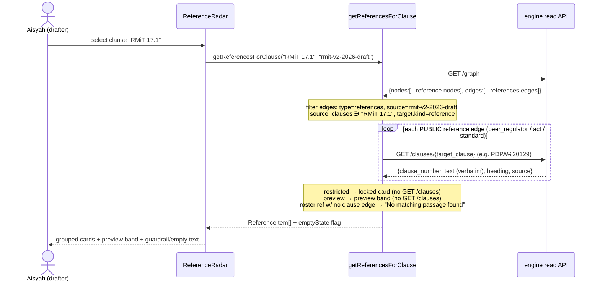

# Reference Radar

**Ticket:** [#26](https://github.com/dzaffren/copa-hackathon/issues/26)

The Reference Radar is the drafter's primary aid in Rulebook Radar. For the clause
Aisyah is drafting, it surfaces — quoted **verbatim** — what external references say
on that exact topic: a peer central bank's equivalent policy, national acts (such as
the Personal Data Protection Act), and international standards. Each reference carries
a plain-language "why this reference matters" tied to her clause and a link to the
source passage, replacing the scattered manual research that is a drafter's biggest
time cost today.

## User Story

As a policy drafter, for the clause I'm drafting, I want to see what peer regulators,
national acts, and international standards say on that exact topic — quoted verbatim
with why each matters — so that I can ground my draft in the external references that
shape it, without scattered manual research.

## Background & Context

**Current state:**

- When a drafter revises a policy such as Risk Management in Technology (RMiT), the
  heaviest task is researching what **external references** say on the topic — other
  central banks' equivalent technology-risk policies, national acts (for example the
  Personal Data Protection Act), and international standards. This research directly
  shapes the wording of the draft.
- Today that research is scattered, manual work: the drafter opens each external
  document separately, searches it by hand, copies out the relevant passage, and keeps
  track in her own notes of which source said what and why it mattered for the clause.
- Nothing links a specific clause the drafter is working on to the specific external
  passages that bear on it, so the connection lives only in the drafter's head and has
  to be rebuilt from scratch every revision.

**Problem:**

- Finding what peers, acts, and standards say on the exact topic being drafted is slow,
  scattered, and manual — yet it is what most directly shapes the wording. _(Validated
  9 July 2026 in the first direct RMiT-drafter interview as the primary drafter pain.)_
- Because the research is manual, an obviously-relevant external reference can be
  missed, and the drafter cannot quickly show a colleague or manager the exact passage
  a wording choice is grounded in.
- The drafter has no single place that, for one clause, gathers the peer regulator's
  equivalent rule, the relevant national-act obligation, and the international standard
  side by side with the reason each one matters.

## Target User & Persona

- **Who:** Aisyah R., a Bank Negara Malaysia policy drafter in the technology-risk area,
  drafting RMiT v2 — the single editable draft in MVP1.
- **Context:** She encounters this need clause by clause while drafting. In the demo she
  is working on RMiT clause 17.1 — the shift from consulting the Bank before first-time
  public-cloud adoption for critical systems to notifying the Bank within 14 days — and
  wants to ground that change in what external references say about cloud approval.
- **Current workaround:** She keeps a personal list of source documents, opens each one,
  searches for the relevant passage, and manually notes which source supports or
  challenges her wording. There is no reviewer persona in MVP1; Aisyah is the sole
  drafter.

## Goals

- For the selected clause or topic, present the connected external references — peer
  regulator, national act, international standard — each with a **verbatim excerpt**, its
  source and section, and a plain-language **"why this reference matters"** tied to the
  clause.
- Make the source treatment unmistakable: public references show full quoted content; the
  regulatory handbook shows a locked, content-withheld placeholder; trend and news items
  are a clearly-labelled preview only.
- Uphold the verbatim-citation guardrail on external sources: never invent a passage,
  never present an off-topic passage as equivalent, and state "No matching passage found"
  when a reference has nothing on the topic.
- Let the drafter jump from any excerpt to the exact passage in the source so she can
  verify it in seconds.

## Non-Goals

> These belong to sibling stories. The Reference Radar shows the standing, connected
> reference set and its labelled previews; it does not do the work below.

- **The graph canvas, reference nodes and edges, provenance trails, and "Switch to
  supervisor view."** How references appear as nodes on the cluster map, how the edges are
  drawn, and the "Why this changed" provenance trail belong to the **Single-draft rulebook
  workspace (#7)**.
- **Turning references into findings about the draft.** Judging that the draft _lacks_
  something a reference expects (a reference gap) or that a peer _backs_ the wording (peer
  support), ranking those findings, and the manager-approval closing step belong to **Draft
  alignment (#8)**. The Reference Radar surfaces and quotes the references; it does not
  score the draft against them.
- **Generating redrafts and running live grounded web search.** Proposing new clause
  wording and searching the web for current trends and news on the approved allowlist
  belong to the **Drafting copilot (#9)**. The Reference Radar shows the already-connected
  reference set and its labelled trend/news _preview_ items only; it does not run a live
  search.

## User Workflow

1. **Select the clause** — Aisyah is drafting RMiT clause 17.1 (first-time public-cloud
   adoption for critical systems). She opens the Reference Radar for that clause.
2. **See the connected references** — The radar shows the external references linked to
   this topic, grouped by type: a peer central bank's technology-risk policy, the Personal
   Data Protection Act, and an international operational-resilience standard.
3. **Read each verbatim, with why it matters** — Each public reference shows an exact
   quoted excerpt with its source and section, plus a plain-language "why this reference
   matters" tied to clause 17.1. Each excerpt is labelled an illustrative candidate pending
   source validation.
4. **See what is withheld and what is preview** — The regulatory handbook is listed but its
   content is locked and not shown. A trends and news band is clearly labelled a preview /
   what's next, not committed to MVP1.
5. **Verify at the source** — Aisyah follows an excerpt's link to the exact passage in the
   source to confirm the quote word for word.
6. **Handle gaps honestly** — If a connected reference has nothing on the topic, the radar
   says "No matching passage found"; if no external reference covers the clause's topic at
   all, the radar says so plainly rather than inventing one.

## Acceptance Criteria

> Scenarios are written from Aisyah's point of view. Source treatments (public / locked /
> preview) are described as observable labels; exact styling lives in the UI/Frontend
> Requirements section. In the demo the external sources are candidate/illustrative pending
> discovery Experiment 2, and every excerpt is labelled so.

### Background

```gherkin
Given I am Aisyah R., the drafter of RMiT v2, signed in to Rulebook Radar
  And I am drafting clause 17.1 — first-time public-cloud adoption for critical systems,
      changing from "consult the Bank before adoption" to "notify the Bank within 14 days"
  And the Reference Radar for clause 17.1 has this connected reference set
    | reference                                                | type                    | source treatment        | why this reference matters                                                                 |
    | Technology Risk Management Guidelines (MAS, Singapore)   | peer central bank       | public — full quote     | how a peer regulator treats cloud approval for critical systems                             |
    | Personal Data Protection Act 2010 (Malaysia)            | national act            | public — full quote     | cloud adoption for critical systems implicates personal-data handling under the PDPA        |
    | Principles for Operational Resilience (Basel Committee)  | international standard   | public — full quote     | the international baseline for third-party (incl. cloud) dependencies for critical operations|
    | Regulatory Handbook (BNM)                               | regulatory handbook     | locked — content withheld | listed so I know it exists; content is confidential and deferred from MVP1                 |
    | Trends · News · foreign policies                        | trend / news preview    | labelled preview only   | signals such as in-country cloud regions and EU DORA — a what's-next preview, not committed  |
```

### Scenario: Opening the Reference Radar for the clause I am drafting

```gherkin
Given I am drafting clause 17.1
When I open the Reference Radar for that clause
Then I see the external references connected to clause 17.1's topic, grouped by type
  And I see a peer central bank policy, the Personal Data Protection Act, and an international standard
  And each public reference shows a verbatim excerpt with its source and section
  And each carries a plain-language "why this reference matters" written about clause 17.1
  And the excerpts are labelled as illustrative candidates pending source validation
```

### Scenario Outline: Each public reference is quoted verbatim with why it matters

```gherkin
Given the Reference Radar is open for clause 17.1
When I read the entry for <reference>
Then I see the verbatim excerpt "<excerpt>" attributed to <section>
  And I see the reason "<why it matters>"
  And the excerpt is labelled an illustrative candidate pending source validation

Examples:
  | reference                                              | section                                             | excerpt                                                                                                                                                                                        | why it matters                                                                                                                                              |
  | Technology Risk Management Guidelines (MAS, Singapore) | Section 3.4.2 — Management of Third Party Services (2021) | The FI should assess and manage its exposure to technology risks that may affect the confidentiality, integrity and availability of the IT systems and data at the third party before entering into a contractual agreement or partnership. | MAS governs cloud through third-party risk management — assess technology risk before contracting, manage it on an ongoing basis — not pre-approval; the peer benchmark for 17.1's shift from consultation to 14-day notification. |
  | Personal Data Protection Act 2010 (Malaysia)           | Section 129(2) — transfer of personal data outside Malaysia (as amended by Act A1727, in force 1 Apr 2025) | A data controller may transfer any personal data of a data subject to any place outside Malaysia if— (a) there is in that place in force any law which is substantially similar to this Act; or (b) that place ensures an adequate level of protection in relation to the processing of personal data which is at least equivalent to the level of protection afforded by this Act. | A cloud region outside Malaysia engages the PDPA's cross-border transfer test (substantially similar law or adequate protection), so the 17.1 notification should still capture data residency once consultation is removed. |
  | Principles for Operational Resilience (Basel Committee) | Principle 5 — third-party dependency management (2021) | Banks should manage their dependencies on relationships, including those of, but not limited to, third parties or intragroup entities, for the delivery of critical operations.                | The international baseline keeps responsibility for third-party (incl. cloud) dependencies with the bank whatever the approval model — 17.1 must preserve that. |
```

> **Source-verification status (added when the real references were pulled).** All three public
> excerpts above are now quoted **verbatim from the real public sources**, extracted via the
> engine's `markitdown` pipeline and staged in `data/references/`: **Basel** (Principle 5),
> **PDPA** (§129(2), as amended by Act A1727), and **MAS** (§3.4.2). Note MAS TRM has **no**
> dedicated "public cloud prior approval" clause — cloud is governed under §3.4 _Management of
> Third Party Services_, so the spec's earlier MAS excerpt (a paraphrase) has been replaced by
> the real §3.4.2 text. The "illustrative candidate" badge stays on for the demo (whether these
> are the final, genuinely-equivalent sources is confirmed by discovery Experiment 2), but the
> quoted text is now real, not invented.

### Scenario: The regulatory handbook appears as a locked, content-withheld placeholder

```gherkin
Given the Reference Radar is open for clause 17.1
When I look at the Regulatory Handbook reference
Then it is listed so I know it exists and connects to this clause
  And it is marked as restricted and access-controlled
  And no excerpt or content is shown for it
  And I cannot open it to read its text
```

### Scenario: The trends and news items are shown clearly as a preview

```gherkin
Given the Reference Radar is open for clause 17.1
When I look at the Trends and News band
Then it is labelled as a preview / what's next that is not committed to MVP1
  And it shows example signals such as in-country cloud regions, EU DORA, and a cloud-outage news item
  And none of these preview items is presented as a committed reference with a verbatim excerpt
  And a note explains they join the MVP only if other policy drafters confirm the same need
```

### Scenario: Following an excerpt to verify it at the source

```gherkin
Given the Reference Radar is open for clause 17.1
  And the peer regulator entry shows a verbatim excerpt from the MAS Technology Risk Management Guidelines
When I follow the source link on that entry
Then I am taken to the exact passage in the source document
  And the excerpt shown in the radar matches the source passage word for word
```

### Scenario: References are only shown as related when the passage genuinely addresses the topic

```gherkin
Given the Reference Radar is open for clause 17.1
When I verify each reference's cited passage against its source
Then every reference shown as related genuinely addresses approval or notification for cloud adoption by critical systems
  And no reference whose only passage covers an unrelated subject is presented as related to clause 17.1
```

### Scenario: A connected reference with nothing on the topic shows "No matching passage found"

```gherkin
Given I move to drafting the clause that sets the wording of the Bank's own cloud notification form in Appendix 10
  And the Personal Data Protection Act is a connected reference
When I read the Personal Data Protection Act entry for that clause
Then it states "No matching passage found"
  And no excerpt text is shown for it
  And no unrelated passage is quoted in its place
```

### Scenario: Empty state when no external reference covers the topic at all

```gherkin
Given I am drafting the clause that sets the wording of the Bank's own cloud notification form in Appendix 10
  And no peer regulator, national act, or international standard in the set has a passage on that internal form wording
When I open the Reference Radar for that clause
Then I see a clear message that no external reference covers this topic yet
  And no excerpt is shown
  And no reference is invented to fill the space
```

### Scenario: Selecting a different clause refreshes the radar to that clause's topic

```gherkin
Given the Reference Radar is showing the references for clause 17.1
When I select clause 12.1 of the Outsourcing policy — the Bank's written approval before a new material outsourcing arrangement
Then the radar refreshes to the references relevant to that clause's topic
  And references that do not address that topic are no longer shown
  And each reference still shows a verbatim excerpt with its "why this reference matters"
```

### Scenario: Every excerpt is labelled illustrative and never claimed as verified

```gherkin
Given the Reference Radar is open for clause 17.1
When I read any public reference excerpt
Then it is labelled an illustrative candidate pending source validation
  And the tool never states that the source has been verified when it has not
```

## Business Rules & Constraints

- **Verbatim-citation guardrail (hard rule).** Every reference excerpt is quoted exactly
  as it appears in the source, shown with its source name and section (for example
  Personal Data Protection Act 2010, Section 129). If a connected reference has no passage
  on the clause's topic, the radar states "No matching passage found" — it never invents,
  paraphrases into a quote, or stretches an unrelated passage to fit.
- **No invented equivalence.** A reference presented as "equivalent" or "related" must
  genuinely address the clause's topic. A passage claimed to match that actually covers a
  different subject is a defect, not a valid entry.
- **Confidentiality-aware treatment.** Public references (peer regulator, national act,
  international standard) show full quoted content. The regulatory handbook shows a locked,
  content-withheld placeholder — listed so the drafter knows it exists, with its text held
  behind access control (the same treatment as internal committee minutes). Trend and news
  items are a labelled preview only.
- **Illustrative-until-validated.** In the demo the external sources are candidate /
  illustrative pending discovery Experiment 2. Every excerpt is labelled as such, and the
  tool never claims a source has been verified when it has not, and never presents an
  unverifiable quote.
- **Topic-scoped, per clause.** The radar is scoped to the selected clause or topic, not
  the whole document. Selecting a different clause refreshes the set to the references that
  address that clause's topic.
- **Every excerpt carries its "why this reference matters."** The reason is written about
  the drafter's clause in plain language, so the drafter understands the relevance without
  reading the whole source.
- **Show, don't judge, and don't search live.** The radar surfaces and quotes the standing
  connected reference set and its labelled previews. Scoring the draft against those
  references (gaps, peer support) is Draft alignment's job; running a live grounded web
  search is the copilot's job.

## Success Metrics

- For the demo clause (RMiT 17.1), the radar surfaces the peer regulator, national-act, and
  international-standard references with a verbatim excerpt and a clause-specific "why it
  matters" for each — and a drafter completes external-reference research for the clause
  faster than by opening each source by hand.
- 100% of shown excerpts quote an existing passage verbatim with its source and section;
  any excerpt that cannot be verified against the source is treated as a defect.
- Zero invented equivalences: every reference shown as related to the clause genuinely
  addresses that topic on inspection; a passage that actually covers a different subject is
  treated as a defect.
- When a reference has nothing on the topic, the radar says "No matching passage found," and
  when no reference covers the topic at all, the radar says so — in every such case, with no
  fabricated content.
- The regulatory handbook always appears as a locked placeholder with no content shown, and
  trend/news items always appear labelled as a preview — never presented as committed
  references.

## Dependencies

- **Knowledge-graph engine (#6).** Supplies the connected external references for a clause,
  their exact passages, and the topic links that decide which references appear for which
  clause.
- **Single-draft rulebook workspace (#7).** Provides the clause-selection context and the
  graph canvas the drafter arrives from; the radar opens for the clause selected there.
- **External reference corpus.** A small set of public external references for the cloud
  topic — a peer central bank's technology-risk policy, the Personal Data Protection Act,
  and an international operational-resilience standard — ingested as sources the radar can
  quote. The exact set is locked by discovery Experiment 2.
- **Regulatory handbook placeholder.** The handbook is confidential and appears only as a
  locked, content-withheld placeholder; no real content is available to the radar in MVP1.
- **Draft alignment (#8) and Drafting copilot (#9).** Consume the radar's connected
  references downstream — alignment turns them into findings, the copilot uses them to
  redraft — but the radar itself only surfaces and quotes them.

## UI/Frontend Requirements

> Observable states referenced by the scenarios above. Colours and exact styling are
> indicative for the demo, not contractual.

- **A Reference Radar panel scoped to the selected clause**, headed so it is clear it shows
  what external sources say about that clause's topic (for example "clause 17.1 —
  public-cloud adoption"), refreshing when a different clause is selected.
- **One card per reference, grouped by type** (peer central bank, national act,
  international standard), each showing: a type/source label, the source title and version,
  the **verbatim excerpt** set apart as a quoted block with its "cited source" caption, the
  section attribution, and the "why this reference matters" line.
- **Public vs locked vs preview treatment is visually distinct:**
  - Public references show the full quoted excerpt.
  - The regulatory handbook card is a locked, content-withheld placeholder (no excerpt
    text, a restricted/access-controlled marker, no open action).
  - Trend and news items sit in a separate band clearly marked "preview / what's next,"
    visually set apart from the committed references.
- **A source link on each public excerpt** that takes the drafter to the exact source
  passage for verification.
- **Guardrail and empty states are explicit text**, not blank space: "No matching passage
  found" on a connected reference with nothing on the topic, and a clear "No external
  reference covers this topic yet" message when the whole set has no coverage.
- **An illustrative-candidate label** on the excerpts, making clear the sources are pending
  validation for the demo.

## Open Questions

- [x] ~~Does the Reference Radar judge the draft against references or generate redrafts?~~
      — **Resolved:** No. The radar surfaces and quotes the connected references with "why
      each matters." Turning them into findings is Draft alignment (#8); redrafts and live
      web search are the copilot (#9).
- [ ] **Which exact external sources make the demo cut?** — **Deferred (non-blocking):** the
      peer regulator, national act, and international standard shown here are candidate /
      illustrative names pending discovery Experiment 2 (which tests that genuinely
      equivalent passages can be found without false equivalence, and confirms the sources
      are obtainable). The radar's behaviour — verbatim quoting, "why it matters," locked and
      preview treatment, empty states — does not depend on the final source list.
- [ ] **Does the trend / news layer become a committed part of the radar?** — **Deferred
      (non-blocking):** the near-real-time trend / news need is RMiT-specific evidence so far
      and ships as a labelled preview; it joins MVP1 only if more policy drafters confirm the
      same need. Until then it is preview-only and does not block the committed reference
      surface.

---

> **Technical refinement (added by `/prd-refine`).** Everything below is the buildable
> technical detail for #26. It binds to the same engine facts as its sibling drafter specs
> (#7 workspace, #8 draft alignment, #9 copilot) via the shared refine brief. Nothing above
> this rule (the approved business content) is changed. The Reference Radar is a **client-side
> read** over the engine's graph + clause index; its only real backend work is the
> **external-reference extension** of the knowledge-graph engine (#6), specified here and flagged
> as a dependency that reopens #6.

## Functional Requirements

- **Client-side reference read (per clause).** For a selected clause on the single editable
  draft `rmit-v2-2026-draft`, the radar MUST derive its reference set from two public engine
  reads only: one `GET /graph` (whole graph; the corpus is tiny) and one `GET /clauses/{n}` per
  public reference passage it displays. No new engine endpoint is called (see ADR 0003 for the
  future convenience route).
- **Reference-edge filter.** From `GET /graph`, the radar MUST select edges where
  `edge.type == "references"` AND `edge.source == "rmit-v2-2026-draft"` AND
  `edge.source_clauses` contains the selected clause number (e.g. `"RMiT 17.1"`) AND the `edge.target`
  node has `kind == "reference"`. Every other edge kind (`version-lineage`, internal `overlaps`)
  MUST be ignored by the radar — those belong to #7/#8.
- **Per-`source_type` treatment (must, not should).**
  - `source_type ∈ {peer_regulator, act, standard}` with `access == "public"`: fetch each
    `target_clause` via `GET /clauses/{n}` and render the **verbatim** `text` as a quoted excerpt
    with its `heading` (section) and `source`. This is the only path that shows quoted content.
  - `access == "restricted"` (the `handbook`): render a locked, content-withheld placeholder. The
    radar MUST NOT call `GET /clauses` for a restricted node (its passages are never ingested).
  - `preview == true` (the `trend` band): render in a separate preview band with a
    "preview / what's next" label. The radar MUST NOT present a preview item as a committed
    reference and MUST NOT show a verbatim excerpt for it.
- **"Why this reference matters."** Each card's relevance line MUST be the edge's `reason` string
  (engine-supplied, written about the selected clause) — never re-generated or paraphrased client-side.
- **Verbatim-citation guardrail (hard rule, enforced structurally).** A public reference card MUST
  render `clause.text` byte-for-byte from `GET /clauses/{n}`. If a target clause does not resolve
  (`404 CLAUSE_NOT_FOUND`), the radar MUST show **"No matching passage found"** for that reference
  and MUST NOT substitute any other passage. The radar never composes or truncates quote text.
- **Honest gaps and empty state.** A reference in the draft's document-connected roster (a reference
  node with ≥1 `references` edge from `rmit-v2-2026-draft`) that has **no** edge anchoring the
  selected clause MUST render **"No matching passage found."** When **every** roster reference is in
  that state for the clause (no public excerpt, no locked card, no preview item carries a passage),
  the radar MUST additionally show the whole-set banner **"No external reference covers this topic
  yet."** Neither state fabricates a card.
- **Illustrative-until-validated label.** Every public excerpt MUST carry an "illustrative candidate
  — pending source validation" badge while the demo flag `REFERENCE_SOURCES_VALIDATED` is `false`.
  The radar MUST never state a source has been verified.
- **Atomicity / idempotency:** N/A for writes — the radar performs **only idempotent GETs** and
  persists nothing. Re-opening the radar for the same clause MUST yield an identical set (the
  artifacts are immutable and byte-stable). The radar owns **no** `localStorage` key.

### Validation & Business Rules

- The selected clause number is supplied by the #7 workspace context (in-memory / route param),
  not typed by the user; if it is absent the radar shows the whole-set empty banner rather than
  erroring.
- A reference edge that fails engine build-time validation (no `reason`, or a **public** target
  clause that does not resolve) is never shipped in `graph.json` — the build fails loudly
  (`GraphBuildError`). The client therefore trusts that any public `references` edge it reads has a
  resolvable passage; the `404` path is a defensive fallback, not the normal case.
- Restricted (`handbook`) and preview (`trend`) reference edges are exempt from the
  "every target clause resolves" build check (their passages are intentionally not ingested); they
  MUST still carry a non-empty `reason` and a `target_clauses` **label** for provenance.

## Permissions & Security

- **Scope:** Public engine read routes only (`GET /graph`, `GET /clauses/{n}`). No auth token, no
  role header — the drafter path touches only public BNM policy data and public external references
  (MAS TRM, PDPA, Basel POR are public documents).
- **Authorization:** None enforced by the read API in MVP1 (documented posture, consistent with #7).
  The **real build** puts the SPA behind BNM SSO and gates the read API per drafter role; noted, not
  built for MVP1.
- **Confidentiality — the one sensitive item.** The BNM Regulatory Handbook is confidential. Its
  passages are **never ingested** into `clause-index.json` (defence in depth #1: there is nothing to
  leak via `GET /clauses`), and the client **never calls `GET /clauses`** for an `access:"restricted"`
  node (defence in depth #2). The radar shows only that the handbook exists and connects to the
  clause. This is the same treatment #6/#10 give internal committee minutes and submission text.
- **Input validation:** clause numbers are used only to filter in-memory edges and to build a URL
  path segment for `GET /clauses/{n}`; they are `encodeURIComponent`-escaped (e.g. `RMiT 17.1` →
  `RMiT%2017.1`, `PDPA 129` → `PDPA%20129`). No user free-text reaches the engine.

## System Design

### Components

| Component                  | Path                                                     | Type                 | Responsibility                                                                                                                                                              |
| -------------------------- | -------------------------------------------------------- | -------------------- | --------------------------------------------------------------------------------------------------------------------------------------------------------------------------- |
| `ReferenceRadar`           | `web/src/components/ReferenceRadar.tsx`                  | New (#26)            | Panel for a selected clause: orchestrates the read, groups cards by `source_type`, renders the preview band and empty/gap states.                                           |
| `ReferenceCard`            | `web/src/components/ReferenceCard.tsx`                   | New (#26)            | One reference, with `quoted` / `locked` / `preview` / `no_passage` variants; renders excerpt, section, "why it matters", illustrative badge, source link.                   |
| `getReferencesForClause`   | `web/src/lib/references.ts`                              | New (#26)            | Pure read: `getGraph()` → filter `references` edges → hydrate public passages via `getClause()` → return `ReferenceItem[]` + `emptyState` flag.                             |
| `engineApi`                | `web/src/lib/engineApi.ts`                               | Reuse (#7)           | `getGraph()`, `getClause(n, version?)` typed HTTP client. #26 adds no method.                                                                                               |
| `types.ts`                 | `web/src/types.ts`                                       | Reuse (#7)           | `GraphNode` (incl. reference `kind`/`source_type`/`access`/`preview`), `GraphEdge`, `Clause`, `ReferenceItem`. #26 consumes; if `ReferenceItem` needs a field, extend here. |
| Reference engine extension | `engine/graph.py`, `engine/config.py`, `engine/build.py` | Modify (#6 reopened) | Reference nodes + reference↔clause edges + restricted/preview validator carve-out + ingestion of public reference docs.                                                     |

### Interfaces

- **Engine (HTTP, read-only):** `GET /graph`, `GET /clauses/{clause_number:path}` — see API Design.
- **Workspace context (#7):** the radar receives `{ selectedClause: string; draftDocumentId: "rmit-v2-2026-draft" }` as props from the workspace/alignment page. It does not own clause selection.
- **localStorage:** none owned by #26. (The radar is a pure read; findings/tracked-changes state is #8's `workflowState`.)

### Data flow (client-side read)



### Tradeoffs

1. **Client-side filter (`GET /graph` + N × `GET /clauses`) vs a server-side `GET /clauses/{n}/references`.**
   Chosen: **client-side** for MVP1. The whole graph is tiny (one `GET /graph`), the read needs no
   new engine code path, and it reuses the frozen immutable artifacts unchanged — so #26 ships
   without redeploying the engine's contract. Cost: a handful of extra clause round-trips per clause
   selection (acceptable at demo scale). The convenience endpoint is documented as the future
   alternative in **ADR `docs/adr/0003-reference-radar-read-path.md`**, not built for MVP1.
2. **Public reference edges as frozen `llm-found` vs `curated` placeholders.**
   Chosen: public reference edges (MAS/PDPA/Basel) are recorded as **`provenance:"llm-found"`** with a
   frozen per-edge `confidence` (the output of a one-off `POST /connections/find(rmit-v2-2026-draft,
<ref doc>)` pass, frozen-as-fixture). This satisfies the engine invariant (`curated` edges MUST be
   `confidence == 1.0`, so a sub-1.0 demo confidence like 0.88 cannot be `curated`) **and** gives #8
   the real per-edge confidence it renders. The restricted handbook + preview trend edges carry no
   model score and are **`curated`, `confidence: 1.0`** placeholders.
3. **Restricted handbook: node-only vs edge-with-carve-out.**
   Chosen: **edge + validator carve-out** — the handbook needs a `references` edge from the clause so
   it appears scoped to `RMiT 17.1`, but its passages are never ingested, so the build validator is
   extended to skip the "target clause resolves" check when the target node is `restricted` or
   `preview`. A node-only model could not attach the handbook to a specific clause.
4. **"No matching passage found" as client-side roster derivation vs a live `POST /connections/find`.**
   Chosen: **client-side derivation** from the document-connected roster — the radar is _show, don't
   search_ (per business rules). Running the finder live per clause is #8's hero moment, not the
   radar's job.

## Threat Model Checklist

- **Data classification:** Public policy data + public external references (peer regulator, national
  act, international standard). **No PII in the drafter path.** The single sensitive asset is the BNM
  Regulatory Handbook.
- **Attack surface:** the FastAPI read routes (`GET /graph`, `GET /clauses`, both public) and the
  React SPA. The radar sends no user free-text to the engine (clause numbers only, URL-escaped).
- **Handbook confidentiality:** mitigated by _not ingesting_ its passages (nothing in
  `clause-index.json` to serve) plus the client never requesting them — a leak would require both
  layers to fail. No handbook text exists in any tracked artifact.
- **Authn/authz:** none on the read API in MVP1 (documented); real build adds SSO + role gating.
- **Injection / XSS:** reference excerpts are rendered as **text** (never `dangerouslySetInnerHTML`);
  `source_url` values come from the fixed reference manifest (allowlisted), not user input.
- **Dependencies:** **no new npm dependency for #26** — it reuses #7's `react`, `react-router-dom`,
  and `engineApi` (`reactflow` is #7's, unused here). **No new Python dependency** — reference
  ingestion reuses the existing `markitdown` pipeline (`engine/ingest.py`), already in
  `pyproject.toml`.

## API Design

The radar consumes two existing, public engine endpoints (no new endpoint in MVP1). Concrete values
use the real corpus ids/clauses.

### `GET /graph`

**Response (200) — reference nodes + reference edges (abridged to the #26-relevant items):**

```json
{
  "nodes": [
    {
      "id": "rmit-v2-2026-draft",
      "policy_id": "rmit",
      "title": "Risk Management in Technology (RMiT)",
      "version": "v2 · 2026 draft",
      "status": "In progress",
      "cluster": "technology-risk",
      "kind": "policy"
    },
    {
      "id": "mas-trm-2021",
      "policy_id": "mas-trm",
      "title": "Technology Risk Management Guidelines (MAS, Singapore)",
      "version": "2021",
      "status": "In force",
      "cluster": "technology-risk",
      "kind": "reference",
      "source_type": "peer_regulator",
      "access": "public",
      "preview": false,
      "source_url": "https://www.mas.gov.sg/regulation/guidelines/technology-risk-management-guidelines"
    },
    {
      "id": "pdpa-2010",
      "policy_id": "pdpa",
      "title": "Personal Data Protection Act 2010 (Malaysia)",
      "version": "2010 · Act 709",
      "status": "In force",
      "cluster": "technology-risk",
      "kind": "reference",
      "source_type": "act",
      "access": "public",
      "preview": false,
      "source_url": "https://www.pdp.gov.my/ppdpv1/akta-709/"
    },
    {
      "id": "basel-por-2021",
      "policy_id": "basel-por",
      "title": "Principles for Operational Resilience (Basel Committee)",
      "version": "2021",
      "status": "In force",
      "cluster": "technology-risk",
      "kind": "reference",
      "source_type": "standard",
      "access": "public",
      "preview": false,
      "source_url": "https://www.bis.org/bcbs/publ/d516.htm"
    },
    {
      "id": "bnm-handbook",
      "policy_id": "bnm-handbook",
      "title": "Regulatory Handbook (BNM)",
      "version": "internal",
      "status": "In force",
      "cluster": "technology-risk",
      "kind": "reference",
      "source_type": "handbook",
      "access": "restricted",
      "preview": false
    },
    {
      "id": "trend-cloud-signals",
      "policy_id": "trend-cloud-signals",
      "title": "Trends · News · foreign policies",
      "version": "preview",
      "status": "In force",
      "cluster": "technology-risk",
      "kind": "reference",
      "source_type": "trend",
      "access": "public",
      "preview": true
    }
  ],
  "edges": [
    {
      "source": "rmit-v2-2026-draft",
      "target": "mas-trm-2021",
      "type": "references",
      "reason": "MAS governs cloud through third-party risk management — assess technology risk before contracting, manage it on an ongoing basis — not pre-approval. The peer benchmark for 17.1's shift from consultation to 14-day notification.",
      "source_clauses": ["RMiT 17.1"],
      "target_clauses": ["MAS TRM Cloud"],
      "provenance": "llm-found",
      "confidence": 0.88
    },
    {
      "source": "rmit-v2-2026-draft",
      "target": "pdpa-2010",
      "type": "references",
      "reason": "A cloud region outside Malaysia engages the PDPA's transfer limits, so the 17.1 notification should still capture data residency once consultation is removed.",
      "source_clauses": ["RMiT 17.1"],
      "target_clauses": ["PDPA 129"],
      "provenance": "llm-found",
      "confidence": 0.9
    },
    {
      "source": "rmit-v2-2026-draft",
      "target": "basel-por-2021",
      "type": "references",
      "reason": "The international baseline keeps responsibility for third-party (incl. cloud) dependencies with the bank whatever the approval model — 17.1 must preserve that.",
      "source_clauses": ["RMiT 17.1"],
      "target_clauses": ["Basel POR TP-1"],
      "provenance": "llm-found",
      "confidence": 0.84
    },
    {
      "source": "rmit-v2-2026-draft",
      "target": "bnm-handbook",
      "type": "references",
      "reason": "Listed so the drafter knows the handbook connects to this clause; its content is confidential and deferred from MVP1.",
      "source_clauses": ["RMiT 17.1"],
      "target_clauses": ["BNM Handbook — Cloud & Outsourcing Manual"],
      "provenance": "curated",
      "confidence": 1.0
    },
    {
      "source": "rmit-v2-2026-draft",
      "target": "trend-cloud-signals",
      "type": "references",
      "reason": "Signals such as in-country cloud regions and EU DORA — a what's-next preview, not a committed reference.",
      "source_clauses": ["RMiT 17.1"],
      "target_clauses": ["Trend — in-country cloud regions"],
      "provenance": "curated",
      "confidence": 1.0
    }
  ]
}
```

### `GET /clauses/{clause_number:path}` (public reference passage)

**Request:** `GET /clauses/PDPA%20129`

**Response (200):**

```json
{
  "clause_number": "PDPA 129",
  "text": "A data controller may transfer any personal data of a data subject to any place outside Malaysia if— (a) there is in that place in force any law which is substantially similar to this Act; or (b) that place ensures an adequate level of protection in relation to the processing of personal data which is at least equivalent to the level of protection afforded by this Act.",
  "policy_id": "pdpa",
  "document_id": "pdpa-2010",
  "source": "reference",
  "heading": "Section 129(2) — transfer of personal data outside Malaysia (as amended by Act A1727)",
  "parent": null,
  "children": [],
  "superseded_versions": []
}
```

Analogous 200s: `GET /clauses/MAS%20TRM%20Cloud` → the MAS third-party due-diligence excerpt attributed
to "Section 3.4.2 — Management of Third Party Services (2021)"; `GET /clauses/Basel%20POR%20TP-1` → the Basel third-party-dependency
principle attributed to "Principle 5 — third-party dependency management (2021)";
`GET /clauses/Appendix%2010` → the internal RMiT cloud-notification-form clause (used by the
empty-state flow — it resolves, but no `references` edge anchors it).

**Errors:**

| Status | Code                       | Condition                                                                                            | Radar behaviour                                                        |
| ------ | -------------------------- | ---------------------------------------------------------------------------------------------------- | ---------------------------------------------------------------------- |
| 404    | `CLAUSE_NOT_FOUND`         | A public reference edge's `target_clause` does not resolve (defensive; build should have blocked it) | Render "No matching passage found" on that card; no substitute passage |
| 404    | `CLAUSE_VERSION_NOT_FOUND` | A `?version=` is requested for a clause with no such version (radar sends no version)                | N/A in MVP1 (radar omits `version`)                                    |

> The radar **never** calls `GET /clauses` for a `restricted` or `preview` node, and **never** calls
> `POST /connections/find` (that is #8). It reads only `/graph` and `/clauses`.

## Data Model

There is **no database** and **no `localStorage`** owned by #26. Two data surfaces matter: the
engine's reference-node extension (persisted in the immutable artifacts) and the client view-model.

### Engine reference extension (reopens #6 — backward compatible)

**`GraphNode` (extended, `engine/graph.py`):** add `kind: "policy" | "reference"`. Existing policy
nodes default `kind: "policy"` (backward compatible — any consumer that ignores `kind` is unaffected).
Reference nodes additionally carry:

| Field         | Type | Values                                                           | Notes                                                        |
| ------------- | ---- | ---------------------------------------------------------------- | ------------------------------------------------------------ |
| `kind`        | str  | `"reference"`                                                    | Distinguishes reference nodes from policy nodes              |
| `source_type` | str  | `peer_regulator` \| `act` \| `standard` \| `handbook` \| `trend` | Drives per-card treatment                                    |
| `access`      | str  | `public` \| `restricted`                                         | `restricted` (handbook) ⇒ passages not ingested, locked card |
| `preview`     | bool | `true` \| `false`                                                | `true` (trend) ⇒ preview band, no verbatim excerpt           |
| `source_url`  | str? | public URL                                                       | Public references only; the card's external "source link"    |

**Reference documents (`engine.config.REFERENCE_DOCUMENTS`, `kind:"reference"`) — implemented:**
`mas-trm-2021` (peer_regulator/public), `pdpa-2010` (act/public), `basel-por-2021` (standard/public) —
each carries the exact **verbatim** `passage` (extracted from the real public source; the `.md` write-up
and source PDF under `data/references/` are the provenance) plus a hand-authored `anchor` + `heading`.
Because external references are **not** BNM-numbered, the deterministic `segment_clauses` grammar does not
apply: each public reference becomes exactly ONE clause via `engine.clauses.build_reference_clause`, keyed
`{PolicyShortName} {anchor}` (`MAS TRM Cloud`, `PDPA 129`, `Basel POR TP-1`) with `source:"reference"`,
merged into the same clause index a policy clause lives in (so `GET /clauses/{n}` serves it identically).
`bnm-handbook` (handbook/restricted) and `trend-cloud-signals` (trend/preview) are declared **nodes only**
— no `passage`, no ingestion, no clause-index entry (defence in depth for the one confidential item).

**Reference↔clause edges (`type:"references"`, new `REFERENCE_SEED_EDGES` in `engine/config.py`):** all
have `source == "rmit-v2-2026-draft"`. Public edges are `provenance:"llm-found"` (frozen finder pass)
with per-edge `confidence` (0.88 / 0.90 / 0.84); the restricted + preview edges are `provenance:"curated",
confidence:1.0` placeholders. Build-time validation (`_validate_non_lineage_edge`) gains a carve-out:
when the target node is `access=="restricted"` OR `preview==true`, skip the "each target clause resolves"
check (but still require a non-empty `reason` and a `target_clauses` label).

### Client view-model (`web/src/types.ts`, owned by #7; #26 consumes)

```typescript
type ReferenceSourceType =
  "peer_regulator" | "act" | "standard" | "handbook" | "trend";
type ReferenceCardState = "quoted" | "locked" | "preview" | "no_passage";

interface ReferenceItem {
  nodeId: string; // "mas-trm-2021"
  title: string; // "Technology Risk Management Guidelines (MAS, Singapore)"
  version: string; // "2021"
  sourceType: ReferenceSourceType;
  access: "public" | "restricted";
  preview: boolean;
  whyItMatters: string; // edge.reason
  confidence: number; // edge.confidence (available; not displayed by the radar)
  state: ReferenceCardState;
  passage?: {
    // present only when state === "quoted"
    clauseNumber: string; // "PDPA 129"
    section: string; // clause.heading
    excerpt: string; // clause.text (verbatim)
    sourceLabel: string; // clause.source
    sourceUrl?: string; // node.source_url
  };
}

interface ReferenceRadarResult {
  clauseNumber: string; // "RMiT 17.1"
  groups: Record<ReferenceSourceType, ReferenceItem[]>;
  previewItems: ReferenceItem[]; // preview === true
  wholeSetEmpty: boolean; // true ⇒ show "No external reference covers this topic yet"
}
```

The "illustrative candidate — pending source validation" badge is a **client presentation constant**
(`REFERENCE_SOURCES_VALIDATED = false` in `web/src/config/referenceDemo.ts`), not an engine field —
flip it to `true` when discovery Experiment 2 confirms the sources.

## Architecture Notes

- **New dependencies:** none new. Web reuses #7's `react`, `react-router-dom`, and `engineApi`. Engine
  reuses the existing `markitdown` ingestion — no new Python package.
- **Dependencies & integration:**
  - **Depends on #7 (workspace scaffold):** `web/` project, `web/src/lib/engineApi.ts`,
    `web/src/types.ts`, and the Playwright harness at `web/tests/e2e/` (`playwright.config.ts`). #26
    references these; it does **not** re-scaffold them.
  - **Reopens #6 (engine):** the reference-node/edge extension above is a real, backward-compatible
    change to `engine/graph.py`, `engine/config.py`, and `engine/build.py`. Existing nodes default
    `kind:"policy"`; existing edges and the immutable-artifact design are untouched apart from the new
    reference rows and the restricted/preview validator carve-out. **This is a resolved open question,
    not an open risk** (see Open Questions).
  - **Consumed by #8 and #9:** #8 reads the same `references` edges to raise reference-gap /
    supports-draft findings (and re-runs `POST /connections/find` live for the hero moment) — the
    radar surfaces and quotes; #8 judges. #9's reference-retrieval mode reads the same edges/passages.
    #26 does neither.
- **Cross-spec consistency:** #26 owns only the _read + presentation_ of references; the reference
  **nodes/edges on the graph canvas** are drawn by #7, and turning references into **findings** is #8.

### Exemplar Files

- `engine/config.py` `CURATED_SEED_EDGES` — the shape/validation pattern the `REFERENCE_SEED_EDGES`
  entries follow (reason + clause anchors + provenance + confidence).
- `engine/graph.py` `_build_curated_edges` / `_validate_non_lineage_edge` — where reference-edge
  assembly and the restricted/preview carve-out slot in.
- `data/mock/rmit-v2-2026-draft.md` — the hand-authored-markdown pattern the mock reference documents
  (`data/references/*.md`) follow for ingestion + anchoring.
- `engine/tests/test_graph.py`, `engine/tests/test_build.py`, `engine/tests/test_api.py` — the
  hand-built-fixture, no-network test pattern the reference-extension pytest follows.

## Implementation Plan

### Sub-tasks

**Task E1: Extend `GraphNode` schema + declare reference nodes** — _small_

- Files: `engine/graph.py` (add `kind` to `GraphNode`; add reference-only optional fields
  `source_type`/`access`/`preview`/`source_url`; `_build_nodes` sets `kind:"policy"` for policy docs
  and emits reference nodes from `kind:"reference"` manifest entries), `engine/config.py` (add the 5
  reference-document manifest entries).
- SEQUENTIAL (schema is the foundation for E2/E3). Backward compatible: existing nodes gain
  `kind:"policy"`.

**Task E2: Ingest public reference documents into the clause index** — _medium_

- Files: `data/references/mas-trm-2021.md`, `data/references/pdpa-2010.md`,
  `data/references/basel-por-2021.md` (mock verbatim passages), `engine/config.py` (source paths +
  segmentation anchors for `MAS TRM Cloud` / `PDPA 129` / `Basel POR TP-1`), `engine/build.py` (skip
  ingestion for `access:"restricted"` and `preview:true` nodes — they have no source file).
- SEQUENTIAL (depends on E1).

**Task E3: Reference edges + validator carve-out + graph assembly** — _medium_

- Files: `engine/config.py` (`REFERENCE_SEED_EDGES`), `engine/graph.py` (`_build_reference_edges`;
  extend `_validate_non_lineage_edge` to exempt `restricted`/`preview` targets from clause resolution;
  wire into `build_graph`), `engine/build.py` (thread reference edges through `run_build`/`main`).
- SEQUENTIAL (depends on E2).

**Task E4: Engine-extension pytest** — _medium_

- Files: `engine/tests/test_graph.py` (reference nodes carry `kind`/`source_type`/`access`/`preview`;
  reference edges validate; restricted/preview carve-out passes with an unresolved label; a **public**
  reference edge with an unresolved clause still raises `GraphBuildError`), `engine/tests/test_build.py`
  (a full build emits reference nodes + edges + the three reference passages in the clause index),
  `engine/tests/test_api.py` (`GET /graph` returns reference nodes/edges; `GET /clauses/PDPA 129`
  returns the verbatim passage).
- SEQUENTIAL (depends on E3).

**Task W1: Client read `getReferencesForClause`** — _medium_

- Files: `web/src/lib/references.ts` (pure function: `getGraph()` → filter `references` edges → hydrate
  public passages via `getClause()` → build `ReferenceItem[]`, roster-based `no_passage` derivation,
  and `wholeSetEmpty`), `web/src/types.ts` (add `ReferenceItem`/`ReferenceRadarResult` if #7 left them
  as stubs).
- SEQUENTIAL (depends on #7's `engineApi`/`types.ts` and the E-series engine contract).

**Task W2: `ReferenceRadar` + `ReferenceCard` components** — _medium_

- Files: `web/src/components/ReferenceRadar.tsx` (grouped cards, preview band, empty/whole-set banner),
  `web/src/components/ReferenceCard.tsx` (`quoted`/`locked`/`preview`/`no_passage` variants).
- SEQUENTIAL (depends on W1).

**Task W3: Source link, verbatim passage view, illustrative badge** — _small_

- Files: `web/src/config/referenceDemo.ts` (`REFERENCE_SOURCES_VALIDATED`), `web/src/components/ReferenceCard.tsx`
  (source link → `node.source_url` in a new tab, plus an in-app verbatim passage view built from the
  same `getClause()` text so the excerpt matches word-for-word).
- SEQUENTIAL (depends on W2).

**Task W4: Vitest/RTL component + lib tests** — _medium_

- Files: `web/src/lib/references.test.ts`, `web/src/components/ReferenceRadar.test.tsx` (mock
  `engineApi` with the §API-Design fixtures).
- SEQUENTIAL (depends on W2/W3).

**Task W5: Playwright E2E specs** — _medium_

- Files: `web/tests/e2e/reference-radar-open.spec.ts`, `web/tests/e2e/reference-radar-verbatim.spec.ts`,
  `web/tests/e2e/reference-radar-locked-preview.spec.ts`, `web/tests/e2e/reference-radar-source-link.spec.ts`,
  `web/tests/e2e/reference-radar-gaps.spec.ts`, `web/tests/e2e/reference-radar-refresh.spec.ts` (against
  a seeded engine or a mocked `/graph`+`/clauses`).
- SEQUENTIAL (depends on W2/W3 and #7's Playwright scaffold).

### Negative Constraints

- Do **NOT** re-scaffold `web/`, `engineApi`, `types.ts`, or the Playwright harness — those are #7's.
- Do **NOT** change the engine's immutable-artifact design, the deterministic segmenter, or the
  existing curated/version-lineage edges beyond adding reference rows and the restricted/preview
  carve-out.
- Do **NOT** alter the supervisor routes (`POST /submissions`, `GET /submissions/{id}`) or call
  `POST /connections/find` from the radar (that classification is #8's).
- Do **NOT** ingest, store, or render any BNM Regulatory Handbook passage text — it stays a locked
  node with no clause-index entry.
- Do **NOT** modify the approved business content above the `---` rule.
- Do **NOT** re-generate or paraphrase excerpts or "why it matters" client-side — quote verbatim from
  `GET /clauses`; use `edge.reason` as-is.

## Test Scenarios

**Test 1: Reference set for the drafted clause (happy path)**

- Setup: engine seeded with the §API-Design `/graph` (5 reference nodes/edges) and the three reference
  passages in the clause index.
- Action: `getReferencesForClause("RMiT 17.1", "rmit-v2-2026-draft")` → issues `GET /graph`, then
  `GET /clauses/MAS%20TRM%20Cloud`, `GET /clauses/PDPA%20129`, `GET /clauses/Basel%20POR%20TP-1`.
- Expected: three `quoted` items (peer_regulator, act, standard) with verbatim `excerpt`, `section` =
  clause `heading`, `whyItMatters` = edge `reason`; one `locked` item (`bnm-handbook`, no `GET /clauses`
  issued for it); one `preview` item (`trend-cloud-signals`); `wholeSetEmpty === false`.

**Test 2: Restricted handbook never fetched**

- Setup: as Test 1.
- Action: run the read and inspect the request log.
- Expected: **no** `GET /clauses` request is made for `bnm-handbook`; the card renders `state:"locked"`
  with no excerpt and no open action.

**Test 3: "No matching passage found" for a connected reference with nothing on the clause**

- Setup: select clause `Appendix 10` (resolves via `GET /clauses/Appendix%2010`); no `references`
  edge has `Appendix 10` in `source_clauses`; `pdpa-2010` remains in the document-connected roster.
- Action: `getReferencesForClause("Appendix 10", "rmit-v2-2026-draft")`.
- Expected: every roster reference (incl. `pdpa-2010`) resolves to `state:"no_passage"` → the card shows
  "No matching passage found"; no excerpt text; no substitute passage quoted.

**Test 4: Whole-set empty state**

- Setup: as Test 3 (`Appendix 10` — no reference edge anchors it).
- Action: run the read.
- Expected: `wholeSetEmpty === true` → the radar shows "No external reference covers this topic yet";
  no card is invented.

**Test 5: Guardrail fallback on a missing public passage**

- Setup: a public `references` edge cites `target_clauses: ["MAS TRM Cloud"]` but the clause is absent
  from the index (simulated) → `GET /clauses/MAS%20TRM%20Cloud` returns
  `404 {"error":"CLAUSE_NOT_FOUND","message":"No matching clause found for 'MAS TRM Cloud'"}`.
- Expected: that card renders `state:"no_passage"` ("No matching passage found"); no other passage is
  shown in its place; the other references are unaffected.

**Test 6: Engine build rejects a public reference edge with an unresolved passage**

- Setup: a `provenance:"llm-found"` reference edge whose target is a **public** node cites a clause not
  in the index.
- Action: `build_graph(...)`.
- Expected: raises `GraphBuildError` ("cites clause '…' which does not resolve in the clause index").
  A **restricted/preview** target with an unresolved label does **not** raise (carve-out).

**Test 7: Clause refresh changes the set**

- Setup: radar open for `RMiT 17.1` (three quoted + locked + preview).
- Action: change selection to `Appendix 10`.
- Expected: the read re-runs; the previous three excerpts are gone; the radar shows the whole-set
  empty state — proving the set is scoped to the selected clause.

## Acceptance Criteria

- [ ] The radar renders the three public references (peer_regulator/act/standard) for `RMiT 17.1` with
      verbatim excerpts, section attribution, and edge-`reason` "why it matters".
- [ ] The `bnm-handbook` shows a locked, content-withheld card and triggers **no** `GET /clauses`.
- [ ] The `trend-cloud-signals` band is labelled preview-only and shows no verbatim excerpt.
- [ ] Each public excerpt has a working source link and carries the illustrative-candidate badge.
- [ ] "No matching passage found" (per reference) and "No external reference covers this topic yet"
      (whole set) render for `Appendix 10`; no card is fabricated.
- [ ] Selecting a different clause refreshes the set.
- [ ] Engine: reference nodes carry `kind`/`source_type`/`access`/`preview`; existing nodes default
      `kind:"policy"`; a public reference edge with an unresolved passage fails the build.
- [ ] No type errors or lint warnings (web + engine).

## Verification

Run the verifier skill (web: Vitest + `tsc`/ESLint; engine: pytest + mypy) to confirm changes are clean.

### Backend / engine-extension tests (pytest, `engine/tests/`)

- `engine/tests/test_graph.py` — reference nodes carry the new fields and default `kind:"policy"`
  elsewhere; `_build_reference_edges` validates; the restricted/preview carve-out passes an unresolved
  label; a public reference edge with an unresolved clause raises `GraphBuildError` (Test 6). No network
  (hand-built fixtures, matching the existing pattern).
- `engine/tests/test_build.py` — a full injected-stub build emits the reference nodes, the
  `references` edges, and the three reference passages (`MAS TRM Cloud`, `PDPA 129`, `Basel POR TP-1`)
  in the clause index; restricted/preview docs produce a node but no clause entries.
- `engine/tests/test_api.py` — `GET /graph` includes reference nodes/edges; `GET /clauses/PDPA 129`
  returns the verbatim passage; a missing target clause returns `404 CLAUSE_NOT_FOUND`.

### Component tests (Vitest/RTL, `web/src/`)

- `web/src/lib/references.test.ts` — the filter, roster derivation, `no_passage`, and `wholeSetEmpty`
  logic against the §API-Design fixtures (Tests 1, 3–5, 7).
- `web/src/components/ReferenceRadar.test.tsx` — grouping by `source_type`, the locked/preview
  treatments, the guardrail/empty text, and the illustrative badge.

### E2E tests (Playwright, `web/tests/e2e/`)

Each user-facing Key Scenario maps to an E2E spec (harness scaffolded by #7):

| Key Scenario                                                                        | Test file                                              | Assigned sub-task |
| ----------------------------------------------------------------------------------- | ------------------------------------------------------ | ----------------- |
| Opening the Reference Radar for the clause I am drafting                            | `web/tests/e2e/reference-radar-open.spec.ts`           | Task W5           |
| Each public reference is quoted verbatim with why it matters (Scenario Outline)     | `web/tests/e2e/reference-radar-verbatim.spec.ts`       | Task W5           |
| The regulatory handbook appears as a locked, content-withheld placeholder           | `web/tests/e2e/reference-radar-locked-preview.spec.ts` | Task W5           |
| The trends and news items are shown clearly as a preview                            | `web/tests/e2e/reference-radar-locked-preview.spec.ts` | Task W5           |
| Following an excerpt to verify it at the source                                     | `web/tests/e2e/reference-radar-source-link.spec.ts`    | Task W5           |
| References are only shown as related when the passage genuinely addresses the topic | `web/tests/e2e/reference-radar-verbatim.spec.ts`       | Task W5           |
| A connected reference with nothing on the topic shows "No matching passage found"   | `web/tests/e2e/reference-radar-gaps.spec.ts`           | Task W5           |
| Empty state when no external reference covers the topic at all                      | `web/tests/e2e/reference-radar-gaps.spec.ts`           | Task W5           |
| Selecting a different clause refreshes the radar to that clause's topic             | `web/tests/e2e/reference-radar-refresh.spec.ts`        | Task W5           |
| Every excerpt is labelled illustrative and never claimed as verified                | `web/tests/e2e/reference-radar-verbatim.spec.ts`       | Task W5           |

**Locator strategies:** `data-testid="reference-radar"` (panel root), `data-testid="reference-card"`
with `data-source-type` and `data-state` attributes (`quoted`/`locked`/`preview`/`no_passage`),
`data-testid="reference-excerpt"` (verbatim block), `data-testid="reference-why"`,
`data-testid="reference-source-link"`, `data-testid="reference-preview-band"`,
`data-testid="reference-empty"` (whole-set banner). E2E runs against a seeded engine or a mocked
`/graph` + `/clauses` (Playwright `route`), asserting the excerpt text equals the mocked clause `text`.

## Open Questions

- [x] ~~Does the Reference Radar judge the draft against references or generate redrafts?~~ —
      **Resolved (business):** No; it surfaces and quotes. (Unchanged.)
- [x] ~~How does the restricted handbook attach to a clause without ingesting confidential text, given
      the engine's "every edge anchor resolves" invariant?~~ — **Resolved:** the handbook is a
      `references` edge to an `access:"restricted"` node; `_validate_non_lineage_edge` is extended to
      exempt `restricted`/`preview` targets from the clause-resolution check (they still require a
      `reason` + a `target_clauses` label). No handbook text is ever ingested.
- [x] ~~Why do public reference edges carry sub-1.0 confidence when curated edges must be 1.0?~~ —
      **Resolved:** public reference edges are `provenance:"llm-found"` (a frozen finder pass), which
      permits sub-1.0 confidence and gives #8 the per-edge score it renders; the restricted/preview
      placeholders are `curated`, `confidence:1.0`.
- [x] ~~Client-side filter vs a server-side references endpoint?~~ — **Resolved:** client-side for
      MVP1 (`GET /graph` + `GET /clauses`); `GET /clauses/{n}/references` is documented as the future
      convenience route in **ADR `docs/adr/0003-reference-radar-read-path.md`**, not built for MVP1.
- [x] ~~Does this reopen the engine (#6)?~~ — **Resolved (accepted):** yes, modestly and
      backward-compatibly — the reference-node `kind`/`source_type`/`access`/`preview` schema addition,
      reference ingestion, reference edges, and the restricted/preview validator carve-out (Tasks E1–E4).
      Existing nodes default `kind:"policy"`; the immutable-artifact design and existing edges are
      otherwise untouched.
- [ ] **Cross-document clause selection (e.g. `Outsourcing 12.1`).** — **Deferred (non-blocking):**
      MVP1 seeds `references` edges from `rmit-v2-2026-draft` only, so the radar's clause-refresh
      behaviour is demonstrated across the RMiT v2 draft's own clauses (`RMiT 17.1` → `Appendix 10`).
      The refresh mechanism is clause-agnostic; extending seeded reference edges to other documents so
      selecting `Outsourcing 12.1` surfaces its own references is the documented next step and does not
      block MVP1.
- [ ] **Which exact external sources make the demo cut?** — **Deferred (non-blocking):** MAS TRM, PDPA,
      Basel POR are illustrative candidates pending discovery Experiment 2; the radar's behaviour does
      not depend on the final list (the `REFERENCE_SOURCES_VALIDATED` flag flips when confirmed).
