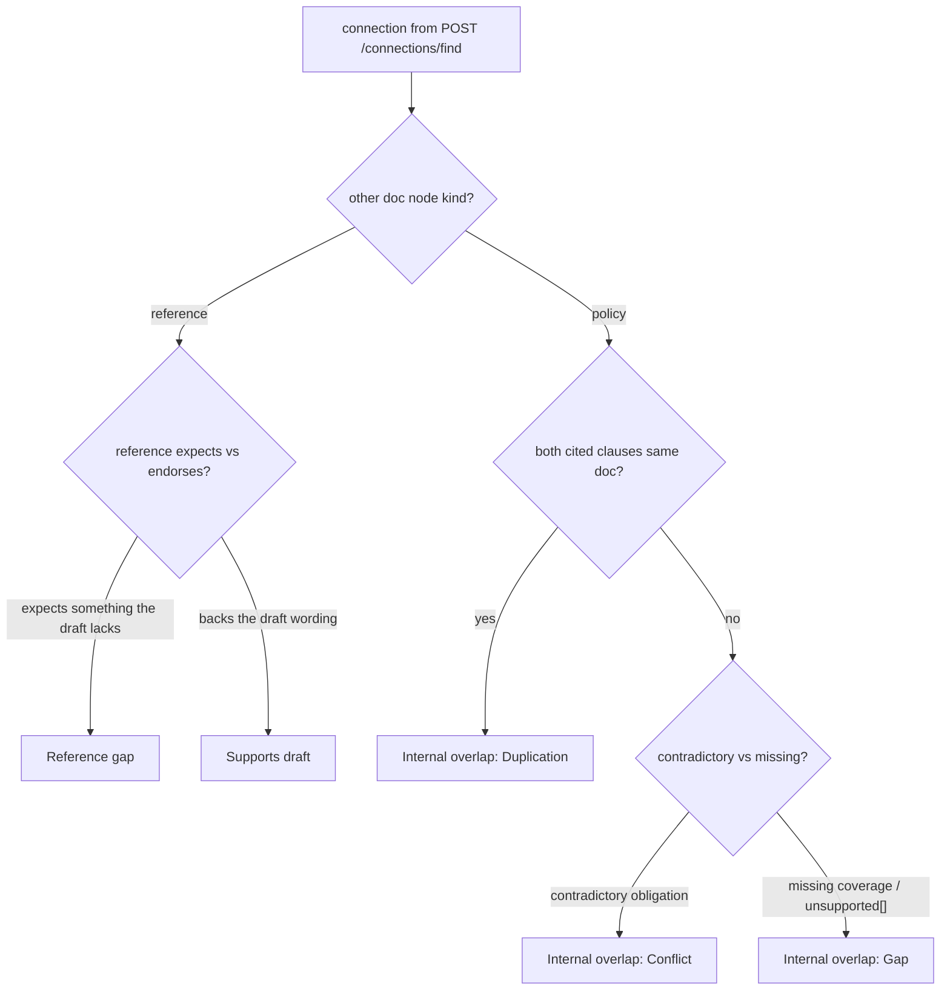

# Draft alignment (references-first)

**Ticket:** [#8](https://github.com/dzaffren/copa-hackathon/issues/8)

> **Filename note.** This spec keeps the filename `spec-ripple-impact-report.md` for
> ticket-#8 stability. In the 9 July 2026 discovery pivot the story was reframed from a
> Conflict / Duplication / Gap "impact report" to a **references-first Draft alignment**
> report, with manager approval folded in and the separate reviewer persona deferred. The
> content below is the current, pivoted story; the old "ripple / impact report" framing is
> superseded.

When the drafter saves a clause change to the one editable draft (RMiT v2), Rulebook Radar
produces a **references-first Draft alignment report**: **reference gaps first** (where a
peer regulator, a national act, or an international standard expects something the draft
lacks), **peer support next** (where an external reference backs the draft's wording), and
**internal overlaps last** (Conflict, Duplication, or Gap across BNM's own published
policies) — each finding quoting the exact clause or passage it relies on. The drafter
resolves every finding — accept the suggested fix (which is inserted into the living draft
as a tracked change) or dismiss it with a recorded reason — and, once all findings are
resolved, submits the aligned draft for a single approving manager. This turns a slow,
memory-dependent external-reference and cross-policy check into a fast, cited, closeable
task.

## User Story

As the drafter of RMiT v2, I want a references-first alignment report on my saved clause
change — reference gaps first, peer support next, internal overlaps last, each citing the
exact clause or passage it relies on — so that I can align my draft with the external
references that shape it and with BNM's own rulebook, resolve every finding, and submit a
clean draft for my manager's approval without ever trusting an unsupported claim.

## Background & Context

**Current state:**

- When a drafter revises a policy clause, the work that most shapes the wording is
  researching what **external references** say on the exact topic — a peer central bank's
  equivalent policy, national acts such as the Personal Data Protection Act (PDPA), and
  international standards. Today that research is scattered and manual, and there is no
  single place that shows, for the clause being drafted, where the draft falls short of a
  reference or where a reference backs it.
- Checking that the revised clause stays consistent with the rest of BNM's own rulebook is
  a secondary but real concern, handled from memory: the drafter recalls which other
  policies might overlap and re-reads each one.
- There is no structured way to record that a possible reference gap or internal clash was
  reviewed and either fixed or consciously set aside, and no cited trail behind the
  decision.

**Problem:**

- A revised clause can silently fall short of a peer regulator, an act, or a standard —
  and can contradict, duplicate, or leave a gap against another BNM policy — and the
  problem may only surface much later, after the change is in force.
- Verifying a suspected reference gap or internal clash means re-reading long documents to
  find the exact passage involved, so the check is slow and error-prone.
- The task depends on individual expertise that is hard to scale, hand over, or reconstruct
  months later, with no record of what was checked and why.

## Target User & Persona

- **Who:** Aisyah R., the policy drafter who owns **RMiT v2** — the one editable draft in
  the technology-risk cluster. Every other BNM policy (Outsourcing, Operational Resilience,
  and the rest of the cluster) is **published, read-only context**.
- **Context:** She reaches this report the moment she saves a clause change and needs to
  know, before she hands the draft on, where it falls short of the external references that
  shape it and where it clashes with BNM's own rulebook.
- **Current workaround:** She researches peer regulators, acts, and standards by hand,
  recalls from memory which BNM policies might overlap, re-reads each source, and judges
  alignment with no cited trail and no record of what she checked.

## Goals

- Produce, from a saved clause change, a **references-first** alignment report: reference
  gaps first, peer support next, internal overlaps last.
- Make every finding independently verifiable in seconds by quoting the exact clause or
  passage it relies on — and, where a claim would rest on a clause that does not exist, say
  "No matching clause found" and name the nearest related clause rather than invent one.
- Let the drafter act on every finding — accept the suggested fix or dismiss it with a
  recorded reason — and reach a clean, submittable draft, with accepted fixes reflected as
  tracked changes in the living draft.
- Give an at-a-glance summary (open-finding count and a breakdown by tier) that updates live
  as findings are resolved, including when a copilot-applied redraft resolves one.
- Offer, once all findings are resolved, a single closing action: **submit the draft for
  manager approval**.

## Non-Goals

- **Researching and displaying what each external reference says, clause by clause.** The
  verbatim reference-excerpt research surface — the panel that shows, for the clause being
  drafted, what each peer regulator, act, and standard says — belongs to the **Reference
  Radar** story. This report _consumes_ those reference connections to raise reference-gap
  and supports-draft findings; it does not own the research surface.
- **Generating and writing the redraft text.** The suggested fix is described here in plain
  language; generating the actual replacement wording, retrieving from the reference nodes,
  running grounded web search, and writing the tracked change into the living draft belong to
  the **Drafting copilot** story. This report describes the fix and reflects the resolved,
  in-draft state that flows back.
- **The graph canvas, edge explanations, and provenance.** Seeing and navigating the cluster
  graph belongs to the **Single-draft rulebook workspace** story.
- **A separate reviewer step.** MVP1 has no reviewer persona. This story's closing action is
  submit for a single approving manager; the deferred reviewer / multi-draft workflow is a
  future phase.
- **Cross-cluster ripple.** Findings are traced within the single technology-risk cluster
  only; a reach into another cluster appears elsewhere as a labelled preview.

## User Workflow

1. **Save a clause change** — Aisyah edits RMiT v2 clause 17.1 from "consult the Bank before
   first-time public-cloud adoption for critical systems" to "notify the Bank within 14
   days" and saves it in the living draft. The tool offers to check the draft's alignment.
2. **See the references-first report** — She opens the Draft alignment report. It names what
   it checked and lists findings in three tiers, in order: **reference gaps** (a peer, act,
   or standard expects something the draft lacks), then **supports draft** (an external
   reference backs the draft), then **internal overlaps** (Conflict, Duplication, or Gap
   across BNM's own published policies). A summary shows the open-finding count and chips by
   tier. Each finding shows its type, the affected policy or reference, a plain-language
   summary, the exact clause or passage it cites, a suggested fix, and an AI-confidence
   indicator.
3. **Verify each finding** — She reads each quoted passage to confirm the issue is real.
   Where a claim would rest on a clause that does not exist, the report states "No matching
   clause found" and names the nearest related clause, so she trusts nothing was invented.
   Reference citations are labelled candidate excerpts pending the reference-radar
   experiment.
4. **Act on each finding** — She accepts the suggested fix (which inserts a tracked change
   into the living draft, or — for a supports-draft finding — records it in the justification
   memo) or dismisses it with a recorded reason. The open count and chips update as she goes.
5. **Fix it with the copilot** — For a finding she wants reworded, she opens the drafting
   copilot; when it applies a redraft, the matching finding here is marked resolved and this
   report syncs live without her switching back.
6. **Submit for manager approval** — When no findings remain open, the report shows "Submit
   draft for manager approval." She submits; only the approving manager is notified, and the
   action cannot be repeated.

## Acceptance Criteria

### Scenario: A saved clause change produces a references-first alignment report

```gherkin
Given Aisyah owns the RMiT v2 draft, the one editable draft in the technology-risk cluster
  And Outsourcing, Operational Resilience, and the rest of the cluster are published, read-only context
  And the external references for this topic include the PDPA, a Basel operational-resilience standard, and the MAS technology-risk guidelines
When she saves the RMiT clause 17.1 change from prior consultation to "notify the Bank within 14 days"
  And she opens the Draft alignment report
Then she sees five findings grouped into three tiers in this order: reference gaps, then supports draft, then internal overlaps
  And the reference-gap tier lists a PDPA data-residency gap and a Basel pre-adoption-control gap
  And the supports-draft tier lists the MAS guidelines backing the notification approach
  And the internal-overlap tier lists an Outsourcing conflict and an RMiT 17.1-versus-17.2 duplication
  And each finding shows a plain-language summary, a cited source, a suggested fix, and an AI-confidence indicator
```

### Scenario: The report opens on an already-saved change without a new edit

```gherkin
Given Aisyah previously saved the RMiT clause 17.1 change in the draft
When she opens the Draft alignment report without making a new edit
Then she sees the same references-first findings for the saved change
  And she can act on each finding as normal
```

### Scenario: A reference-gap finding cites the external passage verbatim and is primary

```gherkin
Given the Draft alignment report for the RMiT clause 17.1 change is open
When Aisyah reads the top finding
Then it is in the reference-gap tier, above any supports-draft or internal-overlap finding
  And it names the affected reference "PDPA 2010 · national act"
  And the cited source reads: PDPA s.129 (sample excerpt): "A data user shall not transfer any personal data of a data subject to a place outside Malaysia unless to such place as specified by the Minister…"
  And the summary explains that the notification set never records where the cloud region is, so the Bank cannot see whether a notified adoption engages the Act
  And the suggested fix is to add cloud-region / data-residency information to the Appendix 10 notification set
  And the AI confidence for this finding shows 88%
```

### Scenario: A supports-draft finding cites an external passage that backs the draft

```gherkin
Given the Draft alignment report for the RMiT clause 17.1 change is open
When Aisyah reads the supports-draft finding
Then it names the affected reference "MAS TRM Guidelines · peer regulator"
  And the cited source reads: MAS TRM (sample excerpt): "…the FI does not require the Authority's prior approval to adopt public cloud services; the FI remains responsible for carrying out due diligence and managing the technology risks on an ongoing basis…"
  And the summary explains that a peer central bank governs public-cloud adoption by notification rather than pre-approval, supporting the 17.1 shift
  And the suggested fix is to cite this reference in the justification memo, with no draft change needed
  And the AI confidence for this finding shows 90%
```

### Scenario: An internal-overlap conflict cites its exact clause verbatim on a published policy

```gherkin
Given the Draft alignment report for the RMiT clause 17.1 change is open
  And Outsourcing (2019) is published, read-only context and not a second editable draft
When Aisyah reads the internal-overlap finding against Outsourcing (2019)
Then it is classified a Conflict
  And it names the affected policy "Outsourcing (2019) · published"
  And the cited source reads: Outsourcing 12.1: "A financial institution must obtain the Bank's written approval before entering into a new material outsourcing arrangement." (11.1 makes cloud arrangements subject to this policy.)
  And the summary explains that RMiT's new "notify within 14 days" is out of step with 12.1's prior-written-approval where a cloud service is also a material outsourcing
  And the suggested fix is to cross-reference in 17.1 how notification interacts with Outsourcing 12.1 for material cloud arrangements
  And the AI confidence for this finding shows 84%
  And she is not offered any way to edit Outsourcing, because only RMiT v2 is editable
```

### Scenario: A duplication finding cites the overlapping clause within the draft

```gherkin
Given the Draft alignment report for the RMiT clause 17.1 change is open
When Aisyah reads the internal-overlap finding for RMiT 17.1 versus 17.2
Then it is classified a Duplication
  And it names the affected policy "RMiT 17.1 vs 17.2 · same doc"
  And the cited source reads: RMiT 17.2 (draft): "…submitting the notification together with the necessary updates to all the information required under paragraph 17.1…"
  And the summary explains that 17.2 now restates the full 17.1 submission set, so two near-identical processes can drift apart
  And the suggested fix is to cross-reference one submission set instead of restating it
  And the AI confidence for this finding shows 78%
```

### Scenario Outline: Each finding type carries a summary, verbatim citation, fix, and confidence

```gherkin
Given the Draft alignment report for the RMiT clause 17.1 change is open
When Aisyah reads the "<finding>" finding
Then it is labelled "<finding>"
  And it names the affected policy or reference "<affected>"
  And it quotes the exact clause or passage "<citation>"
  And it shows an AI confidence of <confidence>

Examples:
  | finding                        | affected                                  | citation                                                                                                                                                                                                       | confidence |
  | Reference gap                  | PDPA 2010 · national act                  | PDPA s.129 (sample excerpt): "A data user shall not transfer any personal data of a data subject to a place outside Malaysia unless to such place as specified by the Minister…"                                | 88%        |
  | Reference gap                  | Basel operational resilience · int'l body | Basel POR (sample excerpt): "Banks should manage their dependencies on relationships, including those of, but not limited to, third parties or intragroup entities, for the delivery of critical operations."   | 81%        |
  | Supports draft                 | MAS TRM Guidelines · peer regulator       | MAS TRM (sample excerpt): "…the FI does not require the Authority's prior approval to adopt public cloud services; the FI remains responsible for carrying out due diligence and managing the technology risks…" | 90%        |
  | Internal overlap — Conflict    | Outsourcing (2019) · published            | Outsourcing 12.1: "A financial institution must obtain the Bank's written approval before entering into a new material outsourcing arrangement."                                                                 | 84%        |
  | Internal overlap — Duplication | RMiT 17.1 vs 17.2 · same doc              | RMiT 17.2 (draft): "…submitting the notification together with the necessary updates to all the information required under paragraph 17.1…"                                                                      | 78%        |
```

### Scenario: Reference citations are labelled candidate excerpts pending the experiment

```gherkin
Given the Draft alignment report for the RMiT clause 17.1 change is open
When Aisyah reads the reference-gap and supports-draft findings
Then each external citation is marked as a sample excerpt from a candidate reference
  And she can see that the external reference set is still being confirmed by the reference-radar experiment
  And the internal-overlap findings against BNM's own policies carry no such candidate label
```

### Scenario: Accepting a fix resolves the finding and inserts a tracked change

```gherkin
Given the Draft alignment report shows the internal-overlap Duplication finding as open
When Aisyah accepts the suggested fix for that finding
Then the finding is marked "✓ accepted · ✎ in draft as tracked change"
  And a "View in draft →" affordance appears on the finding
  And its accept and dismiss actions are no longer available
  And the open-finding count decreases by one
```

### Scenario: Accepting a supports-draft finding records it in the justification instead of the draft

```gherkin
Given the Draft alignment report shows the MAS supports-draft finding as open
When Aisyah accepts it with the "Add to justification" action
Then the finding is marked "✓ noted in justification"
  And no tracked change is inserted into the living draft, because a supporting reference needs no draft change
  And no "View in draft →" affordance appears on this finding
  And the open-finding count decreases by one
```

### Scenario: Dismissing a finding is rejected without a recorded reason

```gherkin
Given the Draft alignment report shows the internal-overlap Conflict finding as open
When Aisyah chooses to dismiss it and confirms without recording a reason
Then she is told a reason is required
  And the finding stays open
```

### Scenario: Dismissing a finding with a recorded reason resolves it and keeps the reason

```gherkin
Given the Draft alignment report shows the internal-overlap Conflict finding as open
When Aisyah dismisses it and records the reason "Prior-approval path for material cloud outsourcing is being handled separately in the Outsourcing revision"
Then the finding is marked dismissed
  And its recorded reason is kept as part of the audit trail
  And the open-finding count decreases by one
```

### Scenario: A dismissed finding counts toward resolution

```gherkin
Given the Draft alignment report has one open finding remaining, the internal-overlap Conflict
When Aisyah dismisses it with a recorded reason
Then no findings remain open
  And the report shows the "Submit draft for manager approval" action
```

### Scenario: The open count and tier chips update as findings are resolved

```gherkin
Given the Draft alignment report shows 5 open findings
  And the summary chips read "2 Reference gap · 1 Supports draft · 2 Internal overlap"
When Aisyah accepts the fix for one reference-gap finding
Then the open-finding count shows 4
  And the summary chips read "1 Reference gap · 1 Supports draft · 2 Internal overlap"
```

### Scenario: A finding resolved by an applied copilot redraft comes back resolved live

```gherkin
Given the Draft alignment report shows the internal-overlap Conflict finding against Outsourcing as open
  And Aisyah has the report open while she opens the drafting copilot in another view
When the copilot applies a redraft that reconciles that conflict
Then the Conflict finding here updates to "✓ accepted · ✎ in draft as tracked change" without her reopening the report
  And a "View in draft →" affordance appears on it
  And the open-finding count reflects one fewer open finding
```

### Scenario: Submitting is blocked while any finding is still open

```gherkin
Given the Draft alignment report shows 1 or more open findings
When Aisyah looks for a way to submit the draft
Then the "Submit draft for manager approval" action is not available
  And she can see how many findings remain open
```

### Scenario: Submitting once all findings are resolved notifies only the approving manager

```gherkin
Given the Draft alignment report has every finding resolved by acceptance or dismissal
  And the "Submit draft for manager approval" action is available
When Aisyah submits the draft
Then she sees confirmation that the draft was submitted and the approving manager was notified
  And no reviewer is involved and no reviewer notification is sent, because MVP1 has no reviewer persona
```

### Scenario: A submitted draft cannot be submitted again

```gherkin
Given Aisyah has already submitted the RMiT v2 draft for manager approval
When she views the Draft alignment report again
Then the submit action is no longer available
  And she sees that the draft has already been submitted for approval
```

## Business Rules & Constraints

- **References-first ordering.** Findings are grouped and ordered into three tiers:
  **reference gaps first** (a peer regulator, a national act, or an international standard
  expects something the draft lacks), **supports draft next** (an external reference backs
  the draft), and **internal overlaps last** (Conflict, Duplication, or Gap across BNM's own
  published policies — the secondary "good to know" layer). Internal overlaps never appear
  above a reference finding.
- **Verbatim-citation guardrail (hard rule).** Every finding must quote the exact clause or
  passage text it is based on, with its clause / section number and source — for external
  references (for example, PDPA s.129, MAS TRM, Outsourcing 12.1) as well as internal
  clauses. Where a claim would rest on a clause that does not exist — for example an internal
  gap, if one arises — the finding must state "No matching clause found" and name the nearest
  related clause; it must never present an invented clause as a citation.
- **Candidate external references.** Reference-gap and supports-draft citations are shown as
  sample excerpts from candidate references, labelled as still being confirmed by the
  reference-radar experiment. Internal-overlap findings against BNM's own published policies
  carry no such label.
- **AI proposes, human commits.** Findings and their suggested fixes are suggestions only. A
  finding is resolved only when the drafter accepts the fix or dismisses it; the tool never
  resolves a finding on its own and never finalises policy text on its own.
- **Dismissal requires a recorded reason.** A finding cannot be dismissed without the drafter
  recording a reason, which is kept for the audit trail. A dismissal attempted without a
  reason is rejected and the finding stays open.
- **Dismissed counts as resolved.** For the purpose of reaching submit, a dismissed finding
  counts the same as an accepted one; "resolved" means accepted or dismissed.
- **Shared tracked-change state with the copilot.** The Draft alignment report and the
  drafting copilot read and write one shared finding state. Accepting a fix on a
  draft-changing finding inserts a tracked change into the living draft and marks the finding
  "✓ accepted · ✎ in draft as tracked change" with a "View in draft →" affordance; a
  copilot-applied redraft resolves the matching finding and both views update live. A
  supports-draft finding is resolved as "✓ noted in justification" and inserts no tracked
  change, because a supporting reference needs no draft change.
- **Submit gated on zero open findings.** The "Submit draft for manager approval" action is
  available only when no findings remain open; while any finding is open, submit is
  unavailable.
- **Single approving manager, no reviewer.** The only closing action is submit for manager
  approval, and only the single approving manager is notified. MVP1 has no reviewer persona,
  no submit-to-reviewer step, and no reviewer notification.
- **Submit is a one-time action per draft.** Once a draft is submitted for approval, it
  cannot be submitted again from this report.
- **Doc-aware finding depth.** The number and mix of findings reflects the change: the deep
  RMiT clause 17.1 change surfaces five findings across all three tiers, while a lighter
  change surfaces fewer.
- **Each finding carries a fixed shape.** Type (reference gap, supports draft, or an internal
  overlap classified Conflict / Duplication / Gap), the affected policy or reference, a
  plain-language summary, a cited source quoted verbatim, a suggested fix in plain language,
  and an AI-confidence indicator.
- **Summary reflects only open findings.** The open-finding count and the tier chips count
  only findings still open, and update immediately as findings are resolved.

## Success Metrics

- **Faster references-and-alignment check (MW10 KR3):** a drafter completes one real
  external-reference and cross-policy alignment review at least 15% faster with this report
  than by researching references and re-reading linked policies by hand, on the same change —
  with the baseline explicitly including time spent researching external references.
- **Fewer missed issues:** on a labelled set of known reference gaps, known peer-support
  passages, and known internal conflicts / duplications / gaps for a given change, the report
  surfaces a higher proportion of the real items than an unaided drafter finds in the same
  time — including not missing an obviously relevant external reference.
- **Zero unsupported claims:** 100% of findings quote an existing clause or passage verbatim,
  and any claim with no supporting clause says so explicitly; any citation that cannot be
  verified against its source document is treated as a defect.
- **No invented equivalence:** every reference-gap and supports-draft finding genuinely
  addresses the topic of the clause it is raised against; a passage claimed to match that
  actually covers something else is treated as a defect.
- **Loop closure:** in the demo, a drafter can go from a saved clause change through
  resolving every finding to a submitted draft with only the approving manager notified.

## Dependencies

- **Knowledge-graph engine (#6).** Supplies the reference-node and internal edges that seed
  the findings and the exact clause / passage text used for citations, and runs the live
  connection-finding loop.
- **Single-draft rulebook workspace (#7).** Establishes RMiT v2 as the one editable draft and
  every other policy as published context, and is where the clause change is saved.
- **Reference Radar (#26).** Owns the verbatim reference-excerpt research surface; this report
  consumes those reference connections to raise reference-gap and supports-draft findings.
- **Drafting copilot with live write-back (#9).** Generates and writes the redraft as a
  tracked change and holds the shared resolved state that flows back into this report.
- **Locked demo cluster and external reference corpus.** The confirmed technology-risk
  policies (RMiT, Outsourcing, Operational Resilience, and the rest) plus the small candidate
  external reference set for the cloud-adoption topic (a peer central bank's tech-risk
  policy, the PDPA, and an international operational-resilience standard).
- **A single approving manager.** The recipient of the submit-for-approval notification.
- **Living working-document location.** The agreed place where the one in-progress draft lives
  and can be edited with tracked changes, so accepted fixes are reflected in the draft.

## Open Questions

- [x] ~~Should the drafter lead with conflicts, or with references and overlaps?~~ —
      **Resolved (9 Jul 2026 pivot):** the hierarchy inverts for the drafter — reference gaps
      first, peer support next, internal overlaps last.
- [x] ~~Can the drafter reach submit by dismissing findings, not only fixing them?~~ —
      **Resolved:** yes; a dismissed finding counts as resolved for submission, but a
      dismissal must record a reason for the audit trail.
- [x] ~~Does the report end at a reviewer, or at manager approval?~~ — **Resolved (9 Jul 2026
      pivot):** the closing action is submit for a single approving manager; the separate
      reviewer persona is deferred to a future phase.
- [x] ~~When should the alignment check run?~~ — **Resolved:** the intended behaviour is
      save-then-check — the report is produced from a saved clause change and can be re-opened
      on an already-saved change.
- [ ] **Has the reference-radar equivalence assumption been validated?** — **Status:** the
      riskiest new assumption — that an LLM finds genuinely equivalent passages in a peer
      regulator's differently-structured policy and in acts without forcing false equivalences
      — is tested by discovery Experiment 2, not yet run. Reference-gap and supports-draft
      citations stay labelled candidate excerpts until then. ← Validate before committing
      external-source content; the internal-overlap mechanics are already green.
- [ ] Should low-confidence findings be visually separated or collapsed by default, or always
      shown in full? — **Deferred (non-blocking):** all findings are shown with their
      confidence indicator for the demo; presentation tuning can follow drafter feedback.

---

## Engine contract

> **Technical refinement (added when #8 was run through `prd-refine`, 10 Jul 2026).**
> Everything below the business content above is the buildable design. This first subsection
> records how the finding shape maps onto the [knowledge-graph engine](spec-knowledge-graph-engine.md);
> the sections that follow (Functional Requirements → Verification) turn that mapping into an
> implementable client over the engine's existing read API plus the modest reference-node
> extension the pivot needs. The engine (#6) is the source of truth for every field named here;
> this pivot does **not** restructure #6 — external references are ingested through the same
> MarkItDown pipeline and modelled as new node types on the same graph (see
> [System Design](#system-design) and [Data Model](#data-model)).

Each finding in this report is derived from a **graph edge** produced by the engine, plus the
clause or passage text fetched by number / anchor. The mapping:

| Alignment-report field                                   | Engine source (from `graph.json` / clause index)                                                                                                                                          |
| -------------------------------------------------------- | ----------------------------------------------------------------------------------------------------------------------------------------------------------------------------------------- |
| Tier (Reference gap / Supports draft / Internal overlap) | Edge **node type**: a **reference-node edge** (external reference ↔ clause) becomes a reference-tier finding; an **internal edge** (BNM clause ↔ BNM clause) becomes an internal overlap. |
| Reference polarity (gap vs supports)                     | **Classified by this story (#8)** from the reference edge — whether the reference expects something the draft lacks (gap) or backs the draft (supports).                                  |
| Internal sub-type (Conflict / Duplication / Gap)         | **Classified by this story (#8)** from the internal edge — the engine emits raw clause-anchored connections and does **not** classify (per #6 Negative Constraints).                      |
| Affected policy or reference                             | Edge `target` node (external reference node or internal policy node; or `source` for same-doc duplications).                                                                              |
| Plain-language summary                                   | Edge `reason` (engine-supplied), refined for the finding.                                                                                                                                 |
| Cited source (verbatim clause / passage)                 | Clause / passage text fetched by number or anchor for each clause in `source_clauses` / `target_clauses`.                                                                                 |
| **AI-confidence indicator** (e.g. 88%, 90%, 84%, 78%)    | Edge **`confidence`** field (0.0–1.0) — `llm-found` edges carry the model score this indicator displays; `structural` / `curated` edges are `1.0`.                                        |
| Suggested fix / tracked change                           | Described by #8; generated and written into the living draft as a tracked change by the copilot (#9).                                                                                     |

**Confidence source of truth.** The percentages in this spec's Acceptance Criteria
(88% / 81% / 90% / 84% / 78%) are illustrative demo values matching the current clickable POC.
The engine supplies the actual `confidence` score per edge and #8 renders it — neither spec
invents a separate confidence number. The engine spec's (#6) own worked example still lists
older illustrative numbers (for example 93% / 82% / 74%); those are to be refreshed to the POC
values when #6 is next revised, and are not a second source of truth.

**One connection = one edge = one finding (1:1).** Each engine connection maps to exactly one
graph edge, and #8 renders it as exactly one finding — one reference-tier finding (gap _or_
supports) or one internal overlap (Conflict _or_ Duplication _or_ Gap) — inheriting that
edge's `confidence` directly. #8 never splits one connection into two findings and never
derives a second confidence number. If a case genuinely needs two findings, the engine's
finder must emit two connections — granularity belongs in #6, so `confidence` stays a single
#6-owned value per finding.

**Reference edges and the guardrail.** Reference gaps and supports-draft findings both come
from reference-node edges — external references are ingested through the same pipeline as BNM
policies and connect to the specific clauses they inform (same graph, new node types). The
verbatim reference excerpts those edges anchor are surfaced by the Reference Radar (#26); #8
reuses the edge and its cited passage to raise the alignment finding. The citation guardrail
applies to references exactly as to BNM clauses: an unsupported candidate is reported and
dropped, never written as a low-confidence edge.

**Internal gaps and the guardrail.** An internal gap has no supporting clause by definition.
It is **not** a low-confidence edge — the engine reports the absence honestly ("No matching
clause found" + nearest related clause via the citation validator), and #8 presents that as
the gap's cited source. Confidence grades _supported_ connections; it never rescues or
represents an unsupported one. (No internal gap is among the five counted findings in the demo
instance; the honest-absence path is demonstrated as a counted case in #26 and #9.)

**Retrieval.** #8 reads the graph (edges + anchoring clause numbers) first, then hydrates only
the clauses / passages a finding cites — the hierarchical pattern in the engine spec, never
dumping the whole cluster into the report.

**Live connection-finding (the hero moment).** When the drafter's saved RMiT 17.1 change is
checked, #8 calls the engine's `POST /connections/find` **live** — the one place the product
runs the model on stage to prove the AI is real. The engine's endpoint runs a **finder +
critic + code-verifier** loop (the finder proposes, the critic refutes weak findings and hunts
for missed ones — recall — and deterministic code validates every cited clause). #8 owns the
_live call_ and the reference-polarity / Conflict-Duplication-Gap classification, not the loop
itself (the loop is a #6 engine capability). Because live means 2–3 model round-trips, #8 must
be able to fall back to the engine's recorded `connection-trace-*.json` if the API stalls
mid-demo; the trace also lets the drafter (and a judge) see the raw agent output and the
guardrail discarding any hallucinated clause. Full technical detail: "Stage 4 is a two-agent
loop" in the engine spec.

## Functional Requirements

- **Derivation trigger:** On a save to `rmit-v2-2026-draft` (or on opening `/alignment` for an
  already-saved change), #8 must (1) read `GET /graph` once to learn node `kind`s and edge
  `confidence`, then (2) call `POST /connections/find` once per enumerated pair, then
  (3) classify every returned `connections[]` entry into a tier + type, then (4) persist the
  resulting `Finding[]` to `localStorage`. Re-opening the report must **not** re-run the model
  if a `Finding[]` for the current draft revision already exists (idempotent read).
- **Pair enumeration:** the pair set for a change is every reference node connected to the
  changed clause, every internal policy node in the `technology-risk` cluster
  (`outsourcing-v1-2019`, `opres-v1-2025-draft`, `bcm-v1-2022`, `recovery-planning-v1-2021`,
  `customer-info-v1-2025`), and the **self-pair** `(rmit-v2-2026-draft, rmit-v2-2026-draft)`
  for intra-draft duplication. A pair whose `connections[]` is empty for this change yields no
  finding — the count reflects the change ("doc-aware finding depth"), so the RMiT 17.1 shift
  yields exactly five (below), while `opres`/`bcm`/`recovery-planning`/`customer-info` return
  empty `connections` for this change and contribute nothing.
- **Classification (client-side, #8-owned):** each connection is classified deterministically —
  tier from the other doc's node `kind` (`reference` → reference tier, `policy` → internal
  overlap); reference **polarity** (gap vs supports) and internal **sub-type**
  (Conflict / Duplication / Gap) from the connection's `summary`/`scope_note`/anchor shape (see
  [System Design](#system-design) decision flow). The engine never classifies (per #6 Negative
  Constraints).
- **Confidence join:** each finding's AI-confidence is read from the `confidence` of the
  `GET /graph` edge whose `source_clauses` + `target_clauses` set equals the connection's cited
  clause numbers (order-insensitive). #8 must never fabricate a confidence number; a connection
  with no matching persisted edge renders `confidence: null` → "confidence pending".
- **Verbatim-citation guardrail (hard rule):** a finding's cited source text is only ever the
  `text` field the engine attached to `source_clauses`/`target_clauses` (fetched from the clause
  index by number, never model-authored). Any candidate the engine returns in `unsupported[]`
  ("No matching clause found") must **not** be rendered as a confident finding; #8 surfaces the
  honest absence and, for an internal gap, names the nearest related clause via
  `GET /clauses/{n}`. No invented clause is ever shown.
- **Stable finding identity (idempotency):** a finding's `id` is a deterministic hash of
  `{tier, type, targetDocId, sortedSourceAnchors, sortedTargetAnchors}`. Re-deriving after a
  copilot redraft or a re-opened report must reuse the same `id` so a resolved (accepted /
  dismissed) finding is not duplicated or reset, and an unresolved one is refreshed in place.
- **Actioning:** accept on a draft-changing finding writes a tracked-change marker + flips the
  finding to `accepted` with `inDraft: true`; accept on a supports-draft finding flips it to
  `accepted` with `inDraft: false` ("noted in justification", no tracked change); dismiss
  requires a non-empty `reason` and flips to `dismissed`. All three are idempotent per `id` and
  atomic per `localStorage` write.
- **Submit gate:** the submit action is available only when zero findings are `open`; submit is
  a one-time action per draft (a second attempt is a no-op reporting `ALREADY_SUBMITTED`).
- **Cross-tab live sync:** every `Finding[]` / tracked-change / submission write fires the
  browser `storage` event; #8 and #9 both subscribe and re-render, so a copilot-applied redraft
  in the `/copilot` tab resolves the matching finding in the open `/alignment` tab without a
  manual refresh.

### Validation & Business Rules

- **`INVALID_DOCUMENT_IDS`** — `POST /connections/find` rejects any body whose `document_ids`
  is not exactly two known ids (including a typo'd reference id). #8 must only ever send the two
  known ids of an enumerated pair; a rejection is a build defect, surfaced as
  `CONNECTION_FIND_UNAVAILABLE` and routed to the trace fallback.
- **Dismiss without reason** — rejected client-side with `DISMISS_REASON_REQUIRED`; the finding
  stays `open` (matches "Dismissing a finding is rejected without a recorded reason").
- **Submit with open findings** — blocked client-side with `SUBMIT_BLOCKED_OPEN_FINDINGS`; the
  open count is shown (matches "Submitting is blocked while any finding is still open").
- **Confidence bounds** — a joined edge `confidence` must be in `[0.0, 1.0]`; anything else is a
  corrupt-graph defect (`WORKFLOW_STATE_CORRUPT` on parse), never rendered.

## Permissions & Security

- **Scope:** the engine routes #8 consumes (`GET /graph`, `GET /clauses/{n}`,
  `POST /connections/find`) are **public** read routes over public BNM + public external
  reference data — no auth header. #8 never touches the role-gated `POST/GET /submissions`
  supervisor routes.
- **Authorization:** none in MVP1. "Submit for manager approval" is a client-side
  `localStorage` state transition, not a server action — there is no drafter/manager auth in the
  demo. The **real build** adds per-document authorization and a server-side workflow store keyed
  per `document_id`/version (ADR `docs/adr/0001-workflow-state-localstorage-demo.md`); documented,
  not built for MVP1.
- **Input validation:** the only free-text input #8 collects is a dismissal `reason`
  (required, trimmed, max 500 chars, stored as-is in `localStorage`, rendered as text not HTML —
  no injection sink because it is never sent to a server or `dangerouslySetInnerHTML`).
- **Confidentiality:** #8 reads only public engine routes and the public reference corpus. It
  never reads `docs/references/` and never ingests the restricted handbook reference node
  (`access: "restricted"`, no passages) — that node is listed by #26 as a locked placeholder and
  is never a #8 finding source.

## System Design

### Components

| Component                   | File                                             | Owner | Responsibility                                                                                       |
| --------------------------- | ------------------------------------------------ | ----- | ---------------------------------------------------------------------------------------------------- |
| `AlignmentPage`             | `web/src/pages/AlignmentPage.tsx`                | #8    | Route `/alignment`; orchestrates derive → render → act; three tier groups references-first.          |
| `deriveFindings`            | `web/src/lib/alignment/deriveFindings.ts`        | #8    | `GET /graph` → enumerate pairs → `POST /connections/find` (live) → classify → join confidence.       |
| `classifyFinding`           | `web/src/lib/alignment/classifyFinding.ts`       | #8    | Pure tier/polarity/sub-type classifiers + demo decision table (no I/O).                              |
| `traceFallback`             | `web/src/lib/alignment/traceFallback.ts`         | #8    | Replays bundled `connection-trace-*.json` when a live call stalls; re-hydrates verbatim text.        |
| `FindingList` / `TierGroup` | `web/src/components/alignment/FindingList.tsx`   | #8    | Renders findings grouped + ordered references-first; empty/loading states.                           |
| `FindingCard`               | `web/src/components/alignment/FindingCard.tsx`   | #8    | One finding: type, affected, summary, verbatim citation, fix, confidence, candidate label, actions.  |
| `SummaryChips`              | `web/src/components/alignment/SummaryChips.tsx`  | #8    | Open count + per-tier chips; recomputed from open findings on every state change.                    |
| `DismissDialog`             | `web/src/components/alignment/DismissDialog.tsx` | #8    | Captures the required dismissal reason; blocks confirm when empty.                                   |
| `SubmitBar`                 | `web/src/components/alignment/SubmitBar.tsx`     | #8    | Submit gate + one-time submit + "already submitted" state.                                           |
| `engineApi`                 | `web/src/lib/engineApi.ts`                       | #7    | Typed client (`getGraph`, `getClause`, `findConnections`); **consumed**, not defined, by #8.         |
| `workflowState`             | `web/src/lib/workflowState.ts`                   | #7/#8 | localStorage store + `storage`-event sync; #8 adds `Finding` derivation + accept/dismiss/submit.     |
| `DraftDocViewer`            | `web/src/components/DraftDocViewer.tsx`          | #7/#9 | Mock Word viewer; renders tracked-change markers #8 writes on accept (**consumed**, not built here). |

### Interfaces

- **Engine (HTTP):** `GET /graph`, `GET /clauses/{clause_number:path}?version=`,
  `POST /connections/find` — see [API Design](#api-design).
- **localStorage contracts (the shared state with #9):** keys
  `rr.findings.rmit-v2-2026-draft`, `rr.trackedChanges.rmit-v2-2026-draft`,
  `rr.submission.rmit-v2-2026-draft` — see [Data Model](#data-model). Cross-tab sync is the
  `window.addEventListener("storage", …)` pattern the POC already uses
  (`docs/poc/policy-consistency-ai/index.html`).

### Data flow (save → references-first report)

```mermaid
sequenceDiagram
  actor A as Aisyah (drafter)
  participant UI as AlignmentPage (web/)
  participant WS as workflowState (localStorage)
  participant API as engine read API
  A->>UI: Save RMiT 17.1 change ("notify within 14 days")
  UI->>API: GET /graph
  API-->>UI: nodes[] (kind: policy|reference) + edges[] (confidence, clause anchors)
  loop each pair: refs, internal policies, self-pair
    UI->>API: POST /connections/find {document_ids:[rmit-v2-2026-draft, X]}
    API-->>UI: {connections[], unsupported[]}
  end
  UI->>UI: classify tier+type; join edge confidence; drop unsupported[] to the guardrail path
  UI->>WS: write Finding[] (rr.findings.rmit-v2-2026-draft)
  WS-->>UI: render 5 findings, references-first (2 gap · 1 supports · 2 internal)
  Note over WS: storage event → #9 copilot tab syncs the same findings live
```

### Classification decision flow (client-side)



### Tradeoffs

| Decision                                                | Alternatives considered                                   | Chosen — why                                                                                                                                  |
| ------------------------------------------------------- | --------------------------------------------------------- | --------------------------------------------------------------------------------------------------------------------------------------------- |
| Classify Conflict/Duplication/Gap **client-side** in #8 | Classify in the engine and return typed findings          | Client-side — #6 deliberately emits raw clause-anchored connections and forbids classification (its Negative Constraints); keeps #6 reusable. |
| Confidence via **edge-join on `GET /graph`**            | Read confidence off the `POST /connections/find` response | Edge-join — the connection response carries **no** `confidence` field; the graph edge is the single #6-owned source of the percentage.        |
| **Live** `POST /connections/find` per pair, on stage    | Pre-baked findings snapshot only                          | Live — it is the one place the product runs the model on stage to prove the AI is real; a recorded-trace fallback covers a mid-demo stall.    |
| Intra-draft duplication via **self-pair** call          | A new dedicated intra-document engine endpoint            | Self-pair — `POST /connections/find` already accepts two known ids and does not forbid `a == b`; needs no engine change (RMiT 17.1 vs 17.2).  |
| **localStorage** demo state + `storage`-event sync      | Server-side workflow store keyed per document/version     | localStorage for MVP1 (ADR `docs/adr/0001-workflow-state-localstorage-demo.md`); the server store is the documented real-build path.          |

ADRs referenced: `docs/adr/0001-workflow-state-localstorage-demo.md` (state),
`docs/adr/0002-graph-viz-react-flow.md` (owned by #7, shared page shell),
`docs/adr/0003-reference-radar-read-path.md` (reference read path, shared with #26).

## Threat Model Checklist

- **Data classification:** public policy data only. Internal clauses (RMiT, Outsourcing, …) and
  the external references (PDPA, Basel POR, MAS TRM) are all public. **No PII in the drafter
  path** — findings quote public clause/passage text; the only user-authored data is a dismissal
  `reason` (a policy note, non-sensitive), stored per-browser in `localStorage`, never
  transmitted.
- **Attack surface:** a static React SPA + three public engine read routes. No auth token, no
  cookie, no server-side #8 state. `localStorage` is origin-scoped and per-browser; a shared
  demo machine shares state (acceptable for MVP1, noted for the real build).
- **AuthN/AuthZ:** none for MVP1 (public read API; client-side submit). The real build adds
  per-document auth + a server-side store (ADR 0001) — documented, not built.
- **Injection / XSS:** the dismissal `reason` and all engine text are rendered as React text
  nodes (never `dangerouslySetInnerHTML`); no template or SQL sink exists in the drafter path.
- **Dependencies:** #8 introduces **no new runtime npm dependency** — it reuses the #7 scaffold
  (`react`, `react-router-dom`, `reactflow`, Tailwind) and the typed `engineApi.ts` client.
  Dev/test deps (`@playwright/test`, `vitest`, `@testing-library/react`, `jsdom`) are scaffolded
  by #7. The engine reference extension adds no new Python dependency (same MarkItDown pipeline).
- **Confidentiality guardrail:** #8 never stages anything under `docs/references/` and never
  ingests the restricted handbook node; the reference corpus it depends on is public files under
  `data/corpus/` / `data/mock/`.

## API Design

#8 is a **consumer** of the existing engine read API (`engine/api.py`) — it defines no new
endpoint. Three routes are used; the uniform error body is `{"error": "<CODE>", "message":
"<text>"}` at the HTTP status.

### `POST /connections/find` — the live hero call (one per pair)

**Request — reference-gap pair (PDPA):**

```json
{ "document_ids": ["rmit-v2-2026-draft", "pdpa-2010"] }
```

**Response (200):**

```json
{
  "connections": [
    {
      "summary": "RMiT 17.1's notification set records no cloud region, so a notified adoption cannot be checked against the Act's cross-border personal-data transfer limit.",
      "source_clauses": [
        {
          "clause_number": "RMiT 17.1",
          "text": "A financial institution must notify the Bank within 14 days of adopting public cloud services for critical systems."
        }
      ],
      "target_clauses": [
        {
          "clause_number": "PDPA 129",
          "text": "A data user shall not transfer any personal data of a data subject to a place outside Malaysia unless to such place as specified by the Minister…"
        }
      ],
      "scope_note": "Engages only where the cloud region is outside Malaysia and personal data is processed.",
      "supported": true
    }
  ],
  "unsupported": []
}
```

#8 classifies this: other doc `pdpa-2010` is `kind:"reference"` → reference tier; the passage
imposes an expectation (record data residency) the draft lacks → **Reference gap**; confidence
joined from the `GET /graph` edge `rmit-v2-2026-draft → pdpa-2010` (anchors `RMiT 17.1` ↔
`PDPA 129`) = `0.88` → **88%**; `candidate: true` (reference-node origin).

**Request — supports-draft pair (MAS):** `{ "document_ids": ["rmit-v2-2026-draft", "mas-trm-2021"] }`
→ a connection whose `target_clauses[0]` is `MAS TRM Cloud` ("…the FI does not require the
Authority's prior approval to adopt public cloud services…"). #8 → reference tier, **Supports
draft**, confidence `0.90` → **90%**, `inDraft:false` on accept.

**Request — internal-conflict pair (Outsourcing):**
`{ "document_ids": ["rmit-v2-2026-draft", "outsourcing-v1-2019"] }` → a connection
`source_clauses` `RMiT 17.1`, `RMiT 17.2` ↔ `target_clauses` `Outsourcing 12.1`, `scope_note`
about material outsourcing. #8 → internal tier, **Conflict**, confidence `0.84` → **84%**.

**Request — intra-draft duplication (self-pair):**
`{ "document_ids": ["rmit-v2-2026-draft", "rmit-v2-2026-draft"] }` → a connection
`source_clauses` `RMiT 17.1` ↔ `target_clauses` `RMiT 17.2` (both same doc). #8 → internal tier,
**Duplication**, confidence `0.78` → **78%**.

**Response (200) exercising the guardrail (`unsupported[]`):** when the finder proposes a
candidate citing a clause absent from the index (e.g. an internal gap on a non-existent
`RMiT 17.5`):

```json
{
  "connections": [],
  "unsupported": [
    {
      "summary": "A candidate internal gap on cloud exit obligations.",
      "message": "No matching clause found",
      "supported": false
    }
  ]
}
```

#8 does **not** render this as a confident finding; it surfaces the honest absence and names the
nearest related clause via `GET /clauses`. (No internal gap is among the five counted demo
findings — the guardrail path is demonstrated as a counted case in #26/#9.)

**Errors:**

| Status | Code                   | Condition                                                                                                                                 |
| ------ | ---------------------- | ----------------------------------------------------------------------------------------------------------------------------------------- |
| 400    | `INVALID_DOCUMENT_IDS` | `document_ids` not a list of exactly two, or an id not in the graph — e.g. `{"document_ids":["rmit-v2-2026-draft"]}` or `[…, "gdpr-eu"]`. |

### `GET /graph`

Returns `{nodes:[…], edges:[…]}`. #8 uses `nodes[].kind` (`policy`|`reference`) to set tier and
`edges[].confidence` + `source_clauses`/`target_clauses` to join the confidence percentage.

### `GET /clauses/{clause_number:path}?version=`

Used only to (a) name the nearest related clause on an `unsupported[]`/gap path and (b)
re-hydrate verbatim text in the trace-fallback path.

| Status | Code                       | Condition                                                       |
| ------ | -------------------------- | --------------------------------------------------------------- |
| 404    | `CLAUSE_NOT_FOUND`         | No clause matches the number (e.g. `GET /clauses/RMiT%2017.5`). |
| 404    | `CLAUSE_VERSION_NOT_FOUND` | The clause exists but not at the requested `version`.           |

### Client-side error codes (#8, not HTTP)

| Code                           | Condition                                                       | Handling                                                        |
| ------------------------------ | --------------------------------------------------------------- | --------------------------------------------------------------- |
| `CONNECTION_FIND_TIMEOUT`      | A `POST /connections/find` exceeds the per-pair budget (8 s).   | Load the bundled `connection-trace-*.json` for that pair.       |
| `CONNECTION_FIND_UNAVAILABLE`  | Network error or `INVALID_DOCUMENT_IDS` from the engine.        | Route to the trace fallback; log the pair.                      |
| `TRACE_FALLBACK_MISSING`       | No bundled trace for a pair the live call failed on.            | Fall back to the bundled findings snapshot; show a stale badge. |
| `DISMISS_REASON_REQUIRED`      | Dismiss confirmed with an empty/whitespace reason.              | Block; finding stays `open`.                                    |
| `SUBMIT_BLOCKED_OPEN_FINDINGS` | Submit attempted while ≥1 finding is `open`.                    | Hide/disable submit; show open count.                           |
| `ALREADY_SUBMITTED`            | Submit attempted on an already-submitted draft.                 | No-op; show "already submitted".                                |
| `WORKFLOW_STATE_CORRUPT`       | `localStorage` JSON fails to parse / confidence out of `[0,1]`. | Reset the derived (unresolved) findings; keep resolved ones.    |

## Data Model

There is **no database** — the drafter state is client-side `localStorage`; the engine serves
in-memory artifacts. Two model surfaces: the client-only `Finding` shape and the engine's
reference-node extension.

### Client-side `localStorage` (owned via `web/src/lib/workflowState.ts`)

**Key `rr.findings.rmit-v2-2026-draft` → `Finding[]`:**

```ts
type Tier = "reference" | "internal";
type FindingType =
  | "reference-gap"
  | "supports-draft" // reference tier
  | "conflict"
  | "duplication"
  | "gap"; // internal tier
type Status = "open" | "accepted" | "dismissed";

interface Citation {
  clauseNumber: string;
  text: string;
  sourceLabel: string;
}

interface Finding {
  id: string; // stable hash of {tier,type,targetDocId,sortedAnchors}
  tier: Tier; // controls references-first ordering
  type: FindingType; // client-classified from the connection
  affected: string; // e.g. "PDPA 2010 · national act", "Outsourcing (2019) · published"
  summary: string; // from connection.summary, refined
  citations: Citation[]; // verbatim from connection.source_clauses/target_clauses
  suggestedFix: string; // plain-language; copilot (#9) generates the actual text
  confidence: number | null; // joined edge confidence (0–1); null → "pending"
  candidate: boolean; // true for reference-tier (sample-excerpt label), false internal
  status: Status;
  reason?: string; // required when status === "dismissed"
  inDraft: boolean; // true once accepted as a tracked change; false for supports-draft
  connectionPair: [string, string]; // the two document_ids sent to POST /connections/find
  trackedChangeId?: string; // links to the rr.trackedChanges entry
}
```

**Key `rr.trackedChanges.rmit-v2-2026-draft` → `TrackedChange[]`** (rendered by `DraftDocViewer`):

```ts
interface TrackedChange {
  id: string;
  findingId: string;
  clauseNumber: string;
  note: string;
  insertedAt: string;
}
```

**Key `rr.submission.rmit-v2-2026-draft` → `Submission | null`** (one-time submit):

```ts
interface Submission {
  submittedAt: string;
  notified: "manager";
}
```

**The five demo findings** (`rmit-v2-2026-draft`, RMiT 17.1 change), ordered references-first:

| #   | tier      | type           | affected                                  | anchors (source ↔ target)                    | confidence |
| --- | --------- | -------------- | ----------------------------------------- | -------------------------------------------- | ---------- |
| 1   | reference | reference-gap  | PDPA 2010 · national act                  | `RMiT 17.1` ↔ `PDPA 129`                     | 88%        |
| 2   | reference | reference-gap  | Basel operational resilience · int'l body | `RMiT 17.1` ↔ `Basel POR TP-1`               | 81%        |
| 3   | reference | supports-draft | MAS TRM Guidelines · peer regulator       | `RMiT 17.1` ↔ `MAS TRM Cloud`                | 90%        |
| 4   | internal  | conflict       | Outsourcing (2019) · published            | `RMiT 17.1`,`RMiT 17.2` ↔ `Outsourcing 12.1` | 84%        |
| 5   | internal  | duplication    | RMiT 17.1 vs 17.2 · same doc              | `RMiT 17.1` ↔ `RMiT 17.2` (self-pair)        | 78%        |

Summary chips (open) = **2 Reference gap · 1 Supports draft · 2 Internal overlap**.

### Engine reference-node extension (reopens #6 — **shared with #26, build once**)

Per the shared brief §3, the pivot adds reference documents + edges to the same graph via the
same MarkItDown pipeline. #8 depends on these; #26 owns the reference **read** surface. Build the
extension once:

- **New reference documents** in `engine/config.py` `DOCUMENTS`: `pdpa-2010`
  (`source_type: "act"`), `basel-por-2021` (`source_type: "standard"`), `mas-trm-2021`
  (`source_type: "peer_regulator"`) — all `kind: "reference"`, `access: "public"`,
  `preview: false`. Their passages become clauses `PDPA 129`, `Basel POR TP-1`, `MAS TRM Cloud`.
- **`GraphNode` gains** `kind: "policy" | "reference"` (existing nodes default `"policy"`,
  backward compatible), plus `source_type`, `access`, `preview` on reference nodes.
- **New reference↔clause edges** (`engine/config.py`): `source = rmit-v2-2026-draft`,
  `target = <reference node>`, `type "references"`, `source_clauses ["RMiT 17.1"]`,
  `target_clauses` the reference clause, `provenance "llm-found"`, `confidence` the model score
  (0.88 / 0.81 / 0.90) — these carry the reference-tier findings' confidence.
- **Demo internal `llm-found` edges** carrying the two internal findings' confidence: the
  specific `RMiT 17.1`,`17.2` ↔ `Outsourcing 12.1` conflict edge (`confidence 0.84`) and the
  same-doc `RMiT 17.1` ↔ `RMiT 17.2` duplication edge (`confidence 0.78`). These are **distinct
  from** the existing curated overlap edge (`confidence 1.0`), which stays the workspace's
  structural baseline link — #8's confidence join selects the model-scored `llm-found` edge.

## Architecture Notes

- **New dependencies:** none at runtime for #8 (reuses the #7 scaffold). The engine extension
  adds no new Python dependency.
- **Integration points:** consumes `web/src/lib/engineApi.ts`, `web/src/types.ts`,
  `web/src/lib/workflowState.ts`, and `web/src/components/DraftDocViewer.tsx` from the **#7**
  scaffold (do not re-scaffold). Shares `workflowState` findings + `storage`-event sync with
  **#9**. Depends on the reference-node graph extension (**#26**/#6). Reuses #26's reference read
  for the "nearest related clause" name on gap/`unsupported` paths.
- **Live-call demo backstop:** the engine records `connection-trace-{a}__{b}.json` in
  `data/artifacts/` on every `POST /connections/find`; copies of the five demo pairs' traces are
  bundled at `web/src/fixtures/connection-trace-*.json` so `traceFallback` can replay them if a
  live call stalls (`CONNECTION_FIND_TIMEOUT`).

### Exemplar Files

- `docs/poc/policy-consistency-ai/impact.html` — the clickable alignment/impact report: tiering,
  finding-card layout, accept/dismiss, submit gating (interaction reference for #8's UI).
- `docs/poc/policy-consistency-ai/index.html` — the cross-tab `localStorage` + `storage`-event
  pattern to mirror in `workflowState.ts`.
- `engine/connections.py` — the exact `{connections[], unsupported[]}` result shape #8 parses.
- `engine/tests/test_api.py`, `engine/tests/test_connections.py` — the `POST /connections/find`
  contract + guardrail behaviour to assert against in engine-extension tests.

## Implementation Plan

### Sub-tasks

**Engine reference extension (shared with #26 — build once; reopens #6):**

**Task E1: `GraphNode` `kind`/`source_type`/`access`/`preview` + reference documents** — _medium_

- Files: `engine/graph.py`, `engine/config.py`, `engine/tests/test_graph.py`,
  `engine/tests/test_config.py`
- SEQUENTIAL (depends on #6; co-owned with #26 — build once)

**Task E2: seed reference↔clause + demo internal `llm-found` edges (confidence 0.88/0.81/0.90/0.84/0.78)** — _small_

- Files: `engine/config.py`, `engine/tests/test_config.py`, `engine/tests/test_graph.py`
- SEQUENTIAL (depends on E1)

**Task E3: ingest the three reference-doc fixtures → clause index (`PDPA 129`, `Basel POR TP-1`, `MAS TRM Cloud`)** — _small_

- Files: `data/mock/pdpa-2010.md`, `data/mock/basel-por-2021.md`, `data/mock/mas-trm-2021.md`,
  `engine/tests/test_build.py`
- SEQUENTIAL (depends on E1)

**Frontend (#8, under `web/`; all depend on the #7 scaffold):**

**Task F1: `classifyFinding` pure classifiers + decision table + demo fixtures** — _medium_

- Files: `web/src/lib/alignment/classifyFinding.ts`, `web/src/lib/alignment/classifyFinding.test.ts`
- INDEPENDENT (pure; needs only `web/src/types.ts`)

**Task F2: `deriveFindings` orchestrator (GET /graph → pairs → POST /connections/find → classify → confidence join)** — _large_

- Files: `web/src/lib/alignment/deriveFindings.ts`, `web/src/lib/alignment/deriveFindings.test.ts`
- SEQUENTIAL (depends on F1 + #7 `engineApi.ts`)

**Task F3: `workflowState` `Finding` derivation + accept/dismiss/submit reducers + `storage`-event sync** — _medium_

- Files: `web/src/lib/workflowState.ts`, `web/src/lib/workflowState.test.ts`
- SEQUENTIAL (depends on F1; co-owned with #9 — coordinate the `Finding` type)

**Task F4: `AlignmentPage` + `FindingList`/`TierGroup` + `SummaryChips`** — _large_

- Files: `web/src/pages/AlignmentPage.tsx`, `web/src/components/alignment/FindingList.tsx`,
  `web/src/components/alignment/SummaryChips.tsx`
- SEQUENTIAL (depends on F2, F3)

**Task F5: `FindingCard` + `DismissDialog` (accept / dismiss+reason / View-in-draft / candidate label)** — _medium_

- Files: `web/src/components/alignment/FindingCard.tsx`,
  `web/src/components/alignment/DismissDialog.tsx`
- SEQUENTIAL (depends on F3)

**Task F6: `SubmitBar` + submit gate + one-time submit** — _small_

- Files: `web/src/components/alignment/SubmitBar.tsx`
- SEQUENTIAL (depends on F3)

**Task F7: `traceFallback` (bundled `connection-trace-*.json` replay + clause re-hydration)** — _small_

- Files: `web/src/lib/alignment/traceFallback.ts`,
  `web/src/fixtures/connection-trace-rmit-v2-2026-draft__pdpa-2010.json`,
  `web/src/fixtures/connection-trace-rmit-v2-2026-draft__mas-trm-2021.json`,
  `web/src/fixtures/connection-trace-rmit-v2-2026-draft__outsourcing-v1-2019.json`,
  `web/src/fixtures/connection-trace-rmit-v2-2026-draft__basel-por-2021.json`,
  `web/src/fixtures/connection-trace-rmit-v2-2026-draft__rmit-v2-2026-draft.json`
- SEQUENTIAL (depends on F2)

**Task F8: Playwright E2E specs for the alignment flows** — _medium_

- Files: `web/tests/e2e/alignment-report.spec.ts`,
  `web/tests/e2e/alignment-finding-detail.spec.ts`,
  `web/tests/e2e/alignment-actions.spec.ts`,
  `web/tests/e2e/alignment-cross-tab-sync.spec.ts`,
  `web/tests/e2e/alignment-submit.spec.ts`
- SEQUENTIAL (depends on F4, F5, F6; uses the #7 Playwright config)

### Negative Constraints

- Do NOT change the engine's immutable-artifact / raw-connection design beyond the additive
  reference-node extension (§3) — the engine still emits **unclassified** connections; all
  tier/type classification stays in #8.
- Do NOT alter or call the supervisor routes (`POST /submissions`, `GET /submissions/{id}`).
- Do NOT re-scaffold `web/` — `engineApi.ts`, `types.ts`, `workflowState.ts`, `DraftDocViewer`,
  routing, and the Playwright config belong to #7; extend, do not recreate.
- Do NOT invent a confidence number — always join it from a `GET /graph` edge; render "pending"
  when unjoined.
- Do NOT build the server-side workflow store or the Microsoft Graph write-back (documented
  real-build paths only).
- Do NOT modify the approved business content above the `Engine contract` heading (the §7 phantom
  clause 6.11 correction is a **#7-only** edit; #8 cites no 6.11).

## Test Scenarios

**Test 1 (happy path — five findings):** derive against the seeded graph; assert
`POST /connections/find` is called for the five pairs, `Finding[]` has length 5 ordered
references-first, chips read "2 Reference gap · 1 Supports draft · 2 Internal overlap", and
finding #1's confidence is `0.88`.

**Test 2 (verbatim citation):** for the PDPA reference-gap finding, assert `citations[0]` equals
the `target_clauses[0]` `{clause_number:"PDPA 129", text:"A data user shall not transfer…"}`
returned by the engine — text is engine-supplied, never model/UI-authored.

**Test 3 (guardrail / `unsupported[]`):** stub `POST /connections/find` to return
`unsupported:[{message:"No matching clause found", …}]` and empty `connections`; assert no
confident finding is created and the honest-absence path names the nearest related clause.

**Test 4 (accept draft-changing finding):** accept the Duplication (#5); assert a
`rr.trackedChanges.rmit-v2-2026-draft` entry is written, the finding is `accepted`/`inDraft:true`
("✓ accepted · ✎ in draft as tracked change"), accept/dismiss actions disappear, open count 5→4.

**Test 5 (accept supports-draft):** accept MAS (#3) via "Add to justification"; assert
`accepted`/`inDraft:false`, **no** `rr.trackedChanges` entry, no "View in draft →", open 5→4.

**Test 6 (dismiss without reason):** dismiss the Conflict (#4) with empty reason; assert
`DISMISS_REASON_REQUIRED`, finding stays `open`, no state write.

**Test 7 (dismiss with reason):** dismiss #4 with a reason; assert `dismissed`, `reason` kept,
open count decremented; dismissed counts toward resolution.

**Test 8 (submit gate + one-time):** with ≥1 open finding assert `SUBMIT_BLOCKED_OPEN_FINDINGS`
(no submit); resolve all, submit once → `rr.submission.rmit-v2-2026-draft` written,
`notified:"manager"`; submit again → `ALREADY_SUBMITTED` no-op.

**Test 9 (cross-tab sync):** in a second tab write an accepted resolution for #4 to
`rr.findings.rmit-v2-2026-draft`; assert the first tab's `storage` listener updates #4 to
resolved and decrements the open count without a reload.

**Test 10 (idempotent re-derive):** with #4 already dismissed, re-run `deriveFindings`; assert #4
keeps its `dismissed` status and `id` (stable hash), and no duplicate finding is created.

**Test 11 (error — `INVALID_DOCUMENT_IDS`):** call the engine with
`{"document_ids":["rmit-v2-2026-draft"]}`; assert `400 INVALID_DOCUMENT_IDS` "document_ids must
contain exactly two known document ids", and #8 routes to the trace fallback
(`CONNECTION_FIND_UNAVAILABLE`).

**Test 12 (trace fallback):** stub the live call to time out; assert
`web/src/fixtures/connection-trace-rmit-v2-2026-draft__outsourcing-v1-2019.json` is replayed and
the same Conflict finding is produced with re-hydrated verbatim text.

## Verification

Run the verifier skill on `web/` (Vitest + `tsc` + ESLint) and on `engine/` (pytest + mypy
baseline) before marking any sub-task done.

### Component / unit tests (Vitest + RTL)

- `web/src/lib/alignment/classifyFinding.test.ts` — the decision table (reference gap/supports,
  Conflict/Duplication/Gap) across the five demo connections + edge cases.
- `web/src/lib/alignment/deriveFindings.test.ts` — pair enumeration, confidence join, `unsupported[]`
  guardrail, stable-id idempotency (Tests 1–3, 10, 11).
- `web/src/lib/workflowState.test.ts` — accept/dismiss/submit reducers, dismiss-reason validation,
  submit gate, one-time submit, `storage`-event sync (Tests 4–9).

### Engine-extension tests (pytest, `engine/tests/`)

- `engine/tests/test_graph.py` — `GraphNode.kind`/`source_type`/`access`/`preview`; reference and
  `llm-found` edges validate (reason + resolving anchors + `confidence` in `[0,1]`).
- `engine/tests/test_config.py` — the three reference documents + five demo edges are present with
  the stated confidences; curated overlap edge stays `1.0`.
- `engine/tests/test_build.py` — the reference passages ingest to `PDPA 129`, `Basel POR TP-1`,
  `MAS TRM Cloud` and resolve in the clause index.

### E2E (Playwright) — Key Scenario mapping

| Key Scenario                                                               | Test file                                        | Sub-task |
| -------------------------------------------------------------------------- | ------------------------------------------------ | -------- |
| A saved clause change produces a references-first alignment report         | `web/tests/e2e/alignment-report.spec.ts`         | F8 (F4)  |
| The report opens on an already-saved change without a new edit             | `web/tests/e2e/alignment-report.spec.ts`         | F8 (F4)  |
| A reference-gap finding cites the external passage verbatim and is primary | `web/tests/e2e/alignment-finding-detail.spec.ts` | F8 (F5)  |
| A supports-draft finding cites an external passage that backs the draft    | `web/tests/e2e/alignment-finding-detail.spec.ts` | F8 (F5)  |
| An internal-overlap conflict cites its exact clause verbatim               | `web/tests/e2e/alignment-finding-detail.spec.ts` | F8 (F5)  |
| A duplication finding cites the overlapping clause within the draft        | `web/tests/e2e/alignment-finding-detail.spec.ts` | F8 (F5)  |
| Each finding type carries a summary, verbatim citation, fix, confidence    | `web/tests/e2e/alignment-finding-detail.spec.ts` | F8 (F5)  |
| Reference citations are labelled candidate excerpts                        | `web/tests/e2e/alignment-finding-detail.spec.ts` | F8 (F5)  |
| Accepting a fix resolves the finding and inserts a tracked change          | `web/tests/e2e/alignment-actions.spec.ts`        | F8 (F5)  |
| Accepting a supports-draft finding records it in the justification         | `web/tests/e2e/alignment-actions.spec.ts`        | F8 (F5)  |
| Dismissing a finding is rejected without a recorded reason                 | `web/tests/e2e/alignment-actions.spec.ts`        | F8 (F5)  |
| Dismissing a finding with a recorded reason resolves it                    | `web/tests/e2e/alignment-actions.spec.ts`        | F8 (F5)  |
| A dismissed finding counts toward resolution                               | `web/tests/e2e/alignment-submit.spec.ts`         | F8 (F6)  |
| The open count and tier chips update as findings are resolved              | `web/tests/e2e/alignment-report.spec.ts`         | F8 (F4)  |
| A finding resolved by an applied copilot redraft comes back live           | `web/tests/e2e/alignment-cross-tab-sync.spec.ts` | F8 (F3)  |
| Submitting is blocked while any finding is still open                      | `web/tests/e2e/alignment-submit.spec.ts`         | F8 (F6)  |
| Submitting once all findings are resolved notifies only the manager        | `web/tests/e2e/alignment-submit.spec.ts`         | F8 (F6)  |
| A submitted draft cannot be submitted again                                | `web/tests/e2e/alignment-submit.spec.ts`         | F8 (F6)  |

**Locator strategies:** `data-testid="finding-{id}"` per card; `data-tier="reference|internal"`
on tier groups; `data-testid="summary-open-count"` and `data-testid="chip-{tier}"`; role-based
queries for the accept/dismiss/submit buttons and the dismiss-reason textbox.

## Open Questions (technical)

- [x] ~~How does #8 get intra-draft duplications from a pairwise endpoint?~~ — **Resolved:** call
      `POST /connections/find` with the **self-pair** `["rmit-v2-2026-draft","rmit-v2-2026-draft"]`;
      the endpoint accepts two known ids and does not forbid `a == b`, so RMiT 17.1 vs 17.2 is
      found with no engine change.
- [x] ~~Where does the AI-confidence percentage come from when the connection response has no
      `confidence` field?~~ — **Resolved:** joined from the matching `GET /graph` edge's
      `confidence`; a connection with no persisted edge renders "confidence pending", never a
      fabricated number.
- [ ] **Does the demo need the two internal findings' confidence (84% / 78%) as persisted
      `llm-found` edges?** — **Status (build dependency):** yes. `engine/config.py` today has only
      the curated Outsourcing overlap edge at `confidence 1.0`; the 84% conflict, the 78%
      duplication, and the three reference edges (88/81/90) must be persisted as `llm-found` edges
      by the §3 extension (Tasks E1–E2), or #8's confidence join returns "pending" for those
      findings instead of the POC percentages. Tracked as the main #6/#26 build dependency.
